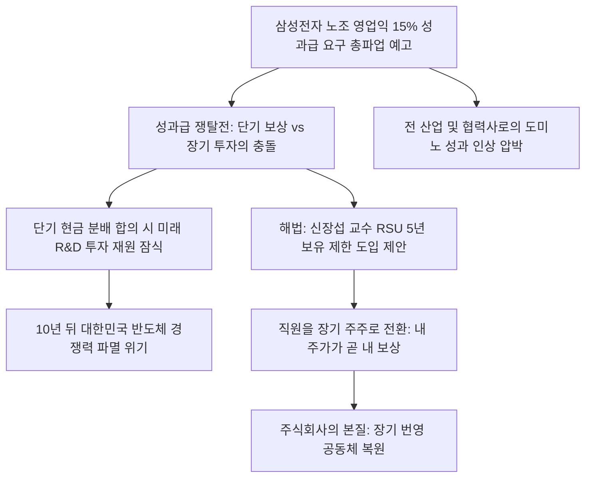

# 기업경영/노동 분석: 삼성전자 성과급 논란과 RSU 보상체계 도입 및 '장기 번영 공동체' 수호 전략
## 투자 신호 + 사회적 영향 평가

---

## 📌 기사 기본 정보

- **날짜**: 2026-05-05
- **출처**: 하현옥 논설위원 직격 인터뷰 (신장섭 싱가포르국립대 교수)
- **카테고리**: 경제 > 노동 > 기업경영
- **핵심 주제**: 영업이익의 15%를 성과급으로 요구하며 총파업을 예고한 삼성전자 노사의 단기 현금 쟁탈 분쟁 상황과, 주식회사의 본질인 '장기 번영 공동체' 수호를 위해 단기 현금 보상 대신 최소 5년의 보유 제한 조건이 걸린 RSU(양도제한조건부주식) 보상 체계로의 대대적 개편 제언 분석

**메타데이터**
- 주요 사건: 삼성전자 노조의 사상 첫 총파업 예고 및 성과급 지급 기준을 둘러싼 대치 심화
- 핵심 원인: 단기 현금성 확정 보상에만 집중된 기형적 성과급 체계, 글로벌 복합 기업인 삼성전자의 위상을 무시한 단일 경쟁사(하이닉스)와의 평면적 보상 비교(필터 버블)
- 주요 주체: 삼성전자 이사회 및 경영진, 삼성전자 전국노동조합, 신장섭 싱가포르국립대 교수
- 키워드: RSU, 장기 번영 공동체, 성과급 분쟁, 미래 보상, 양도제한조건부주식, 기업 지배구조

---

## 🔍 기사를 통한 투자 신호 추출

### 1단계: 핵심 사건 분해

**What (무엇이 일어났는가?)**
- 삼성전자 노조가 반도체 역대급 호황 실적의 낙수효과를 누리기 위해 '영업이익의 15% 확정 성과급 지급'을 요구하며 총파업 카드를 꺼내 들었습니다. 이에 대해 경영학계 석학인 신장섭 교수는 "주식회사는 단기 이익 분탕질의 무대가 아닌 100년 계속되는 장기 번영 공동체"라고 규정하며, 노사 갈등 해결과 장기 생존 R&D 재원 확보를 위해 일반 직원들에게도 최소 5년의 보호예수가 걸린 RSU(양도제한조건부주식)를 미래 보상으로 일괄 지급하는 보상 패러다임 혁신을 긴급 처방했습니다.

**When (언제 일어났는가?)**
- 2026-05-05 (어린이날 공휴일을 맞아 삼성의 역대급 실적 발표 직후, 성과 분배를 둘러싼 노사 갈등이 사상 첫 총파업이라는 파국적 임계점에 도달한 시기)

**Why (왜 일어났는가?)**
- 노조와 직원들의 보상 시간축이 극단적인 '단기 현금(지금 당장 쥐는 돈)'에 매몰되어 있어, 기업의 10년 뒤 초격차 미래 투자를 위한 내부 유보금의 중요성을 상실했기 때문입니다.
- 인텔, TSMC 등 해외 주요 경쟁 기업들은 노조 리스크 없이 장기 성과 기반 주식 보상 체계를 가동하는 반면, 한국은 구시대적 포괄임금 및 현금 성과급 분배 방식에 고착되어 임금 협상이 정치화되었기 때문입니다.

**Who (누가 주도하는가?)**
- 당장의 이익 수치를 바탕으로 현금 배분을 강제하려는 노조 지도부 및 단기 성과 편향의 행동주의 자본 흐름
- R&D 곳간을 지키기 위해 글로벌 스탠다드형 RSU 도입을 주창하는 거시 경제학계 및 장기 주주 연합

---

## 2단계: 투자 신호 해석

### A. **긍정적 신호 (Bullish)**

**① 전사적 주주화 및 장기 RSU 보상 시스템을 선제 도입하는 미래형 테크 혁신 기업**
- **신호**: 전 직원 RSU 지급 및 5년 이상 보호예수 조건의 명문화
- **의미**: 직원이 퇴사하기보다 주가를 올려 5년 뒤 RSU 가치를 극대화하려 노력하므로 인재 유출이 차단되고, 단기 현금 유출이 억제되어 막대한 R&D 예산이 고스란히 초격차 기술(HBM4, 차세대 AI 가속기) 개발에 누적 투입됨
- **투자 기회**: RSU 보상 체계 정착으로 장기 R&D 투자를 수호해나가는 글로벌 선도 테크주

**② 임금 체계 유연성을 확보하고 노조 분쟁 리스크가 제로인 글로벌 파운드리/메모리 독점 기업**
- **신호**: 인텔, TSMC 등 노조 리스크 없이 자체 이익 유보율을 80% 이상 고수하는 경영 환경
- **의미**: 국내 대기업 노사 마찰 반사 수혜로 수주 가시성이 높아지고, 장기 공급 계약 하에서 돌발 생산 중단 리스크가 없어 글로벌 빅테크들이 가장 신뢰하는 최우선 파트너 지위를 굳건히 유지함
- **투자 기회**: 노조 분쟁이 없고 기술 진입장벽이 압도적인 글로벌 파운드리 1위 기업([[TSMC]])

---

### B. **위험 신호 (Bearish)**

**① 노사 갈등으로 인해 영업이익의 상당 부분을 현금 성과급으로 소진하는 단기 편향 제조 기업**
- **신호**: 영업이익의 15% 이상을 일시금 현금 성과급으로 확정 지급하는 합의 관철
- **의미**: 10년 단위의 천문학적 설비 투자가 필요한 반도체 및 화학/배터리 산업에서 장기 R&D 재원이 잠식당해, 다음 반도체 사이클에서 대만의 TSMC나 미국의 거대 공룡들에게 HBM 및 첨단 패키징 시장의 주도권을 완전히 영구 박탈당함
- **투자 리스크**: 노조 리스크가 임계점을 넘어 현금 유출률이 급증하는 대형 제조 우량주

**② 삼성의 임금 인상 가이드라인 타협에 따라 도미노식 임금 폭증 압력을 받는 협력 소부장 및 내수 제조사**
- **신호**: 대기업 성과급 합의 결과의 전 업종 낙수식 강요(도미노 효과)
- **의미**: 삼성전자의 성과급 타결안이 벤치마킹 기준점이 되어, 재무적 체력이 없고 원가 부담이 심한 2·3차 협력 소부장 기업들에게 노조가 동등한 수준의 격려금을 요구하며 납품 단가 마찰 및 연쇄 파업 리스크를 초래함
- **투자 리스크**: 대기업 노사 분쟁 영파를 직접적으로 얻어맞는 중소 IT 부품·소재 협력주

---

### 3단계: 섹터별 투자 기회 매트릭스

#### ✅ **높은 기대도 + 낮은 리스크**

**글로벌 노조 마찰이 없고 장기 보상 체계(RSU)가 안착된 지적재산권 독점 플랫폼사**
- 직원을 주주로 만들어 운명을 같이하는 실리콘밸리식 RSU 체계는 기업의 장기 번영을 보장하는 최고의 세무·인사 무기입니다. 단기 이익 분쟁에서 자유롭고 막대한 무형 자산 로열티를 걷는 하이테크 플랫폼은 노사 파업 리스크에서 영구적으로 자유롭습니다.
- **투자 추천도**: ⭐⭐⭐⭐⭐

---

## 💰 구체적 투자 신호 변환

### 신호 1: '노조 총파업 리스크' 발현 시 단기 변동성을 활용한 장기 초격차 R&D 수혜주 매수 타이밍 포착

**투자 해석**: 기사는 삼성전자 성과급 논란이 단순한 밥그릇 싸움이 아니라, 대한민국 제조업 전체가 직면한 '단기 이익 분탕질 vs 10년 뒤 생존을 위한 장기 투자 R&D 수호' 간의 거대한 이념 전쟁임을 폭로하고 있습니다. 만약 노조가 파업을 강행해 단기적으로 생산 차질 우려가 나오며 주가가 급락한다면, 현명한 투자자는 이를 '공포'가 아닌 '최적의 저가 매수 기회'로 역발상 접근해야 합니다. 메모리 전쟁([[HBM]])의 승패는 단기 성과급 몇 푼이 아니라 장기 투자의 축적으로 결정된다는 신장섭 교수의 통찰대로, 장기 번영의 펀더멘털은 절대 깨지지 않습니다. 다만, 협상 테이블에서 경영진이 RSU 5년 보유 제한 카드를 도입해 노조의 현금 요구를 잠재우고 주주 가치와 임직원 가치를 하나로 묶어내는 '보상 체계 현대화(RSU)'를 최종 타결 짓는 신호가 포착될 때, 삼성전자([[삼성전자]])와 SK하이닉스([[SK하이닉스]])의 장기 멀티플 상승이 확정되므로 이 타결 시점을 기점으로 테크 대형주의 지분 보유 비중을 대폭 상향시켜야 합니다.

---

## 🌍 사회적 영향 평가

### A. 긍정적 사회 영향
- **한국 대기업 임금 문화의 선진적 체질 개선**: 단기 현금 쟁탈전 위주의 낙후된 노사 분쟁에서 벗어나, RSU 도입을 통해 근로자를 실질적 장기 주주로 대접하고 노사가 상생하는 주주 자본주의의 건강한 진화 유도
- **기업 지배구조의 투명성 제고**: 성과와 보상의 공식을 글로벌 수준으로 객관화·투명화하여 외국인 주주들의 코리아 디스카운트 해소 신뢰 증진

### B. 부정적 사회 영향
- **대기업-중소 협력사 간 양극화 갈등의 왜곡 심화**: 삼성 직원의 역대급 성과급 잔치를 지켜보는 협력업체 노동자들의 상대적 박탈감이 고조되고, 무리하게 '삼성 수준의 분배'를 협력업체 사측에 요구해 영세 제조 생태계의 파열음 초래
- **국가 첨단 산업 경쟁력의 정치적 훼손**: 반도체 공장이 단 하루라도 멈출 경우 수천억 원의 국부 유출과 함께 글로벌 공급망 신뢰도가 파괴되어, 대한민국 수출 대동맥의 생존권이 정치적 노사 협상의 볼모로 잡히는 국가 안보적 위협 초래

---

## 🎯 결론: 당신의 투자 전략 수립

- **즉시 실행**: 단기 성과급 인상 압력으로 설비투자(CapEx) 계획을 보류하거나 R&D 비중을 깎아 먹는 굴뚝 대기업 주식 비중 축소
- **3개월 후**: 삼성전자 노사 협상테이블 내 RSU 제도 전격 도입 및 양도 제한 연수 타결안의 최종 성사 여부를 모니터링하여 장기 우량 테크주 적립식 포트폴리오 추가 확장

---

## 📝 Obsidian 연결 구조

