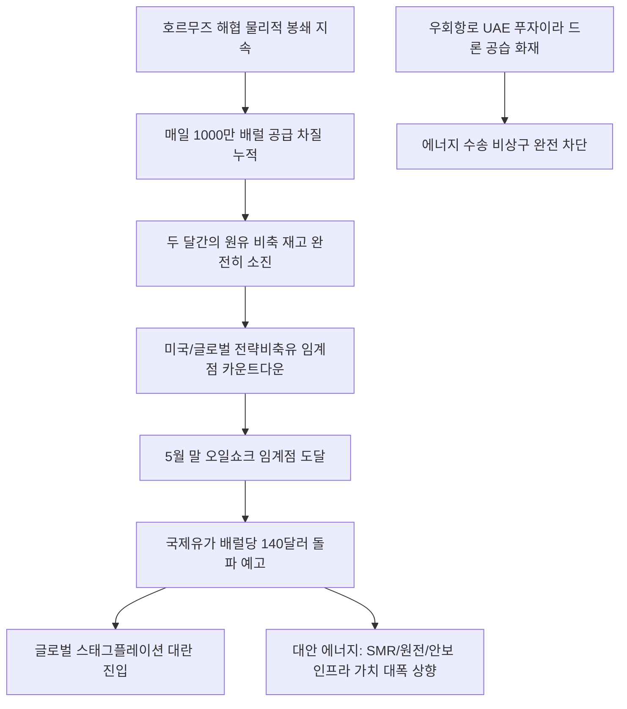

# 에너지/거시 분석: 글로벌 원유재고 바닥과 5월 오일쇼크 임계점 돌입 및 한국 에너지 안보 붕괴 현상
## 투자 신호 + 사회적 영향 평가

---

## 📌 기사 기본 정보

- **날짜**: 2026-05-06
- **출처**: 김기환 기자 (파이낸셜타임스, 로이터, 세계은행 등 주요 외신 종합)
- **카테고리**: 경제 > 에너지 > 원자재
- **핵심 주제**: 이란 전쟁 장기화에 대응해 원유 재고를 헐어 쓰던 글로벌 에너지 완충 지대가 바닥을 드러내며 5월 말 '공급망 임계점(Tipping Point)'에 도달한 상황과, 호르무즈 해협 봉쇄 및 대체 우회로인 UAE 푸자이라 저장 기지의 드론 공격 화마가 촉발한 초고유가($140선 돌파 예고) 및 스태그플레이션 위기 분석

**메타데이터**
- 주요 사건: 글로벌 실물 원유 재고 고갈 임계점 봉착 및 UAE 푸자이라 원유 탱크 화재 습격
- 핵심 원인: 호르무즈 해협 물리적 차단 장기화(일 1000만 배럴 차질), 미국 휘발유 비축 재고 10년 만의 최저치(2억 1000만 배럴 붕괴)
- 주요 주체: 미국 에너지부(DOE), 세계은행(World Bank), 이란군 드론 부대, 한국 산업통상자원부(68일분 비축유 관리 주체)
- 키워드: 오일쇼크, 호르무즈 봉쇄, 푸자이라 공습, 전략비축유, 스태그플레이션, 에너지안보

---

## 🔍 기사를 통한 투자 신호 추출

### 1단계: 핵심 사건 분해

**What (무엇이 일어났는가?)**
- 전 세계가 2달간 비축유와 상업 재고를 헐어 쓰며 유지해온 국제 유가 100달러 선의 '재고 착시 방패'가 완전히 붕괴되었습니다. 5월 말 실물 원유의 물리적 고갈이 예고된 가운데, 호르무즈 해협을 대체해 원유를 우회 수송하던 유일한 비상 통로인 UAE 푸자이라 산업단지마저 이란의 무인기 드론 공격으로 폭발 화마에 휩싸이며 공급망 퇴로가 완벽히 마비되었습니다. 유가 배럴당 130~140달러 돌파를 향한 시한폭탄 카운트다운이 시작되었습니다.

**When (언제 일어났는가?)**
- 2026-05-06 (푸자이라 유류 탱크 화재 여파가 시장에 반영되고, 글로벌 원유 재고 바닥 수치가 주요 외신을 통해 폭로되어 스태그플레이션 공포가 극대화된 시점)

**Why (왜 일어났는가?)**
- 이란 전쟁 장기화로 인해 호르무즈 해협 봉쇄가 풀리지 않는 상황에서, 미국의 연이은 전략 비축유 방출 카드가 바닥을 드러내며 더 이상 인위적인 유가 가격 억제가 불가능해졌기 때문입니다.
- 봉쇄 차단은 순간이지만 해로 및 푸자이라 저장 시설 복구에는 최소 10주 이상 소요되는 '시간의 비대칭성' 탓에 즉각적인 종전이 이뤄지더라도 초고유가가 고착화될 수밖에 없기 때문입니다.

**Who (누가 주도하는가?)**
- 호르무즈 해로를 장악하고 우회로인 푸자이라 기지까지 핀포인트 드론 공습으로 파괴한 이란 강경 혁명수비대
- 비축유 68일치 마지노선 붕괴에 대비해 에너지 비상 계획(Contingency Plan) 발동을 서두르는 한국 등 아시아 원유 수입 의존국 당국

---

## 2단계: 투자 신호 해석

### A. **긍정적 신호 (Bullish)**

**① 전통 화석 연료를 즉각 우회 대체하는 신재생, SMR 원전 및 에너지 안보 인프라**
- **신호**: 원유의 물리적 고갈에 따른 석탄, 가스, LNG 및 대체 전원 수요 폭증
- **의미**: 석유 기반 화학공정과 발전 단가가 천문학적으로 치솟음에 따라, 각국은 생존을 위해 소형모듈원전(SMR) 가동률을 극대화하고 자립형 그린 수소 밸류체인 구축에 대규모 국책 자금을 즉시 투입함
- **투자 기회**: SMR 라이선스를 보유한 에너지 대형 건설주([[현대건설]], [[삼성물산]]), 친환경 에너지 O&M 특허사

**② 지정학 리스크를 회피해 안전 우회로로 제품을 수송하는 해양/육상 대체 수송망 및 공급망 안보주**
- **신호**: 호르무즈 봉쇄 장기화에 따른 해상 물류의 우회항로(북극항로 등) 통행 가치 급등
- **의미**: 전쟁 권역을 회피할 수 있는 차세대 물류 통로를 독점 선점했거나 지휘부를 현장에 전진 배치해 실시간 물동량 데이터를 제어하는 해운 대기업이 폭등한 해상 운임을 수취하며 막대한 환차익을 챙김
- **투자 기회**: 북극항로 상업화 독점 수혜 국적 해운사([[HMM]])

---

### B. **위험 신호 (Bearish)**

**① 원유 수입 의존도가 95%를 초과하면서 고유가 원가 전가 능력이 없는 화학, 철강, 물류 업종**
- **신호**: 유가 140달러 돌파 초읽기 및 수입 원자재 물류 지수 최저치 폭락
- **의미**: 공장을 돌릴 연료비와 아스팔트·나프타 등 기초 자재 원가가 천문학적으로 폭등하여 마진이 훼손되나, 내수 소비 절벽 탓에 완제품 가격에 원가를 전혀 전가하지 못해 공장을 돌릴수록 적자가 적층되는 '경제적 셧다운'에 직면함
- **투자 리스크**: 순수 석유화학, 재래식 토목 건설사, 에너지 다소비 철강/제조 중소형주 전체

**② 고인플레 재발에 따른 연준의 금리 인하 포기로 직격탄을 맞는 고부채 한계 기업**
- **신호**: 에너지 가격 24% 폭등 전망 및 스태그플레이션 공포 현실화
- **의미**: 유가발 물가 폭탄이 다시 터지면서 기준금리 인하 기대가 영구 소멸되어 고금리 장기 차환 압박을 받으며, 부동산 PF 부실 채권([[PF 부실]])의 부도 도미노가 금융권 전체로 급격히 확산됨
- **투자 리스크**: 부채 비율이 높고 단기 회사채 만기가 6개월 내에 도래하는 고레버리지 한계 성장 테마주

---

### 3단계: 섹터별 투자 기회 매트릭스

#### ✅ **높은 기대도 + 낮은 리스크**

**글로벌 SMR 소형 원전 및 그린 에너지 안보 밸류체인 주도주**
- 유가 140달러 시대는 단순히 '친환경'을 넘어선 '국가 생존을 위한 자립형 에너지 확보'를 강제합니다. 화석 연료의 동맥경화가 올수록 SMR 설계 기술과 자립형 에너지 망을 소유한 민간 '에너지 디벨로퍼' 기업([[건설사의 에너지 디벨로퍼 전환]])의 무형 자산 가치는 천정부지로 치솟게 됩니다.
- **투자 추천도**: ⭐⭐⭐⭐⭐

---

## 💰 구체적 투자 신호 변환

### 신호 1: '저유가 시대의 영구적 종언' 선언 - 스태그플레이션 방어형 하이브리드 포트폴리오 셋업

**투자 해석**: 기사는 글로벌 원유 실물 재고의 고갈이라는 '물리적 데드존'이 눈앞에 닥쳤으며, 우회 통로인 푸자이라 기지의 화재 폭격이 단순 가격 변동을 넘어선 실물 경제 마비의 공포탄임을 보여줍니다. 봉쇄 해제 후 복구에만 10주가 소요되는 시간적 격차는, 설령 내일 평화 협정이 체결되더라도 향후 3개월간은 살인적인 스태그플레이션 압력을 온몸으로 견뎌야 함을 뜻합니다. 따라서 투자자는 유가 140달러 공습을 견디지 못할 석유화학 및 재래식 건설 포트폴리오를 전량 매도해야 합니다. 대신, 이 고유가 쇼크를 무력화하고 국가의 '에너지 자급 안보'를 해결해줄 원전/SMR 관련 초대형 테크주나, 봉쇄를 우회해 북극해를 뚫고 갈 수 있는 독점적 물류 패권을 확보한 원양 해운사([[HMM]]) 주식을 바닥에서 포집하여, 다가올 5월 말 오일쇼크 임계점 발작 국면에서 가문의 포트폴리오를 완벽하게 수호해야 합니다.

---

## 🌍 사회적 영향 평가

### A. 긍정적 사회 영향
- **원유 중독증 탈피를 위한 친환경 에너지 믹스 가속화**: 국가적 에너지 안보 붕괴 위기감이 기폭제가 되어, 지지부진하던 신재생 및 SMR 등 무탄소 분산 전원 인프라 확충에 대규모 민관 자본이 투입되어 탄소중립 조기 달성 유도
- **고효율 저에너지 사회로의 강제적 연착륙**: 낭비되던 에너지를 최소화하고 산업 전반에 자원 최적화 IoT 제어 시스템 도입이 빨라져 저비용·고효율의 강인한 거시 경제 체질 확보

### B. 부정적 사회 영향
- **에너지 빈곤층의 겨울 생존권 및 서민 물가 파탄**: 수입 연료비 폭등이 가스·전기요금 폭탄으로 고스란히 가계에 전가되어 저소득 취약계층의 난방 및 주거 생존 환경이 극한의 사지로 내몰림
- **자국 우선주의 자원 안보 전쟁 심화**: 원유 확보를 둘러싸고 국가 간 우방 관계가 깨지고 '에너지 무기화' 블록 장벽이 처져, 신흥 개발도상국들이 전력 기근과 연료 폭동 등 무질서한 파산 국면에 직면할 위험 고조

---

## 🎯 결론: 당신의 투자 전략 수립

- **즉시 실행**: 원유 가공 비용 노출도가 심한 중소형 화학/플라스틱 제조업 및 국내 주택 중심의 재래식 중견 건설사 비중 전량 청산
- **3개월 후**: 푸자이라 기지의 실질 유통 복구율 및 미국의 전략 비축유 바닥 시점을 매주 모니터링하고, 에너지 종속 리스크가 소멸된 친환경 SMR 수혜주의 적립식 투자 한도 대폭 상향

---

## 📝 Obsidian 연결 구조

