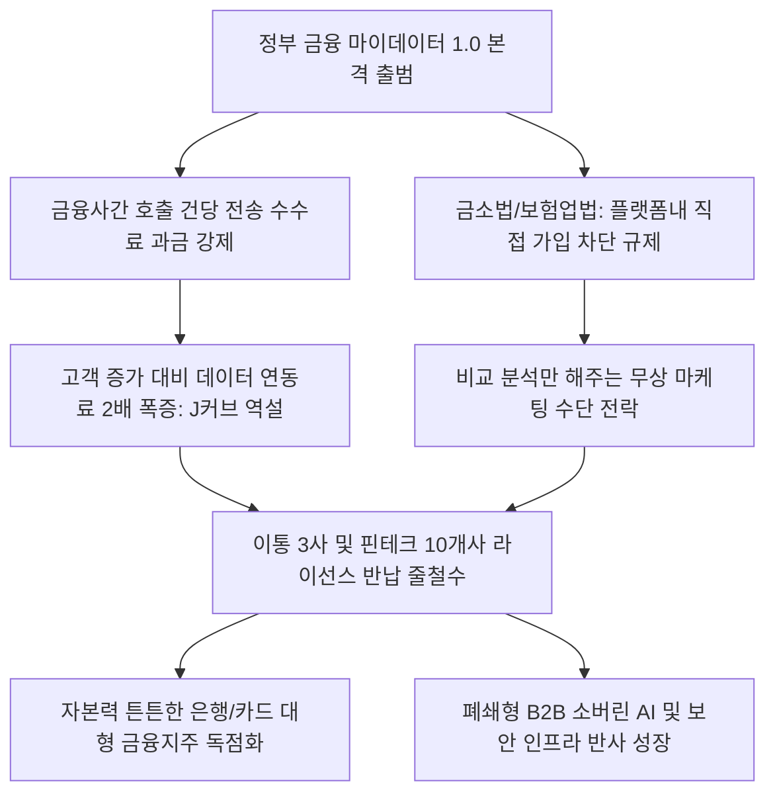

# 금융/테크 분석: 금융 마이데이터 줄철수와 J커브 과금 역설 및 규제 장벽에 따른 핀테크 수익 붕괴 현상
## 투자 신호 + 사회적 영향 평가

---

## 📌 기사 기본 정보

- **날짜**: 2026-05-06
- **출처**: 전자신문 (이창섭 기자)
- **카테고리**: 경제 > 금융 > 핀테크
- **핵심 주제**: 2022년 야심차게 출범한 대한민국 마이데이터(본인신용정보관리업)가 고객이 늘어날수록 전송 수수료 비용이 2배 이상으로 급증하는 'J커브 역설'과 보험 비교 후 원스톱 가입을 가로막는 규제 장벽(보험업법·금소법)에 가로막혀, 이동통신 3사(SKT·KT·LGU+)와 대기업 핀테크사들이 라이선스를 대거 반납하며 생태계 붕괴 위기에 처한 현상 분석

**메타데이터**
- 주요 사건: 대형 이통 3사 및 다수 핀테크 대기업의 마이데이터 라이선스 연속 반납 및 철수 확산
- 핵심 원인: 호출 건수당 부과되는 데이터 전송 수수료 부담의 기하급수적 급등(J커브 비용 구조), 가입을 차단하는 복수 규제(금소법·보험업법), 계열사 간 데이터 공유 제한에 따른 그룹 시너지 원천 차단
- 주요 주체: 금융위원회, 이동통신 3사(KT, LG유플러스, SK텔레콤), 핀테크 중견사(페이코, FN가이드, 11번가 등), 금융 소비자
- 키워드: 마이데이터, J커브 수수료, 데이터 전송료, 플랫폼 규제, 금융소비자보호법, 데이터 경제

---

## 🔍 기사를 통한 투자 신호 추출

### 1단계: 핵심 사건 분해

**What (무엇이 일어났는가?)**
- 대한민국 데이터 경제의 총아로 기대를 모았던 '마이데이터' 라이선스를 취득한 대기업과 통신사들이 잇달아 라이선스를 정부에 반납하고 서비스를 철수(줄철수)하고 있습니다. KT가 금융위 폐업 수리를 완결하고 SKT와 LGU+도 조기 철수를 선언하는 등 총 10개 대표 기업이 데이터 시장을 떠났습니다. 이는 고객을 유치할수록 API 데이터 전송 비용(2024년 328억 원 돌파)이 수익 증가 속도를 훨씬 초월해 2배 이상 폭증하는 치명적인 'J커브의 역설'과, 마케팅만 해주고 정작 수익으로 직결되는 플랫폼 내 다이렉트 가입(보험 등)은 불가능한 규제 엇박자가 부른 비즈니스 붕괴입니다.

**When (언제 일어났는가?)**
- 2026-05-06 (통신 3사의 이탈이 전격 기사화되고, 국회와 정부의 규제 개정안 논의가 지연되면서 핀테크 업계 전체의 유동성 한계 경보가 발령된 시점)

**Why (왜 일어났는가?)**
- 정부가 핀테크 플랫폼에 '신용 정보 호출 건당 정량 과금' 수수료를 강제 도입해, 가입자는 늘어나도 정작 건당 데이터 연동 비용이 플랫폼 영업이익을 갉아먹는 적자 지옥을 방치했기 때문입니다.
- 금융소비자보호법 및 보험업법이 플랫폼 내 금융상품 직접 중개·가입 권한을 원천 차단하여, 플랫폼이 비교 분석만 해주고 수수료는 단 1원도 챙기지 못한 채 트래픽만 소모하는 '무상 봉사자'로 고착되었기 때문입니다.

**Who (누가 주도하는가?)**
- 규제 개선(보호 중심에서 활용 중심으로 세제 개정) 지연과 높은 전송료 상한제를 고수하고 있는 금융당국
- J커브 적자를 견디지 못하고 마이데이터 사업 부서 해체 및 라이선스 공식 폐업을 신청하고 있는 ICT/통신 거두들

---

## 2단계: 투자 신호 해석

### A. **긍정적 신호 (Bullish)**

**① 데이터 독점력과 풍부한 자본력을 바탕으로 생태계를 최종 흡수하는 은행·카드계열 초대형 금융지주사**
- **신호**: 이통사 및 중소형 핀테크사들의 마이데이터 줄철수와 시장 공동화
- **의미**: 경쟁자들이 고사하고 시장에서 이탈하면서, 데이터 전송료 비용을 마케팅비 및 내부 시너지 비용으로 소화할 능력이 있는 대형 금융지주(KB, 신한, 하나 등) 계열 플랫폼들이 개인들의 모든 금융 정보 주권을 영구 독점 통제하게 됨
- **투자 기회**: 통합 앱 지배력을 강화하고 자체 자산관리(WM) 고객 점유율을 독식하는 선두 대형 금융지주사

**② 마이데이터의 실패를 대체하는 대체 불가능한 '소버린 AI 및 토종 특화 B2B 데이터 솔루션' 제공 기업**
- **신호**: 데이터 공유 제한 규제를 우회하여 폐쇄형 온프레미스로 작동하는 AI 분석 인프라 선호
- **의미**: 마이데이터를 통한 광범위한 B2C 데이터 수집이 좌절됨에 따라, 금융사들은 내부 데이터(소버린)를 스스로 분석하여 AI 에이전트로 융합하는 B2B 소프트웨어와 내부 망분리 우회 보안 솔루션 도입을 극대화함
- **투자 기회**: 소버린 AI 기술을 보유한 국산 데이터 엔진 개발사, 기업용 머신러닝 분석 특허사

---

### B. **위험 신호 (Bearish)**

**① 수수료 수익원 가입 연계가 차단되어 유동성 고갈을 겪는 독립형 중소 핀테크 상장사**
- **신호**: J커브 과금 비용의 영업 적자 누적 및 마이데이터 라이선스 연속 반납
- **의미**: 밸류에이션의 원천이던 '금융 종합 플랫폼' 스토리가 마이데이터 철수로 붕괴되며, 대규모 가입자 트래픽이 그대로 전송 수수료 빚더미로 돌아와 파산 및 대기업 피인수합병의 막다른 길로 내몰림
- **투자 리스크**: 가입 가입 전환 수익원이 없는 독립형 P2P/비교추천 전문 상장 핀테크사

**② 마이데이터 사업과의 연계 및 타종 데이터 결합을 통해 신사업을 기획하던 이동통신 및 신용평가(CB)사**
- **신호**: 이통 3사의 마이데이터 라이선스 반납 폐업 수리 완료
- **의미**: 통신 결제 및 데이터 정보를 금융 자산과 결합하여 비금융 신용평가 모델을 팔아먹으려던 통신사의 차세대 신성장 먹거리가 영구 사망하여 해당 부서 R&D 무형자산 가치가 상각 처리됨
- **투자 리스크**: 통신 기반 IT 신사업 비중을 과도하게 높게 잡았던 대형 이동통신 3사 전체

---

### 3단계: 섹터별 투자 기회 매트릭스

#### ✅ **높은 기대도 + 낮은 리스크**

**자체 데이터 유출 우려가 없고 B2B 소버린 AI 및 보안 인프라를 지배하는 독점 기술주**
- 마이데이터의 규제 동맥경화와 비용 지옥은 기업들로 하여금 외부에 데이터를 맡기지 않고 내부 안방(Sovereign)에서 AI로 데이터를 처리하는 폐쇄형 데이터 솔루션으로 복귀하게 만듭니다. B2B 중심의 국산 특화 데이터 엔진과 보안 제어권을 독점한 기업은 정책 왜곡과 상관없이 독보적 실적 성장을 달성합니다.
- **투자 추천도**: ⭐⭐⭐⭐⭐

---

## 💰 구체적 투자 신호 변환

### 신호 1: 독립형 핀테크 자산의 철저한 매도 및 '자본 집중화' 수혜를 받는 대형 금융지주 중심 재편

**투자 해석**: 기사는 한국의 '마이데이터 1.0' 모델이 수익 비즈니스를 원천 차단하는 세법·금융 규제와 고객이 늘수록 손실을 가중시키는 API 데이터 전송료라는 치명적인 J커브 역설 탓에 완전히 파산했음을 여과 없이 증명합니다. 핀테크가 세상을 지배할 것이라는 낭만적 기대는 규제의 철퇴와 수수료 적자 폭탄 앞에 완전히 박살 났습니다. 따라서 투자자는 단기 반등을 노리고 상장 핀테크주나 인터넷 은행 관련주를 매수하는 행위를 극도로 경계하고 비중을 획기적으로 낮추어야 합니다. 대신, 경쟁자들의 대거 이탈로 인해 개인들의 모든 자산 데이터 흐름을 자연스럽게 무혈 독점하게 될 초대형 금융지주 주식으로 자산의 무게중심을 이전시켜야 합니다. 규제 개혁(마이데이터 2.0 및 금소법 개정)이 일어나 원스톱 비교 가입이 완전히 풀리기 전까지는, 자본 맷집이 튼튼하고 독점적 점유율을 차지하게 될 1티어 대형 은행/지주사만이 데이터 경제 파멸 국면의 종착지에서 유일한 절대적 승리자로 살아남을 것입니다.

---

## 🌍 사회적 영향 평가

### A. 긍정적 사회 영향
- **무분별한 개인 정보의 무차별적 결합 방지**: 핀테크 대기업들의 무차별적인 통신-금융 데이터 유착이 제도적으로 억제되어, 개인 금융 신용 정보의 유출 리스크 및 불법 대환 유도 스팸 마케팅 대량 감소
- **소버린 AI 등 내부 데이터 보안 중요성의 격상**: 외부 데이터 플랫폼 의존증을 버리고 기업 내부 데이터 보안(망분리 수호) 및 고정밀 프라이빗 AI 기술 개발 투자가 가속화되는 계기 마련

### B. 부정적 사회 영향
- **일반 금융 소비자의 디지털 정보 접근권의 퇴보와 파편화**: 흩어진 여러 금융 자산과 보험을 한눈에 손쉽게 관리하던 국민 편의가 완전 붕괴되어, 다시 각 금융사 앱 10여 개를 일일이 따로 다운로드해야 하는 아날로그적 정보 소외 및 불편 유발
- **국내 핀테크 생태계의 공동화와 국가 데이터 패권 상실**: 마이데이터의 규제 동맥경화로 토종 혁신 기업들이 모두 문을 닫는 동안, 규제에서 자유로운 해외 거대 IT 빅테크 플랫폼들이 한국인들의 무형 데이터 패권을 우회적으로 잠식하는 데이터 식민지화 노출

---

## 🎯 결론: 당신의 투자 전략 수립

- **즉시 실행**: 마이데이터 기반 비즈니스 비중이 크고 전송 수수료 적자가 J커브 형태로 누적되는 중소형 상장 핀테크주 및 P2P 관련주 전량 매도
- **3개월 후**: 금융위원회의 '마이데이터 활용 활성화 규제 개정' 및 플랫폼 내 원스톱 가입 허용 여부를 담은 법령 개정 추이를 필터링하고, 대기업 금융지주사의 자산관리 독점 효과 실적 지표 검증 후 비중 조절

---

## 📝 Obsidian 연결 구조

