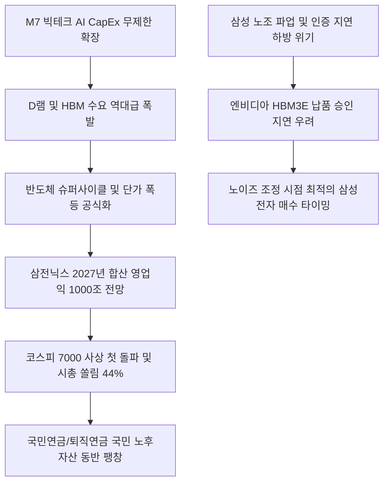

# 반도체/시장 분석: 삼전닉스 합산 영업익 1000조 전망과 HBM 슈퍼사이클 및 코스피 7000 돌파 현상
## 투자 신호 + 사회적 영향 평가

---

## 📌 기사 기본 정보

- **날짜**: 2026-05-06
- **출처**: 국내 경제지 (베한님 기자)
- **카테고리**: 경제 > 반도체 > 증시
- **핵심 주제**: 글로벌 빅테크의 AI 인프라 투자 폭증(CapEx)에 기반한 고대역폭메모리(HBM) 및 D램 수요 폭발로, 삼성전자와 SK하이닉스의 2027년 합산 영업이익이 1000조 원을 노크하고 코스피가 사상 최초 7000을 돌파하며 양사 시총 비중이 전체의 44.51%를 독식하는 한국 증시의 구조적 반도체 쏠림 분석

**메타데이터**
- 주요 사건: 코스피 7000 사상 첫 돌파 및 삼전닉스 2027년 합산 영업이익 1000조 육박 컨센서스 상향
- 핵심 원인: 글로벌 M7 빅테크의 잉여현금흐름(FCF) 43% 감소에도 불구하고 단행되는 무제한 AI CapEx 경쟁, 주문생산형 장기 고마진 HBM 계약 고착화
- 주요 주체: 삼성전자(시총 1500조 원 돌파), SK하이닉스(1년 영업이익률 79% 전망), 씨티그룹 및 맥쿼리 증권, 엔비디아
- 키워드: 반도체 슈퍼사이클, HBM, 잉여현금흐름(FCF), 코스피 7000, 영업이익률 79%, 노조 파업 리스크

---

## 🔍 기사를 통한 투자 신호 추출

### 1단계: 핵심 사건 분해

**What (무엇이 일어났는가?)**
- 대한민국 종합주가지수가 역사상 최초로 7000포인트를 돌파했습니다. 그 배후에는 시총 1500조 원을 넘어선 삼성전자와 전례 없는 고마진 영업이익률(최대 79%)을 예고한 SK하이닉스라는 쌍두마차가 버티고 있습니다. 글로벌 M7 빅테크들이 AI 패권을 쥐기 위해 FCF 감소(43% 감소 전망)를 감수하며 HBM과 고성능 D램 구매에 사활을 거는 덕분입니다. 그러나 지수 고공행진 뒤에는 삼성전자의 노조 총파업이 엔비디아용 차세대 HBM 퀄(품질) 테스트 통과 일정을 지연시킬 것이라는 하방 위기가 얽혀 있습니다.

**When (언제 일어났는가?)**
- 2026-05-06 (코스피 7000 돌파와 동시에 내년도 삼전닉스 영업이익 1000조 원 전망치가 증권가 합산 공식 통계로 집계 완료된 날)

**Why (왜 일어났는가?)**
- AI 데이터센터에 탑재되는 최고 사양 반도체는 범용과 달리 주문 제작 방식으로 사전에 물량이 선매각되어, 공급 과잉 리스크가 차단되고 마진을 부르는 대로 수취할 수 있는 수퍼 셀러 마켓이 장기 고착화되었기 때문입니다.
- 미국의 금리 인하 기대 소멸 조짐에도 불구하고 빅테크 기업들이 AI 인프라를 '도태되지 않기 위한 생존형 군비 경쟁'으로 정의해 장기 설비투자 계획을 확장하고 있기 때문입니다.

**Who (누가 주도하는가?)**
- 미국 빅테크의 막대한 자금을 반도체 하드웨어 구매로 집중시키고 있는 마이크로소프트, 구글, 엔비디아
- 노조 파업이라는 돌발 내부 변수로 삼성의 HBM 인증 지연 가능성을 경고하며 목표가를 미세 조정한 월가 리서치 하우스들

---

## 2단계: 투자 신호 해석

### A. **긍정적 신호 (Bullish)**

**① HBM 및 차세대 지능형 메모리(CXL, PIM) 소부장(소재·부품·장비) 초격차 독점주**
- **신호**: SK하이닉스의 2027년 영업이익률 79.4% 도달 예고 및 빅테크 CapEx 상향 지속
- **의미**: 역사상 유례없는 반도체 고마진 랠리로 인해, HBM 생산에 필수적인 수직 적층 공정 장비 및 화학 접착 소재를 독점 납품하는 협력사들이 현금 흐름 보너스를 독식하며 영업이익 성장이 10배 이상 고공 행진함
- **투자 기회**: HBM 특수 열 압착(TC) 본더 및 정밀 세정·검사 장비 제조 강소 상장사

**② 반도체 실적 폭발로 인한 국민연금 연동 코스피7000 추종 지수형 대형주**
- **신호**: 삼전닉스의 코스피 전체 시가총액 비중 44.51% 독식
- **의미**: 개별 종목의 변동성과 무관하게, 코스피 지수 자체를 추종하는 인덱스 자금 및 연기금 자금이 두 기업의 사상 최대 이익 전망에 강제로 연동되어 지수 전체의 상방 마지노선을 7000선 위로 단단히 밀어 올림
- **투자 기회**: 코스피200 지수 추종 레버리지 상품, 고유보금 기반 배당 성장 대형 금융지주

---

### B. **위험 신호 (Bearish)**

**① 삼성전자의 노사 분쟁 파업에 따른 엔비디아 차세대 HBM3E/HBM4 양산 승인(Qual) 지연 리스크**
- **신호**: 씨티그룹의 삼성전자 목표가 30만 원으로의 미세 하향 조정 경고
- **의미**: 성과급 분쟁 파업이 장기화되어 핵심 연구 인력의 인증 일정이 단 며칠이라도 지연될 경우, 엔비디아의 차세대 HBM 수주를 하이닉스가 100% 독점하며 삼성은 다음 AI 가속기 생태계 사이클에서 영구 낙오되는 치명적 하방 위기에 처함
- **투자 리스크**: HBM 승인 지연 루머 노출 시 삼성전자 주가 변동성 확대 및 연관 부품 공급사

**② 빅테크의 FCF(잉여현금흐름) 43% 폭락 이후 도래할 AI CapEx 피크아웃(Peak-out) 조정**
- **신호**: 빅테크 기업들의 이익 대비 지나친 차입 설비투자에 따른 현금 흐름 고갈
- **의미**: 2027년까지는 수주잔고로 버티나, AI 수익 가시성이 월가의 눈높이를 조금이라도 하회할 경우 2027년 말에 빅테크들이 데이터센터 예산을 일시에 동결시키는 역대급 보복성 인프라 감축이 발생해 반도체 업황이 수직 폭락할 수 있음
- **투자 리스크**: AI 실질 수익 모델이 부재한 고밸류 빅테크 플랫폼 및 원가 절감형 중소 반도체 공급사

---

### 3단계: 섹터별 투자 기회 매트릭스

#### ✅ **높은 기대도 + 낮은 리스크**

**글로벌 독점 HBM 패키징 공정 장비 및 핵심 특허 소부장 기업**
- 삼전닉스의 합산 영업이익 1000조 시나리오는 두 거인이 HBM을 찍어내는 족족 팔려나간다는 물리적 현실을 의미합니다. 설령 삼성의 인증 지연이 발생하더라도 그 빈자리는 하이닉스가 메우므로 HBM 장비와 핵심 부품을 양사에 동시에 공급하는 B2B 특허 소부장은 무풍지대의 절대적 고성장을 구가합니다.
- **투자 추천도**: ⭐⭐⭐⭐⭐

---

## 💰 구체적 투자 신호 변환

### 신호 1: 코스피 7000선 돌파 속 '삼전닉스 독점 랠리'의 실적 수호 및 삼성 노조 파업 타결 시점의 비중 배팅

**투자 해석**: 기사는 코스피 7000 돌파라는 미답의 고지가 빅테크 AI CapEx 폭식이라는 '실물 인프라 무기' 덕분이며, 내년 1000조 합산 영업이익이 단순한 상상이 아닌 구체화되는 현실의 중간 기착지임을 보장합니다. 투자자는 "고점이다, 거품이다"라는 막연한 비관론에 질려 반도체 주식을 던지는 개미들의 차익 매도 행렬([[개미순매도]])에 합류하지 말고, 외국인과 기관의 강력한 동반 매수 세력에 포지션을 견고히 밀착시켜야 합니다. 다만, 단기적으로 삼성전자의 '노조 파업 리스크([[성과급 논란]])'가 HBM3E 엔비디아 퀄 인증 지연이라는 하방 공포를 자극해 주가가 짓눌리는 노이즈가 발생할 때, 이를 포트폴리오를 도망칠 위기가 아니라 오히려 삼성전자([[삼성전자]]) 주식을 바닥에서 대량 쓸어 담는 역발상 바이더딥(Buy the Dip) 기회로 포착해야 합니다. 파업 타결 선언 즉시, 지연되었던 퀄 승인이 발표되며 주가가 수직 리레이팅될 것이므로 노사 협상의 고차 방정식 타결 직전이 인생의 반도체 비중 극대화 타이밍이 될 것입니다.

---

## 🌍 사회적 영향 평가

### A. 긍정적 사회 영향
- **근로자 국민들의 노후 자산의 동반 팽창**: 삼전닉스의 시총 비중이 코스피 전체의 44.51%를 장악함에 따라, 국민연금 및 직장인 퇴직연금, IRP 계좌의 누적 평가액이 사상 최대로 불어나 전 국민 노후 안전망 강화 기여
- **국가 첨단 반도체 패권의 영구적 공고화**: 1000조 영업이익 전망이 전 세계 자본을 한국의 평택과 이천으로 유입시켜, 아시아 반도체 안보 공급망 수호의 유일무이한 바지선 지위 수립

### B. 부정적 사회 영향
- **단기 성과 배분 갈등으로 인한 극단적 국론 분열**: 천문학적 이익 전망을 앞두고 임직원의 성과급 요구, 주주의 고배당 압박, 정부의 세제 환원 요구가 동시에 터져 나와 사회적 당파 갈등과 파업 분쟁 장기화로 산업 마찰 극대화
- **반도체 단일 쏠림에 따른 국가 경제의 취약성 극대화**: 한국 거시 경제와 주식시장의 반도체 의존도가 절반에 육박하여, 향후 AI 버블이 꺼지거나 미국 테크 CapEx 사이클이 붕괴할 때 대한민국 전체가 일시에 침몰하는 동조화 리스크 가중

---

## 🎯 결론: 당신의 투자 전략 수립

- **즉시 실행**: 포트폴리오 내 삼전닉스 우량주 비중을 40% 이상으로 유지하고, 신용을 배제한 현금 자산 기반의 견고한 주주 지분 수호
- **3개월 후**: M7 빅테크의 분기 잉여현금흐름(FCF) 추이 데이터 및 삼성전자 노조 파업 타결 후 엔비디아 최종 납품 승인 공시를 확인하여 소부장 대장주 포트폴리오 비중 리밸런싱 완결

---

## 📝 Obsidian 연결 구조

