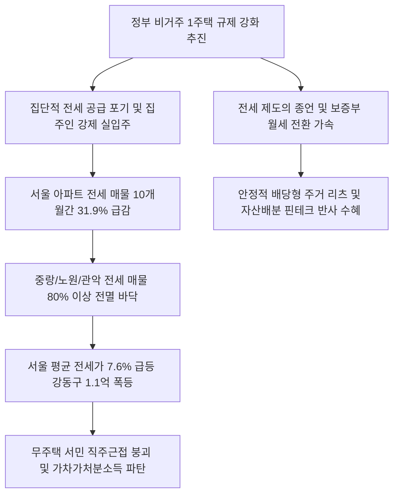

# 부동산/주거 분석: 서울 전세매물 31.9% 급감과 비거주 규제 역설 및 무주택 서민 전셋값 폭등 현상
## 투자 신호 + 사회적 영향 평가

---

## 📌 기사 기본 정보

- **날짜**: 2026-05-06
- **출처**: 전자신문 (배규민 기자), 자료: 아실·다방
- **카테고리**: 경제 > 부동산 > 부동산정책
- **핵심 주제**: 정부의 비거주 1주택자에 대한 세무 규제 강화(장기보유특별공제 거주 요건 결합) 정책이 촉발한 집주인들의 대대적인 실입주 전환과, 이로 인해 서울 아파트 전세 매물이 10개월 만에 31.9% 급감하고 서울 평균 전셋값(7.6% 상승)이 폭등하며 서민 무주택 세입자의 주거 불안이 극대화된 현상 분석

**메타데이터**
- 주요 사건: 서울 아파트 전세 매물 1만 8000여 건으로 31.9% 급감 및 전세 보증금 사상 최대폭 폭등
- 핵심 원인: 비거주 1주택 규제 강화에 따른 임대 물량의 자가 실거주 강제 입주 전환(매물 잠김), 저금리 시대 이후 전세 운영 수익 메리트 둔화
- 주요 주체: 무주택 임차 서민 가구, 수도권 비거주 1주택자, 국토교통부, 부동산 빅데이터 기관(아실, 다방)
- 키워드: 서울 전세급감, 비거주 규제 역설, 수급 불균형, 매물 잠김, 직주근접 훼손, 주거 인플레이션

---

## 🔍 기사를 통한 투자 신호 추출

### 1단계: 핵심 사건 분해

**What (무엇이 일어났는가?)**
- 서울 전역의 아파트 전세 매물이 10개월 만에 31.9% 급증하며 세입자 시장에 유례없는 '공급 소멸' 사태가 덮쳤습니다. 특히 외곽 지역인 중랑구(-85.3%), 관악구(-78.5%), 노원구(-77.9%)는 매물이 완전히 바닥나 씨가 말랐습니다. 이는 실거주를 강제하려는 정부의 세제 규제가 집주인들로 하여금 기존 전세를 내주고 외부 임차 거주하던 삶의 방식을 포기하고 본인 집에 강제 직접 입주하게 만들어 전세 공급망을 잠식한 결과입니다. 이로 인해 서울 전세 평균 보증금은 7억 1000만 원선으로 치솟아 전년 대비 5000만 원 이상 폭등했습니다.

**When (언제 일어났는가?)**
- 2026-05-06 (비거주 1주택 규제의 7월 공식 법안 발의를 앞두고 임대인의 실입주 전환이 폭발적으로 시행되어 수급 붕괴 통계가 공식 입증된 시점)

**Why (왜 일어났는가?)**
- 정부가 자산가들의 비거주 임대 행위를 투기로 보고 세제 혜택(장기보유특별공제 등)을 획기적으로 차단하는 징벌적 세제를 가동하여, 집주인들에게 임대 유지를 포기하는 퇴로를 차단했기 때문입니다.
- '선한 의도'로 설계된 실거주 의무 제도가, 실제 임대시장에 공급을 쏟아내던 주거 혈관(비거주 1주택자의 임대 매물)을 한꺼번에 동결시키는 공급 잠식의 부작용을 유발했기 때문입니다.

**Who (누가 주도하는가?)**
- 조세 정의 실현과 투기 차단을 위해 거주 요건 강제를 설계 추진 중인 기획재정부 세제 관료
- 세금 폭탄을 피해 외곽에 전세를 살며 본인 집을 임대 주던 패턴을 전면 중단하고 본인 집으로 강제 남하하고 있는 서울 1주택 소유주들

---

## 2단계: 투자 신호 해석

### A. **긍정적 신호 (Bullish)**

**① 부동산 대체 안전 투자 수단인 리츠(REITs) 및 주택 종합 자산관리 플랫폼**
- **신호**: 전세 제도의 종언과 보증부 월세 위주 임대시장 재편 가속화
- **의미**: 전세 공급이 붕괴되면서 전 세계 유일의 무이자 차입 제도(전세)가 빠르게 사라지고 고마진 기업형 민간 임대 및 월세 전환이 이루어짐에 따라, 전국 단위 오피스텔 및 주거형 부동산 자산을 전문 굴려 정기 배당을 지급하는 리츠(REITs) 기업들의 가치가 급증함
- **투자 기회**: 대기업 계열 주거 부동산 리츠, 주택 관리 디지털 자동화 플랫폼 기업

**② 전세 보증금 증액 부담에 밀려나 외곽의 아파트를 강제 매수하는 실수요 전환 수혜 중저가 건설사**
- **신호**: 세입자들의 서울 이탈 및 수도권 외곽 중저가 분양 주택으로의 내몰림 매수 전환
- **의미**: 서울 전셋값(평균 7억 원 이상) 상승을 감당하기 어려운 무주택 서민들이 눈높이를 낮추어 경기도 인근의 5억~6억 원대 중저가 신규 분양 아파트를 매수(공급대체)하는 실수요 유입이 활발해짐
- **투자 기회**: 수도권 외곽 지자체 내 풍부한 중저가 분양 주택 수주 잔고를 보유한 중대형 건설주

---

### B. **위험 신호 (Bearish)**

**① 전세 매물 잠김에 따른 수도권 핵심 지역 매매 및 거래량의 동반 고사**
- **신호**: 서울 중랑, 관악, 노원 등의 전세 매물 80% 이상 전멸
- **의미**: 집주인이 직접 입주하면서 주거 이동 자체가 차단되고 거래량이 정체되는 동맥경화가 장기화되어, 거래 수수료 마진에 기생하는 중개 플랫폼과 주거 인테리어 자재 기업의 실적이 급감함
- **투자 리스크**: 수도권 부동산 중개 거래 비중이 절대적인 프롭테크 플랫폼 및 가구/인테리어 브랜드

**② 서울 외곽 중저소득층 근로자 가계의 내수 가처분 소득의 추가 붕괴**
- **신호**: 전세 보증금 평균 7.6%(강동구 19.8% 폭등)의 추가 인상 폭탄
- **의미**: 전셋값을 맞춰주기 위해 가계가 추가적인 전세대출을 받아 이자 비용 지출이 폭증하고, 이는 고스란히 국내 의류, 외식, 레저 등 내수 소비를 얼려버리는 강력한 거시적 스태그플레이션 요인으로 작동함
- **투자 리스크**: 국내 내수 백화점, 국내 가전 유통사, 의류 패션 등 내수 가처분 민감주

---

### 3단계: 섹터별 투자 기회 매트릭스

#### ✅ **높은 기대도 + 낮은 리스크**

**국내 우량 상장 리츠 및 인프라 배당 투자 지주**
- 서울의 전세 매물 소멸과 전세 보증금 폭등은 가계 자본을 월세 지출 구조로 강제 재편하게 만듭니다. 부동산 전세의 종언 국면에서 매달 꼬박꼬박 현금 배당을 수취하는 상장 주거/인프라 리츠 플랫폼은 자금 조달 리스크에서 안전하게 장기 적립식 복리 수익을 확정해 줍니다.
- **투자 추천도**: ⭐⭐⭐⭐⭐

---

## 💰 구체적 투자 신호 변환

### 신호 1: '임대차 수급 동맥경화' 포착과 부동산 보유 비중 축소 및 연배당 리츠/금융자산 대피

**투자 해석**: 기사는 정부의 '선한 의도(비거주 규제 강화)'가 실제로는 시장 공급을 잠식해 세입자의 전셋값 1억 원 폭등이라는 징벌적 청구서로 돌아왔음을 폭로합니다. 부동산 시장에서 '전세'라는 고유의 레버리지 피난처는 영구적으로 파괴되고 있습니다. 투자자는 서울 외곽의 주택 매매시장 반등 테마에 현혹되어 무리한 갭투자를 감행하는 낡은 부동산 공식을 폐기해야 합니다. 전세 매물이 31.9% 폭락했다는 것은 거래 회전율이 사망했음을 뜻합니다. 지금의 수급 붕괴 파고를 이겨내기 위해서는 자산 포트폴리오를 부동산 중심에서 매달 고수익 월배당을 주는 '주식형 고배당 ETF([[월배당ETF]])'나 국내 초우량 주거/상업 리츠(REITs)로 신속히 이동시켜야 합니다. 규제가 공급을 옥죄어 수급 왜곡이 풀리지 않는 장기 주거 인플레이션 하에서, 현금 흐름이 없는 아파트를 쥐고 버티기보다는 월 지출 보완과 세제 방어가 입증된 연배당 자산관리 플랫폼으로 포트폴리오를 재편하는 것이 절대 생존의 법칙입니다.

---

## 🌍 사회적 영향 평가

### A. 긍정적 사회 영향
- **투기 목적 부동산 갭투자 차단**: 갭투자의 지렛대 역할을 하던 전세 자금 유입을 세제 규제로 원천 차단하여, 빚으로 올린 주택 거품을 근본적으로 다이어트하는 계기 마련
- **기업형 월세 임대 선진화 유도**: 불투명하고 위험성 높은 개인 간 전세 거래(전세사기 등)가 소멸하고, 투명하고 체계적인 대기업/리츠형 월세 임대 문화로의 연착륙 유도

### B. 부정적 사회 영향
- **중저소득층의 직주근접 붕괴와 서울 엑소더스(Exodus) 유발**: 서울 외곽(노원, 중랑 등) 전세 증발로 외곽 경기도로 강제 이주당한 청년 및 서민 근로자들의 통근 피로도가 극대화되어 국가 총생산 효율성 훼손
- **전세 난민의 급증과 월세 인플레 가중**: 전세보증금 인상분을 감당하지 못한 서민들이 고마진 반전세/월세로 강제 전환되며 가계 주거비용 부담이 수배로 급등하여 서민 고통 및 사회적 우울증 확산

---

## 🎯 결론: 당신의 투자 전략 수립

- **즉시 실행**: 임대 거래 회전율 둔화 직격탄을 맞은 프롭테크 상장주 및 내수 기반 가구/인테리어 원자재 관련주 전량 매도
- **3개월 후**: 서울 아파트 전세 매물 소진율 지표 추이 및 전세자금 대출 연체율 통계를 분석하여, 주거비 상승 압력이 매매시장으로 전이되는 시점에 중저가 주거 대체 수도권 건설주 선별 진입

---

## 📝 Obsidian 연결 구조

