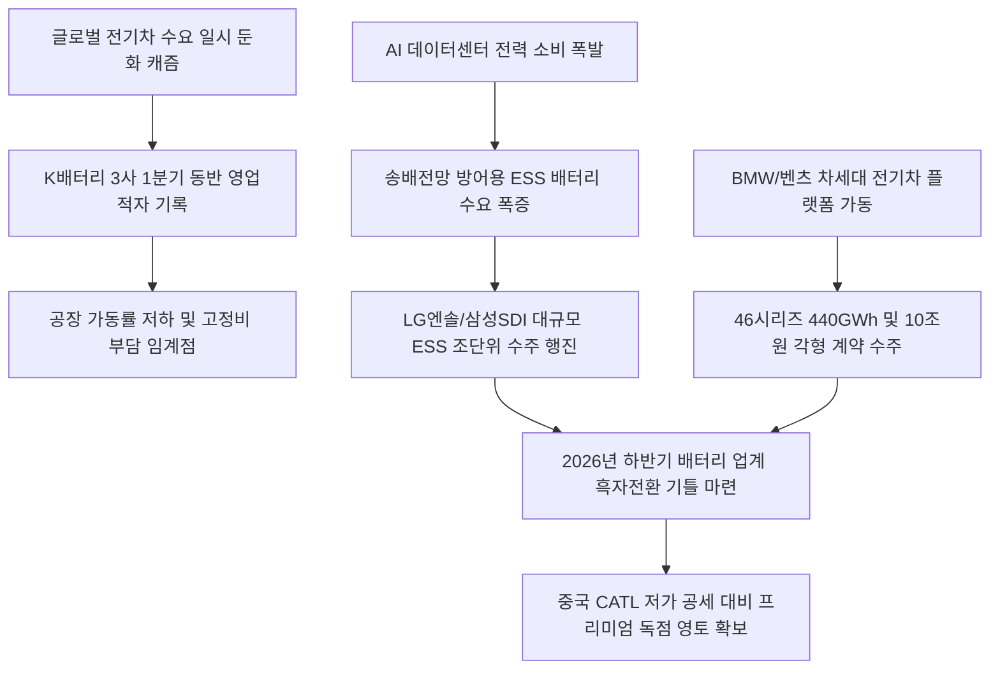

# 배터리/산업 분석: K배터리 1분기 적자 탈출과 대규모 ESS 수주 및 46시리즈·각형 프리미엄 턴어라운드 현상
## 투자 신호 + 사회적 영향 평가

---

## 📌 기사 기본 정보

- **날짜**: 2026-05-06
- **출처**: 매일경제 (박한나 기자)
- **카테고리**: 경제 > 산업 > 배터리
- **핵심 주제**: 전기차 수요 둔화(캐즘) 여파로 2026년 1분기 일제히 적자를 기록한 국내 배터리 3사(LG에너지솔루션·삼성SDI·SK온)가 AI 데이터센터 폭발로 인한 에너지저장장치(ESS) '조 단위' 대규모 수주와 BMW·메르세데스-벤츠용 차세대 46시리즈 및 프리미엄 각형 배터리 10조 원 규모 수주를 바탕으로 하반기 흑자전환(턴어라운드)을 정밀 설계하는 전략 분석

**메타데이터**
- 주요 사건: K배터리 3사 1분기 동시 영업적자 기록 및 ESS/차세대 배터리 수주 폭증 돌입
- 핵심 원인: 전기차 보급 지연에 따른 과잉 설비 고정비 부담, AI 구동 전력망 폭증으로 인한 ESS 배터리 수요 폭발, 중국 LFP와 차별화된 하이엔드 수주잔고 급증
- 주요 주체: LG에너지솔루션(46시리즈 수주 440GWh 돌파), 삼성SDI(벤츠 10조 공급 계약), SK온(적자 축소 노력)
- 키워드: K배터리 적자, ESS 수주행진, 46시리즈 원통형, 각형 프리미엄, LFP 배터리, 턴어라운드

---

## 🔍 기사를 통한 투자 신호 추출

### 1단계: 핵심 사건 분해

**What (무엇이 일어났는가?)**
- 대한민국 국가대표 배터리 3사가 글로벌 전기차 수요 둔화 직격탄을 맞으며 1분기 동반 적자(LG엔솔 -2078억, 삼성SDI -1556억 원 등)의 늪에 빠졌습니다. 그러나 설비 투자 유휴 라인을 AI 데이터센터 구동용 대형 에너지저장장치(ESS) 배터리 생산용으로 발 빠르게 전환하여 '조 단위' 수주 대행진을 벌이고 있습니다. 동시에 최고 성능의 원통형 46시리즈(수주잔고 440GWh 돌파) 및 메르세데스-벤츠용 10조 원 규모의 대형 프리미엄 배터리 계약을 잇달아 성사시켜 하반기 강력한 실적 반전의 화력을 비축했습니다.

**When (언제 일어났는가?)**
- 2026-05-06 (전기차 업황 저점 통과 및 AI 데이터센터발 전력망 ESS 수주 실적이 대기업 재무제표의 2분기 흑자전환 가이드라인으로 명확히 도출된 시점)

**Why (왜 일어났는가?)**
- 전기차 보급 속도 둔화로 인해 공장 가동률이 하락해 고정비 부담이 임계점에 달했기 때문입니다.
- AI 연산에 필요한 데이터센터의 송배전망 부하를 방어하고 재생에너지 간헐성을 해결해 줄 분산형 ESS 시스템 수요가 미국과 글로벌 전역에서 극단적인 폭발기에 돌입했기 때문입니다.

**Who (누가 주도하는가?)**
- 전기차 라인의 일부를 ESS용 각형/LFP 라인으로 신속 전환하여 유휴 라인 낭비를 차단 중인 LG에너지솔루션 및 삼성SDI 이사회
- 중국 저가 CATL과의 단가 경쟁을 지양하고 벤츠·BMW 등 글로벌 프리미엄 완성차용 10개년 계약을 체결해 장기 이익 안정성을 확보한 배터리 경영진

---

## 2단계: 투자 신호 해석

### A. **긍정적 신호 (Bullish)**

**① 데이터센터 전력 공급망 최후의 수혜자인 대형 ESS 배터리 및 부품 제조업**
- **신호**: LG에너지솔루션 매출 내 ESS 비중 20% 중반 돌파 및 테네시 2공장 ESS 전환
- **의미**: 전기차 캐즘 불황의 그늘을 AI 데이터센터 가동용 대형 보조 전력 저장장치(ESS) 수요가 완벽하게 상쇄해주고 있으며, 이는 중국 관세 차단 효과가 강력한 미국 인플레이션 감축법(IRA) 보조금 혜택을 100% 수취하는 독점적 이익 모델이 됨
- **투자 기회**: 북미 ESS 공장 증설 수혜 배터리 대형주, 고안전 각형 배터리 탑재 부품사

**② 차세대 초격차 원통형 46시리즈 및 각형 1티어 특허 소재·장비 공급사**
- **신호**: LG엔솔 46시리즈 수주잔고 440GWh 돌파 및 벤츠 10조 원 각형 다년 계약 체결
- **의미**: 2027년부터 양산이 가속되는 46시리즈(지름 46mm 대형 원통형)와 하이엔드 각형 배터리는 중국 CATL이 침투하기 힘든 완성차 1티어 독점 납품 루트를 확보하여, 관련 고특허 양극재 및 정밀 전극 조립 장비사들이 수년간의 확정적 고마진 낙수효과를 선점함
- **투자 기회**: 46시리즈 조립 장비 독점사, 니켈·망간 프리미엄 양극재 선도 기업

---

### B. **위험 신호 (Bearish)**

**① 범용 LFP 및 단순 파우치형 전기차 배터리 단일 포트폴리오 기업**
- **신호**: 중국 CATL의 초저가 LFP 유럽 침투율 극대화 및 가동률 50% 붕괴
- **의미**: 가격 경쟁력이 절대적인 소형 전기차 시장에서 중국 배터리와 정면 가격 싸움을 벌이는 범용 배터리 제조사는 공장을 돌릴수록 감가상각비 부담으로 만성 적자 수렁에서 헤어 나오지 못함
- **투자 리스크**: 미국 보조금 혜택 외에 독자적 하이엔드 기술 장벽이 없는 2차전지 소형 테마주

**② 미국 대선 및 IRA(인플레이션감축법) 보조금 정책의 정치적 가변성**
- **신호**: 트럼프 2기 행정부 등장 시나리오에 따른 친환경 보조금 삭감 경고
- **의미**: 북미 대규모 생산거점에 쏟아부은 천문학적 자금의 세액공제(AMPC) 혜택이 규제 변화로 축소될 경우, 하반기 흑자전환 스케줄이 다시 지연되어 자본 비용 부담이 급등할 위험 잔존
- **투자 리스크**: 미국 보조금 이익 기여도가 전사 영업이익의 50%를 넘는 고부채 배터리 제조사

---

### 3단계: 섹터별 투자 기회 매트릭스

#### ✅ **높은 기대도 + 낮은 리스크**

**글로벌 최고 수준의 46시리즈 원통형 배터리 장비 및 하이엔드 양극재 소재사**
- 완성차 메이커들이 중국 배터리 배제를 위해 차세대 차량 플랫폼([[노이에 클라쎄]])의 규격을 46시리즈 대형 원통형과 프리미엄 각형으로 일원화하고 있습니다. 적자 속에서도 수주잔고(440GWh)가 꺾이지 않고 폭발하고 있는 46시리즈 조립 설비 공급사는 하반기 턴어라운드의 절대적인 첫 번째 수혜자입니다.
- **투자 추천도**: ⭐⭐⭐⭐⭐

---

## 💰 구체적 투자 신호 변환

### 신호 1: 전기차 '캐즘(Chasm) 터널'의 끝 도달 - ESS 수주 및 46시리즈 전환 1티어 배터리 장기 매수

**투자 해석**: 기사는 국내 배터리 3사의 1분기 적자가 기술적 실패가 아니라 전기차 도입 과도기인 '캐즘(Chasm) 터널'의 가장 어두운 저점 부근을 지나고 있음을 통계로 확인해 줍니다. "배터리 시대는 끝났다"는 식의 공포 심리에 속아 장기 우량 배당 가치주를 헐값에 매도해서는 안 됩니다. 오히려 AI 데이터센터 폭발에 따른 'ESS 수주'라는 새로운 산소호흡기가 가동되고 있음에 눈을 떠야 합니다. 투자자는 단기 실적 적자 노이즈로 주가가 바닥을 기는 현재 시점을, 2027~2028년 벤츠·BMW향 수십조 원의 영업이익 턴어라운드([[턴어라운드]])를 선점하는 최적의 분할 적립식 매수 기회로 삼아야 합니다. 특히, 46시리즈 원통형 배터리 장비 시장과 ESS용 대형 각형 배터리 공급 권한을 가진 K배터리 대형주([[LG에너지솔루션]], [[삼성SDI]]) 위주로 포트폴리오를 압축 재편해야, 하반기 턴어라운드 랠리 개시 시점에 가장 빠른 자산 점프를 달성할 수 있습니다.

---

## 🌍 사회적 영향 평가

### A. 긍정적 사회 영향
- **글로벌 재생에너지 안보의 핵심 보루 안착**: 대규모 ESS 수주 확대를 통해 기후 변화에 따른 태양광·풍력 전력 불안정성을 제거하여 인류의 탄소중립([[탄소중립]]) 가속화에 지대한 기여
- **초고정밀 배터리 제조 엔지니어 양성 유도**: 46시리즈 및 차세대 고체/각형 배터리 공정 도입을 위해 국가적으로 높은 이공계 지식 역량을 갖춘 첨단 연구 인력 고용 창출 확대

### B. 부정적 사회 영향
- **일부 공장 라인 전환에 따른 블루칼라 노동자의 고용 재배치 마찰**: 전기차 라인 가동 중단 및 ESS 라인 전환 과정에서 일시적인 현장 교대 근무 축소와 노동 시간 감소에 따른 서민 근로 가계의 임금 소득 감소 애로 발생
- **정치적 보조금 종속에 따른 자본 유출 우려**: 북미 생산 거점에 대규모 국가 리소스를 집중시켰으나 미국의 보호무역주의 향방에 따라 국내 공장 투자 및 일자리 창출 재원이 미국 현지로 강제 유출되는 불평등 구조 고착화

---

## 🎯 결론: 당신의 투자 전략 수립

- **즉시 실행**: 중국 저가 LFP와 가격으로 싸우며 북미 보조금 혜택 외에 독자적 프리미엄 수주잔고가 부재한 2차전지 중소형 개별 테마주 비중 전량 정리
- **3개월 후**: 2분기 LG에너지솔루션 및 삼성SDI의 적자 감소 폭 수치와 북미 ESS 상업 가동률 지표를 정밀 분석하여, 46시리즈 본격 양산 돌입 시점에 대형 소재주 비중 추가 리밸런싱 실행

---

## 📝 Obsidian 연결 구조

