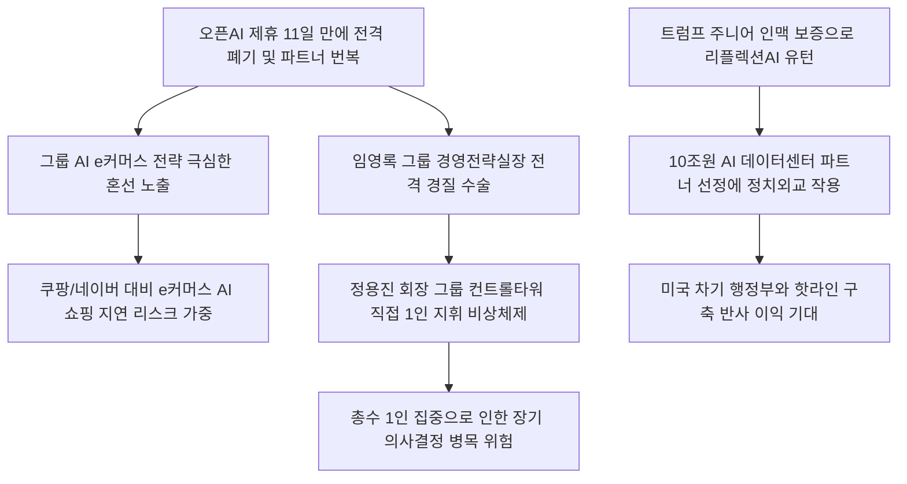

# 유통/경영 분석: 신세계그룹 AI 파트너십 변동과 경영전략실 대수술 및 정용진 직접 지휘 딜레마
## 투자 신호 + 사회적 영향 평가

---

## 📌 기사 기본 정보

- **날짜**: 2026-05-06
- **출처**: 매일경제 (유엄식 기자)
- **카테고리**: 경제 > 유통 > 기업지배구조
- **핵심 주제**: 챗GPT 개발사인 오픈AI와 AI 쇼핑 제휴를 맺은 지 불과 11일 만에 전격 제휴를 중단하고 미국 리플렉션AI로 사업 파트너를 번복한 신세계그룹의 AI 전략 혼선 상황과, 이로 인한 컨트롤타워 수장(임영록 경영전략실장) 경질 및 정용진 회장의 직접 지휘, 그리고 10조 원 규모 AI 데이터센터 투자를 둘러싼 리스크 분석

**메타데이터**
- 주요 사건: 신세계그룹의 오픈AI 제휴 폐기 및 리플렉션AI로의 유턴, 컨트롤타워 경영전략실장 원포인트 전격 경질
- 핵심 원인: 그룹 내 전략적 의사결정의 일관성 상실, 트럼프 가문(트럼프 주니어)과의 외교·정치적 인맥에 기댄 리플렉션AI 협업 선택, 통제 기구(전략실)와 총수 간의 합의 실패
- 주요 주체: 정용진 신세계그룹 회장, 임영록 전 경영전략실장, 리플렉션AI(미국 AI 스타트업), 오픈AI
- 키워드: 경영전략실 대수술, 리플렉션AI, 오픈AI 중단, 완결형 AI 커머스, 트럼프 주니어, 컨트롤타워 흔들림

---

## 🔍 기사를 통한 투자 신호 추출

### 1단계: 핵심 사건 분해

**What (무엇이 일어났는가?)**
- 대한민국 최대 오프라인 유통 공룡인 신세계그룹이 챗GPT의 독점적 우군이던 오픈AI와의 AI 쇼핑 에이전트 개발 협력을 단 11일 만에 전격 폐기했습니다. 그리고 미국 트럼프 가문의 장남인 '트럼프 주니어'가 보증하는 신생 AI 기업 리플렉션AI와 10조 원 규모의 AI 데이터센터 구축 및 차세대 커머스 동맹으로 유턴했습니다. 이 전격적인 파트너 번복의 책임을 물어 그룹 컨트롤타워인 경영전략실 수장(임영록 사장)이 경질되었고, 후임 선임 전까지 정용진 회장이 직접 경영전략실을 1인 지휘하는 비상 체제에 돌입했습니다.

**When (언제 일어났는가?)**
- 2026-05-06 (원포인트 인적 대수술 인사가 공식 발표되고, 2027 완결형 AI 커머스 달성(이마트 내 모든 검색·결제·배송 AI 통합) 로드맵의 지연 우려가 주식 시장에 반영된 시점)

**Why (왜 일어났는가?)**
- 기술적 가치와 비즈니스 정밀성 검증보다 총수의 각별한 인적 인맥(트럼프 가문)과 미 상무장관까지 동원된 '정치외교적 외압'의 역학 관계가 10조 원짜리 대형 IT 투자 비즈니스 파트너 선정에 최우선적으로 개입했기 때문입니다.
- 오픈AI의 범용 AI 생태계 편입에 반대하고 자체 소버린 AI 인프라(250MW 데이터센터)를 소유하려는 정용진 회장의 독자 노선 의지와 경영전략실의 대외 협력 절충안이 내부적으로 극심한 조율 실패를 일으켰기 때문입니다.

**Who (누가 주도하는가?)**
- 리플렉션AI와의 독점 동맹을 위해 오픈AI와의 파트너십을 11일 만에 해고하고 컨트롤타워 인적 수술을 단행한 정용진 회장
- 의사결정의 혼선 속에 경질된 임영록 전 경영전략실장과 차기 실장 후보로 거론되는 이마트 실무 총괄 그룹

---

## 2단계: 투자 신호 해석

### A. **긍정적 신호 (Bullish)**

**① 이마트 그룹의 오프라인 부동산 자산을 '250MW AI 데이터센터'로 전환하는 복합 디벨로퍼 가치 창출**
- **신호**: 리플렉션AI와 250MW 규모의 대형 AI 데이터센터 구축 파트너십 체결
- **의미**: 저성장 사양길에 접어든 대형 마트 점포 및 부지를 AI 연산 데이터센터라는 최고가의 부동산 가치 자산으로 리파이낸싱함으로써, 그룹 전체의 PBR(주가순자산비율)을 재평가받고 장기 임대 수수료 매출을 확보함
- **투자 기회**: 신세계그룹 내 데이터센터 구축을 전담할 건설/인프라 계열사, 송배전 전력망 부품 공급주

**② 미국의 차기 트럼프 행정부 출범 시 직접적 수혜를 입는 '트럼프 인맥주' 포트폴리오**
- **신호**: 트럼프 주니어의 보증을 통한 리플렉션AI 비즈니스 독점 동맹 성사
- **의미**: 트럼프 2기 행정부가 현실화될 경우, 트럼프 가문과의 강력한 핫라인을 보유한 신세계그룹이 미국의 보조금 혜택 및 미 상무부의 국책 수혜 협약 등에서 가장 확실한 한-미 가교 역할을 수행하며 관세 장벽 리스크를 원천 회피함
- **투자 기회**: 정용진 회장의 독점적 미팅 채널을 통해 외교 수혜를 얻는 유통 지주사

---

### B. **위험 신호 (Bearish)**

**① AI e커머스 및 디지털 쇼핑 에이전트 전환 지연에 따른 시장 점유율 붕괴**
- **신호**: 오픈AI와의 11일 만의 결별 및 컨트롤타워 대수술에 따른 e커머스 로드맵의 표류
- **의미**: e커머스 공룡([[쿠팡]])과 AI 쇼핑 시장을 선점한 IT 빅테크([[네이버]], [[카카오]])의 공습 속에서, 마이데이터 및 AI 쇼핑 에이전트의 내부 의사결정이 1년 넘게 번복되며 2027 완결형 AI 커머스 출시 목표 자체가 허위 찌라시로 무너지며 고객이 대거 이탈함
- **투자 리스크**: 디지털 전환 지연 시 실적 쇠락이 가속화되는 e커머스 계열 자회사 및 마트 상장주

**② 10조 원 규모의 과도한 데이터센터 설비투자로 인한 자금 압박과 부채 급증**
- **신호**: 유통 대기업이 10조 원 이상의 장기 기술 부문에 자본을 쏟아붓는 기조 지속
- **의미**: 부동산 PF 부실 위기 및 이마트 적자 구조 하에서 무리하게 10조 원짜리 IT 신사업을 끌어들임에 따라, 그룹의 현금 유보금이 고갈되고 이자 상환 부담이 폭증하여 신용등급 강등 및 유동성 위기 도화선이 됨
- **투자 리스크**: 부채 비율이 높으면서 실질 오프라인 마트 매출이 역성장 중인 유통 계열주

---

### 3단계: 섹터별 투자 기회 매트릭스

#### ✅ **높은 기대도 + 낮은 리스크**

**신세계그룹 데이터센터 구축 및 SCM 물류 시스템 혁신 계열사**
- AI 커머스 파트너가 11일 만에 오픈AI에서 리플렉션AI로 번복되더라도, 신세계가 소유한 대규모 유통 부지를 데이터센터로 리모델링하거나 SCM(공급망 관리) 물류망을 자율화하는 국책 건설 및 IT 계열사의 수주량은 10조 원 예산 한도 내에서 절대적으로 확정되어 있습니다.
- **투자 추천도**: ⭐⭐⭐⭐⭐

---

## 💰 구체적 투자 신호 변환

### 신호 1: 유통업종 내 '지배구조 불안정성(Governance Risk)' 회피 및 오프라인-데이터센터 가치 전환 핀포인트 배팅

**투자 해석**: 기사는 신세계그룹의 AI 사업 파트너가 단 11일 만에 번복되고 경영전략실장 사장이 전격 경질된 일련의 사태가 기술적 우위보다는 '지배구조적 리스크' 및 정치적 외압에 의한 것임을 분명히 증명하고 있습니다. 의사결정이 장기 일관성을 잃고 총수의 정치적 인맥에 따라 10조 원짜리 프로젝트의 파트너가 실시간 둔갑하는 환경은 주주 가치를 파괴하는 맹독입니다. 따라서 투자자는 단순히 "2027년 이마트 AI 에이전트 출시"라는 장밋빛 보도자료에 속아 이마트 주식을 매수하는 행위를 멈춰야 합니다. 오히려 이 의사결정 혼선이 가져올 SSG닷컴 등 e커머스 경쟁력의 퇴보 리스크를 반영해 관련 유통 지분을 적극 축소해야 합니다. 다만, 신세계가 리플렉션AI와 짓기로 확정한 '250MW 대형 AI 데이터센터' 구축 사업의 실무를 독점 수주할 내부 인프라 건설 계열사나 송배전 변압기 공급사 위주로 포트폴리오를 축소 재편하여, 규제와 정치 리스크 속에서도 10조 원짜리 낙수 수혜만 정밀하게 편취하는 핀포인트 투자 전략으로 대응해야 자산을 안전하게 수호할 수 있습니다.

---

## 🌍 사회적 영향 평가

### A. 긍정적 사회 영향
- **유휴 국토의 디지털 인프라 리파이낸싱**: 오프라인 쇠락으로 방치될 수 있는 대형 유통 점포 부지를 250MW급 초대형 첨단 데이터센터로 개조하여, 국가적 AI 연산 인프라 용량 확충에 민간 자본 차원의 대규모 기여
- **한·미 경제 가문 간의 실질적 민간 채널 구축**: 트럼프 장남과의 우호적 채널을 확보함으로써, 향후 글로벌 통화 무역 마찰 국면에서 대한민국 유통·안보 주권을 사수하는 민간 외교의 전략적 교두보 역할 수행

### B. 부정적 사회 영향
- **기업 의사결정의 사유화에 따른 소액주주 피해**: 11일 만의 글로벌 파트너십 파기와 컨트롤타워 마비가 유발한 주가 폭락으로 인해 엄한 소액주주들의 재산권이 침해되고 자본시장의 지배구조 신뢰도가 크게 훼손
- **오프라인 유통 고용 생태계의 붕괴 속도 가속화**: 2027 완결형 AI 커머스(배송·결제 자동화)가 현실화될 경우 이마트 및 물류 현장에서 일하는 계산원, 배송원 등 수만 명의 서민 일자리가 대대적으로 소멸하여 지역 고용 불안 극대화

---

## 🎯 결론: 당신의 투자 전략 수립

- **즉시 실행**: e커머스 전환 지연 및 대형 데이터센터 10조 투자 부담을 온몸으로 짊어져야 할 유통 상장사 및 지주사 비중 전량 정리
- **3개월 후**: 정용진 직접 지휘 경영전략실 체제의 해제 및 한채양 사장 등 신임 컨트롤타워 수장의 선임 시점을 모니터링하고, 리플렉션AI와의 데이터센터 합작 법인 설립 등 실질 추진 단계 진입 시 건설 계열사 진입

---

## 📝 Obsidian 연결 구조

