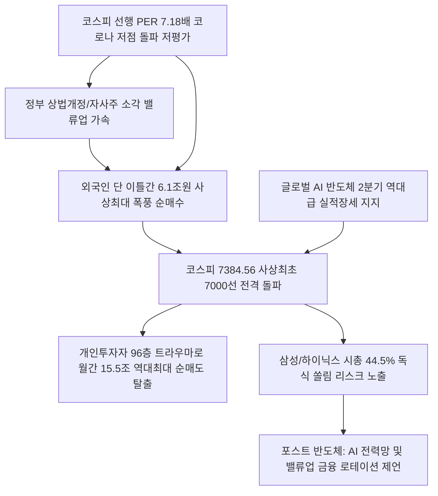

# 증시/시장 분석: 코스피 7000 사상 첫 돌파와 스마트 개미 탈출 및 외국인 6조 폭풍 매수 현상
## 투자 신호 + 사회적 영향 평가

---

## 📌 기사 기본 정보

- **날짜**: 2026-05-06
- **출처**: 한국경제신문 (장서윤·이병준·박유미 기자)
- **카테고리**: 경제 > 금융 > 한국증시
- **핵심 주제**: 5월 6일 코스피 지수가 역사상 최초로 7000선을 돌파해 7384.56으로 장을 마감하며 세계 주요 증시 중 연초 대비 상승률 1위(75.2%)를 달성한 상황과, 이란전쟁 및 고유가·금리 압박을 누른 AI 반도체 실적 장세 속에서 외국인의 6조 원 폭풍 순매수 및 개인의 15조 원 사상 최대 탈출 순매도 대치 분석

**메타데이터**
- 주요 사건: 코스피 7000선 사상 첫 역사적 돌파 및 사상 최대 외국인 순매수(이틀간 6.1조 원 유입)
- 핵심 원인: AI 에이전트 상용화에 따른 HBM 메모리 반도체 구조적 호황 돌입, 선행 PER 7.18배의 역사적 저평가 매력 및 상법 개정 등 기업 밸류업 정책 효과
- 주요 주체: 외국인 투자자(이틀간 6조 원 이상 매수), 개인 투자자(월간 15.5조 원 순매도 탈출), 삼성전자(시총 1500조 원 돌파), SK하이닉스
- 키워드: 코스피 7000, 밸류업 정책, 외국인 사상 최대 매수, 개미 순매도 탈출, 선행 PER, 실적 장세

---

## 🔍 기사를 통한 투자 신호 추출

### 1단계: 핵심 사건 분해

**What (무엇이 일어났는가?)**
- 대한민국 종합주가지수가 6000선을 뚫어낸 지 단 47거래일 만에 사상 최초로 7000선을 돌파해 7384.56으로 장을 마감했습니다. 1년 새 지수대 앞자리를 다섯 번이나 바꾸는 역사적인 코리아 랠리가 전개되었습니다. 외국인은 단 이틀 동안 6조 1000억 원이라는 역사상 최대 규모의 주식을 쓸어 담은 반면, '96층의 공포'에 휩싸인 스마트 개미들은 월간 기준 역대 최대인 15조 5000억 원어치를 던지고 시장을 대거 이탈하는 극단적인 수급 교체(손바꿈)가 발생했습니다.

**When (언제 일어났는가?)**
- 2026-05-06 (M7 빅테크 실적 발표로 AI 투자 불멸성이 증명되고 외국인들이 마이크론을 팔아 한국 반도체 쌍두마차로 자금을 밀어 넣은 역사적 랠리 최고점의 날)

**Why (왜 일어났는가?)**
- 금리 등 유동성 조건이 증시를 지배하던 유동성 장세가 완전히 끝나고, "금리 인상 조짐 자체가 경제의 체력이 튼튼하다는 증거"로 대접받는 본격적인 '실적 장세(Earnings Driven Market)'가 개막했기 때문입니다.
- 이익 증가 속도(선행 EPS 연초 대비 2배 폭증)에 비해 주가 상승 속도가 오히려 느려, 선행 PER이 코로나 당시 최저점(7.52배)보다 저렴한 7.18배에 머무는 극단적인 저평가 매력이 외국인 대형 기금의 사냥 표적이 되었기 때문입니다.

**Who (누가 주도하는가?)**
- 미국의 마이크론을 매도하고 삼전닉스 지분을 역사상 최대로 늘리고 있는 글로벌 헤지펀드 및 외국인 연기금들
- 본업의 가치 대비 억울한 주가 저평가(코리아 디스카운트)를 해소하기 위해 상법 개정 및 자사주 강제 소각 등 밸류업 대책을 몰아붙이고 있는 정책 당국

---

## 2단계: 투자 신호 해석

### A. **긍정적 신호 (Bullish)**

**① 외국인 유동성 유입이 지속 집중될 수밖에 없는 초저평가 밸류업(Value-up) 선도 대형 우량주**
- **신호**: 선행 PER 7.18배 기록 및 상법 개정·자사주 소각 의무화 제도화 임박
- **의미**: 주주환원 강제성이 입증되고 대주주 전횡을 견제할 집중투표제 등이 도입되면서, 이익 체급 대비 주가가 너무 저렴했던 한국 대표 우량 기업들에 대한 외국인의 장기 연기금성 바이코리아(Buy Korea) 수급이 보장됨
- **투자 기회**: 자사주 보유 비중이 높고 배당 성향 확대 여력이 충분한 밸류업 수혜 금융/지능형 반도체주([[삼성전자]])

**② 실물 자산과 AI 기술을 결합하는 '피지컬 AI' 및 지능형 에너지 인프라 강소 제조 기업**
- **신호**: AI 에이전트 상용화 기조 및 반도체 2분기 어닝 서프라이즈 예고
- **의미**: AI 랠리가 무형의 소프트웨어에서 공장 자동화, 전력망 확보 등 물리적 실물 인프라(Physical) 영역으로 급속 이동하며 한국의 전력 변압기, 친환경 전원 시스템, 정밀 물류 기기 시장의 수출 마진을 폭발시킴
- **투자 기회**: 북미 초고압 변압기 수출 지배적 기업, 자립형 SMR 에너지 디벨로퍼 대형주

---

### B. **위험 신호 (Bearish)**

**① 반도체 업황 단일 축에 44.5% 의존하는 코스피 지수의 극단적 '쏠림' 리스크**
- **신호**: 삼성전자·SK하이닉스 두 종목의 시총 비중 44.51% 돌식 점유
- **의미**: 2027년까지는 이익이 팽창하나, 향후 AI 인프라 CapEx가 조금이라도 피크아웃할 경우 반도체 충격이 지수 전체를 수직 강하시키는 단일 섹터 병목 현상에 완전히 노출되어 있음
- **투자 리스크**: 코스피 지수 자체를 추종하는 인덱스 펀드 및 고레버리지 코스피 레버리지 상품

**② 이익 비중이 18%에서 3%로 붕괴된 굴뚝 화학, 철강 및 구시대 전통 내수 제조업**
- **신호**: 증시 내 자본 및 이익 기여도의 반도체 쏠림과 전통 제조 산업의 이익 소멸
- **의미**: 고유가와 고환율, 금리 인상의 파고를 이겨낼 'AI 및 하이테크 해자'가 없는 전통 산업군은 실적 장세에서 철저히 소외되어 주가가 영구 역사 속으로 침몰하는 양극화 부작용이 고착됨
- **투자 리스크**: 원가 전가 능력이 전무하고 AI/에너지 전환 로드맵이 없는 한계 철강, 석유화학, 재래 토목주

---

### 3단계: 섹터별 투자 기회 매트릭스

#### ✅ **높은 기대도 + 낮은 리스크**

**외국인의 집중 표적이자 선행 PER 7배 이하의 밸류업 핵심 반도체/금융 대형주**
- 이틀간 6조 원을 쓸어 담은 외국인 수급은 일시적 투기가 아닌 한국 자본시장의 지배구조 개혁 및 이익 체급 상향을 겨냥한 거대 자금의 재배치입니다. 실적이 폭발하면서도 밸류업 정책의 타겟인 초우량 대형주는 가장 안정적이고 확실한 지수 돌파의 선봉장 역할을 고수할 것입니다.
- **투자 추천도**: ⭐⭐⭐⭐⭐

---

## 💰 구체적 투자 신호 변환

### 신호 1: '개미의 FOMO 공포'를 역이용하는 외국인 수급 추종 및 실적 기반 포트폴리오의 영토 확장

**투자 해석**: 기사는 코스피 7000 돌파가 유동성 버블이 아닌 "기업 이익이 주가를 완벽히 지지하는 진짜 실적 장세"의 도래임을 선언하고 있습니다. 개인들이 과거의 트라우마('96층의 기억')에 갇혀 월간 15조 원이라는 사상 최대치의 우량 주식을 투매하고 나갈 때, 이를 고스란히 외국인 대형 자본이 받아 올리는 역사적 수급 손바꿈이 일어났습니다. 현명한 투자자는 공포에 질려 시장 탈출을 감행하는 개미들의 패착적 매도 대열에서 이탈하여, 외국인의 6조 원 폭풍 순매수 궤적에 포트폴리오를 완벽히 정렬해야 합니다. 다만 지수의 44%가 반도체 단일 축([[삼전닉스]])에 노출된 쏠림 리스크를 제어하기 위해, 이미 폭등한 개별 반도체 대형주 추격 매수 대신, 이익 전망치가 꺾이지 않은 선행 PER 7배 수준의 초우량 밸류업 수혜 금융 지주사 및 AI 데이터센터 가동의 필수재인 전력/에너지 인프라 대장주로 자산의 일부를 로테이션하여 코스피 8000선 돌파 장세의 주역으로 서야 합니다.

---

## 🌍 사회적 영향 평가

### A. 긍정적 사회 영향
- **대한민국 자본시장의 선진국형 체질 전환**: 코리아 디스카운트의 대명사였던 후진적 지배구조가 상법 개정 및 밸류업 압박으로 개혁되어, 전 세계 메이저 자본이 신뢰하고 장기 투자하는 매력적인 자본 영토로 승격
- **국가 성장동력의 실적 중심 증명**: 1분기 GDP 3.6% 성장이 단순 수치가 아닌 글로벌 테크 패권 장악의 실적 결과물임을 글로벌 금융 시장에 입증하여 국가 신인도 비약적 제고

### B. 부정적 사회 영향
- **자본시장 랠리로부터 철저히 소외된 서민 가계의 박탈감 극대화**: 15조 원의 사상 최대 개미 매도세에서 드러나듯, 고물가와 가계부채 부담 탓에 주식을 팔아 생활비/부채 상환으로 소진해 버린 무주택 서민 가계와 자산 팽창 혜택을 누리는 고소득층 간의 부의 양극화 갈등 격화
- **반도체 편중에 따른 국가 거시 경제의 하방 동조화 리스크 가중**: 코스피 전체 운명이 오직 삼전닉스의 실적에만 저당 잡혀, 향후 글로벌 IT 경기 둔화나 미·중 갈등 격화로 반도체 수출길이 막힐 때 한국 증시와 국민연금 전체가 동시에 무너지는 파국적 시스템 취약성 내포

---

## 🎯 결론: 당신의 투자 전략 수립

- **즉시 실행**: 단기 차익 실현을 명분으로 포트폴리오 내 삼전닉스 우량 지분을 투매하는 행동을 전면 금지하고, 6000선으로 복귀할 것이라는 막연한 비관론 배제
- **3개월 후**: 반도체 2분기 영업이익 수치가 확인되는 6~7월 분수령 국면에서 외국인 자금 이탈 여부를 실시간 추적하고, 상법 개정 최종 통과안에 맞춰 자사주 소각 비율이 높은 밸류업 대장주 편입 비율 추가 확장

---

## 📝 Obsidian 연결 구조

