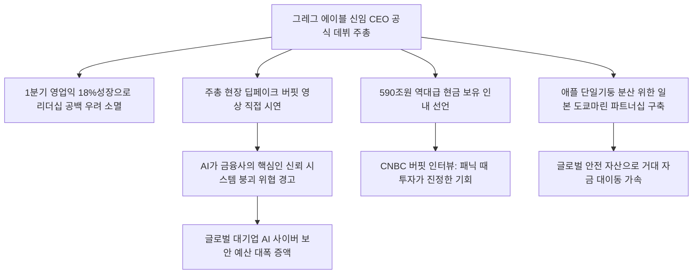

# 해외투자/기술 분석: 버크셔 해서웨이 에이블 체제 공식 출범과 딥페이크 신뢰 위협 및 590조 현금 인내 현상
## 투자 신호 + 사회적 영향 평가

---

## 📌 기사 기본 정보

- **날짜**: 2026-05-06
- **출처**: 한국경제신문 (심재현 특파원, 오마하 현지 보도)
- **카테고리**: 경제 > 금융 > 해외투자
- **핵심 주제**: 60년 워런 버핏의 아우라를 승계한 그레그 에이블 CEO가 2026년 오마하 연례 주주총회에서 공식 데뷔하며 18%의 영업이익 증가(16.7조 원)를 증명한 상황과, 사상 최고치인 590조 원의 현금을 쥐고도 저평가 기회를 기다리는 인내 전략, 그리고 1만 8000명 주주 앞에서 시연한 딥페이크 가짜 버핏 영상이 던지는 '사이버·신뢰 리스크' 위협 분석

**메타데이터**
- 주요 사건: 버크셔 해서웨이의 그레그 에이블 CEO 공식 취임 주주총회 개최 및 딥페이크 버핏 시연
- 핵심 원인: 워런 버핏의 카리스마 승계 공백 극복 필요성, 온라인 데이터만으로 타인의 가치(목소리·이미지)를 복제하는 AI 딥페이크 보안 충격, 고평가 증시 내 현금 인내(Wait & See) 전략 기조
- 주요 주체: 그레그 에이블 버크셔 신임 CEO, 워런 버핏(CNBC 인터뷰 출연), 애플(최대 지분 보유사), 일본 도쿄마린 홀딩스
- 키워드: 포스트 버핏, 그레그 에이블, 딥페이크, 사이버리스크, 전략 비축 현금, 복합기업(컨글로머릿)

---

## 🔍 기사를 통한 투자 신호 추출

### 1단계: 핵심 사건 분해

**What (무엇이 일어났는가?)**
- 워런 버핏 퇴임 이후 그레그 에이블 신임 CEO가 이끄는 버크셔 해서웨이가 공식 출범했습니다. 1분기 영업이익 18% 성장을 증명하고 590조 원의 현금 실탄을 공개했으나, 버크셔 주가는 올해 S&P500 상승률을 밑도는 회의론에 직면해 있습니다. 이에 대응해 에이블은 주총 현장에서 공개 데이터만으로 완벽하게 구현된 가짜 버핏 딥페이크 동영상을 직접 상영하며 "AI는 비즈니스의 초효율화 도구이자 동시에 기업의 '신뢰 기반'을 통째로 붕괴시키는 최대 위험 사이버 리스크"라고 전격 경고했습니다.

**When (언제 일어났는가?)**
- 2026-05-06 (오마하 주주총회 종료 직후, 버크셔의 딥페이크 시연이 실리콘밸리와 월가 전체에 AI 보안 및 데이터 주권의 뜨거운 아젠다로 전파된 시점)

**Why (왜 일어났는가?)**
- 버크셔가 소유한 가이코(보험), BNSF(철도) 등 수십 개 자회사의 거래 펀더멘털은 견고하나, 버핏 개인의 브랜드 파워라는 무형 자산이 사라지며 발생한 밸류에이션 정체를 기술 전환으로 돌파해야 했기 때문입니다.
- AI 고도화로 해킹 및 사기 영상이 정교해져, 전통 금융사들이 자랑해 온 오랜 '신용 자산'이 AI 공격 도구 앞에 한순간에 무력해질 수 있는 거대 시스템 리스크를 직접 입증해 경각심을 고취시키기 위함입니다.

**Who (누가 주도하는가?)**
- 가치 투자의 본고장을 AI 보안 및 하이브리드 기술 구축 플랫폼으로 재정비하고 있는 그레그 에이블 CEO
- "아무도 전화를 받지 않을 때(시장이 극단적 패닉일 때)"가 진정한 최고의 매수 시점이라고 CNBC를 통해 보수주의를 역설한 워런 버핏

---

## 2단계: 투자 신호 해석

### A. **긍정적 신호 (Bullish)**

**① 딥페이크 탐지, 실시간 차단 등 최상위 AI 보안 컴플라이언스(Cybersecurity) 강소 기술주**
- **신호**: 주총 내 가짜 버핏 딥페이크 시연 및 에이블의 '매일 관리해야 하는 사이버리스크' 규정
- **의미**: 버크셔를 포함한 글로벌 초대형 금융·인프라 대기업들이 AI 기만 공격으로부터 자사 평판과 금융 결제망을 보호하기 위해 지능형 사이버 보안 예산을 기하급수적으로 폭증시킴
- **투자 기회**: 실시간 딥페이크 분석/원천 차단 특허 보유 기술주, 글로벌 1티어 정보 보안 서비스사

**② 패닉 국면에서 590조 원의 수혜를 직접 입을 독점적 해자 보유 전통 가치주**
- **신호**: 에이블의 590조 원 현금 인내(Wait & See) 전략 및 시장 조정 대기 선언
- **의미**: 고평가된 현 기술 증시가 매크로 충격으로 폭락하거나 지정학 마찰로 패닉에 빠질 때, 버크셔의 거대한 590조 원 구제 금융 실탄이 해당 기업의 지분을 헐값에 쓸어 담으며 강력한 주가 바닥 지지선과 랠리 엔진을 제공함
- **투자 기회**: 현금 흐름이 독보적이나 매크로 일시 노이즈로 폭락하는 전통 기간산업 및 글로벌 상용차 주도주

---

### B. **위험 신호 (Bearish)**

**① 실질 보안 인프라 투자가 부재하고 '신뢰(Credibility)' 평판 하나로만 버티던 전통 금융/지주사**
- **신호**: 공개 데이터만으로 완벽 복제된 딥페이크 인물 합성의 상용화
- **의미**: 은행장, 자산가, 이사회 의장의 얼굴과 목소리를 복제한 핀포인트 딥페이크 피싱 및 가짜 비디오 지시 한 건에 대규모 금융 송금 사기가 발생해 기업 신용이 하룻밤 새 완전히 붕괴될 수 있음
- **투자 리스크**: 내부 망분리 및 AI 보안 필터링 도입에 소극적인 중소형 은행 및 생명보험사

**② 거품 논란이 있는 고PER 실리콘밸리 AI 소프트웨어 기술주**
- **신호**: 에이블의 590조 원 현금을 쥐고도 "저평가된 적정 가치 기업을 찾기 어렵다"는 보수적 토로
- **의미**: 스마트 머니의 상징인 버크셔가 현재의 AI 밸류에이션을 극단적 버블로 규정하고 투자를 전면 보류하고 있음을 뜻하며, 월가 자본의 투기 에너지가 임계점에 도달해 하락 반전 시 거품이 급격히 해체될 수 있음
- **투자 리스크**: 실질 이익 펀더멘털 없이 멀티플만 100배 이상으로 치솟은 AI 서비스 테마주

---

### 3단계: 섹터별 투자 기회 매트릭스

#### ✅ **높은 기대도 + 낮은 리스크**

**글로벌 정보보안 지배주 및 딥페이크 원천 차단 B2B 특허 기술 플랫폼**
- 딥페이크는 금융 시스템의 근본 신뢰를 파괴하는 '디지털 핵무기'입니다. 에이블이 1만 8000명 앞에서 보여준 경고는 조만간 모든 금융사와 대기업이 사이버 보안 솔루션을 의무 탑재하게 만들 강제 조치의 서막입니다. 경기 침체 리스크와 상관없이 영구적 독점 성장을 달성할 최상의 안전 피난처입니다.
- **투자 추천도**: ⭐⭐⭐⭐⭐

---

## 💰 구체적 투자 신호 변환

### 신호 1: 'AI 거품 랠리' 속 590조 원의 인내에 동참하는 고현금 보유 및 최상위 AI 보안 자산 매수

**투자 해석**: 기사는 버크셔의 딥페이크 시연을 통해 AI가 초효율 비즈니스 도구인 동시에 전통 기업의 생존줄인 '신뢰'를 단숨에 절단할 수 있는 치명적 무기임을 보여줍니다. 버핏과 에이블이 590조 원이라는 우주적 현금을 쥐고도 억지로 투자하지 않고 패닉의 타이밍을 기다리는 것은, 현재의 기술 증시 상승장 이면에 숨은 과열 리스크를 명확히 경고하는 것입니다. 따라서 투자자는 단기적인 FOMO 랠리에 흥분해 고평가된 AI 기술주를 추격 매수하는 행위를 전면 멈추고 현금(달러/MMF) 비중을 30% 이상 유지해 버크셔의 '인내 전략'에 동참해야 합니다. 그리고 이들이 경고한 사이버 리스크를 방어할 '글로벌 AI 보안 1티어 대장주'와, 버크셔가 단일 기둥 리스크 분산을 위해 점진적으로 지분을 확대 중인 '일본 초우량 금융 및 자립형 에너지 인프라([[도쿄마린 파트너십]])'로 포트폴리오를 다변화시켜 다가올 글로벌 매크로 발작 국면을 인생 최대의 리레이팅 기회로 전환해야 절대 생존할 수 있습니다.

---

## 🌍 사회적 영향 평가

### A. 긍정적 사회 영향
- **AI 딥페이크 범죄에 대한 범지구적 경각심 고취**: 세계 최고 권위자의 주총 시연을 통해 일반 대중과 금융 기관들이 디지털 피싱 및 신원 도용 사기 리스크를 인지하고 사전 방어 시스템을 구축하도록 강제 기여
- **전통 가치 산업의 디지털 전환 표준 제시**: 철도와 에너지망에 AI 기술을 직접 구축하는 모범 사례를 제시하여 아날로그 국가 기간 인프라의 운영 효율 향상에 긍정적 영향 제공

### B. 부정적 사회 영향
- **사회적 '신뢰 자산'의 영구적 소멸에 따른 디지털 냉소주의 팽배**: 진짜와 가짜를 완벽히 구별할 수 없는 딥페이크 무차별 확산으로 인해, 법정 증거력 훼손 및 정부·권위자 발표에 대한 대중의 불신이 고착화되어 심각한 사회적 아노미 초래
- **자본 쏠림의 왜곡으로 인한 신흥국 투자 기근**: 590조 원의 거대 자금이 선진국 안전자산(미국 비축유, 일본 대형 손보 등)에만 보수적으로 묶여 있어, 신재생 에너지 전환과 모험 자본이 절실한 개발도상국 및 신흥국들이 구조적 자금 기근을 겪으며 글로벌 부의 편중 가중

---

## 🎯 결론: 당신의 투자 전략 수립

- **즉시 실행**: 실질 현금 유보금이 없고 해킹/보안 리스크에 직접 노출된 중소 핀테크 및 AI 거품 테마주 전량 정리
- **3개월 후**: 버크셔의 분기별 13F 공시를 역추적하여 590조 현금이 패닉 국면에서 매수하기 시작하는 대형 소부장 및 글로벌 1티어 금융 지분 확인 후 길목 지키기 동참 매수 실행

---

## 📝 Obsidian 연결 구조

