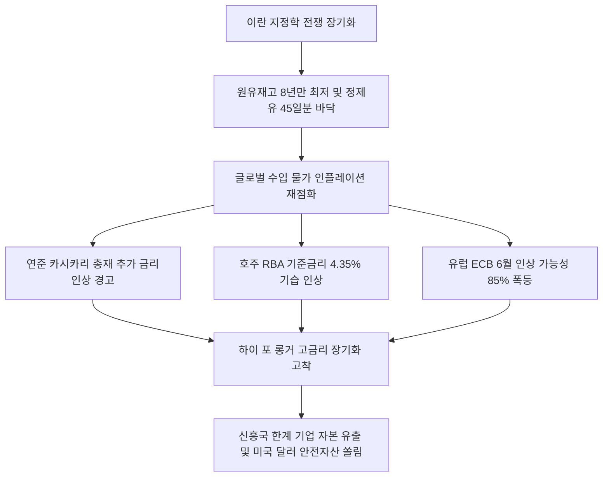

# 통화정책/에너지 분석: 미·유럽 금리 인상론 재부상과 글로벌 에너지 쇼크 및 '하이 포 롱거' 고착화 현상
## 투자 신호 + 사회적 영향 평가

---

## 📌 기사 기본 정보

- **날짜**: 2026-05-07
- **출처**: 글로벌 금융 시장 종합 (연준, ECB, 호주중앙은행 등)
- **카테고리**: 경제 > 글로벌 > 통화정책
- **핵심 주제**: 미국과 이란의 지정학 전쟁에 따른 유가 급등과 글로벌 원유·정제유 재고 고갈로 물가 상승 압력이 임계점에 도달하면서, 금리 인하 기대를 완전히 폐기하고 전 세계 중앙은행들이 금리 추가 인상과 '하이 포 롱거(Higher for Longer)' 긴축 고착화로 유턴하는 통화정책 동조화 현상 분석

**메타데이터**
- 주요 사건: 미국 미니애폴리스 연은 총재의 금리 인상 경고 및 호주 중앙은행(RBA)의 기습 기준금리 인상(4.35%) 단행, 유럽중앙은행(ECB)의 6월 인상 확률 85% 폭등
- 핵심 원인: 호르무즈 해협 폐쇄 장기화에 따른 글로벌 정제유 재고(45일분) 및 원유 재고 8년 만의 최저치 바닥 돌파
- 주요 주체: 연방준비제도(Fed, 닐 카시카리 총재), 유럽중앙은행(ECB), 호주중앙은행(RBA)
- 키워드: 글로벌인플레이션, 하이포롱거, 금리 인상론, 에너지 쇼크, 전략비축유, 통화정책 동조화

---

## 🔍 기사를 통한 투자 신호 추출

### 1단계: 핵심 사건 분해

**What (무엇이 일어났는가?)**
- 미국과 유럽 등 글로벌 자본시장에 금리 인하 기대가 소멸하고 '추가 금리 인상론'이 전면 급부상했습니다. 미 연준의 매파 인사 닐 카시카리 총재는 호르무즈 해협 폐쇄에 따른 유가 폭등 시 금리를 추가 인상해야 한다고 경고했고, 호주중앙은행(RBA)은 선제적으로 기준금리를 4.35%로 기습 인상했습니다. 유럽중앙은행(ECB) 역시 6월 금리 인상 가능성을 85%로 상향 조정하면서, 글로벌 금융 질서가 '금리 인하 유턴형' 추가 긴축 공습에 직면했습니다.

**When (언제 일어났는가?)**
- 2026-05-07 (중동 전쟁발 정제유 재고가 45일분 마지노선 아래로 떨어져 원유 고갈 카운트다운이 4주 앞으로 바짝 다가온 시점)

**Why (왜 일어났는가?)**
- 이란 전쟁 장기화 및 푸자이라 기지 공습으로 원유 공급 차질(일 1000만 배럴)이 물리적 현실이 되면서, 비축유 방출로 버티던 글로벌 인플레이션의 물가 통제 방어막이 완전히 무너졌기 때문입니다.
- 기대 인플레이션의 고착화를 막기 위해 중앙은행들이 정권의 압박에도 불구하고 '신뢰성 수호'를 위해 금리 인상이라는 충격 요법을 꺼내 들 수밖에 없는 절박한 한계 상황에 도달했기 때문입니다.

**Who (누가 주도하는가?)**
- 물가 고착을 막기 위해 금리 인상 총대를 메고 나선 글로벌 중앙은행 총재 연합(연준 매파 위원, RBA, ECB)
- 트럼프 행정부의 금리 인하 압박에 맞서 통화 신용 주권을 지키려는 연준 독립 세력

---

## 2단계: 투자 신호 해석

### A. **긍정적 신호 (Bullish)**

**① 달러 자산 및 초단기 미국 국채(T-Bill) 등 기축통화 피난처 자산의 독주**
- **신호**: 글로벌 금리 동시 추가 인상 우려 및 하이 포 롱거의 장기화
- **의미**: 전 세계 중앙은행들이 금리를 더 오래, 더 높게 올릴 것이 기정사실화되면서 신흥국 자산에서 이탈한 캐리 자금이 최고의 실질 고금리와 안전성을 보장하는 기축통화 달러와 미국 초단기 채권으로 쏠림
- **투자 기회**: 미국 달러화(USD), 미국 단기 국채 ETF

**② 고유가 환경에서도 생존 마진을 유지하는 지능형 분산 에너지 및 전력 인프라 대장주**
- **신호**: 화석 연료 의존도 탈피를 위한 각국의 대체 에너지 국가 투자 폭증
- **의미**: 에너지 고물가가 상수가 됨에 따라, 원유 수입 의존을 무력화할 분산형 원전(SMR) 및 자립형 친환경 에너지 전주기를 선점한 유틸리티 기업들이 독점적 이익 지위를 누림
- **투자 기회**: 글로벌 원전 수출 및 친환경 에너지 수직계열화 확보 대형주

---

### B. **위험 신호 (Bearish)**

**① 고금리 차환 압박과 유동성 경색에 직면한 고부채 신흥국 자산 및 좀비 기업**
- **신호**: 글로벌 '하이 포 롱거' 고착화 및 추가 금리 인상론 부상
- **의미**: 저금리 부채로 연명하던 한계 기업들의 이자 보상 배율이 1 이하로 파괴되어 연쇄 부도가 현실화되고, 달러 캐리 유출로 신흥국 주식/채권 가격이 동반 급락함
- **투자 리스크**: 부채 비율이 높고 유보 현금이 고갈된 신흥국 고레버리지 한계 성장 기술주

**② 수입 에너지 비용 상승을 제품 단가에 전가하지 못하는 한계 내수 기업**
- **신호**: 정제유 재고 45일분 마지노선 붕괴에 따른 수입 물가 인플레 재점화
- **의미**: 고유가로 인한 유류 물류원가는 폭증하나, 내수 소비 위축 탓에 완제품 가격을 올리지 못해 마진 스프레드가 붕괴되어 영업 적자 수렁으로 빠짐
- **투자 리스크**: 에너지 다소비 내수 음식료, 중소 제조업, 수입 부품 의존 화학사

---

### 3단계: 섹터별 투자 기회 매트릭스

#### ✅ **높은 기대도 + 낮은 리스크**

**기축통화 미국 달러(USD) 및 글로벌 분산형 친환경 에너지 유틸리티 지배주**
- 글로벌 금리가 더 오랫동안 높은 수준을 유지할 때 자본이 안착할 최후의 영토는 오직 미국 달러화와 무탄소 전원 공급권을 쥔 독점적 에너지 유틸리티 기업뿐입니다. 이 두 기둥은 거시 인플레이션 폭풍우 속에서도 안전한 이익 방어를 보장받습니다.
- **투자 추천도**: ⭐⭐⭐⭐⭐

---

## 💰 구체적 투자 신호 변환

### 신호 1: '금리 인하 낙관론'의 완전한 폐기와 미국 달러 및 에너지 안보 자산으로의 포트폴리오 비중 이전

**투자 해석**: 기사는 중동 전쟁으로 유발된 글로벌 에너지 고갈 위기가 단순한 일시적 쇼크를 넘어 전 세계 통화 정책을 '추가 금리 인상'이라는 가혹한 긴축 경로로 회귀시키고 있음을 데이터로 실증합니다. '곧 금리가 내릴 것'이라는 안일한 희망 고문에 기대어 레버리지를 높이고 고PBR 성장주를 쥐고 버티는 포트폴리오는 다가올 고금리 장기 폭풍(Higher for Longer) 속에 완전히 파멸당할 수 있습니다. 투자자는 즉시 포트폴리오의 체질 개선을 단행해야 합니다. 부채 부담이 큰 한계 기업과 신흥국 레버리지 비중을 신속히 매도하고, 확보된 자금을 100% 기축통화 미국 달러(USD)성 MMF, 미국 초단기 채권, 그리고 에너지 맷집이 강하고 자립 능력을 갖춘 한국의 차세대 원전·에너지 디벨로퍼 지배주([[현대건설]], [[삼성물산]] 등)로 전격 이동시켜 글로벌 긴축 발작 국면에서 가문의 부를 안전하게 수호해야 합니다.

---

## 🌍 사회적 영향 평가

### A. 긍정적 사회 영향
- **한계 한계기업 구조조정을 통한 거시 경제 건전성 확보**: 장기 고금리 유지 압박이 실질 생산성 혁신이 없는 한계 좀비 기업들을 시장에서 강제 퇴출시켜 국가 자본 배분의 효율성 개선
- **에너지 자립 및 분산 전원 기술의 강제적 연착륙**: 화석 연료 수입 가격 폭등 탓에 국가들이 강제적으로 SMR 및 무탄소 그린 에너지 인프라 독자 구축에 예산을 총동원하여 기후 위기 극복 가속화

### B. 부정적 사회 영향
- **글로벌 신흥국 파산 도미노와 사회 불안 가중**: 달러화 고금리 장기화로 인해 달러 빚을 갚지 못하는 개도국 서민들이 식량·에너지 기근에 시달리고 정권 교체 및 폭동 등 정치적 무질서 고조
- **고금리 장기화에 따른 서민 가계의 금융 빈곤화**: 주택담보대출 및 생계대출 이자 부담이 눈덩이처럼 불어나 가계 실질 가처분 소득이 고갈되고 중산층 가계가 연쇄 부도로 붕괴하는 복합적 내수 한파 초래

---

## 🎯 결론: 당신의 투자 전략 수립

- **즉시 실행**: 미래 실적 기대로 연명하나 부채 비율이 200%를 초과하는 고레버리지 한계 성장 기술주 및 신흥국 주식 비중 축소
- **3개월 후**: 6월 ECB 통화정책 회의의 실제 금리 인하 여부 및 미 연준의 성명서 가이던스 변화를 모니터링하여, 고금리 고착 강도에 맞춰 달러화 보유 비중 최종 조율

---

## 📝 Obsidian 연결 구조

