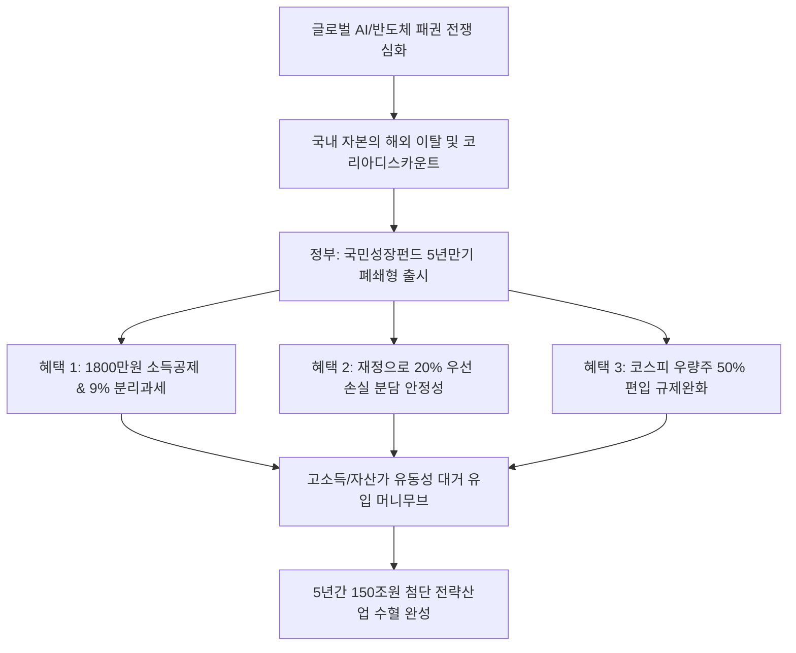

# 투자정책/금융 분석: 국민성장펀드 출시와 파격적 소득공제 및 재정 우선 손실 분담 구조 현상
## 투자 신호 + 사회적 영향 평가

---

## 📌 기사 기본 정보

- **날짜**: 2026-05-07
- **출처**: 권화순·김도엽 기자 (금융당국 및 시중은행 종합)
- **카테고리**: 경제 > 금융 > 투자정책
- **핵심 주제**: 국가 전략 첨단산업(반도체, AI, 이차전지 등) 육성 재원을 마련하기 위해 5년간 150조 원 조성을 목표로 출시된 '국민참여형 국민성장펀드'의 1800만 원 소득공제 및 9% 분리과세 등 역대급 세제 혜택과 정부 재정의 20% 우선 손실 분담 안정성 구조 분석

**메타데이터**
- 주요 사건: '국민참여형 국민성장펀드' 오는 22일 본격 출시 및 사상 최초의 정부 우선 손실 20% 보전 구조 적용
- 핵심 원인: 미·중 중심의 글로벌 기술 보조금 전쟁 심화에 따른 국내 첨단 기술 자급 및 인프라 재배선 자금 확보 필요성, 해외 주식 이탈(코리아 디스카운트) 방어용 고수익·고안정성 금융 장치 개발
- 주요 주체: 금융위원회, 기획재정부, 가입 개인 투자자(연간 1억 원 한도), 국내 첨단 산업 대기업(삼성전자, SK하이닉스 등)
- 키워드: 국민성장펀드, 소득공제, 분리과세, 우선손실분담, 폐쇄형 펀드, 테크 금융

---

## 🔍 기사를 통한 투자 신호 추출

### 1단계: 핵심 사건 분해

**What (무엇이 일어났는가?)**
- 정부가 연간 1억 원 가입 한도에 최대 40%(최대 1800만 원) 소득공제 혜택과 배당소득 9% 분리과세 혜택을 전격 결합한 '국민참여형 국민성장펀드'를 전격 출시합니다. 5년 폐쇄형(환매 불가능) 구조의 단점을 방어하기 위해 정부 재정에서 펀드 손실의 최대 20%를 먼저 흡수해주는 하방 안정 장치를 설계했으며, 펀드 자금의 50%를 코스피 우량주([[삼전닉스]])에 편입할 수 있도록 운용 규제를 과감히 완화했습니다.

**When (언제 일어났는가?)**
- 2026-05-07 (금융위원회와 시중은행권의 상품 출시 고시가 완결되고, 연말 정산 소득공제 및 분리과세 혜택을 노리는 고소득층의 머니 무브 예고가 팽배해진 시점)

**Why (왜 일어났는가?)**
- 과거 '뉴딜펀드'처럼 저수익성과 경직성 탓에 애물단지로 전락했던 정책형 펀드의 실패를 거울삼아, 민간의 거대 자산가들을 유인할 수 있는 파격적인 세제 감면 카드를 전격 투입했기 때문입니다.
- 국가적 '인프라 재배선 비용(5년간 150조 원)'을 정부 예산만으로 충당하기에는 재정 인플레이션 리스크가 크므로, 시중의 풍부한 민간 유동성을 우회 유치해 국가 첨단 산업 생태계를 지키기 위함입니다.

**Who (누가 주도하는가?)**
- 1,800만 원 소득공제와 9% 단일 분리과세라는 파격적 세제 스위트너(Sweetener)를 마련한 세제·금융 당국
- 코스피 반도체 랠리에 힘입어 펀드 자산 유치 경쟁을 벌이고 있는 시중 5대 은행 및 대형 증권사 리테일 본부

---

## 2단계: 투자 신호 해석

### A. **긍정적 신호 (Bullish)**

**① 국내 최우량 지능형 반도체 대형주 및 첨단 소부장(소재·부품·장비) 생태계**
- **신호**: 국민성장펀드 내 코스피 대형 우량주 50% 편입 허용 및 5년간 150조 원의 신규 자금 수혈
- **의미**: 펀드가 설정되는 순간 법적으로 자금의 절반이 삼성전자, SK하이닉스 등 최고 경쟁력을 갖춘 한국 대표 IT 주식과 첨단 AI 장비주를 기계적으로 매수해야 하므로, 시장 지수 하방을 단단히 지지해주는 강력한 국책성 수급 우군이 확보됨
- **투자 기회**: 펀드 포트폴리오 최상위에 편입될 한국 대표 반도체/AI 대형주([[삼성전자]], [[SK하이닉스]])

**② 금융소비자종합과세 대상에 노출된 고소득 연봉자 및 고액 자산가층**
- **신호**: 투자금액 7000만 원 납입 시 최대 1800만 원 소득공제 및 9% 분리과세 혜택 부여
- **의미**: 고세율(최대 49.5%) 누진 과세를 받던 고액 연봉 직장인과 자산가들이 합법적인 세금 회피 피난처를 얻게 되어, 연말정산 시 막대한 환급금(세후 실질 소득 증가)을 확보하게 됨
- **투자 기회**: 세무 절세형 금융 상품 포트폴리오 다변화, 개인 IRP 자금 배분 최적화

---

### B. **위험 신호 (Bearish)**

**① 5년 만기 폐쇄형(환매 차단) 구조에 따른 '유동성 동결(Lock-in)' 리스크**
- **신호**: 5년간 중도 인출 및 해지가 전면 금지되는 폐쇄형 구조
- **의미**: 향후 5년 내에 글로벌 금융 위기나 가계의 급격한 현금 유동성 경색이 도래하더라도 펀드에 들어간 1억 원의 자금은 완전히 묶여서 인출할 수 없으므로, 자산의 긴급 대피 능력이 마비됨
- **투자 리스크**: 가계 비상 예비 자금 성격의 단기 자산, 은퇴 직전의 1~2년 차 단기 은퇴 준비 가계 자금

**② 5년 뒤 펀드 만기 시점의 반도체/IT 경기 피크아웃에 따른 원금 손실 위험**
- **신호**: 첨단 산업 단일 섹터 편중과 5년 뒤 강제 환매 조건의 충돌
- **의미**: 정부가 20%의 손실을 우선 분담해주더라도, 5년 뒤 반도체 사이클이 하락기(불황)의 바닥일 경우 30% 이상의 지수 폭락이 발생하면 정부 보전율을 초과하는 실질 원금 손실이 개인에게 고스란히 귀속됨
- **투자 리스크**: 분산 투자가 결여된 극단적인 단일 섹터(반도체) 편향의 5년 만기 한계 펀드

---

### 3단계: 섹터별 투자 기회 매트릭스

#### ✅ **높은 기대도 + 낮은 리스크**

**국민성장펀드 내 핵심 매수 타겟인 1티어 밸류업 지능형 반도체 대장주**
- 5년간 150조 원이 국내 첨단 전략산업으로 강제 수혈되는 구조에서, 펀드 운용 규제 완화(우량주 50% 편입)의 최대 혜택은 이익 체급이 압도적인 한국 반도체 투톱에게 고스란히 돌아갑니다. 정부 재정이 20% 보증을 서주는 방패 효과와 세제 혜택이 융합된 최고의 하방 안정 자산입니다.
- **투자 추천도**: ⭐⭐⭐⭐⭐

---

## 💰 구체적 투자 신호 변환

### 신호 1: 자산가 포트폴리오의 절세용 '국민성장펀드' 1억 원 풀 가입 및 만기 5년 유동성 격리 전략

**투자 해석**: 기사는 정부의 '국민성장펀드' 출시가 글로벌 AI 자본 대이동 속에서 민간 자본을 활용해 국가 첨단 주권([[피지컬 AI 주권 위기]])을 지키려는 가장 파격적인 통화·재정적 스위트너(Sweetener)임을 웅변하고 있습니다. 고소득 직장인이 연말에 수백만 원의 세금 고지서를 맞는 환경에서, 7,000만 원 가입 시 1,800만 원이라는 합법적 소득공제와 9% 배당 분리과세는 금융 역사상 전무후무한 혜택입니다. 투자자는 5년간 돈이 묶인다는 '유동성 동결'을 가계의 비상 자금 수준 안에서 철저히 격리 통제할 수 있다면, 오는 22일 판매 개시 즉시 개인 한도(연간 1억 원)를 풀(Full) 가입해야 합니다. 정부 재정이 20% 손실을 무조건 먼저 떠안아주는 든든한 방패가 있고, 자금의 50%가 초우량 반도체 대장주([[삼성전자]])에 기계적으로 매수 유입되므로, 이는 예금 금리 인상기([[긴축전환]])에도 예금을 압도하는 역대급 세후 복리 마진을 안겨다 줄 자산가 전용 최상의 조세 방어 성채가 될 것입니다.

---

## 🌍 사회적 영향 평가

### A. 긍정적 사회 영향
- **민간 주도의 첨단 국가 전략 재원 150조 조기 확충**: 세금 낭비 없이 고소득층의 여유 자금을 자발적으로 유치하여, 반도체·AI 등 미래 국가 생존이 걸린 초격차 인프라 R&D의 마중물 조달 성공
- **국민 가계의 국가 첨단 성장 성과 공유**: 평소 주식 투자를 기피하던 일반 서민들이 정부 보증(20% 손실 보전) 하에 펀드 주주로 참여하여, 대기업 성장의 과실을 가계 자산 증식으로 환류받는 선순환 복지 모델 작동

### B. 부정적 사회 영향
- **부의 양극화와 '절세 양극화' 혜택의 불평등 심화**: 연간 수천만 원의 여유 자금을 5년간 묶어둘 수 있는 자산가 계층만 소득공제(1800만 원)와 분리과세 혜택을 독식하여 서민 가계와의 상대적 박탈감 고조
- **과거 실패 정책 펀드의 오작동 우려에 따른 재정 낭비 위험**: 5년 뒤 만기 시점에 글로벌 AI 사이클이 붕괴하여 대규모 손실이 발생할 경우, 국민의 세금(재정)으로 20%의 손실을 보전해주어야 하므로 국가 재정 건전성에 심각한 타격과 함께 사회적 책임 공방 격화

---

## 🎯 결론: 당신의 투자 전략 수립

- **즉시 실행**: 가계 자산 중 5년간 인출이 필요 없는 장기 여유 현금을 선별하여, 22일 출시되는 국민성장펀드 개인 한도 범위 내 납입 계획 수립 실행
- **3개월 후**: 국민성장펀드의 초기 완판 추이 및 국내 증시 순유입 금액 데이터를 분석하여, 펀드 수혜를 직접 입을 반도체 소부장 대장주 추가 분할 매수 보정

---

## 📝 Obsidian 연결 구조

