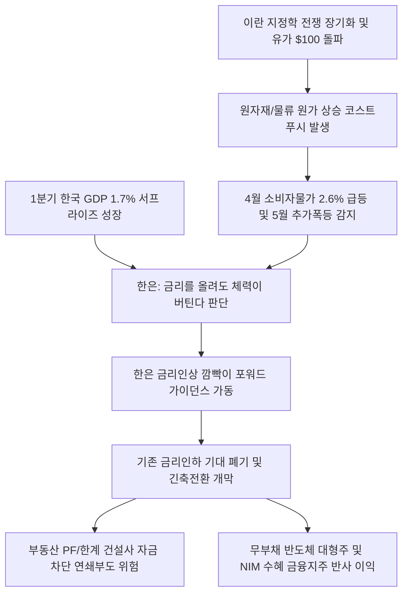

# 물가/통화정책 분석: 한국은행의 금리인상 깜빡이 작동과 공급망 코스트푸시 및 인플레이션 긴축전환 현상
## 투자 신호 + 사회적 영향 평가

---

## 📌 기사 기본 정보

- **날짜**: 2026-05-07
- **출처**: 한국은행 물가상황 점검회의 및 주요 외신(FT 등) 종합
- **카테고리**: 경제 > 금융 > 물가정책
- **핵심 주제**: 중동의 이란 지정학 전쟁 장기화에 따른 원유/물류의 공급 코스트푸시(Cost-Push) 인플레이션 장기화와 5월 소비자물가 급등 우려 속에서, 기존의 금리 인하 기대감을 영구 폐기하고 1분기 GDP 1.7% 서프라이즈 성장을 면죄부 삼아 기준금리 인상 신호(포워드 가이던스)를 전격 가동한 한국은행의 긴축 유턴 분석

**메타데이터**
- 주요 사건: 한국은행의 소비자물가 2.6% 돌파에 따른 기준금리 인상 깜빡이(포워드 가이던스) 전격 가동
- 핵심 원인: 호르무즈 해협 폐쇄 우려 장기화에 따른 유가 $100 돌파 및 코스트푸시 인플레이션 고착화, 1분기 성장률 1.7% 달성에 따른 긴축 체력 확보
- 주요 주체: 한국은행 금융통화위원회(금통위), 이창용 한은 총재, 기획재정부, 미국 연방준비제도(Fed)
- 키워드: 인플레이션, 한국은행, 금리인상 깜빡이, 코스트푸시, 기저효과, 포워드 가이던스, 긴축전환

---

## 🔍 기사를 통한 투자 신호 추출

### 1단계: 핵심 사건 분해

**What (무엇이 일어났는가?)**
- 한국은행이 지난 수개월간 유지해오던 금리 인하 기조를 전면 폐기하고 기준금리 인상 가능성을 공식 시사하는 '긴축 전환(인상 깜빡이)'의 선제적 소통을 가동했습니다. 중동 전쟁으로 인한 코스트푸시 물가 대란이 농축수산물 기저효과와 겹치며 5월 물가가 통제 불능으로 급등할 우려가 감지되었기 때문입니다. 특히 1분기 GDP가 1.7%라는 나 홀로 초강세 서프라이즈를 기록하자, 한은은 "경제가 견뎌낼 기초 체력이 증명되었다"며 물가를 잡기 위한 추가 금리 인상 칼날을 갈기 시작했습니다.

**When (언제 일어났는가?)**
- 2026-05-07 (글로벌 에너지 쇼크에 따른 5월 소비자물가 전망 점검회의가 개최되고, 5월 28일 기준금리를 결정할 금통위를 3주 앞두고 포워드 가이던스가 가동된 날)

**Why (왜 일어났는가?)**
- 원유 비축량이 68일치 아래로 하강하는 공급망 마비 속에서 유가가 배럴당 120달러 선을 두드리자, 단순 금리 동결로는 수입 인플레이션과 원-달러 1440원대 급등을 방어할 수 없다는 외통수에 몰렸기 때문입니다.
- 1.7%의 성장률 서프라이즈가 금융통화위원회에 '금리를 올리더라도 실물 경제가 무너지지 않는다'는 강력한 정책적 면죄부를 제공했기 때문입니다.

**Who (누가 주도하는가?)**
- 물가 안정 의지를 입증해 기대인플레이션을 꺾으려는 한국은행 총재 및 금통위 매파 위원단
- 한은의 긴축 전환 신호에 따라 대출 한도 축소 및 조달 금리 상향을 준비 중인 시중 금융권

---

## 2단계: 투자 신호 해석

### A. **긍정적 신호 (Bullish)**

**① 고금리 장기화 수혜를 받아 순이자마진(NIM)이 고착화되는 1티어 대형 금융지주사**
- **신호**: 한국은행의 긴축 전환 깜빡이 가동 및 기준금리 추가 인상 예고
- **의미**: 금리 인하 소멸로 여신 금리가 고공행진을 유지하는 반면, 은행의 조달 비용은 안정화되어 예대마진(NIM) 스프레드가 장기간 사상 최대로 누적되며 대규모 현금흐름을 확보함
- **투자 기회**: 대형 시중은행 및 금융지주사 우량주, 9% 분리과세 수혜 국산 펀드([[국민성장펀드]])

**② 부채가 없고 보유 현금의 고금리 이자 이익이 R&D 비용을 충당하는 '현금 리치' 초대형 테크 기업**
- **신호**: 고물가-고금리 긴축 체제의 장기 안정적 우상향 지속
- **의미**: 금리가 올라갈수록 빚이 많고 현금이 없는 한계 기업들은 파산하나, 사내유보금(FCF)이 풍부한 IT 공룡들은 고금리 이자 수익만으로 차세대 기술 개발 비용을 충당해 독점력을 더욱 견고히 굳힘
- **투자 기회**: 무부채 현금성 자산이 수십조 원에 달하는 최상위 반도체/정밀 제조 대장주([[삼성전자]])

---

### B. **위험 신호 (Bearish)**

**① 금리 인상 시 자금 조달 스프레드 폭증으로 부도가 임박한 '부동산 PF 및 한계 건설사'**
- **신호**: 한은의 추가 금리 인상론 부상 및 시장 금리 상승폭 확대
- **의미**: 저금리 차환이 원천 차단되면서 지방 미분양 적체에 시달리는 한계 중견 건설사들의 유동성 줄도산이 현실화되며 2금융권 금융 연쇄 부실을 자극함
- **투자 리스크**: PF 우발채무 노출도가 높은 중소형 건설사([[PF 부실]]), 캐피탈, 저축은행 주식 전체

**② 항공유 단가 폭등과 달러화 이자 부담의 이중고를 겪는 항공, 여행 및 한계 내수 유통업**
- **신호**: 유가 100달러 돌파에 따른 항공유 가격 2배 급등 및 고유가 지속
- **의미**: 고유가로 인한 유류할증료 폭등으로 여객 수요가 급감하는 와중에, 달러화 리스료 부채의 원리금 이자 부담이 수배로 늘어 저비용 항공사(LCC)들의 연쇄 파산 위기가 현실화됨
- **투자 리스크**: 부채 비율이 높고 유가 민감도가 절대적인 국내 저비용항공사(LCC) 및 한계 내수 여행사

---

### 3단계: 섹터별 투자 기회 매트릭스

#### ✅ **높은 기대도 + 낮은 리스크**

**글로벌 무부채 현금 독점 테크 대형주 및 NIM 수혜 메이저 금융지주**
- 한은의 추가 긴축 전환은 '부채의 이자 폭탄'을 견디지 못하는 기업을 강제 퇴출시키는 혹독한 옥석 가리기의 시작입니다. 빚이 없고 반도체 슈퍼 사이클([[영업익1000조]])의 초입에 선 대형 우량주와 NIM이 상승하는 금융지주사는 위기 속에서 자본을 수호할 최고의 요새입니다.
- **투자 추천도**: ⭐⭐⭐⭐⭐

---

## 💰 구체적 투자 신호 변환

### 신호 1: '금리 인하 환상'의 폐기 및 무부채 현금 부자 대형주와 고마진 금융지주로의 전격 리밸런싱

**투자 해석**: 기사는 한국은행이 1.7%의 GDP 성장률 서프라이즈를 무기 삼아 물가 안정을 위한 '추가 금리 인상 깜빡이'를 켰음을 선언하고 있습니다. 이제 시장의 지배 법칙은 "언제 금리가 내리는가"가 아니라 "금리 인상 폭풍 속에서 누가 빚 없이 이자로 돈을 버는가"로 완전히 재편됩니다. 투자자는 부동산 갭투자나 부채 비율이 높은 중소형 한계 벤처주에 투자하는 도박 심리를 철저히 언런(Unlearn)해야 합니다. 지금의 통화 긴축 국면을 돌파할 유일한 열쇠는 '현금 보유력'입니다. 포트폴리오 내에서 빚더미에 오른 건설, 저비용 항공사(LCC), 한계 내수 유통주를 즉시 전량 매도해야 합니다. 그리고 이 확보된 현금을 풍부한 유보이윤으로 1000조 영업이익 랠리를 이끌 무부채 반도체 대장주([[삼성전자]])와, 예대 마진 스프레드 독식으로 NIM 턴어라운드를 달성할 메이저 금융지주, 그리고 파격적인 비과세 소득공제를 보장해 정부가 손실을 방어해주는 신규 출시 '국민성장펀드([[국민성장펀드]])'로 대피시켜야 금리 인상의 부도 쓰나미 속에서 내 자산의 절대 안전을 확보할 수 있습니다.

---

## 🌍 사회적 영향 평가

### A. 긍정적 사회 영향
- **가계 및 기업의 과도한 부채 다이어트 유도**: 한은의 강력한 긴축 경고 신호가 영끌 대출과 한계 기업의 무분별한 채무 차입 행위를 선제 억제하여 중장기적 거시 금융 안보 안정화에 기여
- **기술 R&D 및 고부가가치 산업으로의 자본 재배선 촉진**: 고금리 압박이 저효율 좀비 기업들을 도태시키고, 반도체 및 AI 기술 혁신 등 국가 전략 산업으로 한정된 국가 자본을 집중시키는 건강한 산업 체질 개선 유도

### B. 부정적 사회 영향
- **서민 한계 대출 가계의 연쇄 파산 및 민생 붕괴**: 주택담보대출 이자가 눈덩이처럼 늘어나 은퇴 고령층과 맞벌이 서민 가계의 실질 소비력이 붕괴되고 지역 자영업 경제의 폐업 도미노 유발
- **경기 침체 속 물가 폭등인 '스태그플레이션' 부작용 격화**: 고유가에 기반한 코스트푸시 인플레이션을 금리 인상이라는 통화 채찍만으로 다스리다 보니, 내수 소비는 극단적으로 얼어붙고 물가는 여전히 높은 가혹한 스태그플레이션 통증 수반

---

## 🎯 결론: 당신의 투자 전략 수립

- **즉시 실행**: 부채 비율 150% 초과 및 고유가/고환율 직격탄을 입는 LCC 항공사, 내수 여행, 중소 건설주 전량 정리
- **3개월 후**: 5월 28일 한국은행 금통위의 실제 금리 인상 가이드라인 및 만장일치 여부를 추적하고, 원-달러 환율이 1400원선 아래로 턴어라운드하는 외인 수급 타이밍에 맞춰 금융 포트폴리오 최종 리밸런싱 실행

---

## 📝 Obsidian 연결 구조

