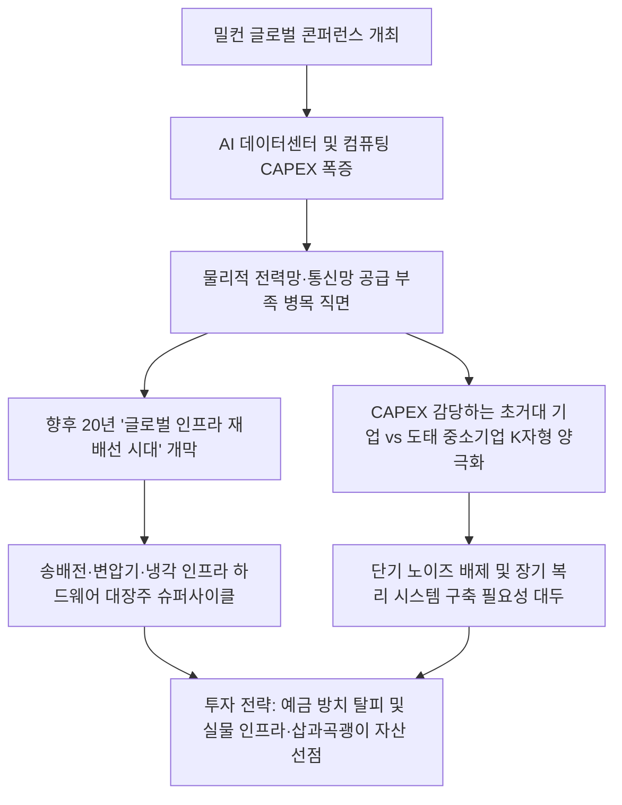

# 인프라/투자전략 분석: 밀컨 글로벌 콘퍼런스 AI 인프라 재배선 시대와 K자형 기업 양극화 현상
## 투자 신호 + 사회적 영향 평가

---

## 📌 기사 기본 정보

- **날짜**: 2026-05-07
- **출처**: 밀컨 글로벌 콘퍼런스 (블랙록 래리 핑크, 브룩필드 브루스 플랫 CEO, 시타델 켄 그리핀 등)
- **카테고리**: 경제 > 금융 > 투자전략
- **핵심 주제**: AI 자본 유입 본격화와 함께 향후 20년간 진행될 전 지구적 '전력망·통신망 재배선(Rewiring)의 시대'의 도래, 막대한 자본 지출(CAPEX)을 감당하는 빅테크와 도태되는 기업 간의 'K자형 양극화', 고물가 장기화 속 단기 노이즈를 이기는 장기 복리 투자의 필연성 분석

**메타데이터**
- 주요 사건: 글로벌 자산운용 및 금융 거물들이 모인 밀컨 콘퍼런스에서 AI 거품론 일축 및 전력망·인프라 재배선 패러다임 제시, K자형 기업 양극화 및 장기 복리 투자 필요성 강조
- 핵심 원인: AI 데이터센터 급증에 따른 글로벌 컴퓨팅 자원(GPU, 메모리 반도체) 및 물리적 유틸리티(전력, 송전망, 냉각 장치)의 극심한 공급 부족
- 주요 주체: 래리 핑크(블랙록 회장), 브루스 플랫(브룩필드 CEO), 켄 그리핀(시타델 CEO)
- 키워드: #밀컨콘퍼런스 #AI인프라 #재배선 #기업양극화 #장기복리 #인플레이션 #데이터센터 #컴퓨팅선물 #CAPEX

---

## 🔍 기사를 통한 투자 신호 추출

### 1단계: 핵심 사건 분해

**What (무엇이 일어났는가?)**
- 글로벌 금융 거물들이 밀컨 글로벌 콘퍼런스에 모여 AI 산업의 장기 성장을 선언하고, 향후 20년을 클라우드와 AI 데이터센터 구축을 위해 글로벌 전력망과 통신망을 새롭게 포는 '인프라 재배선(Rewiring)의 시대'로 규정했습니다. 동시에 대규모 인프라 투자 능력을 갖춘 최상위 기업들만 생존하는 'K자형 기업 양극화'가 심화될 것이라고 경고했습니다.

**When (언제 일어났는가?)**
- 2026-05-07 (인플레이션 고착화와 전력 인프라 쇼크가 겹치며 AI 성장 동력의 실물 물리적 기반 확보가 시장의 최우선 화두로 부상한 시점)

**Why (왜 일어났는가?)**
- 가상 세계에 머물던 AI 혁신이 실제 데이터센터 구동과 컴퓨팅 파워 공급이라는 '물리적 한계(전력 부족, 통신 병목, 냉각 결핍)'에 직면하면서, 인프라 자체가 가장 가치 있는 자산이자 투자 병목처가 되었기 때문입니다.
- 연간 수조 원에 달하는 AI 자본 지출(CAPEX) 장벽이 형성되면서, 대형 테크 기업과 중소기업 간의 자본 생산성 격차가 극대화되었기 때문입니다.

**Who (누가 주도하는가?)**
- 글로벌 실물 자산 및 금융 자본을 움직이는 탑티어 자산운용사 및 헷지펀드(블랙록, 브룩필드, 시타델 등)
- 막대한 유보 현금으로 물리적 전력·컴퓨팅 인프라를 입도선매하고 있는 초거대 빅테크 연합

---

### 2단계: 투자 신호 해석

### A. **긍정적 신호 (Bullish)**

**① 전력망 재배선 및 전력 기기, 데이터센터 인프라 대장주의 구조적 장기 성장**
- **신호**: 향후 20년간의 전 지구적 유틸리티/통신 인프라 재배선(Rewiring) 투자 돌입
- **의미**: AI 연산량이 급증함에 따라 송배전망, 초고압 변압기, 전력 에너지원, 냉각 솔루션(액침 냉각 등)을 공급하는 인프라 밸류체인 기업들은 경기 변동과 무관한 슈퍼 사이클에 진입함
- **투자 기회**: 초고압 변압기 및 송배전 기업, 글로벌 전력 그리드 인프라 ETF, 고효율 전력 반도체 설계사

**② 물리적 실물 자산 기반의 인프라 투자 펀드 및 대체 자산 운용사**
- **신호**: 국부펀드와 연기금 자본의 AI 실물 인프라 자산으로의 대이동
- **의미**: 저성장 국면에서 연 12% 이상의 확실하고 안정적인 장기 복리 수익률을 제공할 수 있는 민간 인프라 자산(발전소, 데이터센터 부지 등)의 소유권을 쥔 자산운용사들의 밸류에이션 리레이팅이 가속화됨
- **투자 기회**: 글로벌 대체 자산운용 대장주, 인프라 전문 리츠 및 펀드

---

### B. **위험 신호 (Bearish)**

**① 천문학적 AI CAPEX를 감당할 재무 체력이 없는 중소/중견 기업의 도태**
- **신호**: AI 생존 비용 상승 및 기업 간 'K자형 양극화' 심화
- **의미**: AI 시스템 도입 및 독자 인프라 구축 비용을 지불하지 못하는 하위 80% 기업들은 생산성과 마진율 경쟁에서 완전히 밀려나며 시장 점유율을 빅테크에 강제 빼앗기는 고사 위기에 처함
- **투자 리스크**: 고부채 저효율 중소형 소프트웨어/제조 기업, AI 도입 지연 전통 내수 유통주

**② 누적된 고물가(인플레이션) 고착화로 인한 실질 가처분 소득 감소 및 한계 소비재 기업**
- **신호**: 켄 그리핀의 누적 인플레이션(생필품 가격 폭등) 및 수명 장기 부채 경고
- **의미**: 기본 생존 비용 상승과 고물가 압박이 가중되면서 경기 민감형 내수 소비재 기업들의 매출 성장이 정체되고, 고금리 지속에 따른 이자 비용 증가로 재무 건전성이 악화됨
- **투자 리스크**: 가격 전가력이 없는 저가형 내수 생필품 및 프랜차이즈, 고부채 경기 민감 유통사

---

### 3단계: 섹터별 투자 기회 매트릭스

#### ✅ **높은 기대도 + 낮은 리스크**

**송배전 전력망 및 초고압 변압기 글로벌 독점 제조 대장주 및 북미 데이터센터 인프라 디벨로퍼**
- 전 세계적인 '재배선' 투자는 피할 수 없는 강제적 물리 흐름입니다. 금리 상황과 상관없이 빅테크의 데이터센터 구동을 위해 전력 기기와 인프라 공급 계약을 독점 체결한 대장주들은 향후 수년간 실적 가시성이 100%에 수렴합니다.
- **투자 추천도**: ⭐⭐⭐⭐⭐

---

## 💰 구체적 투자 신호 변환

### 신호 1: 단기 '거품론' 노이즈를 이기는 '인프라 재배선(Rewiring)' 벨류체인 핵심 선점 및 장기 복리 시스템 구축

**투자 해석**: 밀컨 콘퍼런스에서 래리 핑크가 던진 메시지는 명확합니다. 단기적인 주가 등락이나 거품론에 속아 은행 예금에 현금을 묵혀두는 것은 인플레이션 시대에 자산을 스스로 파괴하는 행위입니다. 진정한 기회는 AI 서비스 자체보다, AI를 구동하기 위한 전력망 재배선, 통신 인프라, 쿨링 시스템 등 '물리적 토대(삽과 곡괭이)'에 있습니다. 투자자는 즉시 포트폴리오를 재편하여, AI 소프트웨어 단기 테마주를 매도하고, 북미 및 글로벌 송전망·초고압 변압기 독점 기술을 보유한 하드웨어 대장주([[효성중공업]], [[HD현대일렉트릭]] 등)와 글로벌 대체 인프라 자산을 직접 소유한 메이저 자산운용사로 자금을 재배치해야 합니다. 이들은 20년 만에 도래한 '글로벌 물리적 인프라 대교체기'의 직접적인 최대 수혜를 입으며 장기 복리의 마법을 실현할 것입니다.

---

## 🌍 사회적 영향 평가

### A. 긍정적 사회 영향
- **글로벌 전력 인프라의 스마트화 및 신재생 에너지 연계 가속화**: AI 데이터센터의 전력 폭증에 대응하기 위해 전 세계 국가와 기업들이 노후 전력망을 지능형 스마트 그리드로 조기 개편하고 무탄소 에너지 전원을 확충하여 에너지 효율 혁신 달성
- **장기 복리 투자 대중화를 통한 노후 자본 건전성 확보**: 예금 중심에서 장기 인프라 복리 투자로 자본이 흘러가면서, 고령화 사회의 개인들이 장기 인플레이션 압박을 이겨내고 자산 방어벽을 구축할 기회 제공

### B. 부정적 사회 영향
- **K자형 기업 양극화로 인한 골목상권 및 중소기업 붕괴**: 빅테크의 AI 독점 현상이 고착화되면서 자체 기술 대응력이 없는 영세·중소기업들의 폐업이 급증하고 고용 시장의 양극화 극대화
- **실물 인프라 건설 지연 시 에너지 빈곤층 양산**: 빅테크의 무차별적인 전력·에너지 독점으로 인해 일반 가계 및 취약 계층의 전기 요금과 통신 요금이 폭등하는 등 공공재 비용의 불평등한 상승 초래

---

## 🎯 결론: 당신의 투자 전략 수립

- **즉시 실행**: AI 모멘텀만 가지고 있고 실질 현금흐름이나 인프라 수혜가 없는 고밸류에이션 테마 기술주 매도 및 달러화 기반 인프라 자산 비중 확대
- **3개월 후**: 컴퓨팅 자원의 자산화 경향 및 '컴퓨팅 선물' 등 신규 금융 대체 상품의 인프라 구축 현황을 추적하여 대체 자산 포트폴리오 다각화

---

## 📝 Obsidian 연결 구조

