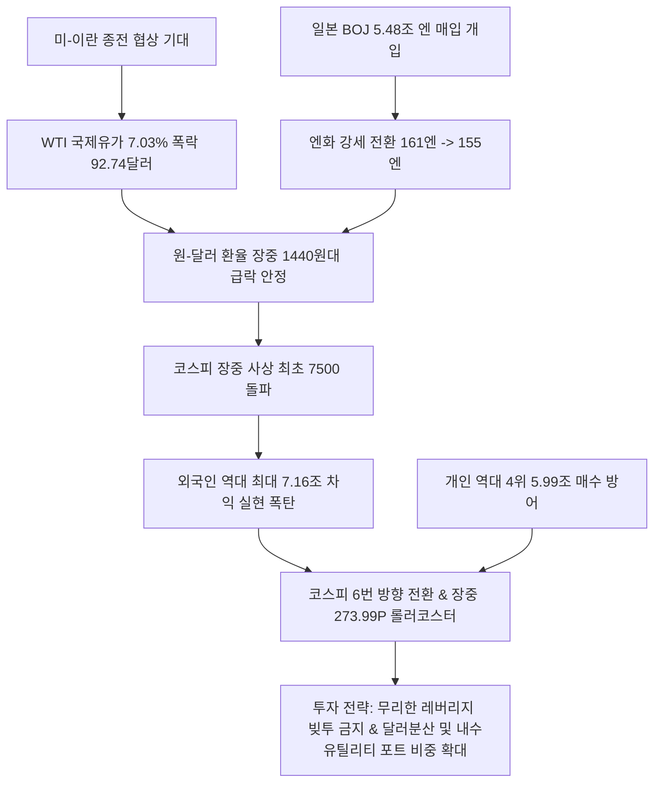

# 외환/증시 분석: 원·달러 환율 1440원대 안정과 코스피 7500 돌파 및 외국인 역대 최대 7.1조 순매도 폭탄 분석
## 투자 신호 + 사회적 영향 평가

---

## 📌 기사 기본 정보

- **날짜**: 2026-05-07
- **출처**: 글로벌 외환·증시 시장 종합 (중앙일보 염지현·장서윤 기자)
- **카테고리**: 경제 > 금융 > 외환/증시
- **핵심 주제**: 미-이란 종전 협상 기대에 따른 달러인덱스 및 국제유가 폭락, 일본 BOJ의 대규모 시장 개입에 따른 엔화·원화 동반 강세로 환율이 1440원대 안착했으나, 코스피가 사상 최초 7500을 돌파한 직후 외국인의 역대 최대 차익 실현 매도(7.1조 원)와 개인의 역대급 방어 매수(6조 원)가 맞붙으며 변동성이 극대화된 롤러코스터 장세 분석

**메타데이터**
- 주요 사건: 원·달러 환율 장중 1440원대 급락(5주 만에 80원 하락), 코스피 장중 사상 최초 7500선 돌파 후 7200선까지 급락하는 변동성 연출, 외국인 하루 만에 역대 최대인 7.16조 원 순매도 폭탄 투하
- 핵심 원인: 미-이란 종전 기대에 따른 달러인덱스 하락(97.9) 및 WTI 유가 폭락(7.03%), 일본 BOJ의 엔화 방어 시장 개입(5.48조 엔 매입)에 따른 엔화·원화 동조 강세, 코스피 7500 도달에 따른 외국인의 기술적 차익 실현 폭발
- 주요 주체: 글로벌 외환 시장 참가자, 외국인 기관 투자자, 국내 개인 투자자, 일본은행(BOJ)
- 키워드: #원달러환율 #코스피7500 #외국인순매도 #엔화개입 #달러인덱스 #국제유가하락 #차익실현 #롤러코스터장세 #바이코리아

---

## 🔍 기사를 통한 투자 신호 추출

### 1단계: 핵심 사건 분해

**What (무엇이 일어났는가?)**
- 미-이란 종전 기대와 달러 강세 누그러짐에 힘입어 원·달러 환율이 1440원대로 안정화되었습니다. 그러나 국내 증시는 코스피 7500을 돌파하자마자 외국인의 역대 최대 규모인 7.16조 원의 차익 실현 매도 폭탄이 떨어지며 장중 변동성이 273.99포인트에 달하는 극한의 롤러코스터 장세를 연출했습니다. 개인이 약 6조 원의 순매수로 이를 받아치며 지수 붕괴를 간신히 막아내는 '바이코리아' 방어전이 전개되었습니다.

**When (언제 일어났는가?)**
- 2026-05-07 (중동 전쟁 리스크 완화에 기댄 자본시장 활성화와 누적된 차익 실현 압박이 최고조로 충돌한 시점)

**Why (왜 일어났는가?)**
- 미-이란 종전 협상 소식으로 안전자산 수요가 급감하고 달러인덱스(97.9)와 국제유가(7.03% 폭락)가 떨어지는 한편, 일본 BOJ가 엔화 가치를 지키기 위해 약 5.48조 엔을 투입해 엔화를 155엔대로 견인하며 원화의 동조 강세를 유발했기 때문입니다.
- 단기 급등으로 코스피가 사상 최초 7500을 터치하자, 외국인 투자자들 사이에서 "단기 고점 달성"이라는 기술적 차익 실현 합의가 형성되어 전례 없는 매도 합치(7.1조 원)를 이뤄냈기 때문입니다.

**Who (누가 주도하는가?)**
- 대규모 차익 매물을 쏟아낸 외국인 기관 자본 및 이들이 버린 매물을 패닉 바잉 또는 지수 방어용으로 받아낸 국내 거대 개인 투자자 연합
- 엔화 가치 사수를 위해 5.48조 엔 규모의 폭탄 개입을 단행한 일본은행(BOJ)

---

### 2단계: 투자 신호 해석

### A. **긍정적 신호 (Bullish)**

**① 수입 원자재 및 원유 비용 절감에 직면한 전통 유틸리티 및 제조업 강세**
- **신호**: 국제유가 폭락(WTI 92.74달러) 및 환율 1440원대 하락 안정화
- **의미**: 원유와 가스를 대량으로 수입하여 물류·생산 원가 부담이 심각했던 한국의 유틸리티(한전, 가스공사) 및 항공, 중공업, 기계, 음식료 섹터의 원가 스프레드가 대폭 개선되며 2분기 영업이익 마진 턴어라운드를 유도함
- **투자 기회**: 국내 대표 유틸리티주, 항공 및 물류 대장주, 원자재 수입 비중이 높은 화학/음식료주

**② 개인 자금의 대형주 하방 방어력 입증과 국내 대표 밸류업 지배주**
- **신호**: 외국인 7.1조 원 매도 폭탄을 6조 원 순매수로 받아낸 개인의 엄청난 대기 자금력
- **의미**: 외국인의 일시적 차익 실현 폭탄에도 불구하고, 밸류업 정책 기대감과 풍부한 예탁금이 지수 하방을 강력히 지지하고 있어 기술적 조정 완료 시 강력한 재상승 모멘텀을 담보함
- **투자 기회**: 주주 환원과 자사주 소각 여력이 큰 국내 대표 지주사 및 밸류업 대장주

---

### B. **위험 신호 (Bearish)**

**① 원화 강세 전환으로 인한 수출 대형주의 환차손 및 영업 마진 축소 우려**
- **신호**: 원·달러 환율의 1530원 최고점에서 1440원대 급속 하락(원화값 5% 강세)
- **의미**: 글로벌 시장에서 고환율 효과(수출 환효과)로 호실적을 누리던 자동차, IT 하드웨어, 선박 제조 등 국내 수출 대장주들의 원화 환산 영업이익이 단기적으로 감소하여 주가 조정 빌미를 제공함
- **투자 리스크**: 원·달러 환율 민감도가 극도로 높은 대형 자동차 및 자동차 부품사, 한계 IT 하드웨어 기업

**② 종전 기대 무산 시 외환·증시 양방향 신용 잔고 폭발 및 마진콜 위험**
- **신호**: 외국인 역대 최대 순매도와 개인의 '빚투' 및 무차별 추종 매수 충돌
- **의미**: 현 주가 수준은 미-이란 종전 확률을 50% 이상 선반영하고 있어, 만약 미-이란 협상이 돌연 교착 상태에 빠지거나 중동 지정학 전쟁이 재점화될 경우 환율은 1530원을 재돌파하고 코스피는 역대급 신용 물량이 출회되며 급격한 투매 사태를 유발할 수 있음
- **투자 리스크**: 신용 융자 잔고율이 역대 최고치인 코스닥 중소형 고밸류 성장 테마주

---

### 3단계: 섹터별 투자 기회 매트릭스

#### ✅ **높은 기대도 + 낮은 리스크**

**국제유가 급락과 원화 강세에 따른 마진 개선 수혜 대형 유틸리티 및 원자재 수입 화학 대장주**
- 미-이란 협상 지속 여부와 무관하게 국제 원유 공급선 재조정과 엔화·원화 동조화 효과는 상수가 되고 있습니다. 환율 1400원 중반대 안착과 고유가 해소의 직접적 수혜를 누리는 공공 유틸리티 및 원자재 가격 전가형 정밀 화학 기업들은 불확실성 국면에서 가장 안전한 피난처입니다.
- **투자 추천도**: ⭐⭐⭐⭐

---

## 💰 구체적 투자 신호 변환

### 신호 1: '종전 희망 회로' 과몰입 경계 및 포트폴리오 밸런스 재배정 및 변동성 헷지 전략 가동

**투자 해석**: 원·달러 환율이 1440원대까지 밀려나며 외환 시장은 다소 안정을 되찾았지만, 주식 시장에서 외국인이 사상 처음으로 '하루 7.1조 원'을 내던진 것은 단순히 기술적 차익 실현을 넘어 시장의 펀더멘털이 지정학적 단일 변수([[종전 협상]])의 행방에 극도로 취약함을 방증합니다. 종전이 타결되면 환율 1390원대 진입과 증시 불마켓이 열리겠지만, 협상이 깨지는 순간 대마진콜 사태가 터집니다. 투자자는 즉시 포트폴리오의 극단적인 방향성 베팅을 멈춰야 합니다. 개인 투자자의 무차별 방어 매수세에 편승하여 빚을 내어 레버리지를 늘리는 행위는 금물입니다. 오히려 지금처럼 원화 가치가 단기 강세(1440원대)일 때, 확보된 원화 현금을 분할하여 일부 미국 달러(USD) 실물 자산 및 달러 자산으로 다시 헷징하고, 고유가 완화로 비용 구조가 완전히 정상화되는 저평가 내수/에너지 수입 대형주([[한국전력]], [[롯데케미칼]] 등)로 주식 포트폴리오를 분산하여 극단적인 시장 변동성을 완충해야 합니다.

---

## 🌍 사회적 영향 평가

### A. 긍정적 사회 영향
- **수입 물가 안정화 및 가계 실질 생활비 부담 완화**: 환율이 1400원대 중반으로 하향 안정화되고 유가가 90달러 초반으로 하락하면서 가계 가스·전기 요금 및 생필품 수입 단가가 안정되어 누적된 인플레이션 고통 경감
- **엔화 방어 협력을 통한 아시아 금융 통화 동맹 신뢰 구축**: 일본 BOJ의 강력한 엔화 방어 개입이 원화 가치의 동조 방어선 역할을 해줌으로써, 아시아 통화 시장의 연쇄 파국(환율 전쟁)을 막고 거시 금융 안정을 획득

### B. 부정적 사회 영향
- **극심한 롤러코스터 장세에 의한 개인 투자자 부의 뇌동매매 손실**: 하루 변동성 270포인트가 넘는 변동성 속에서 추종 매매에 뛰어든 개인 투자자들이 고점 매수 후 급락 패닉 셀링을 반복하여 중산층 가계의 가용 자산이 허공에 분해될 위험 고조
- **원화 강세 전환에 따른 국내 주요 수출 대기업의 채산성 악화 및 고용 정체**: 고환율 수출 반사이익이 사라진 IT·자동차 대기업들이 하반기 실적 가이던스를 하향 조정하고 보수적인 채용 및 투자 기조로 돌아설 우려

---

## 🎯 결론: 당신의 투자 전략 수립

- **즉시 실행**: 최근 단기 코스피 7500 급등 시점에 과도하게 실행한 개인 주식 신용 융자(빚투) 전량 차환 및 상환 처리로 계좌 안전 비율 강화
- **3개월 후**: 미-이란 종전 협상의 14개 항 최종 도장을 검토하여, 완전 합의 타결 시 성장주로의 공격적 진입, 교착 시 고환율 방어 달러 자산 100% 리밸런싱 실행

---

## 📝 Obsidian 연결 구조

