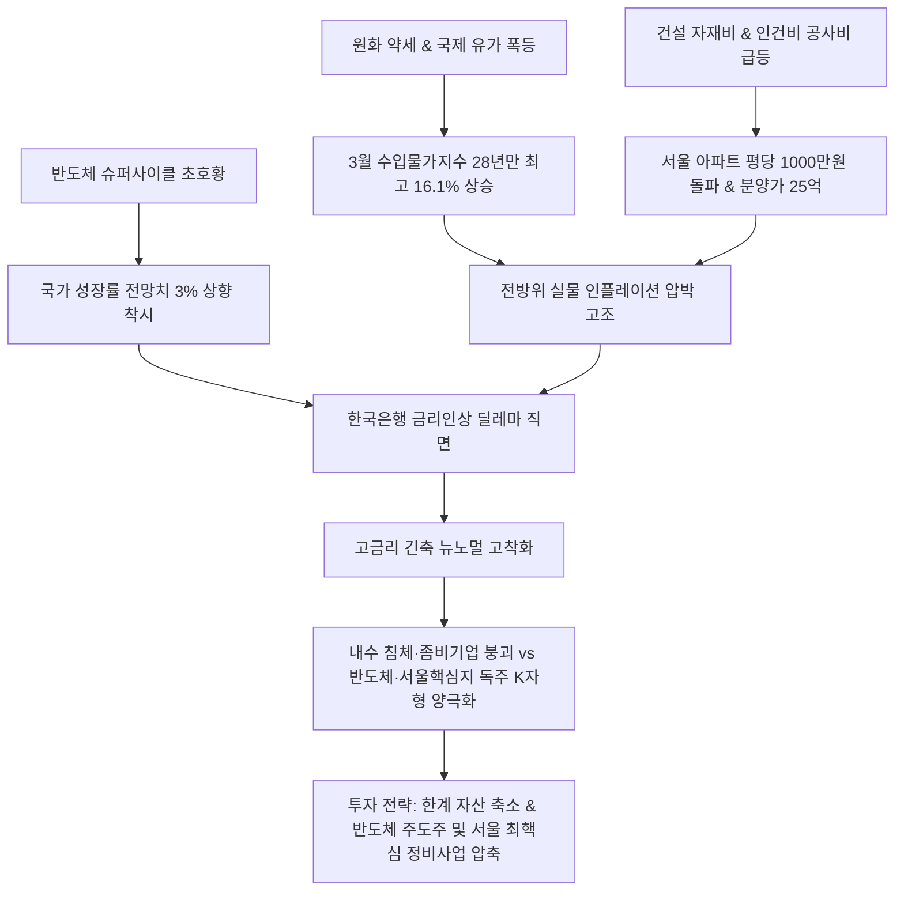

# 통화정책/부동산 분석: 수입 인플레와 집값 폭등 속 한국은행의 추가 금리 인상 딜레마 및 K자형 양극화 현상
## 투자 신호 + 사회적 영향 평가

---

## 📌 기사 기본 정보

- **날짜**: 2026-05-07
- **출처**: 글로벌 금융·부동산 시장 종합 (광화문 김경환 경제부장 시평)
- **카테고리**: 경제 > 금융 > 통화정책/부동산
- **핵심 주제**: 원화 약세 및 유가 폭등에 따른 수입물가 28년 만의 최고치 기록과 공사비 폭등발 서울 아파트 분양가 폭등으로 자산 인플레이션 압박이 임계점에 달했으나, 반도체 초호황에 가려진 내수·중소기업의 심각한 고사 상태(K자형 양극화)로 인해 추가 기준금리 인상 카드를 만지작거리며 깊어지는 한국은행의 통화정책 딜레마 분석

**메타데이터**
- 주요 사건: 원화 약세·유가 쇼크에 따른 3월 수입물가지수 28년 만의 최고 수준(16.1% 상승) 기록, 공사비 폭등에 따른 서울 아파트 평당 분양가 1,000만 원 돌파 및 25억 원 도달, 반도체 초호황에 따른 성장률 3%대 상향과 추가 금리인상 가이던스 부상
- 핵심 원인: 글로벌 공급망 교란 및 중동 전쟁발 에너지 인플레이션, 원자재·인건비 상승에 따른 건설 원가 구조의 회복 불가능한 고착화, HBM/반도체 중심의 극단적 수출 편중 성장(착시 현상)
- 주요 주체: 한국은행(BOK, 이창용 총재 및 금융통화위원회), 국토교통부, 국내 건설업계 및 한계 자영업/중소기업
- 키워드: #한국은행 #금리인상딜레마 #수입물가지수 #공사비폭등 #K자형양극화 #반도체슈퍼사이클 #한계기업 #분양가상승

---

## 🔍 기사를 통한 투자 신호 추출

### 1단계: 핵심 사건 분해

**What (무엇이 일어났는가?)**
- 자산 버블과 수입 물가 폭등을 억제하기 위한 한국은행의 '추가 금리 인상론'이 수면 위로 급부상했습니다. 수입물가지수가 28년 만에 최고치(16.1% 상승)를 찍고 분양 공사비 폭등으로 노량진 등 서울 핵심지 분양가가 25억 원을 돌파하며 전방위 인플레이션이 촉발되었습니다. 이에 한은은 금리 인상 깜빡이를 켰으나, 반도체만 웃고 내수 소상공인과 한계 중소기업은 고사하는 'K자형 양극화'로 인해 금리 인상의 부작용을 통제하기 어려운 딜레마에 봉착했습니다.

**When (언제 일어났는가?)**
- 2026-05-07 (반도체 호황으로 국가 성장률 전망치가 3%로 복귀하는 착시 속에서 서민 실물 경기 및 내수 한파가 극명히 대비되던 통화정책의 변곡점)

**Why (왜 일어났는가?)**
- 수입 원자재 및 에너지 단가 상승이 시차를 두고 완제품 및 공사비(평당 1,000만 원) 폭등으로 고착화되면서, 금리를 올리지 않고는 실물 자산 거품과 인플레 기대심리를 잠재울 수 없는 지경에 이르렀기 때문입니다.
- 반도체 수출 급증이 헤드라인 GDP 지표를 착시적으로 방어하고 있어 통화당국이 금리 인상 명분을 얻었으나, 자영업자와 한계 기업들의 부실채권(NPL) 비율이 폭등하고 있어 실제 금리를 올렸을 때 내수 경제 파멸이 우려되기 때문입니다.

**Who (누가 주도하는가?)**
- 자산 버블과 인플레이션을 잡기 위해 금리 인상 깜빡이를 켜며 긴축 포워드 가이던스를 작동한 한국은행 금융통화위원회
- 공사 원가 상승을 명분으로 분양가를 역대 최고치로 인상 중인 대형 건설 디벨로퍼 및 이를 소화하는 서울 핵심지 자산가들

---

### 2단계: 투자 신호 해석

### A. **긍정적 신호 (Bullish)**

**① 원가 구조 변경 및 인플레이션을 분양 가격에 전가할 수 있는 서울 핵심지 도시정비·건설 대장주**
- **신호**: 노량진 등 서울 핵심지 분양가 25억 돌파 및 공사 원가 폭등의 수용
- **의미**: 지방 건설사와 좀비 시행사들은 무너지지만, 서울 강남/용산/여의도 등 핵심 입지에서 가격 전가력을 온전히 발휘하여 높은 공사 마진을 확보하는 1군 초대형 건설 브랜드 지배기업들은 인플레이션 방어 자산으로 리레이팅됨
- **투자 기회**: 국내 1군 정비사업 독점 브랜드 대형 건설사, 시행/개발 수직계열화 확보 디벨로퍼

**② 반도체 초호황의 직접적 수혜를 입는 글로벌 IT 하드웨어 및 HBM 공급망**
- **신호**: 한국 경제성장률 3%대 복귀를 견인하는 반도체 슈퍼 사이클 독주
- **의미**: 내수 둔화와 통화 긴축 리스크에서 완전히 독립되어 글로벌 AI 데이터센터 인프라 확장 자본을 싹쓸이하는 반도체 및 관련 7세대 HBM 장비/부품 체인은 코스피 시장의 유일무이한 주도적 생존 영역이 됨
- **투자 기회**: HBM 핵심 패키징 장비 및 소재 기업, 메모리 초우량 대장주

---

### B. **위험 신호 (Bearish)**

**① 고금리 유지 및 추가 인상 시 연쇄 부도에 직면한 고부채 좀비 한계 기업 및 한계 저신용 금융 섹터**
- **신호**: 한은의 금리 인상 긴축 유턴 및 고금리 장기화 고착화
- **의미**: 영업이익으로 이자조차 못 갚는 한계 기업(좀비 기업) 비율이 사상 최고치에 달한 상황에서 한은의 추가 금리 인상이 집행되면 저축은행, 상호금융 등 비은행 금융기관의 연체율 폭등과 함께 한계 시행·시공사 부도 도미노가 현실화됨
- **투자 리스크**: 부채 비율이 높고 현금 흐름이 막힌 중소형 건설·시행사, 부동산 PF 노출도가 높은 2금융권 금융주

**② 내수 위축의 직접적 타격을 받는 가격 비전가형 소비재 및 자영업 밀착형 리테일**
- **신호**: K자형 양극화 심화 및 서민 가계의 실질 소득 감소
- **의미**: 금리 및 수입 물가 상승으로 가계의 이자 부담과 가처분 소득 고갈이 극대화되면서 필수 소비재가 아닌 사치재, 중저가 패션, 화장품, 프랜차이즈 리테일의 매출 성장이 꺾이고 마진 파괴가 가속화됨
- **투자 리스크**: 내수 의존도가 100%에 달하는 고밸류 의류·화장품 유통사, 중소형 백화점/홈쇼핑

---

### 3단계: 섹터별 투자 기회 매트릭스

#### ✅ **높은 기대도 + 낮은 리스크**

**글로벌 독점력을 지닌 AI 반도체 공급망 및 가격 전가력이 완벽한 서울 핵심 입지 대주주**
- K자형 양극화의 상단(반도체 수출, 서울 핵심 자산)에 속한 자산은 긴축 쇼크 속에서도 독점적 가치와 강력한 인플레이션 방어력을 발휘합니다. 금리가 오를수록 이 양극화는 심화되므로, 양극화의 '우측 상단 승자 통로'에 완벽히 탑승한 대장 자산군에만 포트폴리오를 압축해야 합니다.
- **투자 추천도**: ⭐⭐⭐⭐⭐

---

## 💰 구체적 투자 신호 변환

### 신호 1: 내수/부동산 PF 지뢰밭에서 탈출하여 글로벌 '반도체 강성 자본' 및 '서울 최핵심 입지 RWA'로 포트폴리오 압축 이전

**투자 해석**: 기사는 한국 경제가 반도체 독주의 착시 효과 속에 갇혀 있지만, 하부 구조에서는 28년 만의 수입 인플레 폭발과 분양 공사비 평당 1천만 원 시대를 감당하지 못해 붕괴하기 직전의 'K자형 양극화'를 적나라하게 보여줍니다. 금리 인하가 사실상 물 건너간 상황에서 한계 자영업과 지방 중소형 건설, 2금융권 채권은 조만간 닥쳐올 긴축 부작용의 지뢰밭입니다. 투자자는 즉시 포트폴리오의 구조조정을 실행해야 합니다. 지방 미분양 노출도가 높은 중소형 건설주 및 한계 기술 성장주 비중을 전량 청산하고, 확보된 자본을 글로벌 AI 캐펙스(CAPEX) 수혜를 100% 독식하는 HBM 밸류체인 핵심 장비주와 고분양가를 완벽하게 시장 가격에 전가할 수 있는 서울 강남·용산 정비사업 독점 대형주([[삼성물산]], [[현대건설]] 등)로 극단적으로 한정 투자하여 자산의 맷집을 키워야 합니다.

---

## 🌍 사회적 영향 평가

### A. 긍정적 사회 영향
- **한계 한계기업 구조조정을 통한 산업 효율성 제고**: 장기 고금리 유지 압박이 비효율적인 한계 좀비 기업들을 도태시키고, 살아남은 우량 기업들 중심으로 자본과 노동을 집중시켜 장기적인 잠재 성장률 복원 가속화
- **실물 인프라 기반의 친환경·자동화 신공법 도입 가속화**: 공사비와 인건비 급등에 직면한 건설업계가 모듈러 공법, 3D 건축 프린팅, 자동화 로봇 건설 솔루션을 앞당겨 도입하며 산업 전체의 기술 고도화 달성

### B. 부정적 사회 영향
- **주거 불평등 극대화 및 서민 세대의 서울 진입 장벽 영구화**: 평당 1천만 원 공사비와 서울 분양가 25억 시대의 정착으로 인해 청년 및 무주택 서민 세대의 서울 내 주택 마련이 사실상 차단되며 심각한 사회적 박탈감과 자산 격차 양극화 야기
- **고금리 장기화에 따른 한계 중소기업·자영업자 파산 및 중산층 붕괴**: 한은의 금리 인상 기조 유지가 내수 소비를 추가 동결시켜 대출로 버티던 소상공인과 중소기업의 연쇄 부도를 유도하고 중산층이 서민·빈곤층으로 추락하는 연쇄 파국 야기

---

## 🎯 결론: 당신의 투자 전략 수립

- **즉시 실행**: 지방 건설사, PF 부실 노출 금융사, 고레버리지 신규 분양 상가 등 고부채 부동산 유관 한계 자산 처분 및 전원 반도체/달러화 우량주로 자산 압축
- **3개월 후**: 한은 금통위의 실제 추가 금리 인상 단행 여부 및 분양 시장의 청약 경쟁률 추이를 모니터링하여 핵심 입지 부동산 청약 전략 최종 보정

---

## 📝 Obsidian 연결 구조

