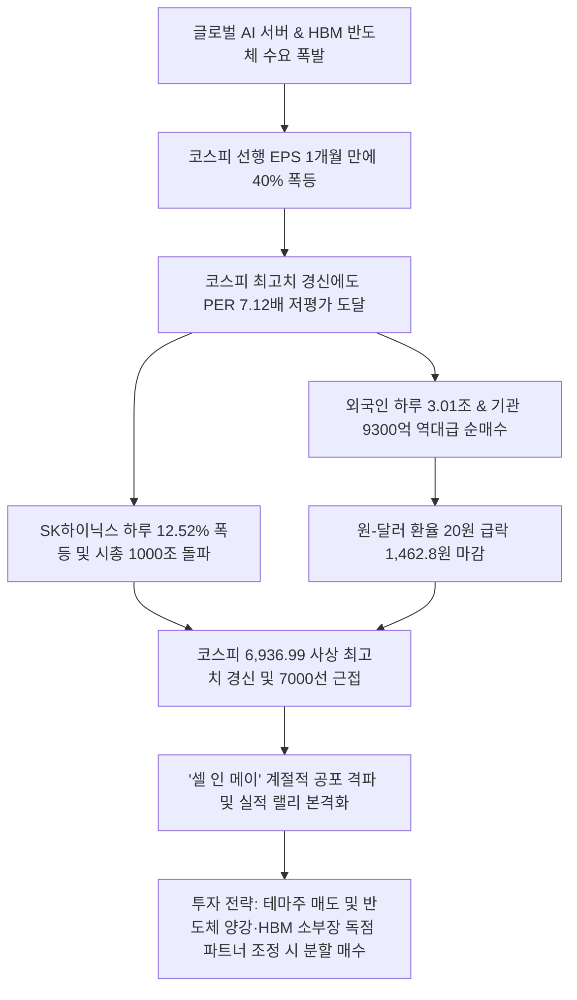

# 증시/반도체 분석: 코스피 7000 돌파 임박과 SK하이닉스 시총 1000조 돌파 및 '셀 인 메이' 격파 실적 랠리 분석
## 투자 신호 + 사회적 영향 평가

---

## 📌 기사 기본 정보

- **날짜**: 2026-05-07
- **출처**: 글로벌 금융·증시 시장 종합 (중앙일보 박유미 기자)
- **카테고리**: 경제 > 금융 > 증시/반도체
- **핵심 주제**: 코스피가 하루 5.12% 폭등하며 6,936.99로 사상 최고치를 경신하고 SK하이닉스가 하루 12.52% 급등해 최초로 시총 1,000조 원에 올라서는 등 반도체 양강 주도로 '셀 인 메이(Sell in May)' 격언을 일축하며 전개된 실적 기반의 저PER 밸류에이션 정상화 랠리 분석

**메타데이터**
- 주요 사건: 코스피 사상 최고치 경신(6,936.99 마감), SK하이닉스 시가총액 최초 1,000조 원 돌파(종가 144만 7,000원, +12.52%), 외국인 유가증권시장 3.01조 원 및 기관 9,363억 원의 역대급 동반 순매수, 원·달러 환율 20원 급락(1,462.8원)
- 핵심 원인: AI 데이터센터용 HBM 수요 폭발 및 글로벌 빅테크 호실적 연동, 선행 12개월 EPS 한 달 만에 40% 폭등(3월 말 666.6 → 4월 말 926.8)에 따른 실적 장세 이행, 폭등에도 불구하고 PER 7.12배로 낮아진 저평가 밸류에이션 매력
- 주요 주체: SK하이닉스, 삼성전자, 외국인 기관 투자자, 기관 투자자
- 키워드: #코스피7000 #SK하이닉스 #삼성전자 #반도체랠리 #셀인메이무색 #선행EPS #외국인순매수 #PER밸류에이션 #HBM #시총1000조

---

## 🔍 기사를 통한 투자 신호 추출

### 1단계: 핵심 사건 분해

**What (무엇이 일어났는가?)**
- 국내 증시가 하루 만에 5%가 넘는 역사적인 대폭등을 기록하며 코스피 7000선 고지를 코앞에 두게 되었습니다. SK하이닉스가 하루 12.52% 폭등해 꿈의 시가총액 1,000조 원 반열에 올랐고, 외국인이 하루에만 3조 원 이상을 매수하는 광풍이 불었습니다. 5월 주식 매도 룰인 '셀 인 메이' 우려가 완전히 침묵한 채, 기업 실적 전망(EPS)이 40% 급등하며 발생한 '실적 드라이브형 랠리'가 본격화되었습니다.

**When (언제 일어났는가?)**
- 2026-05-07 (5월 초 실적 공시와 글로벌 AI 인프라 구축 수요가 교차하며 한국 반도체 기업들의 이익 전망치가 수직 상승한 시점)

**Why (왜 일어났는가?)**
- AI 서버에 필수 탑재되는 차세대 고대역폭 메모리(HBM) 시장을 장악한 한국 반도체 양강의 수출 실적이 글로벌 엔비디아 밸류체인과 맞물려 폭발적으로 상향 조정되었기 때문입니다.
- 주가는 급등했으나 기업들의 미래 이익 전망치(EPS)가 주가 상승 속도보다 훨씬 빠르게 상향되어, 시장 전체의 멀티플(PER 7.12배)이 오히려 저평가 매력을 띠는 밸류에이션 리레이팅이 발생했기 때문입니다.

**Who (누가 주도하는가?)**
- 전 세계 AI 공급망 병목을 해소하며 천문학적 현금을 벌어들이는 한국 반도체 대장주(SK하이닉스, 삼성전자)
- 환차익과 밸류에이션 매력을 보고 하루 3조 원의 강력한 바이코리아 매수 주문을 밀어 넣은 외국인 스마트 머니

---

### 2단계: 투자 신호 해석

### A. **긍정적 신호 (Bullish)**

**① 실적 성장에 기반한 저PER 구간 진입으로 코스피 추가 랠리 및 7500 안착**
- **신호**: 코스피 선행 EPS 한 달 만에 40% 급등(926.8) 및 PER 7.12배 하락
- **의미**: 주가가 사상 최고치를 달렸음에도 기업들의 실제 현금 창출 능력이 이를 압도하여 주가가 싸 보이는 '실적 장세'가 도래함. 이는 단기 거품 우려를 해소하고 코스피 7,500선까지 추가 상단을 여는 강력한 펀더멘털 지지선 역할을 함
- **투자 기회**: 코스피 지수 추종 ETF, 코스피 대형 대표주 및 반도체 레버리지 상품

**② 글로벌 AI 반도체 밸류체인의 핵심 허브인 HBM 및 후공정 소부장 파트너**
- **신호**: SK하이닉스 주가 12.52% 폭등 및 사상 최초 시총 1,000조 원 돌파
- **의미**: HBM의 글로벌 독점 지위와 차세대 AI 서버용 DDR5 수요 확장이 실적으로 입증되면서 하이닉스에 장비·소재를 납품하는 핵심 국산화 소부장 기업들의 영업이익이 동반 레벨업됨
- **투자 기회**: HBM 전용 패키징·테스트 장비 제조 파트너사, 반도체 초미세화 특수 가스 및 소재 대장주

---

### B. **위험 신호 (Bearish)**

**① 외국인 단기 순매수 쏠림에 따른 차익 실현 유출 시 변동성 리스크**
- **신호**: 외국인의 단 하루 3조 원 이상 집중 순매수 및 원·달러 환율 급락
- **의미**: 외국인의 대규모 매수 유입은 환차익과 맞물려 지수를 급상승시키지만, 5월 말 엔비디아 실적 발표 전후 또는 글로벌 거시 지정학 리스크 재점화 시 역방향의 매도 폭탄으로 표변하여 지수를 순식간에 급락시킬 수 있는 잠재적 유동성 변동성을 안고 있음
- **투자 리스크**: 외국인 지분율이 급격히 높아진 고PER 부품 성장주

**② 매크로 잠복 변수(미 중간선거, Fed 통화 기조 변화)에 따른 미국 중간 조정 가능성**
- **신호**: 차기 연준의장 후보 케빈 워시의 매파 성향 및 미국 중간선거 변수 잠재
- **의미**: 국내 실적 랠리가 강력해도 미국 통화정책이 재긴축으로 선회하거나 중간선거 불확실성으로 S&P 500이 5~10월 계절적 조정을 겪을 경우, 글로벌 캐리자금 이탈과 연동하여 국내 증시도 동반 하락 조정 압력을 받음
- **투자 리스크**: 이익 체력이 검증되지 않은 고레버리지 중소형 성장주

---

### 3단계: 섹터별 투자 기회 매트릭스

#### ✅ **높은 기대도 + 낮은 리스크**

**글로벌 HBM 독점 기술력을 보유한 메모리 반도체 대장주 및 7세대 패키징 핵심 장비 파트너**
- 이번 랠리는 단순한 기대감이 아닌 '실제 이익 EPS의 수직 상승'이 뒷받침하는 밸류에이션 정상화 국면입니다. 특히 엔비디아의 실적 발표를 기점으로 HBM 공급 계약 실적이 계속 구체화될 것이므로, 조정을 줄 때마다 반도체 대장주와 독점 장비 파트너 지분을 확보하는 것이 최고 승률의 로드맵입니다.
- **투자 추천도**: ⭐⭐⭐⭐⭐

---

## 💰 구체적 투자 신호 변환

### 신호 1: '셀 인 메이' 공포 극복 및 이익 성장(선행 EPS) 주도 반도체 핵심 포트폴리오 비중 확대 및 조정 시 분할 매수

**투자 해석**: 기사는 코스피가 사상 최고치인 6,930선에 도달했음에도 12개월 선행 PER이 역사적 저평가 수준인 7.12배에 불과하다는 메가톤급 팩트를 제시합니다. 주가가 급등한 것보다 기업들의 AI 반도체 수출 이익(EPS)이 40%나 빠르게 급증했기 때문에 지금 주가는 절대 버블이 아닙니다. 매년 5월에 주식을 파는 '셀 인 메이'의 철 지난 공식에 사로잡혀 주식을 다 팔고 현금만 쥐고 있는 것은 상승 랠리에서 완전히 도태되는 악수입니다. 투자자는 즉시 포트폴리오를 조정해야 합니다. 실적이 없는 단순 성장 테마주나 내수 부진주를 신속히 매도하고, HBM 시장의 압도적 맹주인 [[SK하이닉스]]와 밸류에이션 정상화 구간에 도달한 [[삼성전자]]의 비중을 획기적으로 올리며, 5월 중순 지정학이나 거시 노이즈로 인한 단기 기술적 조정이 발생할 때마다 이를 매도 기회가 아닌 '일생일대의 장기 복리 매수 기회'로 포착해 지분을 매집해야 합니다.

---

## 🌍 사회적 영향 평가

### A. 긍정적 사회 영향
- **국가 연금 재정 건전성 강화 및 국민 부의 증대**: 국내 시총 1위 그룹인 반도체 양강의 역사적 주가 폭등과 영업이익 급증이 이들의 지분을 대량 보유한 국민연금의 운용 수익률을 획기적으로 레벨업시켜 노후 연금 고갈 우려 해소에 기여
- **국내 AI 첨단 소부장 기술 생태계의 고부가가치 전환**: 대기업의 HBM 대규모 캐펙스 투자가 낙수 효과를 일으켜 국내 중소형 장비·소재 협력사들의 고용 창출과 차세대 반도체 원천 기술 국산화 속도 단축

### B. 부정적 사회 영향
- **반도체 편중에 따른 국내 양극화 증시 및 한계 섹터 박탈감**: 반도체만 오르고 다른 한계 제조업, 내수 소비재, 전통 산업군은 소외당하는 K자형 양극화가 주식 시장에서도 그대로 재현되며 개인 투자자 간 수익률 격차 불평등 고조
- **급격한 외국인 자본 의존에 따른 외환·증시 금융 변동성 취약화**: 외국인의 극단적인 3조 원 매수 쏠림은 역으로 글로벌 유동성 경색 발생 시 하루 만에 조 단위 자금이 썰물처럼 빠져나가는 외풍 취약형 외환·증시 체질을 고착화

---

## 🎯 결론: 당신의 투자 전략 수립

- **즉시 실행**: 실적이 뒷받침되지 않고 거시 지표에만 기대던 고PBR 금융 및 저효율 한계 가치주 비중 축소 후 반도체 주도주 비중 상향
- **3개월 후**: 5월 27일 엔비디아의 차분기 실적 발표와 HBM 가이던스 변화를 추적하여, 시장 예상치 상회 시 반도체 소부장 대장주로의 추가 레버리지 포트폴리오 최적화 단행

---

## 📝 Obsidian 연결 구조

