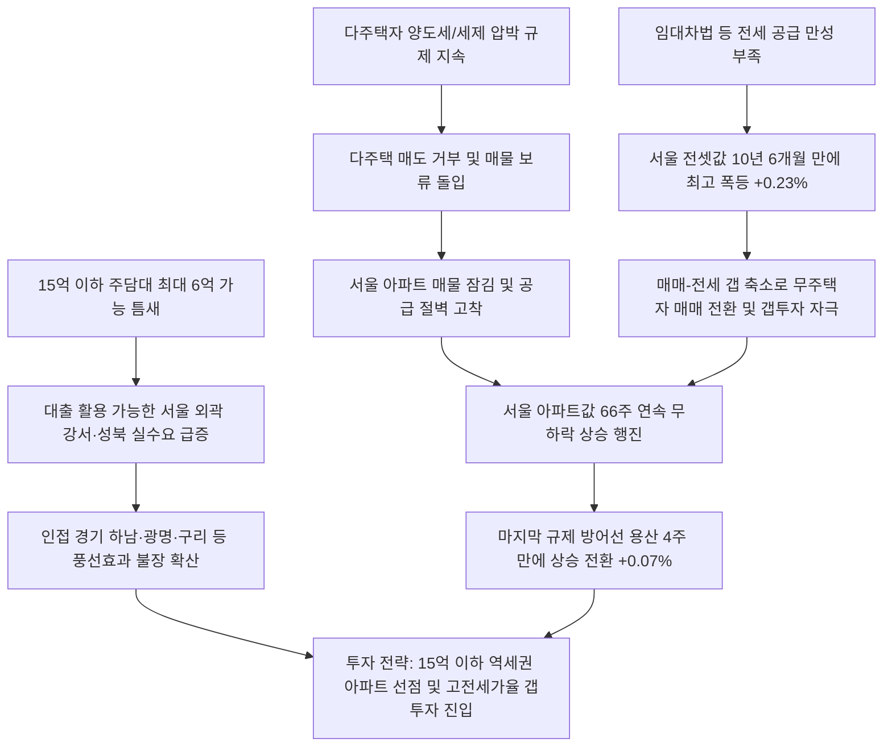

# 부동산/정책 분석: 서울 아파트 66주 연속 상승과 용산 상승 반전 및 10년 만의 전세난 속 규제 효력 한계 분석
## 투자 신호 + 사회적 영향 평가

---

## 📌 기사 기본 정보

- **날짜**: 2026-05-07
- **출처**: 글로벌 부동산 시장 종합 (중앙일보 김준영 기자)
- **카테고리**: 경제 > 부동산 > 정책/시장
- **핵심 주제**: 정부의 다주택자 세제 압박 규제 효력이 완전히 소진되면서 용산구가 4주 만에 상승 반전하고, 서울 25개 구 중 오직 강남구만 제외하고 전역이 강세로 돌아서며 66주 연속 상승 행진을 지속하는 현상, 그리고 15억 이하 중저가 아파트의 레버리지 매수 급증 및 10년 6개월 만의 역대급 전세 폭등세 분석

**메타데이터**
- 주요 사건: 서울 아파트값 66주 연속 무하락 랠리 지속(이번 주 0.14~0.15% 상승), 용산구 상승 전환(+0.07%), 서울 전셋값 10년 6개월 만의 최고 상승률(0.23%) 기록, 정부 다주택자 매물 유도를 위해 토지거래허가 주말(토요일) 신청 긴급 수용 방침 발표
- 핵심 원인: 다주택자 규제 억누름 정책의 피로감 및 효력 소진, 15억 원 이하 아파트에 집중되는 최대 6억 원 대출 규제 틈새 활용 실수요, 전세 시장의 만성 공급 부족에 따른 매매가 하방 지지 및 갭투자 자극
- 주요 주체: 서울 및 수도권 아파트 매수 대기 실수요자, 다주택자 매도 보류층, 국토교통부 및 한국부동산원
- 키워드: #서울아파트 #66주연속상승 #용산상승전환 #전세난 #대출6억 #토지거래허가 #매물잠김 #갭투자 #부동산정책

---

## 🔍 기사를 통한 투자 신호 추출

### 1단계: 핵심 사건 분해

**What (무엇이 일어났는가?)**
- 서울 부동산 시장에서 다주택자 세제 규제 압박으로 잠시 주춤했던 용산구가 4주 만에 상승 반전(+0.07%)에 성공하며 규제 효력 무력화를 증명했습니다. 서울에서 유일하게 하락세를 유지하던 강남구(-0.04%)마저 고립 위기에 놓인 채, 대출 레버리지가 용이한 15억 이하 서울 외곽(강서·성북)과 인접 경기도(하남·광명)가 상승세를 주도하는 '불길 전이 패턴'이 뚜렷해졌습니다. 또한, 서울 전셋값이 10년 6개월 만에 가장 가파른 속도로 폭등했습니다.

**When (언제 일어났는가?)**
- 2026-05-07 (정부의 다주택자 세제 압박 마지막 유예 기한을 앞두고 다주택자들이 매도를 거부하고 시장 잠김 현상이 확고해진 시점)

**Why (왜 일어났는가?)**
- 공급 부족이 해결되지 않은 상태에서 규제책으로 억누른 수요가 매물 잠김 현상과 부딪혀 더 강하게 위로 튕겨 올랐기 때문입니다.
- 대출 규제선인 15억 이하 구간 아파트(최대 6억 주택담보대출 가능)에 실수요 매수세가 집중되고, 전세 공급난이 임계점에 달하며 높은 전세가율이 매매가를 밀어 올렸기 때문입니다.

**Who (누가 주도하는가?)**
- 정부의 압박에도 버티기에 돌입한 다주택 매도 거부층
- 대출 6억 한도를 최대로 활용하여 중저가 상급지 진입을 시도하는 2030·40 실수요자 세대
- 주말에도 토지거래허가 신청을 받는 무리한 고육책을 내놓은 부동산 규제 당국

---

### 2단계: 투자 신호 해석

### A. **긍정적 신호 (Bullish)**

**① 서울 외곽 15억 이하 랜드마크 아파트 및 인접 경기 핵심 주거지 매매가 강세 지속**
- **신호**: 서울 외곽(강서 0.30%, 성북 0.27%) 폭등 및 하남(0.33%), 광명(0.31%) 동반 랠리
- **의미**: 15억 한도 내에서 주택담보대출 6억 원을 최대로 지렛대 삼을 수 있는 서울 외곽 준신축 단지와, 서울 진입 장벽에 막혀 차선책으로 하남·광명 등 교통망이 우수한 경기 1급지를 선택하는 '풍선효과' 실수요층이 두텁게 유지되어 하방 경직성이 보장됨
- **투자 기회**: 서울 강서·성북 역세권 대단지 준신축, 하남 미사·광명 뉴타운 등 경기 핵심 주거지 분양권

**② 전세가율 급등 지역의 소액 갭투자 및 서울 핵심지 재개발/재건축 지분 가치 상승**
- **신호**: 서울 전셋값 10년 6개월 만의 최고 상승률(0.23%) 기록 및 용산 상승 전환
- **의미**: 전셋값 폭등은 매매가와의 갭(Gap)을 좁혀 무주택자의 매매 전환을 유도하고 외지인 갭투자의 임계점을 자극함. 아울러 마지막 입지 랜드마크인 용산이 재상승세로 꺾이면서 규제 구역 내 재개발 정비사업 지분의 희소성이 더욱 높아짐
- **투자 기회**: 서울 전세가율 70% 근접 지역의 소형 아파트 매입, 용산 및 한강변 재개발 구역 내 빌라·상가 입주권

---

### B. **위험 신호 (Bearish)**

**① 정부의 주말 접수 강행 기한 종료 이후 닥칠 매물 잠김 심화와 거래 절벽**
- **신호**: 토지거래허가 주말 긴급 접수 등 다주택자 매도 압박 고육책 가동
- **의미**: 정부가 양도세 중과 혜택 만료 전 다주택자 매물을 유도하기 위해 토요일 접수까지 감행했으나, 이 최종 기한이 지나면 버티기에 성공한 다주택자들이 매물을 완전히 거둬들여 '심각한 공급 소멸(매물 잠김)' 상태에 빠짐. 매물이 소멸하면서 거래량이 급감하고 호가만 상승하는 비정상적 과열 국면으로 진입함
- **투자 리스크**: 거래량이 지나치게 메마른 외곽 단지의 고점 매수

**② 하반기 금리 재인상 가능성 고조에 따른 고레버리지 영끌족의 연체 위험**
- **신호**: 수입 인플레 및 한은의 추가 금리 인상 깜빡이 작동
- **의미**: 현재 15억 이하 아파트 매수세는 대출 6억 원을 한도 끝까지 땡겨 받은 이른바 영끌 성격이 강합니다. 하반기 글로벌 긴축 장기화로 한은이 기준금리를 추가 인상할 경우, 주담대 변동금리가 폭등하며 차주들의 실질 가처분 소득이 급감하고 연체율 리스크가 불거질 수 있음
- **투자 리스크**: 대출 비중이 극단적으로 높은 영끌용 외곽 구축 아파트

---

### 3단계: 섹터별 투자 기회 매트릭스

#### ✅ **높은 기대도 + 낮은 리스크**

**교통망 호재가 확실하고 서울 접근성이 뛰어난 경기 준상급지 및 서울 전세가율 높은 신축 대단지**
- 전세 공급난이 역대급으로 심각해지는 상황에서 매매로 전환하기 가장 매력적인 가격대는 대출 활용도가 높은 15억 이하 구간입니다. 이 구간에 위치하며 전세 수요가 든든하게 받쳐주는 신축 대단지와 갭이 극도로 좁아진 준상급지 자산은 고금리 폭풍 속에서도 가치가 안전하게 수호됩니다.
- **투자 추천도**: ⭐⭐⭐⭐

---

## 💰 구체적 투자 신호 변환

### 신호 1: 규제 우회 '대출 가용 15억 이하 서울 외곽·경기 준상급지' 및 '고전세가율 갭투자'로 자본의 안전 안착

**투자 해석**: 기사는 정부의 인위적 다주택 규제가 완전히 항복을 선언했음을 알립니다. 용산이 4주 만에 상승 전환하며 서울 아파트 66주 연속 상승을 이끄는 것은 서울 자산의 절대적 공급 부족을 뜻합니다. 특히 전셋값이 10년 6개월 만에 최고치로 폭등한 것은 '미친 전세난'이 매매가를 아래에서 강하게 밀어 올리는 2015년 대세 갭투자 장세의 재림입니다. 투자자는 어설픈 정부 규제 완화 기대를 멈추고 구조적 수혜 자산에 진입해야 합니다. 강남 토지거래허가 등 묶여 있는 고가 자산에 자금을 묶어두는 대신, 대출 6억 원 혜택이 온전히 작동하는 서울 강서·성북의 15억 이하 역세권 아파트나 이 불길이 가장 뜨겁게 옮겨붙는 경기 하남·광명의 준신축 단지를 적극 선점해야 합니다. 또한 전셋값 폭등을 지렛대 삼아 전세가율 70%가 넘는 핵심 철도 노선 인근 소형 아파트의 갭을 선점하여, 하반기 다주택 기한 만료 후 올 '매물 잠김 폭풍' 속에서 자산 상승 마진을 독식해야 합니다.

---

## 🌍 사회적 영향 평가

### A. 긍정적 사회 영향
- **수도권 철도망 거점 중심의 콤팩트 도시화 촉진**: 서울 진입 문턱을 넘지 못한 실수요자들이 교통이 편리한 경기 하남, 광명, 구리 등으로 분산 이동하면서 수도권 광역 교통 거점 도시들의 인프라 개발 및 지역 균형 발전 가속화
- **정비사업 규제 합리화 촉구에 따른 주택 공급 패러다임 전환**: 인위적 세제 압박의 한계가 명확해짐에 따라, 시장 활성화를 위해 도심 재건축·재개발의 층수 제한 완화 및 용적률 상향 등 실질적 공급 중심 부동산 정책 수립 유도

### B. 부정적 사회 영향
- **10년 만의 역대급 전세난으로 서민 무주택 세대의 주거 불안 심화**: 전세 물량 고갈로 임대료가 수직 상승하면서 서민 월세 전환 비율이 급증하고, 전세금을 돌려받지 못하는 전세 사기 및 역전세 관련 청년층 금융 고통 가중
- **자산 진입 장벽 상향으로 사회 초년생의 부의 사다리 단절**: 15억 이하 중저가 아파트마저 66주 연속 상승하며 가격대가 오르면서 2030 세대의 '내 집 마련' 자립 기회가 완전히 박멸되고 자산 불평등으로 인한 사회적 갈등 최고조

---

## 🎯 결론: 당신의 투자 전략 수립

- **즉시 실행**: 전세가율 상승세가 두드러지는 서대문·성북·마포 일대 대단지 아파트의 매매-전세 갭 축소 폭 점검 및 15억 초과 무대출 고가 주택의 무리한 고금리 신규 대출 매수 자제
- **3개월 후**: 정부의 하반기 세제개편안 최종 확정안(양도세·종부세 개편 방향)을 모니터링하여, 추가 매물 잠김 심화 여부에 맞춰 매도 보류 및 주거 포트폴리오 장기 보유 포지션 최종 확정

---

## 📝 Obsidian 연결 구조

