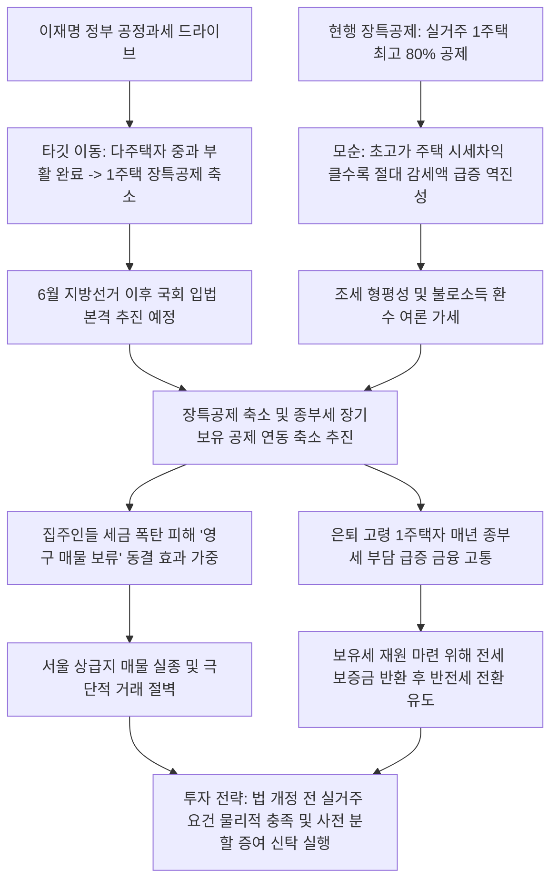

# 부동산/세제 분석: 1주택자 장기보유특별공제 축소 추진과 종부세 연쇄 파급 및 세제 개편 동결 효과 분석
## 투자 신호 + 사회적 영향 평가

---

## 📌 기사 기본 정보

- **날짜**: 2026-05-07
- **출처**: 글로벌 부동산 세제·재정 정책 종합 (안장원 부동산선임기자 칼럼)
- **카테고리**: 경제 > 부동산 > 세제/정책
- **핵심 주제**: 이재명 정부가 다주택자 양도세 중과 부활에 이어 1주택자 대상 최고 80%에 달하는 장기보유특별공제(장특공제) 축소를 다음 표적으로 설정하고, 이 개편이 종합부동산세(종부세) 장기보유 공제(최고 50%) 축소로 연쇄 파급되면서 고가 1주택 은퇴 고령자 세 부담 가중 및 시장의 매물 동결 효과를 자극하는 세제 리스크 분석

**메타데이터**
- 주요 사건: 이재명 정부의 1주택자 장특공제 축소 추진 방침 부상, 종합부동산세(종부세)의 15년 이상 장기보유 공제제도(최고 50%) 연동 개편 가능성 제기, 6월 지방선거 이후 국회 입법을 통한 본격적인 양도세법 개정 드라이브 예고
- 핵심 원인: 고가 주택 시세차익이 클수록 절대적 감세 혜택이 폭발적으로 커지는 장특공제의 역진성 모순(불로소득 과세 형평성 논란), 오래 보유할수록 세제 혜택 때문에 매도를 거부하게 만드는 시장의 '동결 효과(Lock-in Effect)' 고착화
- 주요 주체: 이재명 대통령 및 정책 참모진, 고가 1주택 장기 보유 은퇴자층, 기획재정부 및 국회 기획재정위원회
- 키워드: #장기보유특별공제 #양도소득세 #종합부동산세 #세제개편 #동결효과 #1주택자과세 #조세형평성 #부동산세제 #6월지방선거

---

## 🔍 기사를 통한 투자 신호 추출

### 1단계: 핵심 사건 분해

**What (무엇이 일어났는가?)**
- 정부가 1주택자에게 적용되던 최대 80% 세금 깎아주기 카드인 '장기보유특별공제(장특공제)'의 전면 축소를 공식화했습니다. 이는 15년 이상 보유 시 최고 50% 세액을 공제해주던 종합부동산세(종부세)의 장기보유 공제까지 연쇄 손질할 시나리오로 연결되어, 강남·마포 등 고가 1주택 소유자들의 양도세와 보유세 부담이 수억 원대로 급증할 수 있는 전례 없는 세제 변곡점이 형성되었습니다.

**When (언제 일어났는가?)**
- 2026-05-07 (다주택자 양도세 중과 부활이 완료되고, 6월 지방선거 이후 여야의 실질적 조세 법안 입법 전쟁을 한 달 앞둔 긴장 시점)

**Why (왜 일어났는가?)**
- 시세차익이 10억 원 이상인 고가 주택의 경우, 동일한 80% 공제율을 받아도 저가 주택 대비 절대 세금 감면액이 기하급수적으로 커져 "자산 불평등 완화"라는 정부 정책 기조와 정면배치되기 때문입니다.
- 장특공제를 유지하기 위해 소유주들이 고가 주택의 매도를 거부하고 버티는 '동결 효과' 탓에 도심 내 매물 유통량이 급감하여 아파트값 상승 압력을 가중시킨다는 진단이 나왔기 때문입니다.

**Who (누가 주도하는가?)**
- 형평 과세와 자산 불로소득 환수를 위해 장특공제 축소 입법 드라이브를 거는 이재명 정부 및 원내 다수당 세력
- 세제 혜택 박탈 시 매물을 묶고 증여나 상속 우회로를 모색하는 강남·여의도·목동의 고자산 1주택 보유층

---

### 2단계: 투자 신호 해석

### A. **긍정적 신호 (Bullish)**

**① 법 개정(6월 이후) 전 비거주 1주택자들의 한시적 급매물 출회와 이를 인수할 현금 자산가**
- **신호**: 지방선거 이후 법 개정을 통한 장특공제 한도 축소 및 비거주 공제율 급하향 추진
- **의미**: 거주 기간이 짧거나 비거주 중인 일시적 2주택자 혹은 고가 1주택 보유자들이 세제 혜택이 살아있는 법 개정 완료 전 한시적 절세 매물을 내놓을 수밖에 없음. 이는 현금 유동성이 풍부한 매수 대기자들에게 강남·마포 등 상급지 진입을 위한 단기적인 급매 가격 매수 기회를 제공함
- **투자 기회**: 서울 주요 정비구역 내 급매 매물 입도선매, 양도세 비과세 기한이 임박한 준신축 분양권

**② 세제 강화에 대응한 사전 증여 수요 급증으로 인한 부동산 자산 컨설팅 및 신탁 수혜**
- **신호**: 장특공제 및 종부세 공제 연쇄 축소 우려 고조
- **의미**: 매도할 때 양도세 폭탄을 맞고 매년 낼 종부세 부담도 커지게 된 자산가들이 매도 대신 자녀 세대로의 '사전 증여'로 급선회함. 이에 따라 증여세 재원 마련용 배당 자본 확보와 신탁 상품, 관련 금융 자산 관리(WM) 섹터의 비즈니스 매출이 수직 상승함
- **투자 기회**: 고액 자산가 관리(WM) 강점이 있는 대형 금융 그룹주, 상속·증여 관련 세무 컨설팅 전문 서비스

---

### B. **위험 신호 (Bearish)**

**① 1주택 세제 방어막 붕괴에 따른 강남·마포 등 고가 아파트의 극심한 '매물 동결'과 거래량 멸절**
- **신호**: 양도세 장특공제 상한 한도 설정 및 거주 요건 초강력 강제
- **의미**: 실거주 요건을 충족하지 못했거나 법 개정 이후 세 부담이 크게 늘어난 집주인들이 "팔면 세금으로 다 뺏기니 차라리 평생 쥐고 간다"며 아예 매물을 영구 잠금 조치함. 공급이 완전히 말라붙으면서 거래량이 역대 최저 수준으로 급감하고, 호가만 극단적으로 벌어지는 기형적 지수 시장으로 변화함
- **투자 리스크**: 거래량이 말라붙어 기술적 매매 체결이 어려운 서울 상급지 대형 아파트

**② 은퇴 고령 1주택자의 가용 현금흐름 악화와 종부세발 급전 월세 전환 리스크**
- **신호**: 종합부동산세(종부세) 장기보유 공제(최고 50%) 연동 축소 검토
- **의미**: 평생 집 한 채 쥐고 특별한 소득 없이 연금으로 생활하는 고령 은퇴자들의 매년 보유세(종부세) 실질 납부액이 대폭 인상됨. 세금 납부 재원을 마련하기 위해 이들이 실거주 중인 자가 아파트를 보증부 월세(반전세)로 전환하여 보증금을 돌려주고 월세를 받아 세금을 내야 하는 내몰림 현상이 가속화됨
- **투자 리스크**: 고령층 소유 비중이 높은 서울 재건축 단지 내 전세 보증금 채무 변제 위험

---

### 3단계: 섹터별 투자 기회 매트릭스

#### ✅ **높은 기대도 + 낮은 리스크**

**양도세·종부세 헷징용 대체 증여 신탁 자산 및 원가 방어 능력이 검증된 배당형 리츠 자산**
- 1주택자 세제 혜택마저 형평성 논리로 축소되는 시기에는 직접적인 부동산 매매를 통한 차익 극대화 전략보다, 세법상 합법적인 증여·상속 헷징 수단을 활용하고 과세 부담을 회피할 수 있는 대체 배당형 리츠나 간접 부동산 펀드가 상대적으로 안전하며 높은 현금 배당 메리트를 보장받습니다.
- **투자 추천도**: ⭐⭐⭐⭐

---

## 💰 구체적 투자 신호 변환

### 신호 1: '법 개정(6월 지방선거 이후) 전' 포트폴리오 거주 요건 물리적 충족 및 사전 증여·상속 세무 구조 선제 재설정

**투자 해석**: 기사는 양도세 장특공제 축소가 단순한 검토를 넘어 이재명 정부의 '공정 과세' 핵심 입법 아젠다로 정착했음을 실증합니다. 특히 종부세 공제(최고 50%)까지 함께 도마 위에 오를 확률이 90% 이상인 현시점에서, 은퇴 후 평생 한 채를 쥐고만 있을 예정이던 고가 1주택자들은 발등에 불이 떨어졌습니다. 보유 혜택만 믿고 실제로 거주하지 않는 상태로 버티는 자산 배분은 향후 양도세와 보유세의 더블 세금 폭탄 아래 자산 가치를 강제로 훼손당할 수 있습니다. 투자자는 즉시 포트폴리오의 '실거주 매핑'을 단행해야 합니다. 비거주 중인 고가 1주택이 있다면 즉시 임차인을 내보내고 본인이 입주하여 '실거주 기간(최대 40% 적용선)'을 피동적으로 확보해야 하며, 이것이 불가능한 다주택이나 한계 자산은 법 개정이 통과될 6월 이전에 한시적 양도세 혜택을 받고 시장에 매도 청산하거나, 취득가액이 낮아 양도세가 과도하다면 자녀 세대에게 사전 '분할 증여' 신탁을 체결하여 조세 영토를 선제적으로 재구축하고 리스크를 완전히 헷징해야 합니다.

---

## 🌍 사회적 영향 평가

### A. 긍정적 사회 영향
- **부동산 자산 불로소득 환수를 통한 재정 세수 건전성 확보**: 초고가 주택 장기 보유자들이 그간 누려온 수억 원 규모의 양도세 비과세에 준하는 과도한 감세 혜택을 차단하여 국가의 세입 기반을 강화하고 복지 재정 확충
- **실거주 중심의 주택 보유 유도를 통한 위장 전입 및 투기적 보유 근절**: 단순 보유 장특공제 축소로 자본가들이 빈집이나 비거주 주택을 시장에 강제 임대하게 만들어 도심 내 실질적 주거 이용률 제고

### B. 부정적 사회 영향
- **극심한 매물 잠김에 따른 전세 공급 멸절 및 서민 전세난 가중**: 비거주 1주택자에 대한 양도세 혜택 박탈 우려 탓에 집주인들이 전세를 놓지 않고 본인이 강제 실거주 입주를 선언하면서, 전세 매물이 수천 가구 증발하고 임대차 시장의 가격 폭등 유발
- **고령 은퇴 가구의 금융 빈곤화 및 자산 처분 한계에 따른 주거 안정성 파괴**: 소득이 없는 고령 1주택 가구가 매년 급증하는 종부세를 내기 위해 가계 빚을 지거나 생활비를 줄여 생계형 금융 곤경에 시달리는 사회적 소외 현상 심화

---

## 🎯 결론: 당신의 투자 전략 수립

- **즉시 실행**: 본인 소유의 고가 1주택 양도세 모의 계산 시 보유 기간 대비 '실거주 기간' 누락 여부 확인 및 6월 지방선거 전 한시적 절세 매도 적기 판단
- **3개월 후**: 지방선거 후 발의되는 장특공제 축소 개정안의 '소급 적용 여부' 및 '유예 기간'을 정밀 모니터링하여 증여 등 자산 양도 최종 기한 설계

---

## 📝 Obsidian 연결 구조

