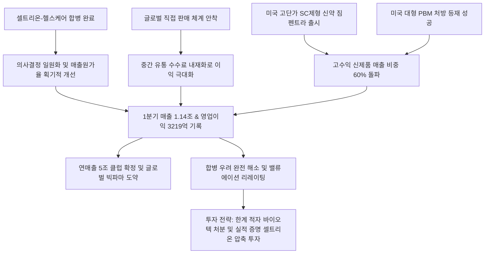

# 제약/바이오 분석: 셀트리온 분기 매출 최초 1조 돌파와 짐펜트라 신성장 동력 및 합병 직판 시너지 효과 분석
## 투자 신호 + 사회적 영향 평가

---

## 📌 기사 기본 정보

- **날짜**: 2026-05-07
- **출처**: 셀트리온 공시 및 증권사 리포트 종합 (정기종 기자)
- **카테고리**: 경제 > 산업 > 바이오
- **핵심 주제**: 셀트리온이 올해 1분기 사상 처음으로 분기 매출 1조 원의 벽을 돌파(매출 1조 1,450억 원, 영업이익 3,219억 원)하며, 헬스케어 합병 시너지와 해외 직접 판매(직판) 체계의 안착, 그리고 고수익 피하주사(SC) 신약 '짐펜트라'의 폭발적 성장을 바탕으로 글로벌 빅파마로 도약하는 펀더멘털 분석

**메타데이터**
- 주요 사건: 셀트리온 1분기 어닝 서프라이즈 달성(매출 1조 1,450억 원, yoy +35.7% / 영업이익 3,219억 원, yoy +115.5%), 고부가가치 피하주사(SC) 제형 자가면역질환 치료제 '짐펜트라'의 고성장 지속, 합병 법인의 매출원가율 개선 가시화
- 핵심 원인: 셀트리온과 셀트리온헬스케어의 통합 일원화에 따른 이중마진 제거 및 유통 효율화, 중간 도매상을 생략한 글로벌 직접 판매 체계 안착에 따른 고마진 확보, 처방 권장 우호 정책(미국·유럽) 수혜
- 주요 주체: 셀트리온 경영진(서정진 회장), 글로벌 처방 기관 및 보험사, 바이오 투자 주체들
- 키워드: #셀트리온 #바이오시밀러 #해외직판 #합병시너지 #1조클럽 #짐펜트라 #수익성개선 #글로벌빅파마 #어닝서프라이즈

---

## 🔍 기사를 통한 투자 신호 추출

### 1단계: 핵심 사건 분해

**What (무엇이 일어났는가?)**
- 국내 1위 바이오 대장주 셀트리온이 1분기 사상 최초로 '분기 매출 1조 원' 돌파라는 메가톤급 이정표를 달성했습니다. 매출 1조 1,450억 원, 영업이익 3,219억 원으로 전년 동기 대비 각각 35.7%, 115.5% 수직 상승했습니다. 합병 초기 제기되었던 원가율 상승 및 마케팅 비용 증가 우려를 완전히 불식시키며, 직판망 안착과 미국 시장용 고부가가치 신약인 '짐펜트라'의 선전이 이끈 양적·질적 동반 폭발입니다.

**When (언제 일어났는가?)**
- 2026-05-07 (합병 법인 출범 후 1년여가 지난 시점에 일회성 상각 비용이 완전 소진되고 본격적인 마진 개선 데이터가 증명된 시점)

**Why (왜 일어났는가?)**
- 개발(셀트리온)과 판매(헬스케어)로 쪼개져 있던 지배 구조를 하나로 합침으로써 매출원가율을 획기적으로 낮추었고, 해외 현지 병원·보험사를 상대로 한 '글로벌 직판 시스템'이 예상보다 빠르게 안착하여 유통 수수료를 고스란히 이익으로 전환했기 때문입니다.
- 단순 오리지널 복제약(시밀러)을 넘어, 피하주사 방식으로 특허 장벽을 세운 고단가 SC 제형 신약 '짐펜트라' 등 마진율이 70%가 넘는 핵심 신규 제품군의 매출 비중이 전체의 60%까지 확대되었기 때문입니다.

**Who (누가 주도하는가?)**
- 해외 직판 영업망을 직접 개척하며 유통 패권을 쟁취한 셀트리온 경영진 및 현지 마케팅 사업단
- 미국 처방약급여관리업체(PBM) 등 주류 보험 급여 등재를 통해 짐펜트라 판매를 승인한 글로벌 의료 바이어들

---

### 2단계: 투자 신호 해석

### A. **긍정적 신호 (Bullish)**

**① 이중 마진 소멸 및 직판 효과 장기화에 따른 연간 5조 매출 및 30%대 영업이익률 안착**
- **신호**: 1분기 영업이익률 28.1% 달성 및 고수익 신제품 비중 60% 상회
- **의미**: 합병 초기 발생한 재고자산 공정가치 평가액 상각이 완료되면서 생산 원가가 드라마틱하게 낮아짐. 직판을 통해 중간 마진을 고스란히 독식하므로 하반기로 갈수록 이익 체력이 강화되어 올해 연매출 5조 원, 영업이익률 30%대 돌파가 사실상 보장됨
- **투자 기회**: 셀트리온 보통주, 바이오 헬스케어 섹터 대장주 및 ETF

**② 고마진 자가면역치료 SC 제형 신약 '짐펜트라'의 미국 침투율 급성장**
- **신호**: 미국 내 바이오시밀러 및 SC 처방 유도 우호 정책 가속화
- **의미**: 미국 의료비 절감 기조와 맞물려 편의성이 극대화된 피하주사(SC) 제형인 '짐펜트라'의 대형 PBM 등재가 완료됨에 따라 고단가 시장 처방량이 수직 상승하며 장기 성장의 핵심 캐시카우로 자리 잡음
- **투자 기회**: 셀트리온 핵심 의약품 원료 및 소부장 국산화 파트너사

---

### B. **위험 신호 (Bearish)**

**① 오리지널 특허 만료에 따른 글로벌 바이오시밀러 가격 인하 경쟁 심화**
- **신호**: 글로벌 빅파마들의 바이오시밀러 대거 출시 및 수주 경쟁 격화
- **의미**: 램시마, 트룩시마 등 1세대 바이오시밀러의 글로벌 보급률이 정점에 달한 상황에서 인도·중국 등 후발 제약사들의 단가 후려치기 공세가 지속되어 기존 성숙 제품군군의 단기 약가 인하 압박이 가중됨
- **투자 리스크**: 파이프라인 다변화가 늦고 단일 1세대 시밀러 의존도가 높은 한계 바이오사

**② 직판 영업망 유지를 위한 해외 현지 마케팅 비용 및 고정비 상승 위험**
- **신호**: 중간 유통사를 생략한 현지 법인 중심의 독자 마케팅 전개
- **의미**: 직판은 고마진을 주지만, 미국·유럽 등 거대 시장에서 직접 의사·약사·보험사를 상대로 세일즈를 유지해야 하므로 대규모 현지 인건비 및 마케팅 고정비가 상시 발생하여 신제품 판매 부진 시 고정비 절벽으로 작용할 수 있음
- **투자 리스크**: 판관비 통제 능력이 떨어지는 중소형 해외 수출 바이오벤처

---

### 3단계: 섹터별 투자 기회 매트릭스

#### ✅ **높은 기대도 + 낮은 리스크**

**해외 유통망(직판)을 장악하고 신약(짐펜트라) 믹스 개선이 완료된 거대 바이오 챔피언**
- 바이오 섹터 내에서도 K자형 양극화가 극도로 심화되고 있습니다. 현금 창출 능력이 없어 유상증자로 연명하는 바이오벤처와 달리, 조 단위 현금을 자체 조달하여 R&D와 직판망에 재투자하는 셀트리온은 긴축 고금리 국면에서도 독점적 가치와 강력한 실적 방어벽을 보장받습니다.
- **투자 추천도**: ⭐⭐⭐⭐⭐

---

## 💰 구체적 투자 신호 변환

### 신호 1: 단순 바이오 테마벤처 청산 및 '실적 입증' 셀트리온 및 독점 파이프라인 바이오 대장주로 자본 압축

**투자 해석**: 기사는 셀트리온이 단순히 기대감만으로 움직이는 바이오 기업이 아니라, 실제로 '1조 원의 분기 매출과 3천억 원이 넘는 영업이익'을 찍어내는 거대 캐시카우 기업으로 체질 개선을 완수했음을 증명합니다. 신약 개발 성공 확률에만 베팅하며 매년 적자를 기록하는 한계 바이오벤처에 자금을 분산하는 포트폴리오는 고금리 장기화 국면에서 자산을 파멸로 몰고 갈 수 있습니다. 투자자는 즉시 포트폴리오를 재편해야 합니다. 실적이 없는 바이오 잡주들을 전량 매도하고, 합병 시너지와 짐펜트라의 미국 직판 안착으로 펀더멘털 혁신을 달성한 [[셀트리온]]으로 바이오 포트폴리오를 100% 단일화하여 장기 복리의 결실을 안전하게 획득해야 합니다.

---

## 🌍 사회적 영향 평가

### A. 긍정적 사회 영향
- **국내 첨단 바이오 원천 소재·부품·장비(소부장) 자립화 견인**: 셀트리온의 연 5조 매출 스케일 확장이 국내 후방 바이오 원료 및 장비 협력업체들로 대규모 낙수 효과를 흘려보내며 국가 바이오 주권 확립에 기여
- **글로벌 의료비 경감 및 난치성 질환 환자 주거 편의성 제고**: 오리지널 대비 저렴하고 효과적인 바이오시밀러 및 집에서 자가 주사 가능한 SC 제형(짐펜트라)의 보급 확대로 전 세계 환자들의 경제적 부담 경감 및 삶의 질 개선

### B. 부정적 사회 영향
- **바이오 자본의 초대형 독식에 따른 벤처 생태계 고사**: 정책 자금과 민간 투자가 셀트리온 등 소수의 이익 입증 대형사로만 쏠리는 극단적 바이오 K자형 양극화가 발생하여 신진 혁신 바이오 벤처들의 R&D 자금줄 동결 야기
- **미·중 바이오 패권 분쟁 격화 시 외교적 리스크 노출**: 미국 생물보안법 등 미·중 갈등에 따라 한국 바이오 기업들이 글로벌 CMO(위탁생산) 수주 쟁탈전 최전선에 서게 되며 지정학적 공급망 보복 리스크에 상시 노출

---

## 🎯 결론: 당신의 투자 전략 수립

- **즉시 실행**: 연구개발(R&D) 지출만 과도하고 영업현금흐름이 상시 적자인 코스닥 바이오 잡주 전량 매도 후 셀트리온 지분 편입
- **3개월 후**: 짐펜트라의 미국 PBM 처방 통계 및 하반기 출시 예정인 차세대 시밀러(스텔라라, 아일리아 시밀러)의 허가 데이터를 검증하여 바이오 비중 최종 확대 조율

---

## 📝 Obsidian 연결 구조

