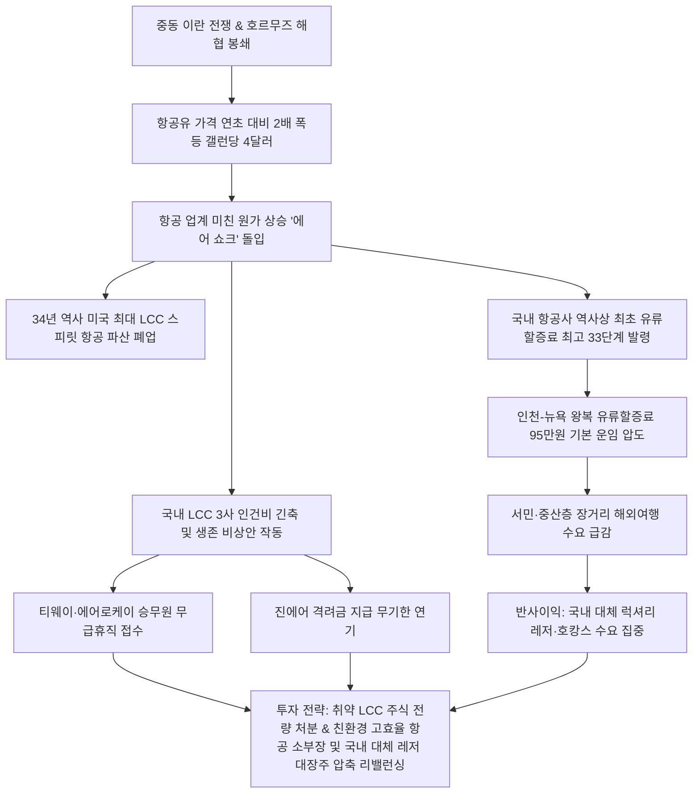

# 항공/산업 분석: 항공유 2배 폭등에 따른 스피릿 항공 파산 폐업 및 국내 LCC 무급휴직 돌입 에어 쇼크 분석
## 투자 신호 + 사회적 영향 평가

---

## 📌 기사 기본 정보

- **날짜**: 2026-05-07
- **출처**: 글로벌 항공 산업 및 외신 종합 (한국경제신문 김기환·이우림 기자)
- **카테고리**: 경제 > 산업 > 항공/유통
- **핵심 주제**: 이란 지정학 전쟁 및 호르무즈 해협 봉쇄 장기화에 따른 항공유 2배 폭등(갤런당 4달러)으로 34년 전통의 미국 최대 LCC 스피릿 항공이 최종 폐업하고, 국내 LCC들도 무급휴직과 안전 격려금 보류 등 긴급 생존 자구책에 돌입하며 비즈니스 모델 붕괴 위기에 직면한 '에어 쇼크(Air Shock)' 현상 분석

**메타데이터**
- 주요 사건: 미국 LCC의 상징 스피릿 항공 최종 영업 종료(5월 2일 폐업), 국내 항공사 2016년 산정 체계 도입 이래 역사상 최초로 유류할증료 최고 단계인 33단계 전격 적용, 티웨이항공 및 에어로케이 객실 승무원 대상 무급휴직 접수, 진에어 직원 격려금 무기한 지급 연기
- 핵심 원인: 이란 전쟁으로 인한 항공유 가격 연초 대비 2배 폭등(1.9달러 → 4달러), 초고가 유류할증료 부과에 따른 해외여행 심리 급감 및 박리다매 중심 LCC 비즈니스 모델 원가 파괴
- 주요 주체: 스피릿 항공(Spirit Airlines), 국내 LCC 3사(티웨이항공, 진에어, 에어로케이), 국적 FSC(대한항공), 글로벌 항공 운송 업계
- 키워드: #에어쇼크 #항공유폭등 #유류할증료 #LCC위기 #스피릿항공파산 #티웨이항공 #무급휴직 #격려금보류 #FSC차별화

---

## 🔍 기사를 통한 투자 신호 추출

### 1단계: 핵심 사건 분해

**What (무엇이 일어났는가?)**
- 글로벌 지정학 에너지 쇼크가 항공 산업을 가장 먼저 직격하는 '에어 쇼크(Air Shock)'가 현실화되었습니다. 항공유 가격이 연초 대비 2배 폭등하며 미국 대표 LCC 스피릿 항공이 34년 만에 최종 폐업했습니다. 국내 항공사들 역시 역사상 최초로 유류할증료 최고 단계인 33단계를 발령하여 기본 운임보다 유류할증료가 훨씬 더 비싼 '배보다 배꼽이 더 큰' 상황이 되었고, 국내 LCC 삼사 역시 승무원 무급휴직과 인건비 동결 등 패닉 상태의 구조조정에 돌입했습니다.

**When (언제 일어났는가?)**
- 2026-05-07 (중동 전쟁발 유가 폭등세가 항공 운송 및 유통 원가 구조를 완전히 한계점까지 밀어붙여, 대형 LCC의 실질적 파산 사례가 최초로 공식화된 시점)

**Why (왜 일어났는가?)**
- 전체 운영 비용의 30%에 달하는 제트유(항공유) 비용이 단기 2배 폭등하면서, 저가 운임을 기반으로 부대 수수료를 뜯어내던 LCC들의 박리다매 비즈니스 구조가 물리적 한계에 부딪혀 적자 스프레드를 감당할 수 없었기 때문입니다.
- 유류할증료 폭등으로 인해 LCC의 매력(초저가)이 완전히 소멸되어 소비자 가격이 대형 항공사(FSC)와 무차별해졌고, 고물가 압박에 시달리는 서민층의 장거리 여행 예약률이 급감했기 때문입니다.

**Who (누가 주도하는가?)**
- 고유가 압박을 견디지 못하고 영업 종료를 선언한 글로벌 LCC 및 생존을 위해 인건비 긴축 카드를 꺼내 든 국내 LCC 3사
- 연료 효율을 위해 대형기 운항을 대거 취소하고 노선을 축소 통합하고 있는 글로벌 메이저 대형 항공사(FSC)

---

### 2단계: 투자 신호 해석

### A. **긍정적 신호 (Bullish)**

**① 연료 효율 극대화 항공기(보잉 787 등) 공급망 장악 글로벌 항공 제조업체 및 고효율 엔진 소부장**
- **신호**: 글로벌 항공사들의 대형기(A350) 감축 및 고효율 중소형기(B787) 대체 투입
- **의미**: 에어쇼크 상황에서 살아남기 위해 항공사들은 기존 노선에서 연료 소모량을 15% 이상 감축할 수 있는 차세대 고효율 친환경 엔진 및 중소형 항공기 교체 발주를 서두를 수밖에 없음. 이에 따라 고효율 여객기 제조 독점 밸류체인과 엔진 핵심 부품 국산화 정밀 제조 기업들은 구조적 수혜를 입음
- **투자 기회**: 글로벌 친환경 경량 여객기 제조업체 및 초정밀 항공 부품 생산 국산화 주도주

**② 해외여행 위축에 따른 대체 국내 휴양지 및 국내 호캉스/유통 인프라 대장주**
- **신호**: 유류할증료 33단계 폭등(왕복 95만 원 돌파)으로 인한 해외 장거리 여행 기피 심화
- **의미**: 장거리 해외여행 비용이 천정부지로 솟구치면서 휴가철 수요가 국내 5성급 럭셔리 호텔, 청정 관광지(제주, 강원), 또는 비행기를 안 타는 호캉스 소비로 급격히 회귀함. 고환율과 고유가를 피해 국내 유통/엔터테인먼트 복합 단지를 소비하는 내수 집중 리조트 기업들의 2~3분기 매출 반사이익이 기대됨
- **투자 기회**: 국내 1급지 복합 카지노·리조트 지배기업, 내수 프리미엄 호스피탈리티 대장주

---

### B. **위험 신호 (Bearish)**

**① 이자 부담 및 항공유 적자 누적으로 부채 비율 폭증한 재무 한계 국내 LCC**
- **신호**: 티웨이항공·에어로케이 승무원 무급휴직 돌입 및 진에어 격려금 연기
- **의미**: 이미 팬데믹 기간 축적된 부채 차환 압박에 시달리던 국내 LCC들이 무급휴직을 신청할 만큼 기초 체력이 고갈되었음을 뜻함. 항공유 폭등세가 하반기까지 지속될 경우 영업 적자 스프레드가 자본 잠식으로 이어져 유상증자 선언 및 연쇄 부도설이 가시화될 위험이 큼
- **투자 리스크**: 부채 비율이 300%를 상회하고 보유 기종의 연료 효율성이 떨어지는 중소형 LCC 및 항공 상장주

**② 유류할증료 폭등에 따른 해외 아웃바운드 여행 패키지 기획사 및 해외 면세점 유통 채널**
- **신호**: 유류할증료가 기본 운임(67만 원)을 압도하는 95만 원 돌파
- **의미**: 서민·중산층의 패키지 해외여행 진입 장벽이 너무 높아져 해외 아웃바운드 여행 패키지 판매량이 곤두박질치고, 해외 현지 소비와 직접 맞물리는 국내 대형 면세점 채널의 매출 성장이 동결됨
- **투자 리스크**: 패키지 아웃바운드 전문 상장 여행사, 공항 면세점 입찰 가격 전가가 불가능한 면세 유통주

---

### 3단계: 섹터별 투자 기회 매트릭스

#### ✅ **높은 기대도 + 낮은 리스크**

**해외여행 좌절 수요를 완전히 흡수하는 대체 국내 복리 럭셔리 레저 지배주 및 고효율 엔진 항공 핵심 부품 제조사**
- 에어쇼크는 단기간에 해결하기 어려운 중동의 물리적 유가 쇼크에 기인합니다. 장거리 여행이 막힌 중산층의 가용한 레저 예산이 100% 흘러 들어가는 국내 고급 호스피탈리티 지배기업과, 고유가를 극복하기 위해 항공사들이 울며 겨자 먹기로 발주하는 고효율 중소형기 부품사는 불확실성 시대의 확실한 성장주입니다.
- **투자 추천도**: ⭐⭐⭐⭐

---

## 💰 구체적 투자 신호 변환

### 신호 1: '재무 취약 LCC' 포트폴리오 전량 축소 청산 및 고효율 소부장·수혜 대체 국내 레저 자산으로 리밸런싱

**투자 해석**: 기사는 미 LCC의 대명사 스피릿 항공의 최종 파산 폐업을 통해 저가 항공사 비즈니스 모델의 종말을 선언하고 있습니다. 국내 LCC 3사 역시 무급휴직과 수당 지급 유예 카드를 꺼내 들며 최악의 유동성 위기를 자백한 상황입니다. "유가쇼크가 곧 지나가고 해외여행이 재개되겠지"라는 낙관론으로 LCC 주식을 바닥에서 줍는 행위는 다가올 대규모 연쇄 파산 및 자본 잠식 유상증자의 폭풍 속에 계좌를 강제 청산당할 수 있는 위험천만한 행동입니다. 투자자는 즉시 포트폴리오의 항공·여행 섹터를 재조정해야 합니다. 재무 구조가 취약한 국내 LCC 상장 주식 비중을 100% 매도 청산하고, 확보된 자금을 고유가 대응용 고효율 엔진 및 친환경 부품을 납품하여 든든한 백로그를 쥔 독점 소부장 대장주와, 해외여행 포기 세력의 보복 소비를 100% 흡수하여 호실적이 확정적인 국내 대체 복합 레저/카지노 지배기업([[파라다이스]], [[강원랜드]] 등)으로 이동시켜 에어쇼크의 충격을 완벽하게 헷징해야 합니다.

---

## 🌍 사회적 영향 평가

### A. 긍정적 사회 영향
- **친환경·고효율 항공 운송 기술 패러다임 강제 전환**: 에어쇼크로 인한 막대한 비용 부담 탓에 글로벌 항공사들이 노후 다연료 소비 기종을 신속하게 은퇴시키고 친환경·탄소제로 연료(SAF) 및 초고효율 여객기 도입 투자를 전면 가속화
- **내수 관광 활성화를 통한 로컬 경제 부흥**: 해외 아웃바운드 여행 폭증으로 유출되던 국내 자본이 강원, 제주 등 국내 지방 관광 거점 도시로 재유입되면서 무너져가던 지방 요식·숙박업 및 골목상권 자영업 생태계 소생

### B. 부정적 사회 영향
- **이동의 자유 양극화에 따른 중산층 이하 서민 세대의 사회적 소외 가중**: 유류할증료 폭등으로 고소득 자산가층만 자유롭게 해외를 오가는 '글로벌 이동권의 K자형 양극화'가 심화되며 중산층 가계의 상대적 박탈감 고조
- **항공사 연쇄 구조조정에 의한 대규모 고용 한파 및 조종사·승무원 생계 위기**: LCC들의 연쇄 폐업 및 장기 무급휴직 강행으로 수천 명에 달하는 항공 청년 노동자들의 생계가 흔들리고 관련 후방 지상 조업, 공항 서비스 업계의 대규모 실직 파탄 야기

---

## 🎯 결론: 당신의 투자 전략 수립

- **즉시 실행**: 부채 비율이 높고 단거리 노선 경쟁만 치열한 중소형 국내 LCC 주식 전량 매도 및 보유 중인 해외 항공권의 유류할증료 부과 세부 내역 재확인
- **3개월 후**: 여름 성수기(6~8월) 실제 탑승률 데이터 및 중동 전쟁의 호르무즈 해협 봉쇄 해제 협상 진척도를 매칭하여 대체 레저 섹터의 이익 실현 시점 조율

---

## 📝 Obsidian 연결 구조

