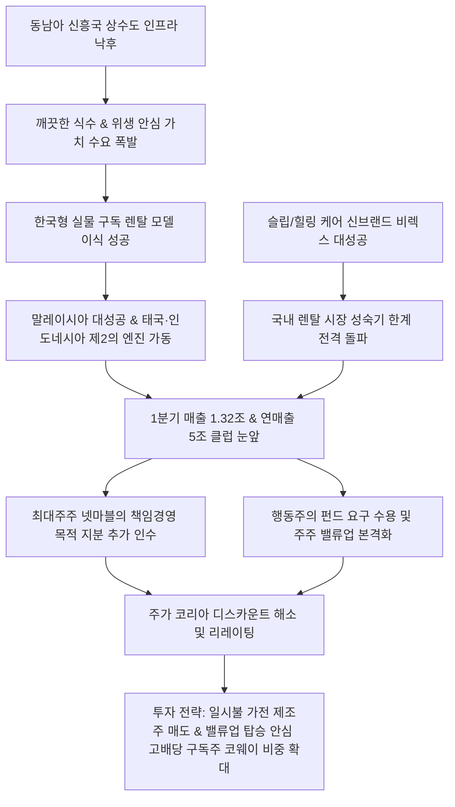

# 환경가전/렌탈 분석: 코웨이 첫 연매출 5조 돌파 전망과 동남아 위생 렌탈 패권 장악 및 주주 밸류업 시너지 분석
## 투자 신호 + 사회적 영향 평가

---

## 📌 기사 기본 정보

- **날짜**: 2026-05-07
- **출처**: 글로벌 환경 가전 및 렌탈 시장 종합 (금융정보업체 에프앤가이드 및 업계 자료 종합)
- **카테고리**: 경제 > 산업 > 가전/구독경제
- **핵심 주제**: 코웨이가 창사 최초로 '연매출 5조 원 돌파'를 목전에 두고 있으며, 물가 상승과 경기 침체 속에서도 목돈 부담이 없는 실물 구독(렌탈) 비즈니스와 말레이시아·태국 등 동남아 위생 가전 시장의 현지 서비스 이식 성공, 그리고 최대주주 넷마블의 책임 경영 및 주주가치 제고 시너지를 통한 주가 재평가(Re-rating) 분석

**메타데이터**
- 주요 사건: 코웨이 창사 이래 최초로 연매출 5조 원 클럽 진입 유력, 1분기 영업 전망 서프라이즈(매출 1조 3,293억 원, yoy +13%), 최대주주 넷마블의 책임 경영 목적 지분 매입 추진 및 주주 환원 강화 기조 가동
- 핵심 원인: 수질 환경이 열악한 동남아 중산층을 겨냥한 한국형 위생 관리 서비스(코디)의 성공적 현지화, 슬립·힐링 케어 브랜드 '비렉스(BEREX)'의 대성공으로 국내 성숙기 포화 돌파, 불황에 강한 반복형 현금흐름(구독 모델) 사업 체질
- 주요 주체: 코웨이 경영진, 최대주주 넷마블, 동남아 현지 중산층 소비자, 행동주의 펀드 및 기관 투자자
- 키워드: #코웨이 #5조클럽 #구독경제 #렌탈비즈니스 #동남아위생가전 #비렉스 #BEREX #책임경영 #주주밸류업

---

## 🔍 기사를 통한 투자 신호 추출

### 1단계: 핵심 사건 분해

**What (무엇이 일어났는가?)**
- 대한민국 대표 환경가전 기업 코웨이가 1분기 호실적(매출 1조 3,293억 원)을 기반으로 사상 첫 연매출 5조 원 고지 돌파를 예고했습니다. 고금리·고물가 하에서 일시불 가전 수요가 침체되는 동안 코웨이는 매월 소액만 납부하는 '관리 서비스 결합형 렌탈(구독)' 비즈니스로 전 지구적 불황을 정면 격파했습니다. 특히 동남아시아에서 '깨끗한 물과 안심 위생'이라는 본질적 가치를 팔아 시장 패권을 독점했고, 넷마블의 지분 확보 및 배당 확대 기대로 주주 가치의 극적인 턴어라운드를 맞았습니다.

**When (언제 일어났는가?)**
- 2026-05-07 (인플레이션 심화로 인한 소비 둔화 우려와 지배구조 개선을 통한 코리아 디스카운트 해소 움직임이 증시 전체의 대두 화두가 된 시점)

**Why (왜 일어났는가?)**
- 동남아 주요국(말레이시아, 태국, 인도네시아)의 노후한 상수도 인프라 틈새를 뚫고, 단순 판매 방식이 아닌 한국 고유의 인적 케어(코디 서비스)라는 락인(Lock-in) 시스템을 완벽히 이식하여 해약률을 극단적으로 낮추었기 때문입니다.
- 정수기에 치우쳐 있던 기존 렌탈 믹스를 매트리스, 안마의자, 홈케어 시스템을 포괄하는 고단가 전문 브랜드 '비렉스(BEREX)'로 다각화하여 신규 계정 당 객단가(ARPU)를 획기적으로 끌어올렸기 때문입니다.

**Who (누가 주도하는가?)**
- 동남아 시장 개척 및 비렉스 신제품 런칭을 총지휘한 코웨이 현지 법인 및 국내 영업망
- 책임 경영 지분 매입을 통해 지배구조를 강화하고 행동주의 펀드의 배당 확대 요구를 수용한 최대주주 넷마블

---

### 2단계: 투자 신호 해석

### A. **긍정적 신호 (Bullish)**

**① 인플레이션 불황기에 강력한 하방 경직성을 발휘하는 구독 경제 기반의 현금흐름 밸류에이션**
- **신호**: 1분기 매출 yoy 13% 증가 및 누적 렌탈 계정의 견고성
- **의미**: 경기 침체로 목돈 지출을 꺼리는 소비자들이 렌탈 서비스로 눈을 돌리며 불황 역행 성장을 지속함. 매달 들어오는 꼬박꼬박한 현금흐름(Recurring Revenue)은 거시 경제가 꺾여도 기업의 이익 훼손을 차단하는 최고의 방패막이며, 이는 고금리 시대 자본이 가장 선호하는 안전 실물 자산으로 대우받음
- **투자 기회**: 코웨이 보통주, 구독 경제 및 실물 배당 매력이 높은 가치 지배주

**② 해외 매출 비중 폭증으로 환율 변동 헤지 및 신흥국 중산층 성장의 핵심 수혜**
- **신호**: 말레이시아 안착 및 태국·인도네시아 렌탈 계정 폭발적 성장세 지속
- **의미**: 국내 시장의 성장 둔화 한계를 완전히 탈피하여 동남아 현지 위생 렌탈 패권을 완전 독점함. 달러 및 현지 통화 기준 매출 유입이 늘어나며 원화 약세 국면에서 환율 반사이익을 얻고 신흥국의 위생 인프라 성장을 대변하는 글로벌 지배주로 체질이 전격 교체됨
- **투자 기회**: 해외 신흥국 현지 법인 매출 성장을 발판 삼는 실물 유통 대장주

---

### B. **위험 신호 (Bearish)**

**① 5년 의무 사용 기한 완료에 따른 소유권 이전 계정의 단기 매출 공백 우려**
- **신호**: 성숙기에 접어든 국내 시장 내 소유권 이전 도래 계정 증가
- **의미**: 렌탈 5년 만기가 되어 기기의 소유권이 고객에게 넘어가면 매달 들어오던 렌탈료가 즉시 정지됨. 이를 상쇄할 만큼 신제품 비렉스(BEREX)나 차세대 가전으로 즉각적인 재렌탈 전환이 이루어지지 않을 경우, 국내 매출 부문에서 일시적인 둔화 공백이 발생할 수 있음
- **투자 리스크**: 신규 브랜드 마케팅 비용이 과도하게 쏠리고 계정 전환율이 낮아지는 한계 렌탈사

**② 국가별 규제 및 로컬 위생 가전 경쟁사들의 공격적 카피 공세**
- **신호**: 인도네시아 인증 이슈 및 현지 저가 정수 필터 경쟁자들의 시장 진입
- **의미**: 동남아 렌탈 시장의 폭발적인 수익성을 확인한 현지 대기업 및 글로벌 가전 공룡들이 저가형 구독 상품으로 코웨이의 영토를 침범함. 특히 인도네시아 등 현지 정부의 수입 기기 환경·할랄 인증 규제 장벽이 강화될 경우 단기 물류 및 마케팅 오버헤드가 발생함
- **투자 리스크**: 해외 현지 직영 영업망 및 독점적 브랜드력을 갖추지 못한 중소형 가전 수출사

---

### 3단계: 섹터별 투자 기회 매트릭스

#### ✅ **높은 기대도 + 낮은 리스크**

**자체적인 인적 케어 네트워크(코디)와 강력한 고정 현금흐름을 보유한 실물 구독 1등 챔피언**
- 거시 고물가 압박 속에서 일시불 고가 소비재는 무너지고 있으나, 안심 위생이라는 본질적 니즈에 안착하여 매달 안정적인 캐시를 거둬들이는 코웨이는 가장 안전하고 강력한 이익 성장주입니다. 여기에 최대주주의 책임 경영 및 배당 확대라는 밸류업 엔진까지 결합되어 밸류에이션 재평가 매력이 최고조에 달했습니다.
- **투자 추천도**: ⭐⭐⭐⭐⭐

---

## 💰 구체적 투자 신호 변환

### 신호 1: 경기 민감 '일시불 가전 제조사' 전량 매도 및 '밸류업+고배당 구독 리더' 코웨이 및 지주사 비중 확대

**투자 해석**: 기사는 고물가 침체기에 목돈이 드는 소비가 정체되는 틈을 타 코웨이가 '5조 원 규모의 글로벌 안심 구독 플랫폼'으로 완벽하게 체질 개선을 해냈음을 증명합니다. 특히 넷마블의 지분 확보 움직임과 배당 강화 기조는 저평가되어 있던 코웨이 주가의 밸류에이션 재평가를 알리는 직접적인 시그널입니다. 가처분 소득이 줄어들면 가장 먼저 지출을 끄는 백색가전 일시불 판매 대형주에 돈을 묶어두는 포트폴리오는 불황기에 마진 붕괴를 피할 수 없습니다. 투자자는 즉시 포트폴리오를 재편해야 합니다. 경기 변동에 취약한 일반 가전주를 매도하고, 동남아 위생 패권을 장악하여 고환율 및 불황 저항력을 검증받은 [[코웨이]] 지분을 적극 매수하고, 배당 유입과 지배구조 개선 수혜를 입는 지주 회사 및 대주주 포트폴리오로 재배치하여 안정적인 고배당 복리의 마법을 획득해야 합니다.

---

## 🌍 사회적 영향 평가

### A. 긍정적 사회 영향
- **신흥국 공공 위생 인프라의 민간 보조적 역할 수행**: 공공 상수도 보급과 정수 능력이 미흡한 동남아 주요국 가정에 합리적인 비용으로 깨끗한 식수와 공기 환경을 보장하여 현지 국민 보건 지표 및 위생 수준 향상에 직접 기여
- **경력 단절 여성 및 지방 일자리 창출을 통한 상생 금융 실천**: 방문 관리직(코디) 조직의 대규모 현지 채용을 통해 신흥국 및 국내 지방 경제 내 여성·고령층의 안정적 소득 기회 확대 및 장기 일자리 제공

### B. 부정적 사회 영향
- **구독 피로 및 한계 취약 계층의 장기 부채성 지출 고착**: 일시불 구매 능력이 없는 한계 서민 가계가 가전 렌탈을 과도하게 늘릴 경우 매달 고정비 이자 성격의 렌탈료가 고착되어 가계 실질 저축률 저하 및 가처분 소득 고갈 가속화
- **만기 폐기 기기 급증에 따른 글로벌 전자 폐기물 환경 오염 가중**: 렌탈 소유권 이전 및 노후 기기 반환 시 대량으로 쏟아지는 플라스틱 정수 필터 및 가전 전자 폐기물의 자원 순환·재활용 시스템 미비 시 심각한 환경 오염 초래

---

## 🎯 결론: 당신의 투자 전략 수립

- **즉시 실행**: 일시불 백색가전 및 내수 포화 단계에 머무르며 주주 환원이 전무한 가전 제조업체 비중 매도 청산 및 코웨이 포트폴리오 편입
- **3개월 후**: 비렉스(BEREX)의 연간 매출 기여도 및 인도네시아 법인의 손익분기점(BEP) 돌파 시점을 확인하여 글로벌 렌탈 자산 비중 보정

---

## 📝 Obsidian 연결 구조

