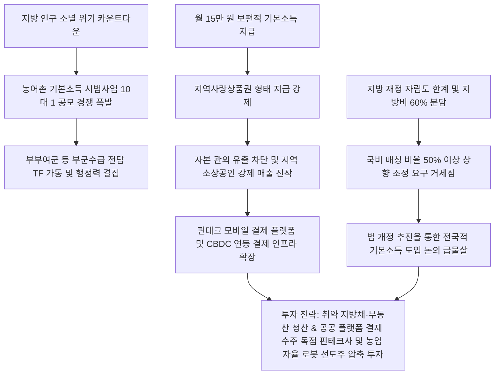

# 복지/재정 정책 분석: 농어촌 기본소득 시범사업 10대 1 경쟁률과 지방 재정 자립도 한계 및 소멸 극복 생존 전략 분석
## 투자 신호 + 사회적 영향 평가

---

## 📌 기사 기본 정보

- **날짜**: 2026-05-07
- **출처**: 전국 지자체 및 행정안전부 공조 종합 (신진호·최종권·김준희·박진호·안대훈 기자)
- **카테고리**: 경제 > 정책 > 지방재정/복지
- **핵심 주제**: 인구 소멸 벼랑 끝에 몰린 전국 69개 인구감소지역 군(郡) 중 59개 지자체가 단 5곳을 선정하는 이재명 정부의 '농어촌 기본소득 시범사업'에 대거 몰리며 10대 1의 경쟁률을 기록하고, 지방비 60% 분담이라는 열악한 재정 여건 하에서도 지역 생존을 위해 보편적 기본소득과 지역화폐 선순환 시스템을 장착하려는 처절한 지자체 생존 전략 분석

**메타데이터**
- 주요 사건: 농어촌 기본소득 시범사업 공모 경쟁률 10대 1 기록(59개 지자체 지원), 인구소멸지역 지자체들의 TF팀 구성 및 행정력 총동원, 기본소득 연동 지역사랑상품권 활성화 계획 수립
- 핵심 원인: 고령화 및 청년층 유출에 따른 지방 군 단위 행정 구역의 영구 멸절 공포, 월 15만 원 현금성 지원을 통한 '인구 댐' 구축 및 소비 강제 효과(지역사랑상품권)를 노린 상권 소생 의지
- 주요 주체: 59개 참가 군 지자체(부여군, 괴산군, 무주군, 홍천군 등), 이재명 대통령 및 기획재정부/행정안전부
- 키워드: #농어촌기본소득 #지방소멸 #지역사랑상품권 #지방재정자립도 #이재명정부 #인구유입 #보편적복지 #지역균형발전

---

## 🔍 기사를 통한 투자 신호 추출

### 1단계: 핵심 사건 분해

**What (무엇이 일어났는가?)**
- 대한민국 소멸 위기 지자체들이 생존을 위한 최후의 보루로 '농어촌 기본소득 시범사업' 공모에 사활을 걸었습니다. 월 15만 원의 지역사랑상품권을 주민 전원에게 보편 지급하는 시범 지구 5곳을 선발하는 사업에 59개 지자체가 한꺼번에 몰려 10대 1의 경쟁률이 터졌습니다. 지자체들은 심각한 재정난과 지방비 60% 부담이라는 악조건에도 불구하고, 인구 유입과 소상공인 매출 강제 진작을 위해 부군수급 전담반(TF)을 출범하며 예산을 베팅하는 극단의 행정 쟁탈전을 개시했습니다.

**When (언제 일어났는가?)**
- 2026-05-07 (이재명 정부의 복지 정책 드라이브가 실제 재정 지원과 연동되어 지방 선거를 앞둔 지역 표심 및 지방 소멸 대안으로 전면에 부각된 시점)

**Why (왜 일어났는가?)**
- 고령화로 주민 자체가 소멸하여 지방 자치구 자체가 멸절되는 물리적 카운트다운이 눈앞에 닥치자, 기존 복지 모델로는 인구 유입이 불가능함을 깨달았기 때문입니다.
- 기본소득을 관외로 빠져나가지 못하는 '지역사랑상품권'으로 락인(Lock-in)하여 현지 자영업자들의 매출을 인위적으로 보장해주는 것이 붕괴하는 지방 자본 생태계를 지키는 유일한 응급 처방이기 때문입니다.

**Who (누가 주도하는가?)**
- 인구 소멸 벼랑 끝에서 사활적 행정 결집을 시도하는 지방자치단체장 및 전담 행정 기획단
- 국가 균형 발전 및 보편 기본 복지를 차세대 정부 핵심 브랜딩으로 삼고 국비 40% 분담을 개시한 중앙정부(이재명 행정부)

---

### 2단계: 투자 신호 해석

### A. **긍정적 신호 (Bullish)**

**① 지역사랑상품권 연동 모바일 결제 플랫폼 및 지역 핀테크 인프라 독점 수주 솔루션사**
- **신호**: 월 15만 원 기본소득의 지역사랑상품권 강제 발행 및 전국적 기본소득 모델 확산 예고
- **의미**: 기본소득은 종이 상품권이 아닌 모바일 바우처, 카드, 혹은 블록체인 기반의 지역화폐 결제망을 통해 지급됨. 시범 사업 5개 지구가 선정되고 향후 법 개정으로 전국 확산 시, 해당 지자체들의 모바일 결제 플랫폼을 구축하고 정산 수수료를 챙기는 핀테크 플랫폼 대장주들의 공공 수주 물량이 수직 상승함
- **투자 기회**: 공공 지역화폐 결제 플랫폼 독점 구축 및 운영사, 블록체인 기반 DID/결제 보안 기술주

**② 농어촌 기계화 및 농업 생산성을 비약적으로 높일 차세대 자율 스마트팜 하드웨어**
- **신호**: 인구 부족 농어촌의 지속 가능성을 위한 '지역 유지 비용' 지출 정당화 부상
- **의미**: 기본소득 지급으로 노동 인구 하방을 방어하는 한편, 농어촌 고령화에 따른 극심한 일손 부족을 해결하기 위해 지자체들이 자율주행 트랙터, 농업 로봇, 스마트팜 유틸리티에 대한 구매 보조금 예산을 공격적으로 확충함
- **투자 기회**: 국내 대표 스마트 농기계 및 자율주행 농업 로봇 선도주, 고효율 스마트팜 토탈 솔루션사

---

### B. **위험 신호 (Bearish)**

**① 지방비 60% 강제 분담에 따른 재정 자립도 붕괴 및 지방 소멸 위험 고착화 군(郡) 채권/부동산**
- **신호**: 지방 재정 자립도가 극도로 열악한 상황에서의 과도한 복지 지출 매칭 분담
- **의미**: 시범사업에 선정되더라도 사업비의 60%를 지자체가 직접 책임져야 하므로, 자립도가 한 자릿수인 지자체들의 실질 지방 채무가 폭증하고 다른 필수 인프라 유지 보수 예산이 삭감되는 부작용이 발생함. 인구 유입이 실패할 경우, 지자체의 모라토리엄(파산) 리스크가 가시화됨
- **투자 리스크**: 소멸 위험 고강도 지자체 소유 지방 채권 및 해당 지역 내 상가/부동산 자산

**② 관외 유출 제한(지역사랑상품권 규제)에 직면한 광역 대기업 리테일 및 온라인 이커머스**
- **신호**: 관내 소비만 강제하는 목적성 화폐(지역사랑상품권) 중심 지급 구조
- **의미**: 기본소득 유동성이 해당 소형 자치구 내 영세 가맹점으로만 흘러가도록 락인되기 때문에, 대형 마트, 대기업 프랜차이즈, 서울 소재 온라인 몰 등의 현지 지점 매출 기여는 원천 차단됨. 지방 소비 진작 기대를 반영했던 범용 소비재 기업들의 실질 수혜가 전무함
- **투자 리스크**: 지방 유통 거점 대형 할인점 상장주, 지방 배송 비중이 높은 온라인 이커머스 플랫폼

---

### 3단계: 섹터별 투자 기회 매트릭스

#### ✅ **높은 기대도 + 낮은 리스크**

**전국 지자체 지역화폐 모바일 결제 인프라를 독점 운영하는 대형 IT 핀테크사 및 차세대 정밀 농업 로봇 지배주**
- 10대 1의 경쟁률이 증명하듯 농어촌 기본소득과 지역화폐 지급은 소멸을 막기 위한 지자체들의 강제적 뉴노멀이 되고 있습니다. 정치적 기조와 무관하게 시스템 수주를 독점하는 핀테크 인프라 기업과 고령화 노동력 부족을 물리적으로 대체할 자율주행 농기계 대표주는 공공 정책의 가장 확실하고 리스크 없는 수혜주입니다.
- **투자 추천도**: ⭐⭐⭐⭐

---

## 💰 구체적 투자 신호 변환

### 신호 1: 지방 한계 채권 청산 및 '공공 플랫폼 수주' 핀테크 플랫폼 대장주 및 '자율 농업 스마트팩토리' 주도주 편입

**투자 해석**: 기사는 전국 지방의 85%가 넘는 군 지역이 인구 멸절의 극심한 공포 속에 '기본소득'이라는 마지막 국가 보조 재정 수혈에 목숨을 걸었음을 명확히 보여줍니다. 재정 자립도가 완전히 망가진 지자체들의 채권이나 해당 지방 소멸지역의 개발 부동산에 미련을 가지고 투자를 유지하는 것은 극단적인 자본 소멸 리스크를 짊어지는 것과 같습니다. 투자자는 즉시 포트폴리오를 재편해야 합니다. 지방 미분양 부동산 및 소멸지 인근 간접 자산을 전량 청산하고, 확보된 자금을 59개 지자체가 일제히 추진하는 지역화폐 결제망 모바일 플랫폼 수주권을 확보한 대형 IT 핀테크 지배주와, 고령화 농가에 필수적으로 투입될 고마진 스마트 농업 자율 하드웨어 대표주([[대동]], [[TYM]] 등)로 압축 전환하여 공공 재정의 강제 수혜 벨트에 자산 승차를 시켜야 합니다.

---

## 🌍 사회적 영향 평가

### A. 긍정적 사회 영향
- **소외 지역 기본 복지선 보장 및 지역 경제 선순환 유도**: 보편적 기본소득 15만 원이 지역화폐로 강제 유통되면서 붕괴 직전의 지방 전통시장 소상공인 매출이 20% 이상 진작되는 등 기초 서민 경제 생명선 연장
- **농어촌 노동력 부족 극복을 위한 농업 스마트화 가속**: 젊은 인구 유입 지연에 대응하기 위해 지자체들이 예산을 투입해 농업용 드론, AI 자율 트랙터를 신속 보급하여 미래 정밀 농업 경쟁력 조기 확보

### B. 부정적 사회 영향
- **지방비 분담 고착화에 따른 지자체 재정 파탄 위험**: 자립도가 10% 미만인 군(郡) 지자체들이 60%의 재정 분담을 억지로 감당하면서 복지 포퓰리즘 경쟁에 휘말려 도로, 소방, 의료 등 핵심 공공재 유지 보수비가 마비되는 연쇄 부작용 봉착
- **정부 공모 선정 여부에 따른 지자체 간 부의 양극화 격화**: 시범 사업에 선정된 5개 군은 인구 유입 호재를 누리지만, 탈락한 54개 군은 재정 지원 부족 속에 소멸 속도가 더욱 가속화되어 지방 내 극단적인 'K자형 소멸 양극화' 초래

---

## 🎯 결론: 당신의 투자 전략 수립

- **즉시 실행**: 재정 건전성이 취약한 지방자치단체 발행 채권(지방채) 전량 차환 및 매도하여 포트폴리오 유동성 리스크 차단
- **3개월 후**: 농어촌 기본소득 시범사업의 최종 5개 선정 지자체를 확인하여, 선정 지구의 모바일 지역화폐 단독 결제 대행 핀테크사 지분 확대

---

## 📝 Obsidian 연결 구조

