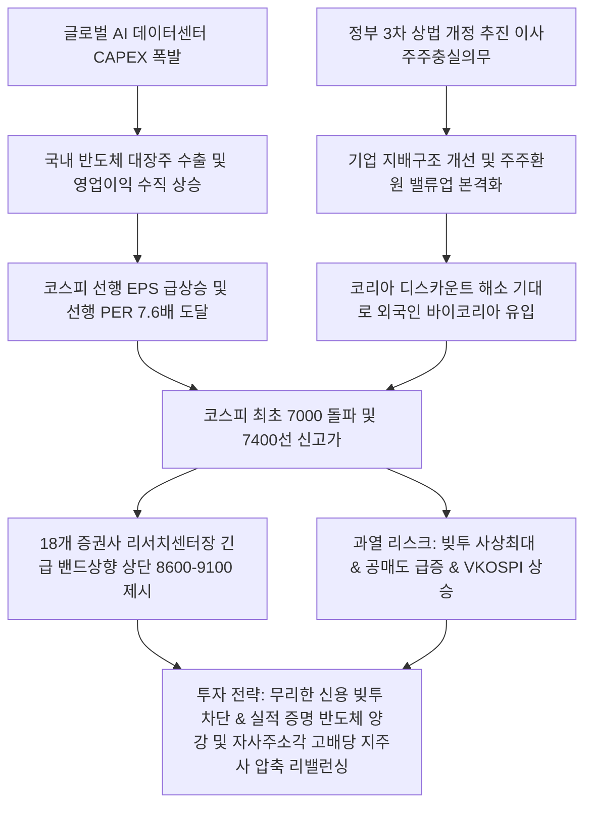

# 증시/밸류업 분석: 18개 증권사 센터장들의 코스피 상향 전망과 상법 개정 밸류업 및 AI 반도체 랠리 분석
## 투자 신호 + 사회적 영향 평가

---

## 📌 기사 기본 정보

- **날짜**: 2026-05-07
- **출처**: 국내 금융투자 및 증권사 리서치센터 종합 (머니투데이 설문)
- **카테고리**: 경제 > 증시 > 시장전망
- **핵심 주제**: 코스피 사상 최초 7000 돌파 및 7400선 도달에 따른 국내 18개 메이저 증권사 리서치센터장들의 긴급 밴드 상향 조정(상단 8600~9100선 제시), 글로벌 AI 반도체 실적 폭발과 이재명 정부의 3차 상법 개정(이사 주주 충실 의무, 집중투표제)을 통한 코리아 디스카운트 해소 시너지 및 저PER 7.6배의 역사적 정상화 랠리 분석

**메타데이터**
- 주요 사건: 코스피 7000 사상 첫 돌파 및 7400선 전격 안착, 18개 증권사 리서치센터장 대상 긴급 증시 전망 설문 단행(삼성증권 8400, 신한투자증권 8600 등 상단 일제 조정), 이재명 정부의 1~3차 지배구조 개선 상법 개정 추진 가시화
- 핵심 원인: HBM 및 차세대 메모리 수출 폭증에 따른 국내 반도체 영업이익 추정치의 수직 상승, 이사 충실의무 및 자사주 소각 강제 등 주주환원 밸류업 입법화에 따른 해외 자금 유입, 12개월 선행 PER 7.6배 수준의 압도적 저평가 매력
- 주요 주체: 18개 증권사 리서치센터장(김동원 KB본부장, 이진우 메리츠센터장 등), 외국인 기관 투자자, 금융감독원 및 기획재정부
- 키워드: #코스피7000 #증시상단전망 #AI반도체주도 #밸류업 #코리아디스카운트 #상법개정 #선행PER #해외자금유입 #멀티플리레이팅

---

## 🔍 기사를 통한 투자 신호 추출

### 1단계: 핵심 사건 분해

**What (무엇이 일어났는가?)**
- 대한민국 자본시장이 사상 최초로 코스피 7000선을 돌파해 7400선 신고가에 도달하자, 주요 18개 증권사 리서치센터장들은 일제히 목표 밴드 상단을 8400~8600포인트로 대폭 상향 수정했습니다. 글로벌 AI 수요 폭증으로 반도체 EPS가 수직 상승하는 가운데, 이사의 주주 충실 의무와 자사주 소각 의무화를 담은 '3차 상법 개정'이 가시화되면서 코리아 디스카운트가 전격적으로 해소되는 '멀티플 리레이팅' 국면이 도래했습니다.

**When (언제 일어났는가?)**
- 2026-05-07 (반도체 초호황과 주주 밸류업 입법화 드라이브가 교차하며, 외국인의 대규모 한국 주식 바이코리아가 역사적 고점을 연일 돌파하던 증시의 결정적 신기원)

**Why (왜 일어났는가?)**
- SK하이닉스와 삼성전자의 HBM 실적 개선이 단순 희망이 아닌 숫자로 입증되었고, 그럼에도 불구하고 12개월 선행 PER이 여전히 7.6배(미국 S&P500 22배 대비 반의반 토막)에 불과해 밸류에이션 매력이 폭발적이었기 때문입니다.
- 지배주주 일가의 이익만 보장하던 기존 기업 지배구조를 법적으로 강제 개혁하는 '상법 개정 시리즈(이사 주주 충실의무, 집중투표제)'가 외국인 투자자들에게 마침내 신뢰를 제공했기 때문입니다.

**Who (누가 주도하는가?)**
- 한국 상장주식 헐값 메리트를 알아보고 매수 주문을 쏟아내는 외국인 기관 투자자 연합
- 주주가치 우선 과세와 밸류업 입법 패키지를 전력 추진 중인 정부 정책 당국

---

### 2단계: 투자 신호 해석

### A. **긍정적 신호 (Bullish)**

**① 실적 기반의 극단적 저평가(선행 PER 7.6배) 해소에 따른 코스피 8000선 추가 리레이팅**
- **신호**: 12개월 선행 PER 7.6배 수준 및 연준 금리인하 기대 결합
- **의미**: 주가는 사상 최초로 7000을 돌파했으나, 기업들이 벌어들이는 미래 이익 성장률에 비하면 주가는 역사상 가장 싼 저평가 영역에 머물러 있음. 지배구조 법안 통과와 하반기 연준 금리 인하(1회 이상)가 단행되면 지수 멀티플이 9~10배 수준으로 수렴하며 지수가 8600을 넘어 9100선까지 열릴 수 있음
- **투자 기회**: 코스피 대형 주도주, 반도체 및 고주주환원 대형 금융 지주사, 밸류업 인덱스 ETF

**② 이사 주주 충실의무 및 자사주 소각 의무화의 직접 수혜를 입는 저PBR/고유보금 대형 지주사**
- **신호**: 이재명 정부의 3차 상법 개정 및 주주환원 강화 정책 본격화
- **의미**: 자사주를 꽁쳐두고 주주를 무시하던 구태 지배구조 대기업들이 강제적으로 자사주를 전량 소각하고 배당 성향을 대폭 상향해야 하는 구도로 외통수에 걸림. 유보율이 극도로 높고 자사주 보유 비중이 큰 우량 지주 회사들의 주주 환원액이 급상승함
- **투자 기회**: 자사주 비율이 높고 시총 대비 순현금이 풍부한 대표 저PBR 지주사 및 부품 제조사

---

### B. **위험 신호 (Bearish)**

**① 빚투(신용 융자) 사상 최고치 도달 및 공매도 급증에 따른 단기 기술적 급락 변동성**
- **신호**: 신용 잔고 사상 최대 돌파, 공매도 폭증, VKOSPI 변동성 공포 지수 상승
- **의미**: 7000 돌파 장세에 흥분한 개인 투자자들의 고레버리지 '빚투'가 임계점에 도달해 기술적 매도 매물이 조금만 쏟아져도 신용 반대매매가 연쇄 폭발하여 지수가 순식간에 5~10% 조정받을 수 있는 기술적 과열 취약 상태임
- **투자 리스크**: 신용 융자 비율이 10%를 초과하는 고밸류 코스닥 개별 성장주

**② AI 반도체 성장에만 의존한 편중 랠리로 인한 내수/한계 섹터의 장기 소외**
- **신호**: 반도체 이익 전망 상향이 전체 지수 EPS의 70% 이상 독점
- **의미**: 헤드라인 지수는 7000을 넘어가지만, 반도체를 제외한 의류, 음식료, 중소형 화학, 건설업계는 실적 둔화와 내수 침체에 신음하고 있어 비반도체 계좌의 상대적 박탈감과 거래량 침체가 고착화됨
- **투자 리스크**: 반도체 밸류체인과 무관한 고부채 중소형 내수 제조주

---

### 3단계: 섹터별 투자 기회 매트릭스

#### ✅ **높은 기대도 + 낮은 리스크**

**글로벌 독점 HBM 기술을 보유한 반도체 메이저 대장주 및 자사주 보유율 10% 이상의 밸류업 금융지주**
- 실적이 완벽히 뒷받침되는 저PER(7.6배) 환경에서는 반도체 공급망 대장주가 1순위이며, 상법 개정의 칼날 앞에 자사주를 전격 소각해야 하는 현금 부자 금융지주 및 지주사들이 가장 리스크 없이 주주 환원의 열매를 따 먹을 수 있는 최적의 영토입니다.
- **투자 추천도**: ⭐⭐⭐⭐⭐

---

## 💰 구체적 투자 신호 변환

### 신호 1: '코리아 디스카운트 해소' 입법 밸류업 수혜 자산 매집 및 반도체 융합 밸류체인 믹스 다변화

**투자 해석**: 기사는 코스피가 사상 최초 7000선을 돌파한 본질적 이유가 일시적 테마가 아닌 '사상 최대의 반도체 실적 급증'과 '3차 상법 개정이라는 제도적 지배구조 개혁'의 동시 타격에 기인함을 실증합니다. 선행 PER 7.6배라는 비정상적 헐값 시장은 해외 거대 자본에게 최고의 먹잇감입니다. 지수가 고점이라는 공포에 휩쓸려 주식을 다 팔고 채권이나 예금으로 피난 가는 포트폴리오는 다가올 '코리아 리레이팅' 상승장(목표 8600)에서 완전히 배제당할 수 있습니다. 투자자는 즉시 포트폴리오를 조정해야 합니다. 밸류업 혜택이 없고 지배구조가 불투명한 중소형 한계주를 전량 매도 청산하고, HBM 시장의 절대 권력을 쥔 [[SK하이닉스]], [[삼성전자]]와 상법 개정 통과 시 대규모 자사주 소각 및 배당 확대가 불가피한 메이저 지주사 및 금융지주([[KB금융]], [[메리츠금융지주]] 등)의 비중을 극대화하여 코리아 디스카운트 해소의 직접 수혜를 계좌 가치로 고스란히 치환해야 합니다.

---

## 🌍 사회적 영향 평가

### A. 긍정적 사회 영향
- **1000만 주식 동학 주주들의 자산 건전성 개선 및 노후 연금 안정화**: 코스피 7000 시대 정착으로 국내 주식 비중이 높은 국민연금, 퇴직연금 및 일반 개인 투자자들의 자산이 비약적으로 증대되어 가계의 중장기 소비력 및 복지 안정망 탄탄화
- **이사 충실의무 도입을 통한 소액 주주 주권 보장 및 투명한 자본시장 구축**: 3차 상법 개정 통과로 소수 대주주의 편법 승계 및 터무니없는 주주 가치 훼손 결정(물적 분할 후 쪼개기 상장 등)이 법적으로 전격 차단되어 한국 금융의 도덕적 해이 극복

### B. 부정적 사회 영향
- **빚투 과열 및 신용 반대매매 연쇄 파산으로 인한 중산층의 가계 타격**: 사상 최대에 도달한 빚투 신용 물량 탓에 지수가 단기 기술적 조정을 겪을 경우, 반대매매 당일 하한가 사태가 속출하여 무리하게 베팅한 서민 개인 투자자 가계의 동반 파산 유발
- **지수 상승의 착시 효과에 가려진 실물 경기 빈곤층의 소외 가중**: 헤드라인 증시 지표는 역사상 최초의 호황을 외치지만, 실물 자영업과 소외 산업군은 고금리 고물가에 파산하는 괴리가 고착되어 자산가와 비자산가 사이의 계급적 장벽 고조

---

## 🎯 결론: 당신의 투자 전략 수립

- **즉시 실행**: 최근 코스피 급등으로 인해 계좌 내 신용 대출 비율이 30%를 상과하는 고레버리지 신용 포지션 즉각 정리하여 현금 비중 20% 확보
- **3개월 후**: 3차 상법 개정안의 최종 국회 표결 결과 및 연준의 금리 인하 실행 시점을 추적하여, 상단 8600포인트 도달 시점에 맞추어 포트폴리오 차익 실현 및 MMF 전환 실행

---

## 📝 Obsidian 연결 구조

