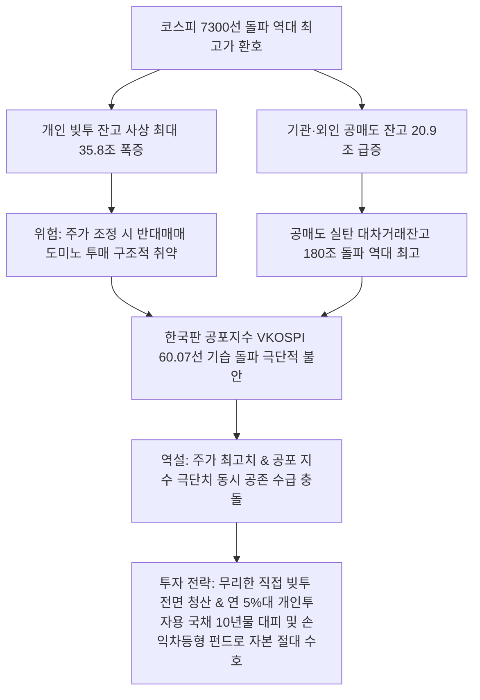

# 증시/리스크 분석: 코스피 7000 돌파 이면의 3대 경고등 빚투 사상 최대·공매도 폭증·VKOSPI 공포지수 60 돌파 분석
## 투자 신호 + 사회적 영향 평가

---

## 📌 기사 기본 정보

- **날짜**: 2026-05-07
- **출처**: 글로벌 금융투자 및 리스크 관리 본부 종합 (한국경제신문 오효정·박유미·김다영·박영우 기자)
- **카테고리**: 경제 > 증시 > 자본시장/투자전략
- **핵심 주제**: 코스피 지수가 7300선을 뚫고 역대 최고치를 갱신하는 환호 이면에서 '사상 최대 빚투 잔고(35.8조 원)', '한 달 새 36% 폭증한 공매도 잔고(20조 원)', '극단적 공포 구간에 진입한 한국판 변동성지수 VKOSPI 60 돌파'라는 전례 없는 3대 과열 경고등이 동시에 켜진 역설적 시장 모순 및 변동성 방어 전략 분석

**메타데이터**
- 주요 사건: 신용거래융자 잔고 사상 최고치 기록(35조 8,389억 원, 5개월 만에 8.5조 원 폭증), 공매도 잔고 20조 원 돌파 및 대차거래 잔고 역대 최고(180조 6,284억 원), 변동성지수 VKOSPI 60.07 폭등
- 핵심 원인: 지수 급상승에 흥분한 개인 투자자들의 대규모 고레버리지 빚투 베팅, 주가 단기 고점 인식에 따른 외국인·기관의 하락 베팅 대차거래 급증, 미-이란 지정학 소강에도 불구하고 잔존하는 원가 인플레 우려와 2분기 실적 선반영 피로감
- 주요 주체: 신용 융자 주도 국내 개인 투자자, 숏 베팅 외국인/기관 공매도 세력, 한국은행 및 금융감독원
- 키워드: #코스피7000 #빚투사상최대 #신용거래융자 #반대매매 #공매도폭증 #VKOSPI60 #공포지수 #대차거래 #변동성헷징 #손익차등형

---

## 🔍 기사를 통한 투자 신호 추출

### 1단계: 핵심 사건 분해

**What (무엇이 일어났는가?)**
- 코스피 7000 시대의 초입에서 자본시장에 대규모 연쇄 붕괴 위험을 경고하는 3대 이상 징후가 동시에 포착되었습니다. 주가가 사상 최고치를 달리는 상황에서 개인의 '빚투' 신용 융자 잔고가 사상 최대인 35.8조 원을 뚫었고, 역방향의 하락 베팅인 공매도 잔고 역시 20조 원으로 폭증했습니다. 결정적으로 시장의 공포 체감 온도인 VKOSPI(변동성 지수)가 60선을 급돌파하여, 주가 폭등과 극단적 공포가 동시에 끓어오르는 기이한 수급 모순 장세가 연출되었습니다.

**When (언제 일어났는가?)**
- 2026-05-07 (반도체 랠리에 흥분한 개인의 추격 매수와 2분기 피크아웃을 노리는 기관의 공매도 베팅이 한 치의 양보 없이 역대 최고치로 정면충돌한 시점)

**Why (왜 일어났는가?)**
- 지수 상승에서 소외당할 수 없다는 개인의 포모(FOMO) 심리가 작용해 과도한 부채 레버리지를 일으켜 주가를 밀어 올렸기 때문입니다.
- 단기 상승 속도가 과도하다고 판단한 외국인·기관이 공매도 선행 지표인 대차거래(180조 원 돌파)를 역대 최대 수준으로 빌려 하락 트리거에 손가락을 얹었기 때문입니다.
- 실물 설비투자가 반도체 공정 고도화(선별 투자) 및 조선·방산에만 편중되어 있고 경제 전반으로 온기가 퍼지지 못하는 K자형 착시 성장의 취약성을 시장이 직시했기 때문입니다.

**Who (누가 주도하는가?)**
- 주식 생활비 대출 및 신용 융자로 지수 하단을 억지 지탱하는 국내 개인 투자자군
- 대규모 대차거래를 통해 공매도 포지션을 20조 원 넘게 구축한 글로벌 헤지펀드 및 메이저 기관
- 변동성 증폭 속에서 개인들을 위해 후순위 손실 인수용 손익차등형 펀드를 출시 중인 금융 자산 업계

---

### 2단계: 투자 신호 해석

### A. **긍정적 신호 (Bullish)**

**① 하락장 충격 완화 및 선순환 수익을 누리는 '롱숏(Long-Short)' 및 '손익차등형' 방어형 펀드**
- **신호**: VKOSPI 60선 돌파 및 공매도 잔고 20조 원 돌파
- **의미**: 시장의 변동성 자체가 극대화되는 시기에는 단순 매수(Long Only) 전략은 참사를 겪음. 상승 종목을 사고 동시에 하락 종목을 공매도하여 절대 수익을 내는 롱숏 펀드와, 운용사가 손실을 일정 부분 우선 감내해 주는 '손익차등형 펀드'는 극단적 변동성 장세에서 완벽한 피난처로 작동함
- **투자 기회**: 롱숏 롱런 펀드, 선순환 구조의 저변동성 배당 랩어카운트 상품

**② 확정 고금리 및 원리금을 완벽하게 수호하는 개인투자용 국채 10년물 등 확정 안전 자산**
- **신호**: 빚투 반대매매 연쇄 폭발 우려 및 극단적 공포 지수 고착
- **의미**: 빚투 잔고가 35조를 넘은 상태에서 기술적 조정이 오면 반대매매로 인해 코스피 지수가 6000선 초입까지 강제 밀려날 수 있음. 이 시기 정부가 보장하며 연 5%대 확정 금리를 제공하는 10년 만기 개인투자용 국채는 시장 조정 리스크를 피하며 높은 실질 이익을 얻는 최적의 헷징 카드가 됨
- **투자 기회**: 개인투자용 국채 10년물 및 20년물, 초단기 달러 MMF

---

### B. **위험 신호 (Bearish)**

**① 기술적 조정 시 반대매매 연쇄 폭탄의 도화선이 될 '고신용 잔고' 기술 성장주**
- **신호**: 빚투(신용거래융자) 잔고 35.8조 원으로 사상 최대치 폭증
- **의미**: 담보 유지 비율(통상 140%) 아래로 주가가 하락할 경우, 증시 하락 당일 오전 9시에 무차별적인 시가 반대매매(투매)가 쏟아져 나와 주가를 강제로 하한가로 밀어붙임. 특히 신용 잔고율이 높은 기술 테마주나 개별 중소형주들은 매크로 충격 발생 시 한순간에 계좌 잔고가 녹아내릴 파멸의 위험을 안고 있음
- **투자 리스크**: 신용 융자 잔고가 자본금 대비 8% 이상인 코스닥 중소형 테마주

**② 대차거래 역대 최고(180조) 돌파에 따른 외국인 공매도 표적 대형주**
- **신호**: 대차거래 잔고 180.6조 원 역대 최고 및 공매도 잔고 20조 돌파
- **의미**: 숏 베팅 세력의 실탄이 사상 최대로 장전되었음을 뜻함. 글로벌 매크로 인플레 재점화나 반도체 가이던스 미세한 둔화 신호가 나오는 즉시 이 180조 원 규모의 대차잔고가 공매도 폭탄으로 전격 투하되며 시총 대형주들의 주가를 인위적으로 짓누를 것임
- **투자 리스크**: 실적 대비 멀티플이 과도하게 치솟은 고PER 바이오 및 IT 대형 부품사

---

### 3단계: 섹터별 투자 기회 매트릭스

#### ✅ **높은 기대도 + 낮은 리스크**

**원리금 보장 및 비과세 혜택이 주어지는 개인투자용 국채(연 5%대) 및 하락 충격을 선제 방어하는 롱숏/손익차등형 펀드**
- 빚투 35조와 VKOSPI 60 돌파는 자본시장이 기술적 폭락의 임계점에 서 있음을 보여주는 가장 솔직한 수급 성적표입니다. 이 상황에서 무리한 추가 지수 상승 베팅은 최악의 악수입니다. 확정적 고금리를 주는 국채 자산과 하방을 방어하는 간접 운용 펀드로 대피하는 것이 가문의 부를 지키는 현명한 로드맵입니다.
- **투자 추천도**: ⭐⭐⭐⭐⭐

---

## 💰 구체적 투자 신호 변환

### 신호 1: '고레버리지 직접 투자' 전면 전격 중단 및 '확정 고금리 국채' 및 '변동성 방어 랩/롱숏'으로 자본 80% 안전 피신

**투자 해석**: 기사는 코스피 7300선 돌파라는 축제의 가면 뒤에 35조 원의 빚투 시한폭탄과 180조 원의 공매도 화약고가 언제든 터질 수 있는 극단적 위험이 도사리고 있음을 통계로 경고합니다. 공포 지수인 VKOSPI가 60을 뚫었다는 것은 언제든 대폭락이 올 수 있다는 스마트 머니의 소리 없는 절규입니다. 남들이 주식으로 대박을 쳤다는 소문에 영끌 빚투에 합류하여 직접 투자를 지속하는 포트폴리오는 조만간 닥쳐올 반대매매 투매 국면에서 전 재산이 강제 청산당하는 비극을 겪을 수 있습니다. 투자자는 즉시 포트폴리오를 대피시켜야 합니다. 신용 대출로 산 모든 상장 주식 비중을 즉각 전량 손절·청산하여 현금화하고, 가용 자본의 80% 이상을 연 5%대 고금리와 국가 원리금 보장이 담보된 [[개인투자용 국채 10년물]]로 분산 이동해야 합니다. 나머지 주식 자산도 직접 투자 대신 하방 리스크를 운용사가 선순위로 방어해 주는 [[손익차등형 펀드]]나 전문 롱숏 랩어카운트로 전격 전환하여 다가올 증시 대폭풍 속에서 포트폴리오를 절대 수호해야 합니다.

---

## 🌍 사회적 영향 평가

### A. 긍정적 사회 영향
- **자본시장 리스크 경고 체계 가동 및 합리적 간접 투자 문화 정착**: 3대 과열 지표 노출을 통해 투자자들에게 과도한 빚투의 한계를 경고하고, 무차별 직접 투자가 아닌 펀드, 국채, TDF 등 합리적인 포트폴리오 다각화 유도
- **실물 자산 중심의 신중한 기업 투자 환경 조성**: 과도한 설비 증설 경쟁 대신 고부가 선별 투자를 집행하는 반도체 대기업들의 성향 정착으로, 향후 발생할 수 있는 글로벌 공급 과잉발 파멸적 치킨게임 선제 방지

### B. 부정적 사회 영향
- **대규모 반대매매 도미노에 의한 가계 금융 파산 및 중산층 붕괴**: 주가 돌발 조정 발생 시 하루 수조 원 규모의 신용 반대매매가 집행되어, 빚을 내어 추격 매수했던 청년 및 은퇴 서민층 가계가 연쇄 채무 불이행 파산 상태 직면
- **실물 경제의 투자 위축과 특정 대기업으로의 자본 편중 심화**: 코스피 상승의 과실이 소수 반도체·방산 대기업에만 쏠리고 전통 제조업과 내수 자영업은 고금리 이자 부담에 폐업하는 실물 경기 'K자형 양극화' 사회 갈등 증폭

---

## 🎯 결론: 당신의 투자 전략 수립

- **즉시 실행**: 계좌 내 주식 담보 대출 및 신용 융자 잔고 전량 즉시 상환 처리하여 담보유지비율 200% 이상 안전지대로 격상
- **3개월 후**: 반도체 2분기 실제 실적 공시(6~7월) 확인 및 신용거래 잔고가 30조 원 이하로 하향 정상화되는 시점까지 직접 매수 전면 동결

---

## 📝 Obsidian 연결 구조

