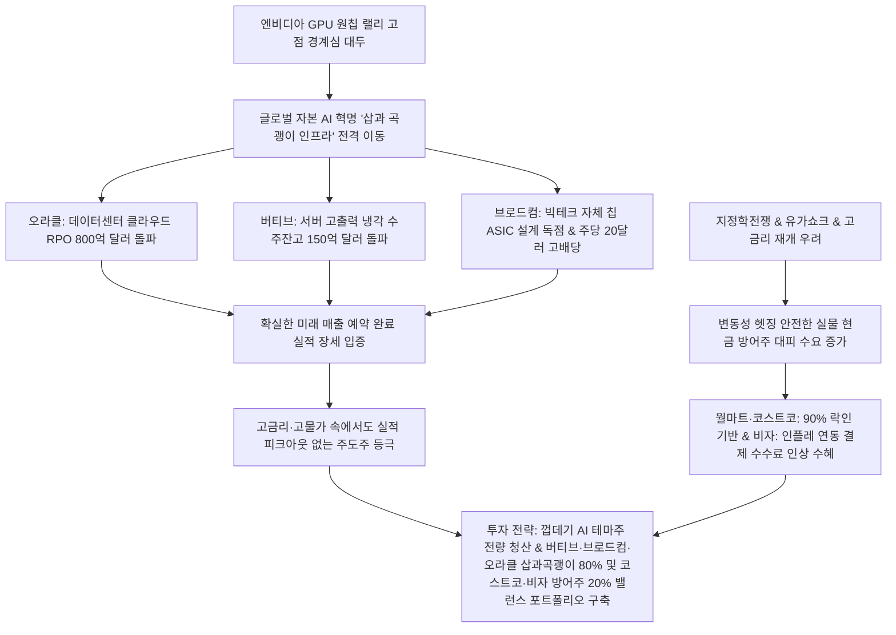

# 글로벌 투자 분석: AI 인프라 "삽과 곡괭이" 오라클·버티브·브로드컴 독점력과 변동성 방어주 헷징 전략 분석
## 투자 신호 + 사회적 영향 평가

---

## 📌 기사 기본 정보

- **날짜**: 2026-05-07
- **출처**: 글로벌 자본시장 및 월가 투자은행 동향 (중앙일보 · 블룸버그 글로벌머니클럽)
- **카테고리**: 경제 > 글로벌 > 투자전략
- **핵심 주제**: 엔비디아 GPU 독주 장세의 고점 경계 속에서 AI 데이터센터와 통신망 등 물리적 인프라를 독점 공급하는 '삽과 곡괭이' 메이저 기업들(오라클, 버티브, 브로드컴)의 RPO 및 수주잔고 급증 데이터 분석, 그리고 거시 매크로 변동성을 방어할 현금흐름 1등 소비재 방어주(월마트, 코스트코, 비자)의 포트폴리오 조율 전략 분석

**메타데이터**
- 주요 사건: 오라클(ORCL) 클라우드 잔여이행의무(RPO) 800억 달러 돌파, 버티브(VRT) 데이터센터 고효율 냉각 장치 수주잔고 150억 달러 돌파, 브로드컴(AVGO) 빅테크 맞춤형 주문형 반도체(ASIC) 설계 지배 및 고배당(주당 20달러) 매력 부각, 월마트 및 코스트코 등 실물 현금흐름 방어주의 플랫폼 지배력 확대
- 핵심 원인: AI 초거대 모델 구동에 따르는 발열(냉각 결핍), 데이터 전송 지연(네트워크 병목), 천문학적 GPU 가격 대항용 자체 칩(ASIC) 수요 급증, 고금리·인플레 장기화에 따른 경기 방어용 소비 유통망의 플랫폼화 가속
- 주요 주체: 글로벌 하이퍼스케일러(구글, MS, 아마존, 메타), 월가 헤지펀드 투자 연합, 글로벌 인프라 공급 지배주
- 키워드: #AI인프라 #삽과곡괭이 #오라클 #버티브 #브로드컴 #ASIC #데이터센터냉각 #방어주 #월마트 #코스트코 #비자 #CapEx #RPO

---

## 🔍 기사를 통한 투자 신호 추출

### 1단계: 핵심 사건 분해

**What (무엇이 일어났는가?)**
- AI 거대 주도주들의 고점 논란 속에서 글로벌 자본이 AI 혁명의 실물 공급망을 독점하는 '삽과 곡괭이' 기업들로 전격 리밸런싱을 감행하고 있습니다. 클라우드 RPO 800억 달러를 쌓은 오라클, 서버 발열 제어 수주잔고 150억 달러의 버티브, 빅테크 맞춤형 설계(ASIC)의 최강자 브로드컴이 AI의 물리적 뼈대로 낙점되었습니다. 동시에 인플레이션 수수료와 강력한 고객 락인(재가입률 90% 코스트코)을 지닌 실물 소비 방어주들이 변동성 헷저로 전면에 등극했습니다.

**When (언제 일어났는가?)**
- 2026-05-07 (글로벌 고금리 재인상 가능성 및 중동 리스크가 겹치며 순수 밸류에이션 성장주에서 '계약 실적이 담보된 인프라 및 가치 방어주'로 자본의 안전 대이동이 단행된 시점)

**Why (왜 일어났는가?)**
- 거대 AI 소프트웨어 서비스 자체는 경쟁이 너무 치열해 최종 승자를 예측하기 어려우나, 이들이 구동될 서버 인프라(냉각 장치, 전용 칩 설계, 클라우드 창고)는 빅테크가 무조건 선주문해야 하는 상수의 영역이기 때문입니다.
- 단기 고점 부담을 느낀 월가 자금들이 AI 성장의 과실(ASIC, 냉각)은 온전히 누리되, 거시 물가 압박에서 완벽한 독점적 해자(코스트코 연회비 장벽, 비자 결제 수수료 인플레 방어)를 가진 현금 방어주로 자산의 방어벽을 동시에 쳐야 하기 때문입니다.

**Who (누가 주도하는가?)**
- 설비투자(CapEx) 예산을 조 단위로 쏟아내며 인프라 자산을 입도선매 중인 하이퍼스케일러 빅테크 그룹
- 단기 랠리 거품을 헷징하고 실적(RPO, Backlog)이 실체화된 독점적 하드웨어 및 소비 방어주 지분을 쓸어 담고 있는 글로벌 금융 자본

---

### 2단계: 투자 신호 해석

### A. **긍정적 신호 (Bullish)**

**① 수주잔고가 매출 가시성을 100% 보장하는 AI 물리적 인프라 공급 지배주**
- **신호**: 오라클 RPO 800억 달러 돌파 및 버티브 냉각 장치 수주잔고 150억 달러 기록
- **의미**: 경기 상황이나 지정학 변수와 무관하게, 향후 수년간 이 기업들이 벌어들일 실적이 100% 선예약 완료되었음을 의미함. 특히 AI 연산 폭증에 필수적인 버티브의 액침 냉각/전력 솔루션은 진입 장벽이 극도로 높아 대체 불가능한 초고마진 독점력을 누림
- **투자 기회**: 데이터센터 냉각 솔루션 지배주, 클라우드 인프라 전환 대형주, AI 전력 변압기 공급사

**② 빅테크 자체 칩 개발(ASIC)을 설계 대행하며 현금 배당을 결합한 브로드컴의 독주**
- **신호**: 브로드컴 주문형 반도체(ASIC) 빅테크 채택 급증 및 연 배당 주당 20달러 돌파
- **의미**: 엔비디아의 독점 칩(GPU)에서 벗어나 자체 AI 반도체를 만들려는 구글·메타 등 빅테크들의 맞춤 정장 재단사 역할을 완벽하게 대행함. 실적 성장성과 동시에 탄탄한 현금 배당 메리트를 지녀 긴축 고금리 시기 최고의 밸런스형 주도주로 리레이팅됨
- **투자 기회**: 브로드컴 보통주, 맞춤형 AI 주문 반도체(ASIC) 설계 및 IP 전문 기업

---

### B. **위험 신호 (Bearish)**

**① 실체가 없는 단순 AI 소프트웨어 및 R&D 단계의 고PBR 가상 벤처**
- **신호**: AI 랠리가 수주잔고와 RPO(미래 계약) 기반의 실적 장세로 전격 재편됨
- **의미**: 구체적인 현금 흐름이나 빅테크와의 직접적인 인프라 납품 계약이 없이, "AI 탑재 예정" 등의 기대 심리로 밸류에이션을 높인 하위 80% 소프트웨어/AI 벤처들의 주가는 유동성 회수 국면에서 가장 먼저 폭락 수렁에 빠짐
- **투자 리스크**: 구체적 이익 및 수주 데이터 증명이 불가능한 AI 테마주

**② 가격 전가력이 없으며 부채 부담이 큰 구시대 유통 및 전통 내수 제조업**
- **신호**: 월마트·코스트코의 플랫폼화 및 90% 이상 멤버십 락인 독점
- **의미**: 고물가가 상수가 됨에 따라 소비자들은 멤버십 혜택이 강한 대형 창고형 마트로만 몰리고 온라인 광고 플랫폼을 장착한 유통사만 생존함. 자체 플랫폼화 능력이 없고 가격 인상 시 고객이 즉시 이탈하는 영세 유통 및 내수 제조사는 고사함
- **투자 리스크**: 전통적인 오프라인 중소형 백화점, 가격 전가력이 전무한 의류/생필품 한계 제조사

---

### 3단계: 섹터별 투자 기회 매트릭스

#### ✅ **높은 기대도 + 낮은 리스크**

**글로벌 서버용 고다층 냉각 시스템 지배주(버티브) 및 하이퍼스케일러 자체 칩 대행사(브로드컴)**
- AI 모델 성능 고도화에 필수적인 액침 냉각 기술과 맞춤형 칩(ASIC)은 대체 불가능한 진입 장벽을 갖고 있습니다. RPO와 대형 수주잔고가 향후 3~5년 실적 성장을 물 샐 틈 없이 보증하고 있으므로 거시 변동성이 커질 때 이 두 종목은 가장 확실한 수익의 대안입니다.
- **투자 추천도**: ⭐⭐⭐⭐⭐

---

## 💰 구체적 투자 신호 변환

### 신호 1: '가상 AI 테마 소프트웨어' 전량 청산 및 '삽과곡괭이 독점 하드웨어' 및 '현금 방어주' 8:2 하방 방어 포트폴리오 구축

**투자 해석**: 기사는 엔비디아 단일 칩 독점의 정점에서 자본의 대이동이 어떻게 AI의 '물리적 하부 인프라(ASIC, 냉각, 클라우드 RPO)'로 급속히 리밸런싱되고 있는지를 명확히 보여줍니다. 실적 실체가 없는 가상 AI 서비스나 버블에 가득 찬 기술주에 포트폴리오를 유지하는 것은 다가올 거시 긴축 재개 국면에서 자산을 파멸시키는 지름길입니다. 투자자는 즉시 포트폴리오를 대수술해야 합니다. 단순 탑재 기대로 오른 AI 소프트웨어 잡주들을 즉각 전량 매도하고, 냉각 1위 [[버티브]], 자체 칩 설계의 맹주 [[브로드컴]], 클라우드 대변화의 중심 [[오라클]]의 '인프라 삽과 곡괭이' 핵심주 비중을 80%로 상향하고, 나머지 20%는 고물가 환경에서 강한 고객 락인과 이익 방어력을 입증한 [[코스트코]] 및 인플레 연동 수수료를 뜯어가는 [[비자]]로 포트폴리오를 재배치하여 AI 성장 이익과 매크로 변동성 헷징을 완벽하게 동시 쟁취해야 합니다.

---

## 🌍 사회적 영향 평가

### A. 긍정적 사회 영향
- **글로벌 전력망 및 데이터센터 에너지 효율성의 획기적 제고**: 고마진 고출력 냉각 솔루션(버티브) 및 자체 최적화 칩(ASIC) 도입 가속화로, 전 세계 데이터센터의 탄소 배출량과 전기 낭비를 선제적으로 대폭 절감하여 기후 대응에 이바지
- **디지털 전환 기술 낙수로 인한 전통 기업의 이익 구조 효율화**: 오라클 클라우드 및 AI 인프라의 대중화로 전통 제조업과 유통 기업들이 공급망 재고 관리를 고도화하여 국가 전반의 산업 생산성 획기적 리업

### B. 부정적 사회 영향
- **글로벌 인프라 독점 거인들의 탄생으로 인한 IT 생태계의 중앙 집권화**: 오라클, 브로드컴 등 거대 자본과 인적 인프라를 장악한 극소수 공룡들만 이익을 독식하는 K자형 자본 양극화가 심화되며 중소 소프트웨어 벤처들의 생존 공간 멸절
- **에너지 및 전력 인프라 독점에 따른 민생 공공재 비용의 불평등한 상승**: 빅테크의 무차별적인 인프라/전력 독점으로 인해 발전 단가가 상승하여, 일반 소시민 가계가 감당해야 할 전기, 통신 등의 생필품 인플레 압박 추가 가중

---

## 🎯 결론: 당신의 투자 전략 수립

- **즉시 실행**: 실적이 미공개되었거나 기대치 EPS만 있고 RPO/수주잔고 데이터가 전혀 없는 AI 테마 소프트웨어주 전량 처분
- **3개월 후**: 하이퍼스케일러 빅테크의 차분기 실제 CapEx 예산 집행 데이터 및 버티브의 신규 액침 냉각 수주 건수를 확인하여 인프라 비중 최종 리밸런싱 실행

---

## 📝 Obsidian 연결 구조

