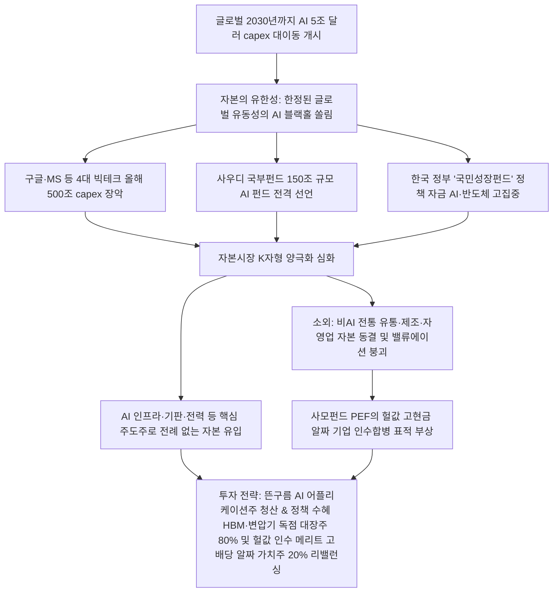

# 자본시장/투자 분석: AI 자본 대이동 7500조 집중과 극단적 K자형 양극화 및 국민성장펀드 정책 쏠림 현상 분석
## 투자 신호 + 사회적 영향 평가

---

## 📌 기사 기본 정보

- **날짜**: 2026-05-07
- **출처**: 국내외 자본시장 동향 및 사모펀드(PEF) 분석 (VIG파트너스 대표 기고)
- **카테고리**: 경제 > 투자 > 자본시장
- **핵심 주제**: 글로벌 빅테크 및 국부펀드(사우디 150조 원 등)가 2030년까지 AI 인프라에 최소 5조 달러(7,500조 원)를 투입하는 전대미문의 자본 대이동 개시와, 한정된 자본이 AI에만 쏠리면서 발생하는 비AI 전통 산업군의 투자 가치 붕괴 및 자본시장 K자형 양극화의 실체와 연쇄 버블 리스크 분석

**메타데이터**
- 주요 사건: 글로벌 AI 인프라 투자 2030년까지 5조 달러(7,500조 원) 돌파 전망, 미국 빅테크 4사 올해만 3,500억 달러(500조 원) CapEx 예고, 사우디아라비아 국부펀드의 1,000억 달러 규모 '프로젝트 트랜센던스' AI 펀드 발표, 한국 정부 주도 '국민성장펀드'의 반도체·AI 쏠림 심화
- 핵심 원인: 미래 AI 패권 장악을 겨냥한 글로벌 국부와 빅테크 자본의 무차별적 입도선매 경쟁, 한정된 글로벌 유동성(자본의 제로섬 구조) 하에서 AI 외 섹터의 자본 소외 발생
- 주요 주체: 글로벌 빅테크(구글, MS, 아마존, 메타), 사우디아라비아 국부펀드(PIF), 한국 정부(국민성장펀드) 및 연기금/공제회, VIG파트너스 등 사모펀드 업계
- 키워드: #자본대이동 #AI자본쏠림 #K자형양극화 #빅테크CAPEX #국민성장펀드 #사우디AI #프로젝트트랜센던스 #비AI소외 #자본시장붕괴

---

## 🔍 기사를 통한 투자 신호 추출

### 1단계: 핵심 사건 분해

**What (무엇이 일어났는가?)**
- 자본 시장 역사상 최대 규모인 '7,500조 원의 AI 자본 대이동'이 시작되면서, 자본시장의 영구적 K자형 양극화가 공식화되었습니다. 글로벌 빅테크와 사우디 국부펀드(150조 원)가 AI 캐펙스를 쓸어 담고 있으며, 국내에서도 정부의 '국민성장펀드' 정책 자금이 AI와 반도체에 집중되고 있습니다. 이로 인해 한정된 시장 유동성이 AI로만 빨려 들어가, AI와 무관한 전통 제조업, 유통, 서비스업 및 벤처 기업들은 자본 조달이 동결되고 가치 평가(밸류에이션)가 붕괴하는 조용한 몰락을 겪고 있습니다.

**When (언제 일어났는가?)**
- 2026-05-07 (자본의 AI 집중도가 임계점을 돌파하여, M&A와 회사채 발행 시장에서 AI와 비AI 기업 간의 자금 조달 스프레드가 처참하게 벌어지기 시작한 시점)

**Why (왜 일어났는가?)**
- 글로벌 유동성은 제로섬에 가깝기 때문에 한 영역에 7,500조 원이 쏠리면 반대급부로 다른 섹터에서는 자본이 강제 이탈하여 말라붙을 수밖에 없는 물리적 법칙 때문입니다.
- AI가 인류의 모든 생산성을 대체할 것이라는 거대한 기조 아래, 국부펀드와 연기금이 '포모(FOMO)'에 휩싸여 국가 생존 차원에서 AI 밸류체인 입도선매에 모든 가용 예산을 쏟아부었기 때문입니다.

**Who (누가 주도하는가?)**
- 천문학적 유보 자금과 정책 국비를 AI 캐펙스 및 전략 지원금으로 쏟아내는 글로벌 하이퍼스케일러와 사우디 왕가, 대한민국 정책 금융단
- AI 편중 투자 포트폴리오를 유지하며, 비AI 기업들의 인수합병(M&A) 단가를 후려쳐 구조조정을 실행 중인 글로벌 사모펀드(PEF) 업계

---

### 2단계: 투자 신호 해석

### A. **긍정적 신호 (Bullish)**

**① 정부 정책 펀드와 대기업 CAPEX 수혜를 직접 독점하는 AI/반도체 원천 소부장**
- **신호**: 국민성장펀드의 5대 첨단 산업 쏠림 및 네이버 4000억 저리 대출 지원
- **의미**: 대한민국 기획재정부와 금융위가 보증하는 '국민성장펀드' 및 연기금/공제회의 자금이 집중적으로 공급되어 해당 AI 소부장 대장주들은 고금리 긴축기에도 가장 값싼 저리 이자로 천문학적 R&D 자금을 조달하는 특권을 보장받음
- **투자 기회**: 정부 밸류업 및 국민성장펀드 우선 편입 고성능 반도체 부품주, 국내 AI 데이터센터 설비 독점사

**② 자본 소외로 극단적 저평가(언더밸류) 영역에 도달한 비AI 우량 가치주의 사모펀드 바이아웃 수혜**
- **신호**: 비AI 기업들의 M&A 평가 가치 하락 및 자본시장 K자형 양극화 심화
- **의미**: 본업의 실적과 현금 창출력은 튼튼하지만 단순히 AI 테마가 아니라는 이유로 주가와 가치가 반 토막 난 비AI 전통 우량 강소기업들을 사모펀드(PEF)가 헐값에 통째로 인수(바이아웃)하여 자진 상정폐지 혹은 배당 극대화 전략을 취할 것임. 소외된 저PBR 가치주들의 기습적 M&A 피인수 및 프리미엄 상환 기회가 발생함
- **투자 기회**: 순현금이 풍부하며 시총이 장부가 이하로 폭락한 전통 식음료, 필수 유통, 우량 부품 제조 지배주

---

### B. **위험 신호 (Bearish)**

**① 자본 동결 및 신규 조달 차단에 직면한 고부채 비AI 중소형 기술 성장주 및 스타트업**
- **신호**: 2030년까지 7,500조 원의 AI 집중 및 벤처 투자 시장 자본 쏠림 고착
- **의미**: 과거 저금리 유동성 파티 시기에 미래 성장성으로 투자금을 받아 연명하던 비AI 중소형 성장 기술사들은 추가 자금 조달(VC 투자, 전환사채 발행 등)이 완전히 거부당해 심각한 '자본 결핍사' 상태에 직면함
- **투자 리스크**: 부채 비율이 높고 매년 영업적자를 기록하며 AI 결합 모델이 없는 중소 IT/소프트웨어 상장주

**② AI capex 투자 금액 대비 수익화(회수) 지연 시 도래할 2차 글로벌 AI 버블 붕괴 위기**
- **신호**: 5조 달러 대규모 인프라 투자 대비 AI 비즈니스 매출 창출 둔화 우려
- **의미**: 빅테크의 천문학적 AI 지출이 단기에 실제 소비 생태계의 유료 결제 매출로 회수되지 않을 경우, 2000년대 닷컴 버블처럼 순간적으로 "돈이 안 된다"는 월가의 냉혹한 선언과 함께 자본이 급속 유출되어 지수 전체를 파탄으로 몰고 갈 리스크가 잠복해 있음
- **투자 리스크**: 실제 영업이익 없이 AI 기대감만으로 PER 100배를 돌파한 고PBR AI 순수 애플리케이션주

---

### 3단계: 섹터별 투자 기회 매트릭스

#### ✅ **높은 기대도 + 낮은 리스크**

**국민성장펀드 등 정책 금융의 핵심 지지를 받는 AI 원천 기판·전선 그리드 독점주 및 헐값 인수 프리미엄 기회가 열린 고배당 비AI 알짜 가치주**
- 정책 자금의 보호를 받는 AI 인프라 핵심 공급망은 긴축 시기 최고의 성장 보증서입니다. 동시에 역발상으로, K자형 양극화 탓에 시총이 청산가치 이하로 버려졌으나 매년 수백억의 이익을 내며 사모펀드의 먹잇감이 되는 초저평가 배당 가치주는 가장 리스크가 없으며 높은 자본 마진을 보장하는 영토입니다.
- **투자 추천도**: ⭐⭐⭐⭐⭐

---

## 💰 구체적 투자 신호 변환

### 신호 1: '기대감 위주 고PER AI 앱 기업' 전량 손절 청산 및 '정책 수혜 인프라' 및 '사모펀드 타깃 저평가 알짜주' 양방향 리밸런싱

**투자 해석**: 기사는 글로벌 자본 시장이 AI라는 거대한 유동성 블랙홀에 빨려 들어가는 동안, 비AI 영역의 우량 기업들이 처참하게 헐값에 버려지는 K자형 양극화의 서막을 증명합니다. 단순 AI 기대심리만 지니고 실제 이익이나 정책 자금(국민성장펀드 등)의 락인 효과가 없는 중소 테마 소프트웨어주나, 빚만 가득하고 AI 경쟁력이 없는 전통 한계주에 자금을 나누어 두는 포트폴리오는 조만간 닥쳐올 자본 동결 한파 속에 파멸을 면치 못할 것입니다. 투자자는 즉시 포트폴리오를 재편해야 합니다. 뜬구름 잡는 고밸류 AI 어플리케이션주를 전량 매도 청산하고, 확보된 자금을 정부 '국민성장펀드' 및 대기업 CAPEX의 조 단위 수혜가 보장된 AI 송배전/기판 1티어 대장주로 압축 배정하는 동시에, 역발상으로 K자형 소외 효과로 주가가 헐값이 되어 사모펀드의 바이아웃 사냥 타깃이 된 청산가치 이하의 고배당 전통 알짜 기업([[KT&G]], [[기업은행]] 등)으로 분산 배치하여 양극화 시대의 양방향 이익을 완벽하게 독점해야 합니다.

---

## 🌍 사회적 영향 평가

### A. 긍정적 사회 영향
- **국가 첨단 전략 기술의 신속한 조기 국산화 및 공급망 안정성 확보**: 정부 '국민성장펀드' 및 정책 금융의 집중 수혈로 인해 AI 메모리, 특수 가스, 차세대 디바이스 소부장 독립에 성공하여 외풍에 강한 제조업 체질 구축
- **소외된 비AI 기업들의 사모펀드 주도 극한의 생산성 혁신**: 자본 조달에 실패한 한계 기업들이 M&A 시장에서 사모펀드의 혹독한 경영 효율화(디지털 전환, 군더더기 사업 매각)를 거치며 거시 경제의 실질적 기초 체력 리업

### B. 부정적 사회 영향
- **자본시장 양극화가 부르는 실물 고용 및 지방 경제의 K자형 양극화 폭발**: 정책 및 민간 자본이 소수의 첨단 반도체/AI 자본집약적 벨트에만 쏠리면서, 고용 인원이 절대적인 전통 내수 제조·유통·자영업계의 자금줄이 마르고 대규모 구조조정 및 지방 경제 소멸 극대화
- **미래 수익성 검증 실패 시 닥쳐올 글로벌 자본 대탈출 및 금융 파국**: 5조 달러에 달하는 대규모 설비 투자가 AI 서비스의 대중적 유료 결제 모델 구축에 실패할 경우, 2000년 닷컴 버블 붕괴를 초월하는 대규모 외환·금융 위기 연쇄 야기

---

## 🎯 결론: 당신의 투자 전략 수립

- **즉시 실행**: 포트폴리오 내 주당 현금 창출력이 전무하며 AI 관련 사업 로드맵만 제시 중인 고PBR 적자 바이오 및 IT 벤처주 전량 매도
- **3개월 후**: 정부 국민성장펀드의 상반기 실제 집행 내역 및 사우디 국부펀드(PIF)의 한국 반도체/인프라 밸류체인 지분 확보 뉴스를 추적하여 포트폴리오 비중 보정

---

## 📝 Obsidian 연결 구조

