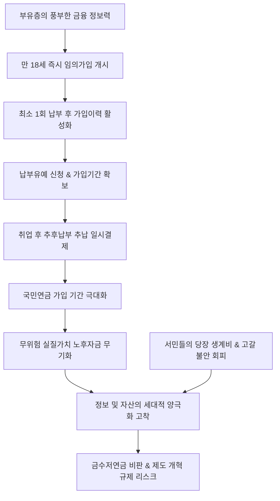

# 금융/연금 분析: 국민연금 10대 임의가입 급증과 강남발 조기 노후준비 및 자산 양극화 심화 분석
## 투자 신호 + 사회적 영향 평가

---

## 📌 기사 기본 정보

- **날짜**: 2026-05-08
- **출처**: 국회 보건복지위원회 김선민 의원실 자료, 이에스더 기자 (중앙일보 등 종합)
- **카테고리**: 경제 > 금융 > 연금/재테크
- **핵심 주제**: 수도권 및 강남 3구의 부유층 부모들을 중심으로 자녀가 만 18세가 되자마자 국민연금에 임의가입시키는 '조기 연금 재테크'가 급증함. 10대 임의가입자가 2년 새 2.5배 늘어난 배경에는 '가입 기간'이 길수록 수령액이 극대화되는 국민연금의 구조를 활용하려는 고도의 금융 전략이 작동함. 이는 정보의 비대칭과 부모의 자산 격차가 자녀의 노후 양극화로 고착화되는 구조적 불평등 현상을 선명하게 드러냄.

**메타데이터**
- 주요 사건: 10대 국민연금 임의가입자 수 2년 만에 2.5배 폭증, 강남 3구의 가입률이 전국 평균의 2배 상회
- 핵심 원인: 국민연금 수령액 산정 시 '가입 기간'의 압도적 중요성 인지, '만 18세 임의가입(최소 1회 납부) → 납부유예 신청 → 취업 후 추후납부(추납)' 우회 재테크 방식 공유
- 주요 주체: 강남 3구 등 수도권 부유층 부모, 만 18세 이상의 학생/청년층, 국민연금공단
- 키워드: 국민연금, 임의가입, 추후납부, 납부유예, 자산양극화, 정보격차, 시간의자본화

---

## 🔍 기사를 통한 투자 신호 추출

### 1단계: 핵심 사건 분해

**What (무엇이 일어났는가?)**
- 자녀가 소득이 없는 학생이더라도 만 18세 법적 의무가입 개시 연령에 달하자마자 부모가 대신 첫 달 보험료(최소 약 4만 2,000원)를 내고 국민연금에 임의가입시키는 비율이 수도권을 중심으로 폭증함. 가입 이력을 먼저 살려둔 후 '납부유예' 상태로 두고, 나중에 자녀가 취업한 뒤 미납한 수년 치를 일시에 내는 '추후납부(추납)' 제도를 결합해 가입 기간을 극대화하는 재테크가 보편화됨.

**When (언제 일어났는가?)**
- 2026-05-08 (국민연금 고갈론 및 개혁에 대한 불안감이 팽배함에도 불구하고, 부유층은 오히려 이를 무위험 확정형 금융 자산으로 간주하고 공격적인 역발상 투자를 감행하는 시기)

**Why (왜 일어났는가?)**
- 국민연금은 민간 보험상품과 달리 물가상승률을 100% 반영하는 국내 유일의 확정 실질가치 자산이며, 수익비가 매우 높음. 특히 수령액을 결정하는 가장 중요한 변수가 '가입 기간'이라는 점을 금융 이해력이 높은 부유층 부모들이 간파했기 때문임.

**Who (누가 주도하는가?)**
- 금융 정보력이 뛰어난 서울 강남 3구(강남·서초·송파) 및 수도권 부유층 자산가 계층

---

### 2단계: 투자 신호 해석

#### A. **긍정적 신호 (Bullish)**

**① 국민연금의 '확정 실질가치 보장 자산'으로서의 가치 재평가**
- **신호**: 부유층의 10대 자녀 국민연금 조기 가입 2.5배 폭증
- **의미**: 연금 개혁 불확실성 속에서도 국민연금이 국가 파산 전에는 절대 디폴트가 나지 않으며, 실질 구매력을 보장하는 '초우량 자본 방어 자산'이라는 신뢰가 부유층 사이에서 입증됨.
- **투자 기회**: 가입 기간을 선제적으로 확보해 두는 것은 개인 포트폴리오 내 무위험 고수익 대체 자산을 선점하는 것과 같음.

**② 공·사적 연금 통합 연계 은퇴 자산관리 컨설팅 시장의 고성장**
- **신호**: 조기 가입 및 추후납부(추납) 제도의 대중화
- **의미**: 국민연금을 기본 베이스로 깔고, 그 위에 퇴직연금, 개인연금(TDF, TIF, 월배당형 ETF)을 정교하게 레이어링하여 생애 현금흐름을 통제하는 '은퇴 자산 리모델링' 비즈니스가 초고속 성장 궤도에 진입함.
- **투자 기회**: 연금 특화 자산배분 상품(TDF) 운용 및 자산관리 플랫폼 서비스를 제공하는 대형 금융사.

---

#### B. **위험 신호 (Bearish)**

**① '금수저 연금' 여론화에 따른 정부의 규제 및 제도 개편 리스크**
- **신호**: 10대 임의가입 상위 15개 지역 중 14곳이 수도권 쏠림, 자산 격차가 노후 양극화로 고착화되는 현상 비판
- **의미**: 형평성 논란이 격화되면 정부가 추후납부(추납) 인정 기간에 제한을 두거나, 소득이 없는 학생층의 임의가입 요건을 까다롭게 변경하는 등 규제 카드를 꺼낼 수 있음.
- **투자 리스크**: 기존의 추납 우회 템플릿만 맹신하고 가입을 차일피일 미루는 청년층의 기회 소실 리스크.

---

### 3단계: 섹터별 투자 기회 매트릭스

#### ✅ **높은 기대도 + 낮은 리스크**

**은퇴 자산관리 전문 지향 자산운용사 및 종합 자문 플랫폼**
- 국민연금 조기 가입 열풍은 국민들의 연금 금융 이해력(Financial Literacy)이 획기적으로 상승하고 있음을 의미합니다. 공적 연금의 높은 기초 체력 위에 개인들이 추가 사적 연금(TDF, 월배당 자산)을 얹으려는 연금 머니무브 현상이 가속화되므로, 생애 자산배분 자문 역량을 갖춘 대형 금융주 및 상장 자산운용사는 장기적이고 안정적인 수수료 매출 증가세를 누리게 됩니다.
- **투자 추천도**: ⭐⭐⭐⭐⭐

---

## 💰 구체적 투자 신호 변환

### 신호 1: 국민연금 조기 임의가입 붐 — 시간의 자본화와 노후 현금흐름 최적화의 시작
- **투자 해석**: 강남 부모들이 자녀에게 현금을 물려주는 대신 '국민연금 가입 기간'을 미리 확보해 주는 것은, 가장 낮은 리스크로 복리 효과와 실질 구매력을 선물하는 고도의 자산 배분 전략입니다. 돈이 지배하는 세상에서 '가입 기간'이라는 시간이 돈을 벌어주는 '시간의 자본화' 템플릿입니다. 투자 관점에서는 개인이 실행할 수 있는 최고의 무위험 연금 재테크 수단이므로 즉시 이수를 권장합니다. 더불어, 이 지식의 대중화는 공적 연금을 보완할 사적 연금(월배당 ETF, TDF 자산) 시장의 폭발을 의미하므로 자산관리 전문 대형 금융사의 가치를 재평가해야 합니다. 단, 자산 불평등 지적에 따른 제도 개정 가능성은 지속적으로 추적할 변수입니다.

---

## 🌍 사회적 영향 평가

### A. 긍정적 사회 영향
- **청년층의 노후 자산 조기 관심 유도**: 10대 및 20대 초반 청년층에게 금융/연금 지식(복리, 물가상승 반영)을 자연스럽게 습득시켜, 국가 전체의 조기 금융 지식수준을 상향시키고 공적 연금의 가입 저변을 단단히 합니다.
- **공적 연금 재정 유동성 보강**: 부유층 자금의 선제적 임의가입 보험료 납입 및 향후 대규모 추후납부(추납) 자금 유입은 단기적으로 연금공단의 재정 유동성을 보강하는 긍정적 기여를 합니다.

### B. 부정적 사회 영향
- **노후 격차가 청년의 출발선에서 고착화**: 정보력과 경제력이 부족한 지방 및 서민층 청년들은 당장 4만 원의 임의가입비나 추납을 감당하지 못해 노후 자산의 심각한 지역적 양극화가 가속화되며, '금수저 연금'이라는 청년층 박탈감을 가중시킵니다.
- **연금 고갈 불안과 부유층 혜택의 불균형**: 연금 재정 건전성 우려로 국민연금 폐지론을 믿고 서민들이 가입을 회피할 때, 오히려 정보와 자본이 넉넉한 계층은 제도의 혜택을 온전히 누려 사회적 신뢰의 양극화를 심화시킵니다.

---

## 🎯 결론: 당신의 투자 전략 수립

- **즉시 실행**: 만 18세 이상 자녀 또는 본인의 국민연금 임의가입(최소금액 약 4만 2,000원 납입) 이력을 즉시 생성하여 가입 개시일을 확보하고, 곧바로 납부유예를 신청하는 실무 프로토콜 완료.
- **3개월 후**: 형평성 논란 확산에 따른 보건복지부의 추후납부(추납) 인정 한도 축소 가능성 및 청년층 첫 달 보험료 국가 매칭 지원 입법 통과 여부 상시 점검. 연금 적립금 급증세가 가파른 자산운용사 TDF 상품군 매입.

---

## 📝 Obsidian 연결 구조

