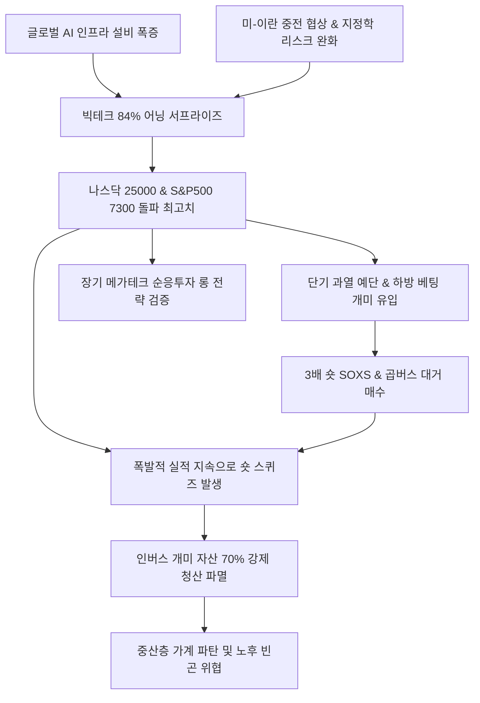

# 증시/투자전략 분析: 미국 증시 사상 최고치 경신과 인버스 ETF 베팅 개미 투자자들의 손실 리스크 분석
## 투자 신호 + 사회적 영향 평가

---

## 📌 기사 기본 정보

- **날짜**: 2026-05-08
- **출처**: 김은령 기자 (머니투데이 경제 보도)
- **카테고리**: 경제 > 금융 > 증시/투자전략
- **핵심 주제**: 나스닥 25,000선 돌파, S&P500 7,300선 돌파 등 유례없는 미국 증시의 역사적 불장 속에서 하락에 베팅한 개인 투자자들의 막대한 손실 사태 분석. 글로벌 AI 컴퓨팅 투자 폭발, 빅테크 기업들의 압도적 어닝 서프라이즈(84% 예상치 상회), 미-이란 휴전 및 종전 협상 급진전 등 매크로 팽창 트렌드를 오판하고 '반도체 3배 인버스(SOXS)'와 국내 '곱버스'에 투기 베팅해 50~70%의 자산이 증발한 레버리지 손실 리스크 및 파생 상품의 구조적 위험성 경고.

**메타데이터**
- 주요 사건: 미국 나스닥 25,000p 및 S&P500 7,300p 동시 돌파 사상 최고치 경신, SOXS 및 곱버스 개인 투자자들의 기록적 손실(-70% 이상)과 강제 청산 속출
- 핵심 원인: AI 르네상스가 주도하는 파괴적인 실적 및 CAPEX 증가 속도 과소평가, 가격 고점 회귀 본능('과열되었으니 내릴 것')에 의존한 무모한 방향성 쏠림, 레버리지 파생 상품의 치명적 설계 한계인 '음(-)의 복리' 가치 침식 간과
- 주요 주체: 서학개미 및 동학개미(개인 투자자), 글로벌 메가테크 기업(M7), 디렉시온(SOXS 운용사)
- 키워드: 미국증시, 사상최고치, 나스닥25000, 인버스ETF, 곱버스, SOXS, 레버리지함정, AI어닝랠리, FOMO

---

## 🔍 기사를 통한 투자 신호 추출

### 1단계: 핵심 사건 분해

**What (무엇이 일어났는가?)**
- 미국 증시가 역사적 초강세 불장을 달성하며 나스닥 2만 5천 고지를 밟음. S&P500의 84%가 실적 어닝 서프라이즈를 터뜨리며 지수를 견인하는 동안, 반대 방향인 반도체 3배 숏(SOXS) 및 지수 곱버스 상품에 수천억 원의 투기 자금을 투입한 개인 투자자들의 자산이 단 한 달 만에 -70% 수준으로 초토화 및 강제 청산되는 손실 리스크가 극대화됨.

**When (언제 일어났는가?)**
- 2026-05-08 (미국 연준 의장으로 내정된 케빈 워시의 매크로 완화적 유동성 신호와 중동 휴전 타결 임박 호재가 겹치며 시장의 팽창 에너지가 최고조에 달한 시점)

**Why (왜 일어났는가?)**
- AI 혁명 도입에 따른 지식 노동의 한계 비용 극감, 그리고 물리적 인프라 대구축(앤트로픽-스페이스X 동맹 등)이 견인하는 '지속 가능한 팽창 우주적 메가 성장 트렌드'를 과거의 낡은 버블 자산 잣대로 오독하여 무리한 투기적 베팅을 감행했기 때문.

**Who (누가 주도하는가?)**
- 단기 고점 인식에 눈이 멀어 무리한 하방 방향성 베팅을 감행한 한계 개인 투자자 진영

---

### 2단계: 투자 신호 해석

#### A. **긍정적 신호 (Bullish)**

**① 실적에 완벽히 지탱받는 AI 주도 메가 팽창 사이클의 강력성 확인**
- **신호**: S&P500 기업 84%의 어닝 서프라이즈 및 지수 사상 최고치 경신
- **의미**: 현재의 역사적 랠리가 2000년대 초 닷컴버블과 같은 무실적 투기 광풍이 아니라, 빅테크의 기하급수적 실적 증명과 무제한적 설비 투자(CAPEX)로 뒷받침되는 진짜 성장 엔진임을 입증함.
- **투자 기회**: 실제 이익 레버리지를 실현하는 글로벌 AI 주도주 및 반도체 벨류체인 핵심 우량 대형주.

**② 지정학 불확실성 소멸에 따른 매크로 안도 랠리 연장선 확보**
- **신호**: 미국-이란 휴전 협상 진전 및 케빈 워시 연준 의장의 정책 정합성
- **의미**: 글로벌 에너지 충격 위기가 해소되고 우호적 유동성 환경이 연장되면서 글로벌 패시브 자금의 위험 선호(Risk-on) 흐름이 장기화될 토대가 다져짐.
- **투자 기회**: 글로벌 1등 메가 테크주 및 미국 대표 주가지수 패시브 롱(Long) ETF.

---

#### B. **위험 신호 (Bearish)**

**① 레버리지 파생 상품의 음(-)의 복리 가치 마모 및 개인 자산 황폐화**
- **신호**: 인버스 3배 및 곱버스 상품 매수 개미들의 대규모 손실 속출
- **의미**: 곱버스나 SOXS와 같은 다배수 파생 상품은 주가가 횡보하기만 해도 수학적으로 가치가 지속 갉아먹히는 파멸적 설계를 지님. 개미들의 자산 몰락은 중장기적으로 가계 유동성 위축과 증시 예탁 자산 증발을 의미해 수급 건전성에 부담을 줌.
- **투자 리스크**: 3배 레버리지 숏 ETF(SOXS, SQQQ) 및 국내 인버스 곱버스 파생 자산의 장기 보유.

---

### 3단계: 섹터별 투자 기회 매트릭스

#### ✅ **높은 기대도 + 낮은 리스크**

**글로벌 AI 혁신 메가 테크사 및 장기 적립형 지수 롱(Long) ETF**
- AI 메가 팽창 사이클의 속도를 감안할 때, 숏 베팅은 시장 지식의 빈곤을 증명하는 자살 행위에 가깝습니다. 실제 100MW 단위 초거대 데이터센터를 구축하며 실적 서프라이즈를 입증하는 지배적 빅테크 M7과 이들을 담은 장기 우량 롱 ETF 상품군은 리스크 대비 기대 가치가 매우 우수합니다.
- **투자 추천도**: ⭐⭐⭐⭐⭐

---

## 💰 구체적 투자 신호 변환

### 신호 1: 나스닥 사상 최고치 돌파 — 메가 팽창장에서 역주행(인버스) 베팅의 치명적 리스크
- **투자 해석**: 나스닥 25,000선 돌파와 S&P500의 84% 어닝 서프라이즈는 AI 문명이 '지식 생산 비용의 원가 파괴'를 통해 영토를 무한히 팽창시키는 빅뱅 국면임을 증명합니다. 단순히 '과열되었다'는 낡은 직관만으로 3배 인버스(SOXS) 및 곱버스에 뛰어든 서학개미들의 -70% 파산 참사는 시장의 팽창 우주적 본질을 거스른 대가입니다. 파생 상품 숏 베팅은 횡보 시 '음의 복리' 가치 침식으로 원금을 녹이는 최악의 투기 함정입니다. 개인 투자자는 시장을 예단하려는 모든 하방 베팅을 철저히 금지해야 하며, 메가 테크 성장 트렌드에 겸손히 동참하여 장기 롱(Long-only) 포트폴리오를 우직하게 사수하는 것이 최상의 생존 공식입니다.

---

## 🌍 사회적 영향 평가

### A. 긍정적 사회 영향
- **혁신 지향 스마트 자본의 고밀도 집적**: 무모한 하방 투기 자금이 청산되고 미래 안보와 기술을 선도하는 초우량 기업들로 국가적 자본이 질서 있게 고농축 수혈되어 차세대 인프라 대전환을 가속화합니다.
- **리스크 관리 및 포트폴리오 다변화의 전 사회적 체득**: 파생 상품의 구조적 위험성에 대한 생생한 대중 교육 효과를 제공하여, 기형적인 레버리지 투기에서 탈피해 건전한 장기 분산 저축형 투자로 개인의 체질이 개선되는 계기를 만듭니다.

### B. 부정적 사회 영향
- **개인 중산층 가계의 가차 없는 자산 파괴**: 한순간에 수천억 원의 서민 투자 원금이 글로벌 자본 시장의 숏 커버링 불쏘시개로 강제 증발함에 따라, 가계 파탄과 노후 은퇴 재정 악화 등 심각한 사회적 생존 위기를 조장합니다.
- **포모(FOMO)와 하방 도박 중독의 투기적 양극화 심화**: 주가 폭등 와중에 최고점 롱 추격 매수로 소외감을 극복하려는 개미와, 대폭락을 고집하며 숏 룰렛에 올인하는 투기적 파편화가 기승을 부려 시장의 건강한 신용 기반이 침식됩니다.

---

## 🎯 결론: 당신의 투자 전략 수립

- **즉시 실행**: 포트폴리오 내 잔존하는 3배 레버리지 숏(SOXS, SQQQ) 및 국내 곱버스 파생 포지션의 무조건적 전량 청산 및 손절 실행. 우상향이 명확한 AI 인프라 장기 롱(Long) 및 지수 분산형 투자로 신속 전환.
- **3개월 후**: 미-이란 종전 서명 세부 절차 및 케빈 워시 연준 의장의 완화적 통화 정책 금리 인하 속도를 관찰하여 매크로 호재 모멘텀의 연장 유효 기간 재평가.

---

## 📝 Obsidian 연결 구조

