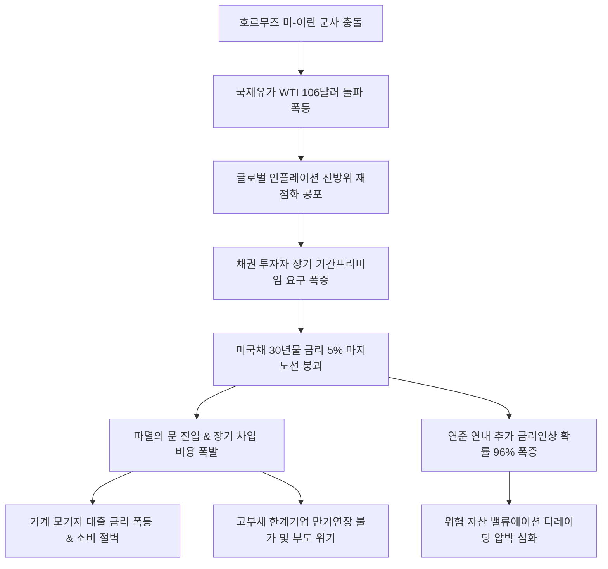

# 금융/채권 분析: 미국채 30년물 금리 5% 돌파와 파멸의 문 경고 및 국제 유가발 인플레이션 공포 분석
## 투자 신호 + 사회적 영향 평가

---

## 📌 기사 기본 정보

- **날짜**: 2026-05-08
- **출처**: 월스트리트저널(WSJ), 시카고상품거래소(CME), 뱅크오브아메리카(BoA) 리포트 종합
- **카테고리**: 경제 > 금융 > 외환/채권
- **핵심 주제**: 미국 장기 금리의 중추인 30년 만기 국채 금리가 심리적 최후 마지노선인 5% 선을 돌파하며 전 세계 금융 시장에 초비상벨이 울림. WTI 배럴당 106달러 및 브렌트유 114달러를 뚫어낸 국제 유가 급등이 핵심 원인으로, 연내 미국 연방준비제도(Fed)의 추가 긴축 확률이 96%까지 폭등함. 이는 가계의 대출 이자와 정부의 재정 이자 부담을 임계치까지 끌어올려 금융 시스템의 구조적 파멸을 유발할 수 있으며 동조화된 한국 국고채 금리 폭등세와 실물 위기 전이 양상 분석.

**메타데이터**
- 주요 사건: 미국채 30년물 수익률 5% 마지노선 붕괴(지난해 7월 이후 최고치), 국제 유가(WTI 106달러, 브렌트유 114달러) 동반 폭등, 연내 연준 추가 긴축 확률 96% 폭증
- 핵심 원인: 호르무즈 해협 미국-이란 군사 긴장 폭발에 따른 석유 공급 차질, 기간 프리미엄(Term Premium) 요구 증가 및 중립금리 상승 기조 안착
- 주요 주체: 연방준비제도(Fed, 닐 카시카리 총재 등), 뱅크오브아메리카(BoA), 한국은행 및 영끌 대출 가계
- 키워드: 미국채30년물, 5퍼센트돌파, 국제유가, 인플레이션, 연준긴축, 기간프리미엄, 파멸의문, 뉴노멀고금리

---

## 🔍 기사를 통한 투자 신호 추출

### 1단계: 핵심 사건 분해

**What (무엇이 일어났는가?)**
- 글로벌 장기 차입 비용의 근간인 30년 만기 미 국채 수익률이 '파멸의 문(Gate of Doom)'으로 통칭되는 5%선을 강하게 돌파함. WTI 유가는 단숨에 배럴당 106달러를 넘어서며 스태그플레이션 우려를 증폭시켰고, 연내 금리 인하 기대가 완전 소멸(인상/동결 확률 96%)하는 금융 대격변에 진입함.

**When (언제 일어났는가?)**
- 2026-05-08 (원유 재고 바닥과 중동 지정학 전쟁 긴장이 동시에 타오르며 에너지발 물가 충격이 금융 시장을 강타한 시기)

**Why (왜 일어났는가?)**
- 지정학 리스크로 인한 공급측 고유가 충격과 경제 블록화(탈세계화) 코스트가 장기물 채권 보유에 따르는 '기간 프리미엄'을 구조적으로 올렸으며, 연준 인사들의 연속적인 매파 발언이 금리 상승 랠리를 부추겼기 때문.

**Who (누가 주도하는가?)**
- 글로벌 인플레이션 장기화를 확신하는 채권 매도 세력 및 원자재 투기 펀드

---

### 2단계: 투자 신호 해석

#### A. **긍정적 신호 (Bullish)**

**① 전통 원자재 유통 및 대체 안보 에너지 밸류체인의 이익 증가 정당화**
- **신호**: WTI 106달러 돌파 및 에너지 안보 긴급 대두
- **의미**: 에너지 고착화는 정유 메이저들의 대규모 재고평가이익을 창출할 뿐만 아니라, 수소 경제나 신재생 에너지로의 인프라 전환 압력을 배가시켜 대체 에너지 섹터의 장기 성장을 정당화함.
- **투자 기회**: 전통 정유 리더주 및 친환경 청정 에너지 원천 기술 기업.

---

#### B. **위험 신호 (Bearish)**

**① 한계 차입 기업 및 고부채 주담대 시장의 도미노 붕괴 리스크**
- **신호**: 미 국채 30년물 금리 5% 마지노선 붕괴
- **의미**: 5% 금리는 글로벌 장기 모기지론의 한계를 설정하는 수치로, 저금리 시절 방대하게 조달해 둔 미국 상업용 부동산 PF 만기 물량과 국내 가계의 가처분 소득을 마비시켜 경기 침체와 한계 자산 부실화를 가속함.
- **투자 리스크**: PF 노출도가 심각한 중소 건설 섹터, 고채무 기술주 및 제2금융권(상호금융 등).

**② 위험 자산 할인율 폭등에 따른 밸류에이션(멀티플) 디레이팅 강제화**
- **신호**: 연내 연준 금리 인상 확률 96% 도달 및 국고채 동반 폭등
- **의미**: 이익 대비 주가 배수를 의미하는 멀티플이 장기 할인율의 폭증으로 강제로 하향 삭감됨. 현금 흐름을 당장 증명하지 못하고 차입으로 연명하는 좀비 성장주들은 최악의 주가 폭락 리스크에 노출됨.
- **투자 리스크**: 고밸류 무실적 바이오, 인공지능 플랫폼 후발 테크사.

---

### 3단계: 섹터별 투자 기회 매트릭스

#### ❌ **낮은 기대도 + 높은 리스크 (적극 회피)**

**고부채 중소형 건설사 및 현금 고갈 좀비 성장주**
- 미 국채 금리 5%의 고금리 고착화(Higher for Longer) 뉴노멀 국면은 부채 의존형 기업들을 가장 먼저 무너뜨릴 '약한 고리'로 만듭니다. 장기 차입 마진이 불가능하고 만기 연장 금리가 폭등하므로 자산 가치 재평가(De-rating) 충격을 정통으로 맞게 되어 적극적 매도 회피가 상책입니다.
- **투자 추천도**: ⭐ (적극 회피)

---

## 💰 구체적 투자 신호 변환

### 신호 1: 미국채 30년물 5% 돌파 — 고금리 뉴노멀 안착과 자산 부채 고강도 다이어트 돌입
- **투자 해석**: 미 장기 금리의 5% 선 붕괴는 지정학적 유가 폭등발 인플레이션이 가세하여 자본의 가격(금리)과 에너지의 가격(유가)이 동시에 수직 상승하는 스태그플레이션적 공포의 발현입니다. 장기물 금리의 5% 안착은 주담대 금리를 사상 최고치로 밀어 올려 실물 소비와 부동산 체력을 붕괴시키는 '파멸의 문'의 입구입니다. 개인 투자자는 고레버리지 고위험 자산 투자를 무조건 중단하고, 신규 채무를 봉쇄하는 '자산 다이어트'를 실행해야 합니다. 포트폴리오는 원가 전가 능력이 확실한 초우량 독점주와 확실한 고금리 혜택을 수취하는 단기 파킹 현금성 자산 위주로 극단적 방어벽을 설계해야 합니다. 에너지 원자재 상승의 헤지 자산 편입 외에는 방어 제일주의를 고수할 시기입니다.

---

## 🌍 사회적 영향 평가

### A. 긍정적 사회 영향
- **부실 좀비 기업 청산을 통한 자본의 생산적 재배치**: 저금리 유동성 파티에 연명하던 부실 기업들의 시장 구조조정을 촉진하여, 국가 한정 유동성이 실질적인 '피지컬 AI' 및 지능화 제조업의 생산성 고도화 부문으로만 쏠리게 하는 체질 강화 유도.
- **신에너지 공급망 및 인프라 전환 가속**: 초고유가 부담이 강제적 에너지 체질 개선 촉진제가 되어 탄소 의존형 산업 구조에서 탈피하고 청정 대체 인프라(수소, 태양광 등) 보급 속도를 획기적으로 앞당김.

### B. 부정적 사회 영향
- **영끌 대출자 파산과 중산층 몰락**: 한국 국고채 동조화로 대출 금리가 급격히 인하될 희망이 꺾이면서, 한계에 달한 중산층 영끌 가계들의 주담대 상환 실패로 인한 파산과 급격한 내수 소비 절벽 현상 초래.
- **재정 지출 마비로 인한 취약 계층의 각자도생**: 정부 채권의 이자 지급 비용 급증은 정부 재정 건전성을 위협하여, 경기 침체 시 실업자 및 빈곤층을 지원할 공적 복지 재원 삭감으로 이어져 취약 계층의 사회적 생존 한계 조장.

---

## 🎯 결론: 당신의 투자 전략 수립

- **즉시 실행**: 변동성 레버리지 투자를 모두 정리하고 한계 고부채 건설/유통주 매도. 포트폴리오를 초우량 단기 국채 금리 수혜 파킹 자산으로 이동하여 고금리 시대의 확정 이자 마진 확보.
- **3개월 후**: 미 연방준비제도 닐 카시카리 총재 등 매파적 리더들의 연내 추가 인상 현실화 강도 및 WTI 110달러 마지노선 고착 여부를 추적하여 위험 자산 편입 비중 조율.

---

## 📝 Obsidian 연결 구조

