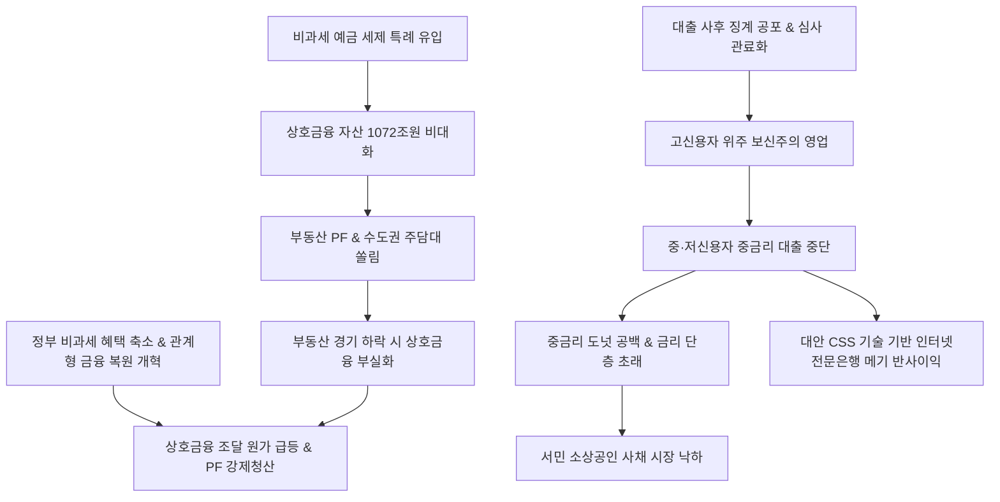

# 금융/금융개혁 분析: 상호금융의 정체성 상실과 부동산 금융 쏠림 및 서민금융기관의 관계형 금융 복원 과제 분석
## 투자 신호 + 사회적 영향 평가

---

## 📌 기사 기본 정보

- **날짜**: 2026-05-08
- **출처**: 권화순·이창섭 기자 (머니투데이 MT리포트)
- **카테고리**: 경제 > 금융 > 서민금융/금융개혁
- **핵심 주제**: 비과세 예금 혜택에 힘입어 자산을 1,072조 원까지 불린 농협, 신협, 새마을금고 등 상호금융권이 본연의 목적인 서민 중금리 공급과 '관계형 금융'은 외면하고 부동산 PF(프로젝트파이낸싱)와 주택담보대출에 자금을 몰아주는 기형적 보신 영업을 단행함. 이로 인해 4~10%대 중금리 대출 공급망이 소멸하여 서민들이 연 20%의 사채 시장으로 내몰리는 '금리 단층'이 심화되자, 정부는 비과세 특례 제한과 징계 면책 제도를 연계한 관계형 금융 강제 복원 등 메가톤급 상호금융 구조개혁에 돌입함.

**메타데이터**
- 주요 사건: 상호금융권 자산 1,072조 원 돌파와 부동산 금융 집중(비조합원 주담대 및 PF 23.7%), 서민 중금리 대출 연 1조 원 급감 및 사금융 추락, 정부의 상호금융 비과세 혜택 전면 재조정 및 포용금융 평가체계 도입
- 핵심 원인: 대출 부실 심사 사후 책임 추궁 공포에 따른 조합 대출 심사역들의 극단적 관료화, 지역 데이터(정성 평판 등) 상실 및 시중은행 모방 보신주의, 부동산 쏠림에 의한 세제 특혜의 대기업/개발 사유화
- 주요 주체: 금융위원회/금융감독원, 상호금융조합(농·수·신협, 새마을금고), 중·저신용 조합원
- 키워드: 상호금융, 관계형금융, 서민금융, 금리단층, 부동산PF쏠림, 비과세혜택, 중금리공백, 금융개혁

---

## 🔍 기사를 통한 투자 신호 추출

### 1단계: 핵심 사건 분해

**What (무엇이 일어났는가?)**
- 국가의 비과세 예금 혜택을 수취하며 1,000조 원대의 공룡 금융기관으로 등극한 상호금융권과 저축은행이 중·저신용 조합원을 위한 대출 사다리를 전면 축소함. 대신 안전한 고신용자 주담대와 단기 고수익 부동산 PF에 자본을 쏠아 넣어 서민 대출 시장의 '도넛(공백) 현상'을 가속화함. 서민들의 연쇄 파산 위기가 고조되자 청와대 정책실 등 금융 당국이 비과세 감면 축소라는 생사여탈권을 지렛대 삼아 강력한 구조개혁을 공식 선포함.

**When (언제 일어났는가?)**
- 2026-05-08 (고금리 장기화 속 부동산 PF 경색 리스크가 임계점에 도달하고, 서민층의 자영업 연쇄 부도가 심화되는 거시적 긴장 시기)

**Why (왜 일어났는가?)**
- 전통적인 '마을 평판 및 거래 관계' 기반의 정성적 데이터 평가(관계형 금융)가 차가운 정량적 신용 평점 시스템에 밀려 망각되었고, 부실 대출 집행 시 면책되는 제도가 미비하여 실무자들이 부동산 담보 대출에만 안주했기 때문.

**Who (누가 주도하는가?)**
- 이재명 정부 청와대 정책실(김용범 정책실장) 및 금융 포용성 회복을 꾀하는 정무 라인

---

### 2단계: 투자 신호 해석

#### A. **긍정적 신호 (Bullish)**

**① 대안 CSS 기술력을 장착한 인터넷전문은행 진역의 우량 중금리 시장 영토 고속 잠식**
- **신호**: 상호금융/저축은행의 중금리 신용대출 1조 원 급감 공백 발생
- **의미**: 1,000조 원 상호금융이 징계 공포로 버려버린 4~10%대 회색지대(Gray Zone) 서민 대출 수요를 정교한 AI 대안신용평가(CSS) 기술을 확보한 인터넷은행 및 핀테크 사업자들이 아무런 경쟁 없이 독점 선점하여 고속 성장할 발판이 열림.
- **투자 기회**: 우수한 씬파일러 데이터 평가 엔진을 보유한 대형 인터넷전문은행 주식 및 핀테크 기술 서비스 기업.

---

#### B. **위험 신호 (Bearish)**

**① 비과세 혜택 폐지 본격화 시 상호금융 자금 조달 가성비 상실 및 2금융 신용 경색**
- **신호**: 정부의 상호금융 구조개혁 및 비과세 예금 한도 제한 검토
- **의미**: 상호금융 자금 조달의 핵심 원천인 비과세 특혜가 줄어들면, 2금융권 전반의 조달 원가가 급상승하여 유동성이 마르게 됨. 이는 보유 중인 위험 부동산 PF 브릿지론 자산의 강제 덤핑 매각으로 이어져 건설 및 부동산 채권 시장에 연쇄 충격을 줄 수 있음.
- **투자 리스크**: 상호금융 부동산 PF 잔고 노출도가 높은 지방 건설 대형주 및 부실 PF 채권 노출도가 큰 비은행 금융사.

---

### 3단계: 섹터별 투자 기회 매트릭스

#### ✅ **높은 기대도 + 낮은 리스크**

**포용금융 수혜를 입는 1등 인터넷전문은행 지주사**
- 정부가 제2금융권(상호금융)을 규제 압박하는 동시에, 서민 금융 사다리 메기 역할을 인터넷은행에 강하게 주문하고 있습니다. 상호금융의 보신주의로 밀려난 우량한 중·저신용자들이 인터넷은행 대안 대출로 대거 흡수되므로 대규모 예대 마진 확대와 리스크 분산 성과를 동시에 획득하여 기대 효용이 독보적입니다.
- **투자 추천도**: ⭐⭐⭐⭐⭐

---

## 💰 구체적 투자 신호 변환

### 신호 1: 상호금융 정체성 개혁 선언 — 1,000조 자본 유동성의 부동산 차단과 대안 금융의 대두
- **투자 해석**: 상호금융의 1,072조 원 자산 비대화와 중금리 공백은 2금융권의 무분별한 부동산 대출 파티가 끝나고 정부의 강제적인 '세제 불이익' 회수 국면이 도래했음을 뜻하는 금융 개혁 신호입니다. 비과세 감면 일몰 및 축소가 현실화되면 2금융의 자금 조달 파이프라인이 훼손되어 부동산 PF 강제 청산 압박이 가중될 것입니다. 투자자는 상호금융 발 부동산 충격 리스크를 방어해야 하며, 역설적으로 상호금융이 팽개친 '중금리 단층' 영토를 데이터(CSS)로 빠르게 독점 중인 인터넷전문은행 및 핀테크 리더들을 포트폴리오의 확실한 핵심 대안주로 매수해야 합니다. 아날로그 관계가 망각된 금융 공백은 오직 테크와 정밀 데이터가 대체하게 됩니다.

---

## 🌍 사회적 영향 평가

### A. 긍정적 사회 영향
- **서민 금융 안전망 재건과 사채 노출 방지**: 사후 부실 징계 면책 및 예대율 완화 등 인센티브 제공을 통해 관계형 금융이 복원되면, 일선 소상공인들이 고금리 사채업자의 불법 추심 위협에 직면하지 않고 제도권 내에서 자금 사다리를 복원하게 돕습니다.
- **부동산 투기 금융의 종식과 소상공인 생태계 환원**: 도시 빌딩 투기나 무분별한 지방 PF에 낭비되던 거대 공적 예금이 강제로 환수되어 지역 사회의 창업, 혁신 제조, 청년 창업 활성화로 재배선되는 생산적 금융 순환 고리를 만듭니다.

### B. 부정적 사회 영향
- **조달 가성비 훼손에 따른 지역 단위 신용협동조합 연쇄 부실**: 정부의 세제 특혜 삭감이 급격하게 이뤄질 경우 상호금융의 급격한 예금 이탈과 대출 부실화가 동시에 겹쳐, 지역 농가나 영세 상인들의 마을 예금 뱅크런 사태 등 지역 금융 안정망의 연쇄 붕괴 위험 존재.
- **신용 평가 맹신에 따른 진정한 관계형 금융의 장기적 쇠퇴**: 상호금융조합마저 시중은행의 고도화된 정량적 CSS에 전적으로 의존하게 될 시, 신용 점수가 아예 산출되지 않는 초취약 계층(신파일러 중 최하단)은 지역 공동체 자금 공급에서 영구 배제되는 사회적 냉대 문제 발생.

---

## 🎯 결론: 당신의 투자 전략 수립

- **즉시 실행**: 상호금융권 우발 채무 노출 비중이 큰 지방 건설주 및 저축은행 후순위 채권 전량 매도. 상호금융의 여신 공백을 기회로 흡수하여 대안 신용 대출 규모를 넓히는 메이저 [[인터넷전문은행 지주사]] 매수.
- **3개월 후**: 정부의 상호금융 비과세 폐지 세제개편 법안 상정 일정을 확인하고, 2금융권 부동산 PF 연쇄 청산에 따른 건설 공급망 부실 노출 추이 매월 모니터링하여 방어망 조율.

---

## 📝 Obsidian 연결 구조

