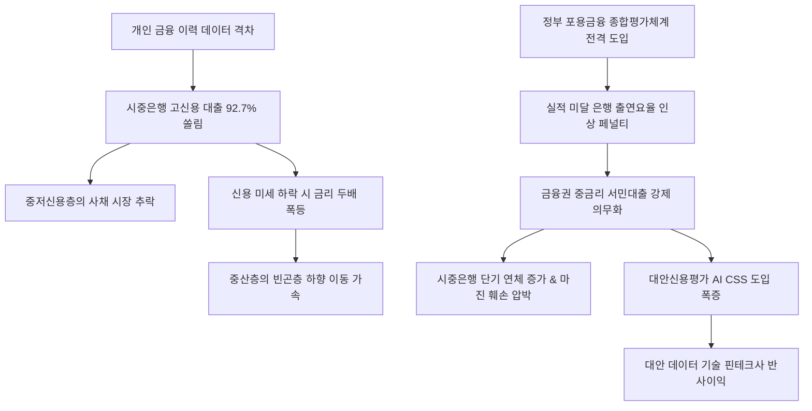

# 금융/포용금융 분析: 신용계급사회와 금리 절벽 및 포용금융 평가체계 도입을 통한 대출 사다리 복원 전략 분석
## 투자 신호 + 사회적 영향 평가

---

## 📌 기사 기본 정보

- **날짜**: 2026-05-08
- **출처**: 권화순 기자 (머니투데이 MT리포트)
- **카테고리**: 경제 > 금융 > 포용금융
- **핵심 주제**: 대한민국 시중은행 대출의 92.7%가 고신용자에게만 집중되며 발생한 극심한 '신용계급사회'와 '금리 절벽(단층)' 위기 분석. 신용등급의 미세한 하락만으로도 대출 금리가 2배 이상 뛰어올라 서민층이 제도권 밖 사채 시장으로 고꾸라지자, 정부는 은행권의 고신용자 위주 안일한 영업에 페널티(출연요율 연동)를 부과하는 '포용금융 종합평가체계'를 공식 도입함. 단순 정량 평가 맹신 관행을 타파하고 대안 신용평가(AI CSS) 기술 도입을 강제해 끊어진 대출 사다리를 복원하는 정책적 드라이브 해부.

**메타데이터**
- 주요 사건: 시중은행 대출의 92.7%가 고신용자(700점 이상)에 쏠리는 현상 지적, 포용금융 실적과 은행 출연요율을 연동해 페널티를 부과하는 포용금융 종합평가체계 도입 발표, 인터넷전문은행의 설립 취지(중저신용 공급) 퇴색 경고
- 핵심 원인: 금융 거래 이력 부족으로 소외받는 중저신용자(씬파일러)의 정량 평가 불이익, 징계 공포로 인한 전통 은행권의 심사 보신주의 및 주담대 쏠림
- 주요 주체: 금융위원회/금융감독원, 시중은행 및 인터넷전문은행, 중저신용 금융 취약층
- 키워드: 신용계급사회, 금리절벽, 포용금융, 대출사다리, 금융양극화, 대안신용평가, 금융포용

---

## 🔍 기사를 통한 투자 신호 추출

### 1단계: 핵심 사건 분해

**What (무엇이 일어났는가?)**
- 은행권의 가혹한 고신용 쏠림으로 4~10%대 중금리 대출 시장이 통째로 붕괴되고 서민들의 사채 전락이 속출하자, 이재명 정부 금융당국은 '포용금융 종합평가체계'를 전격 시행하기로 함. 은행의 중금리 공급 실적, 서민금융 지원 성과를 종합 점수화하여 출연요율(벌금 및 분담금 성격)을 차등하고 규제상의 직간접적 패널티를 부여하는 등 자본의 규칙을 강제로 수정하기 시작함.

**When (언제 일어났는가?)**
- 2026-05-08 (서민 자영업자 연쇄 연체 및 가계 부채 리스크가 임계점에 도달해 공적 연대와 금융 민주주의 복원 요구가 분출한 거시적 시점)

**Why (왜 일어났는가?)**
- 서민 금융 메기 역할로 출범한 인터넷전문은행마저 시중은행의 고신용 주담대 영업 방식을 추종하며 자본의 양극화를 방치했다는 정무적 비판이 임계치를 넘어섰기 때문임.

**Who (누가 주도하는가?)**
- 금융위원회 주도의 금융시장 감시 부서 및 서민 금융 사다리 재건 정책 추진 연합

---

### 2단계: 투자 신호 해석

#### A. **긍정적 신호 (Bullish)**

**① 비금융 빅데이터 결합형 대안 신용평가(AI CSS) 기술 소유 핀테크 진영의 매출 폭등**
- **신호**: 금융위원회의 대안평가 모델 고도화 강제 지침 및 포용평가 감점 회피 필요성 대두
- **의미**: 페널티를 회피해야 하는 시중 은행들과 인터넷은행들이 부실을 내지 않으면서도 중저신용자를 발굴하기 위해 통신 정보, 유통 정보, 조합 활동 데이터가 결합된 융합 CSS 기술을 즉시 고가에 구매·탑재해야 함.
- **투자 기회**: 정교한 AI 기반 씬파일러 신용 등급 발굴 기술을 확보한 특화 테크핀 주식.

---

#### B. **위험 신호 (Bearish)**

**① 타율적 리스크 감수에 따른 은행권의 잠재 부실 채권(NPL) 가중 및 주주배당 훼손**
- **신호**: 은행 출연요율 페널티 부과 기반 포용금융 종합평가 가동
- **의미**: 대안 평가 모델이 미비한 상태에서 억지로 중저신용 대출 쿼터를 채워야 하는 시중 은행과 지방 은행들은 향후 대규모 부실 대손충당금 적립 부담을 안게 되며, 이는 순이자마진(NIM) 축소와 배당금 축소로 이어질 수 있음.
- **투자 리스크**: 자본 비율이 타이트하고 AI CSS 엔진 고도화 속도가 더딘 일부 대형/지방 금융주.

---

### 3단계: 섹터별 투자 기회 매트릭스

#### ✅ **높은 기대도 + 낮은 리스크**

**대안 CSS 기술력 우위를 지닌 인터넷전문은행 및 특화 테크핀 플랫폼**
- 정부가 제2금융권의 비과세 혜택을 깎는 동시에 1금융권에는 서민 대출을 강제 할당하는 과도기적 규제 환경을 조성하고 있습니다. 비금융 데이터를 정밀 분석해 우량한 중저신용자를 안전하게 분별해내는 혁신 기술 핀테크 및 독자 CSS 플랫폼은 연체율 통제와 함께 엄청난 신규 고객을 선점하여 독보적 수혜를 입게 됩니다.
- **투자 추천도**: ⭐⭐⭐⭐⭐

---

## 💰 구체적 투자 신호 변환

### 신호 1: 포용금융 평가 도입 — 신용계급사회 타파와 대안 CSS 혁신 테크핀의 독주 국면 개막
- **투자 해석**: 포용금융 종합평가체계 시행은 금융사의 안전한 고신용 영업에 강력한 정무적 불이익을 연계하여 게임의 판을 강제로 재편하는 강력한 금융 개혁 신호입니다. 기존 은행권에는 충당금 압박 요인으로 작동하겠지만, 비금융 이력 소외층을 발굴할 '대안신용평가(AI CSS)' 솔루션 시장의 기하급수적 팽창을 뜻합니다. 투자자는 규제 압박에 노출된 일부 전통 금융지주사의 비중을 세심하게 조절하는 반면, 통신, 카드, 유통 빅데이터 융합 CSS 역량에서 확실한 초격차를 증명 중인 1등 인터넷전문은행 및 핀테크 기술사로 포트폴리오를 빠르게 리밸런싱할 것을 추천합니다. 신용 점수 장벽이 허물어지는 공백은 오직 고도화된 AI 기술로만 대체됩니다.

---

## 🌍 사회적 영향 평가

### A. 긍정적 사회 영향
- **한계 차주의 사채 추락 완충 및 중산층 붕괴 예방**: 일시적 신용 하락만으로 불법 사금융의 폭력적 늪에 빠지던 서민 자영업자들을 제도권 중금리로 흡수하여 가계 파탄을 막고 자산 이동의 건강성을 수호합니다.
- **포용적 신용 민주주의 인프라 정착**: 금융 거래 이력이 단절되어 지불 능력이 있음에도 불이익을 당하던 주부, 학생, 프리랜서 등 씬파일러들이 억울한 '금리 절벽' 대우를 받지 않는 선진 데이터 복지 사회로 이행합니다.

### B. 부정적 사회 영향
- **무리한 대출 집행에 따른 은행 건전성 및 국가 신용 리스크**: 금융 당국의 억지 할당 압박에 밀려 엄밀한 상환 능력 검증 없이 집행된 중저신용 대출이 향후 매크로 충격 시 연쇄 연체를 유발해, 은행권 부도 및 국가 전체적인 공적 구제금융 재정 낭비 초래 위험.
- **할당 충족을 위한 꼼수 대출 만연**: 실질적인 서민 지원 대신 일시적 편법 대출 상품을 생성하여 서류상의 쿼터만 채운 뒤 리스크를 다른 곳으로 전가하는 금융권의 규제 회피형 왜곡 현상 발생.

---

## 🎯 결론: 당신의 투자 전략 수립

- **즉시 실행**: 포용금융 평가 부담으로 인해 마진 훼손 우려가 큰 대형 및 지방 시중 은행주를 일부 비중 축소하고, 독보적인 빅데이터 css 평가 모델로 포용금융 평점 우위를 가져갈 메이저 [[인터넷전문은행]] 추가 매수.
- **3개월 후**: 정부의 포용금융 출연요율 적용 세부 수치와 인터넷은행들의 실제 중저신용 대출 건전성 흐름(연체율 제어 성과)을 상호 대조하여 포트폴리오 방어선 리튜닝.

---

## 📝 Obsidian 연결 구조

