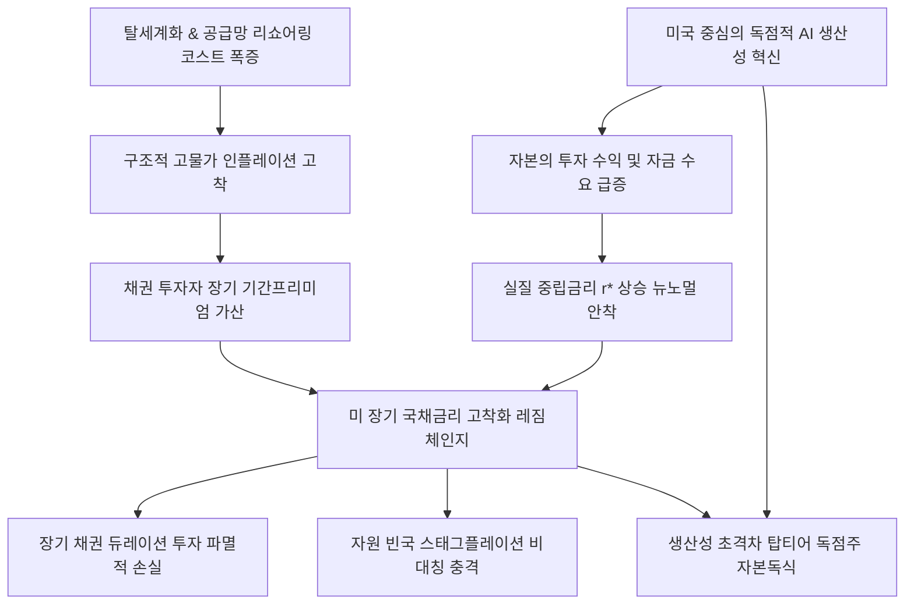

# 금융/매크로 분析: 이란 전쟁발 금리 상승 압력과 탈세계화 및 생산성 혁신의 비대칭적 충격 분석
## 투자 신호 + 사회적 영향 평가

---

## 📌 기사 기본 정보

- **날짜**: 2026-05-08
- **출처**: 중앙일보 소날 데사이의 마켓 나우 (프랭클린템플턴 채권 부문 최고투자책임자 칼럼)
- **카테고리**: 경제 > 금융 > 매크로/외환
- **핵심 주제**: 미국-이란 간 지정학적 전쟁 위기 상황에서 시장의 단기 낙낙론 이면에 도사린 거대한 구조적 매크로 레짐 체인지(Regime Change) 분석. 공급망 지역화(탈세계화)가 유발하는 영구 인플레이션 압박과, 인공지능(AI) 등 미국 주도의 생산성 혁신이 경기를 자극도 억제도 하지 않는 실질 중립금리(r*) 자체를 높이는 '생산성의 역설' 진단. 이에 따라 고금리 기조가 장기 고착화되는 고금리 뉴노멀 시대가 열렸으며, 국가 및 산업별 성장 비대칭성에 대비한 듀레이션 관리 및 펀더멘털 기반 포트폴리오 재편 과제 해부.

**메타데이터**
- 주요 사건: 미국-이란 전쟁 장기화에 따른 에너지 공급망 영구 타격, 글로벌 중립금리(r*) 상승 및 채권 수익률 기간 프리미엄(Term Premium) 가산, IMF의 스태그플레이션 시나리오 경고
- 핵심 원인: 리쇼어링(Reshoring) 및 블록화에 따른 공급망 다변화 비용의 영구 고착화, 미국의 독점적 AI 인프라 대구축이 견인하는 자본 투자 수요 폭증 및 중립금리 기저 상승
- 주요 주체: 소날 데사이(프랭클린템플턴 채권 CIO), 미국 연방준비제도(Fed), 국제통화기금(IMF)
- 키워드: 이란전쟁, 중립금리, 탈세계화, 기간프리미엄, 레짐체인지, 비대칭충격, 고금리고착화, 생산성의역설

---

## 🔍 기사를 통한 투자 신호 추출

### 1단계: 핵심 사건 분해

**What (무엇이 일어났는가?)**
- 지정학적 긴장에도 주가가 사상 최고치를 경신하는 기묘한 랠리 속에서, 실물 채권 매도 압력이 가중되며 미 국채 장기 금리가 영구 고착화되는 구조적 변화 발생. 탈세계화에 의한 생산비 상승 압박과 미국의 독점적 AI 호황에 의한 자금 수요 폭증이 실질 중립금리를 역사적 상단으로 밀어 올려 고금리가 일시적 현상이 아닌 장기 기후(뉴 노멀)로 정착됨.

**When (언제 일어났는가?)**
- 2026-05-08 (WTI 유가가 106달러를 돌파하고 미 장기 금리가 5.0%를 뚫으며 매크로 레짐 체인지 인식이 시장 전체로 침투한 시점)

**Why (왜 일어났는가?)**
- 자원 비축과 리쇼어링 코스트가 고물가를 고착화시키고, AI 혁신으로 기업들의 실질 투자 수익률이 올라가 자금 조달 수요가 마르지 않기 때문임.

**Who (누가 주도하는가?)**
- 프랭클린템플턴을 비롯한 매크로 채권 시장의 메이저 탑티어 전술 운용역들

---

### 2단계: 투자 신호 해석

#### A. **긍정적 신호 (Bullish)**

**① 생산성 혁신 독점국(미국) 및 AI 1등 기술 패권 기업의 비대칭적 성장 지배력**
- **신호**: 미국 중심의 차별적 생산성 혁신 사이클 작동
- **의미**: 고금리 레짐 체인지 하에서도 비용 상승 압박을 'AI 생산성 극대화'로 돌파하며 고수익을 유지할 수 있는 미국 빅테크 및 핵심 인프라 리더들은 타국/타사 대비 성장의 비대칭적 격차를 벌려 자본 독식을 가속함.
- **투자 기회**: 실질 중립금리 상승을 이기는 미국 탑티어 테크 기업 및 AI 수혜 반도체 대장주.

---

#### B. **위험 신호 (Bearish)**

**① 저금리 평균 회귀를 맹신한 채권 듀레이션(장기물) 투자의 파멸적 손실**
- **신호**: 실질 중립금리(r*) 상향 및 기간 프리미엄의 장기 가산 고착화
- **의미**: 과거 10년의 초저금리 시대로 주가가 회귀할 것이라 오판하고 초장기 국채나 저성과 한계 기업에 자본을 묶어둔 포트폴리오는 채권 가격 급락과 재평가 하락(De-rating)으로 영구 손실을 입을 위험이 큼.
- **투자 리스크**: 만기 10년 이상의 초장기 채권 상품 및 고부채 좀비 성장주.

**② 비생산성 혁신 국가(자원 빈국)의 비대칭적 스태그플레이션 충격 가중**
- **신호**: 공급망 지역화 비용 상승과 국가별 양극화 심화
- **의미**: 원유 의존도가 절대적이고 AI 등 생산성 기초 체력이 취약한 국가(예: 대한민국 등)는 고유가 폭탄과 고금리 자본 유출이라는 최악의 이중고 스태그플레이션 상황을 장기 감내해야 함.
- **투자 리스크**: 원화 기반 전통 자산 및 수출 한계 제조 기업군.

---

### 3단계: 섹터별 투자 기회 매트릭스

#### ✅ **높은 기대도 + 낮은 리스크**

**미국 생산성 초격차 메가테크주 및 단기 고금리 확정 수혜 달러 파킹 자산**
- 실질 중립금리 r*가 올라간 뉴 노멀 레짐 체인지에서는 과거의 밸류에이션 평가 배수를 버려야 합니다. 높은 자본 원가를 가볍게 압도하는 실적 성장률을 증명하는 미국의 1등 빅테크와, 고금리 혜택을 손실 없이 수취하는 단기 국채 및 고금리 달러 파킹 자산만이 비대칭적 리스크 구간에서 독보적인 방어 능력을 발휘합니다.
- **투자 추천도**: ⭐⭐⭐⭐⭐

---

## 💰 구체적 투자 신호 변환

### 신호 1: 글로벌 거시 레짐 체인지 안착 — 세계화 퇴조와 AI 생산성 호황이 끄는 고금리 뉴노멀
- **투자 해석**: 소날 데사이 CIO의 지배구조 분석은 현재의 고금리가 스쳐 지나가는 인플레이션 소나기가 아니라, 세계화 후퇴(공급망 지역화 비용 폭증)와 AI 생산성 혁신(자본 수요 및 중립금리 상승)이 영구 결합된 '바뀐 기후'임을 알립니다. 과거의 저금리 평균 회귀 기대에 기반한 초장기 채권(듀레이션 10년 이상) 매수를 중단하고, 자본의 가격(금리)을 실적으로 이기는 미국 1등 테크 기업 위주로 포트폴리오를 다변화해야 합니다. 특히 자원 빈국인 한국의 경우 금리와 물가의 동조 상승 압박으로 스태그플레이션 강도가 더할 것이므로, 원화 자산 비중을 정교히 제어하고 미 달러 기반 생산성 자산의 편입률을 유지할 것을 강력히 권고합니다.

---

## 🌍 사회적 영향 평가

### A. 긍정적 사회 영향
- **혁신 지식 산업으로의 자본 생산성 재배치**: 무임승차 부채 거품이 청산되고, 실질적인 인류 문명의 한계 비용을 파괴하는 '피지컬 AI' 및 지능형 생산성 기술 기업으로만 글로벌 스마트 자본이 고밀도로 선택 집중됨.
- **자원 순환망 및 대체 안보 인프라의 조기 안착**: 에너지 고비용 충격이 강제적 체질 개선 촉진제가 되어 탄소 의존형 산업에서 탈피하고 청정 대체 인프라(수소, 재생에너지) 및 자원 리사이클링(순환경제) 밸류체인 구축 속도를 10배 이상 가속화함.

### B. 부정적 사회 영향
- **국가 간/계층 간 K자 양극화의 영구적 고착화**: 자원과 AI 기술 패권을 쥔 독점국(미국 등)은 초격차 지배력을 누리는 반면, 원자재 의존도가 높고 기술 혁신에서 소외된 신흥국/취약국은 빚더미 이자 지옥에 갇혀 영구 도태되는 사회적 불평등 심화.
- **대중 이자 부담 급증에 따른 복지망 붕괴**: 국가의 재정 이자 지급 코스트 폭증은 재정 건전성을 위협하여, 경기 침체 시 실업자 및 소외 서민층을 지원할 최소한의 복지 예산마저 고갈시키는 국가 안전망 마비 초래.

---

## 🎯 결론: 당신의 투자 전략 수립

- **즉시 실행**: 만기 10년 이상의 장기 국채 및 부채 비율이 높은 한계 기업 비중 축소. 자본 원가를 생산성으로 상쇄하는 [[미국 1등 메가테크주]] 및 고금리를 안전하게 누릴 수 있는 단기 달러 파킹 자산으로 리밸런싱.
- **3개월 후**: 미 연준의 실질 중립금리 r* 상향 조정 논의 흐름과 탈세계화 리쇼어링 비용의 실질 미국 소비자 물가(CPI) 안착 비율을 추적하여 위험 자산 방어선 강도 재정비.

---

## 📝 Obsidian 연결 구조

