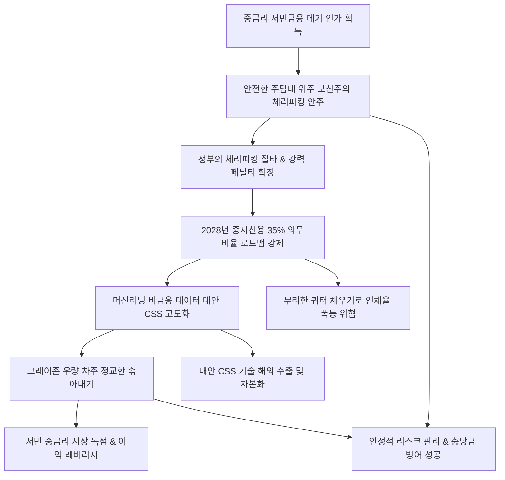

# 금융/인터넷은행 분析: 인터넷전문은행의 설립 취지와 주담대 쏠림 및 대안 신용평가 모델을 통한 메기 역할론 분석
## 투자 신호 + 사회적 영향 평가

---

## 📌 기사 기본 정보

- **날짜**: 2026-05-08
- **출처**: 금융권 종합 취재 (머니투데이 분석 기사)
- **카테고리**: Economic > Finance > 인터넷전문은행/CSS기술
- **핵심 주제**: 출범 10주년을 맞이한 인터넷전문은행 3사(카카오·케이·토스뱅크)의 중금리대출 설립 취지 퇴색과 안전한 주택담보대출 편중(체리피킹) 영업에 대한 당국의 강력한 경고 및 규제 흐름 분석. 이에 대응하여 인뱅 3사가 머신러닝과 비금융 빅데이터를 결합한 독자적 대안 신용평가 모델(CSS)을 고도화하여 기존 시중은행권에서 소외받던 '그레이존' 우량 고객을 발굴하고, 기술 혁신의 진정한 메기 효과를 증명해야 하는 서바이벌 과제 분석.

**메타데이터**
- 주요 사건: 인터넷은행의 주담대 쏠림에 대한 정부의 강력한 페널티 예고 및 비판 여론 비등, 2028년까지 중저신용자 대출 비중 35% 의무화 로드맵 강제, 인뱅 3사의 독자 대안 CSS(카카오뱅크스코어, 케이뱅크 CSS 3.0, 토스 스코어링) 고도화 및 실전 배치
- 핵심 원인: 부실 통제와 안정적 캐시카우 확보를 위한 담보 대출 편중주의, 대안 데이터 평가 모델의 위기 대응 변별력 검증 필요성
- 주요 주체: 금융위원회/금융감독원, 인터넷은행 3사(카카오뱅크, 케이뱅크, 토스뱅크), 중저신용(그레이존) 차주
- 키워드: 인터넷전문은행, 주담대쏠림, 체리피킹, 대안신용평가, CSS고도화, 그레이존, 메기효과, 포용금융

---

## 🔍 기사를 통한 투자 신호 추출

### 1단계: 핵심 사건 분해

**What (무엇이 일어났는가?)**
- 설립 사명인 '서민 중금리 사다리'를 외면하고 안전한 주택 관련 담보 대출 위주 보신 영업에만 몰두했다는 당국의 혹독한 비판과 함께, 인터넷은행의 대출 비중을 강제 조정하는 규제 패널티가 확정됨. 인뱅 3사는 이에 정량 평가 소외층인 '그레이존'을 기교적으로 살려내는 독자적 AI CSS(신용평가 시스템) 모델을 앞세워 본연의 메기 가치를 입증해야 하는 기술 경쟁에 돌입함.

**When (언제 일어났는가?)**
- 2026-05-08 (제2금융권인 상호금융의 세제 혜택 축소 및 1금융권 포용금융 평가 강제화 등 자본 유동성의 지역적·서민적 재배선 개혁이 맞물린 중차대한 시기)

**Why (왜 일어났는가?)**
- 자본의 수익 추구 속성상 부실 연체율을 통제하기 위해 주담대 확장에만 매달렸으나, 이는 시중은행과의 차별성(메기 혁신성)을 상실하게 하는 요인이 되었기 때문임.

**Who (누가 주도하는가?)**
- 카카오·케이·토스뱅크 3사의 기술 개발 센터 및 금융 리스크 통제 정책 라인

---

### 2단계: 투자 신호 해석

#### A. **긍정적 신호 (Bullish)**

**① 독자적 머신러닝 대안 CSS 모델 가치 제고와 무형 기술의 'IP 자본화' 본격화**
- **신호**: 인뱅 3사의 독자 대안 CSS 플랫폼 고도화 및 그레이존 우량 고객 발굴
- **의미**: 담보나 전통 평점이 부족한 중저신용자를 머신러닝으로 솎아내 우량 차주로 정제하는 CSS는 쓰레기 더미에서 금을 캐내는 '자본 리사이클링'과 같음. 이 알고리즘 신용 주권이 입증되면 시중은행에 라이선스를 공급하거나 신흥국 테크핀 시장에 수출할 강력한 지적 자산이 됨.
- **투자 기회**: 비금융 데이터 css 스코어링 시스템을 독점 완성하여 이익과 기술 수출을 동시에 겨냥하는 메이저 [[인터넷전문은행]] 및 지주사.

**② 타 서민금융사(상호금융/저축은행)의 규제 퇴출에 따른 고마진 틈새 시장 독식**
- **신호**: 상호금융/저축은행의 중금리 시장 퇴출로 인한 금리 단층 발생
- **의미**: 상호금융의 보신주의로 붕괴된 중금리 금융 시장의 거대한 우량 그레이존 고객들이 인뱅으로 대거 몰려들며 예대 마진 스프레드를 비약적으로 확대시킬 수 있음.
- **투자 기회**: 리스크 통제 역량이 확실히 입증된 1등 인터넷전문은행 주도주.

---

#### B. **위험 신호 (Bearish)**

**① 중저신용 35% 의무 할당 비율 강제에 따른 경기 하강기 대손 연체율 압박**
- **신호**: 2028년까지 중저신용자 비중 35% 의무 달성 로드맵 연동
- **의미**: 경기 둔화 시기에 의무 비율 숫자를 맞추기 위해 무리하게 부실 위험 차주에게 대출을 확장할 경우 대규모 연체율 상승과 충당금 적립 가중으로 당기순이익이 단기 훼손될 수 있음.
- **투자 리스크**: 대안 CSS 모델의 미세 변별 기술이 부족하고 리스크 한도가 좁은 2군 핀테크사.

---

### 3단계: 섹터별 투자 기회 매트릭스

#### ✅ **높은 기대도 + 낮은 리스크**

**독자 CSS 고도화 역량 및 안정적 대손 관리 능력을 갖춘 1등 인터넷전문은행**
- 주담대와 전세 대출로 벌어들이는 탄탄한 저리 캐시카우를 안전판 삼아, 고도화된 CSS 3.0 모델로 그레이존 우량 차주를 공격적으로 선점하는 1등 인뱅주는 경쟁사 탈락 수혜와 기술 IP 수출 가치를 공유하게 되어 중장기 밸류에이션 매리트가 아주 높습니다.
- **투자 추천도**: ⭐⭐⭐⭐⭐

---

## 💰 구체적 투자 신호 변환

### 신호 1: 인터넷은행 주담대 편중 해소 명령 — 알고리즘 신용 주권 획득과 핀테크 자본화
- **투자 해석**: 인터넷전문은행들에 대한 주담대 쏠림(체리피킹) 경고와 '중저신용 35% 로드맵' 강제화는 인뱅을 단순 시중은행의 디지털 버전을 넘어 '데이터 기반 금융 테크 플랫폼'으로 체질 전환시키는 확실한 혁신 신호입니다. 비금융 빅데이터와 머신러닝 알고리즘이 결합한 대안 CSS 시스템은 시중은행이 보지 못한 그레이존 가치를 정밀 발굴하는 고부가가치 무형 자산입니다. 투자자는 전통적인 담보 의존형 레거시 금융지주사 비중을 조절하는 대신, 카카오뱅크스코어 및 토스 스코어 등 검증된 대안 CSS 엔진을 독점 무기화해 실적 성장과 기술 라이선스 수출을 동시에 입증할 1등 인터넷전문은행 주로 포트폴리오를 고밀도 압축할 것을 추천합니다.

---

## 🌍 사회적 영향 평가

### A. 긍정적 사회 영향
- **금융 취약층의 중금리 사다리 재건 및 사채 전락 차단**: 금융 이력이 없다는 이유만으로 징벌적 고금리나 사금융의 늪에 빠지던 서민, 청년, 씬파일러들에게 대안 CSS를 통해 제도권 자금을 공급해 사회적 가치 분배 실현.
- **아날로그 담보 만능주의에서 지능형 데이터 중심으로 금융 패러다임 전환**: 인뱅이 리드한 머신러닝 신용평가가 시중은행까지 확산되어 국내 금융 전반을 담보 중심의 관료화 영업에서 첨단 데이터 중심의 유연한 포용금융으로 격상시킴.

### B. 부정적 사회 영향
- **의무 수치 채우기용 무리한 대출 유도로 인한 부실 위기 촉발**: 2028년 35%라는 정무적 쿼터를 채우기 위해 연체 리스크가 큰 한계 차주에게 무리한 신용대출을 집행할 경우, 급격한 부실 도미노로 이어져 예금자 불안 및 핀테크 금융망 전체의 신용 경색 초래 우려.
- **혁신 명분 퇴색에 따른 대중적 소비자 불신 가중**: 정부 규제와 국민들의 시선을 피해 우회 주담대에만 여전히 골몰할 경우, 시중은행과 다름없는 약탈적 예대마진 미꾸라지 집단으로 지탄받아 금융 전반의 도덕적 신뢰도 훼손.

---

## 🎯 결론: 당신의 투자 전략 수립

- **즉시 실행**: 대안 CSS 정밀 기술이 부족하고 주담대 보신주의 안주 경향이 높은 일부 레거시 금융지주사 비중 조절. 자체 대안 스코어링 시스템을 활용해 그레이존 선점을 확장하는 메이저 [[인터넷전문은행]] 비중 확대.
- **3개월 후**: 인뱅 3사의 중저신용 의무 할당 준수 속도와 분기별 연체율 추이를 상호 대조하여 대안 CSS 알고리즘의 실전 변별 신뢰성 주기적 모니터링 대응.

---

## 📝 Obsidian 연결 구조

