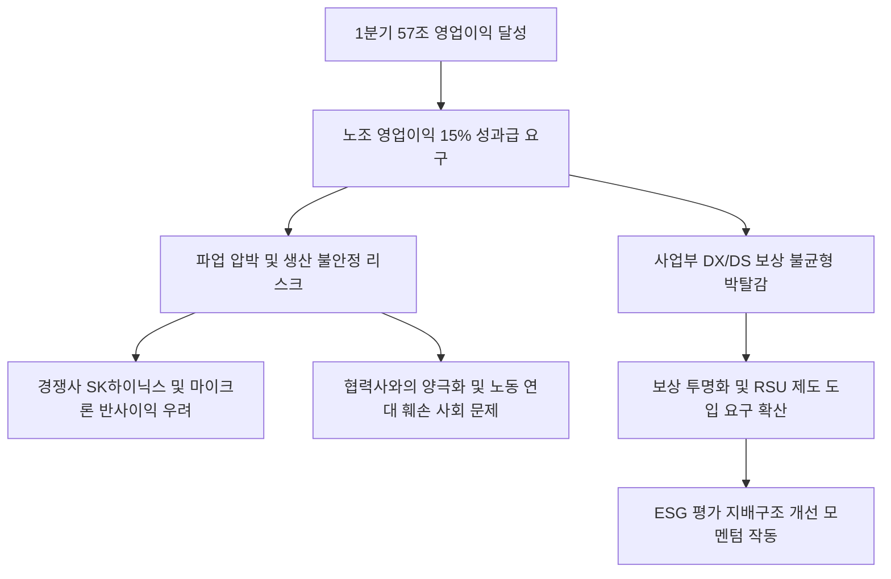

# 노동/ESG 분析: 삼성전자 노사 갈등과 분배의 정의 및 이해관계자 자본주의의 시험대 분석
## 투자 신호 + 사회적 영향 평가

---

## 📌 기사 기본 정보

- **날짜**: 2026-05-08
- **출처**: 권순원 숙명여대 경영전문대학원 원장 (중앙일보 칼럼)
- **카테고리**: 경제 > 노동 > ESG경영
- **핵심 주제**: 삼성전자가 2026년 1분기 57조 원이라는 기록적인 영업이익을 달성하자, 노동조합은 이익의 15%를 성과급으로 요구하며 파업의 깃발을 듦. 이는 한국 노동시장 최상위 조직 노동자가 가져야 할 사회적 책임과 자기 절제 윤리에 대한 질문을 던지며, 협력업체 및 미래 세대와의 상생을 해치지 않는 건전한 보상 체계 거버넌스 수립이 시급함을 시사함. ESG 관점에서 노동 리스크 통제와 보상 투명성(OPI 및 RSU 개편) 확보가 기업 가치 리레이팅의 핵심 조건으로 부각됨.

**메타데이터**
- 주요 사건: 삼성전자 노조의 영업이익 15% 성과급 요구, 파업 결의 및 긴장 고조, 이해관계자 자본주의 패러다임 논쟁 확산
- 핵심 원인: 반도체(DS) 부문 중심의 대규모 어닝 서프라이즈, 불투명하고 자의적인 OPI 성과급 제도에 대한 직원 불신, 사업부 간 보상 비대칭성에 따른 DX 부문의 박탈감
- 주요 주체: 삼성전자, 전국삼성전자노동조합(전삼노), 협력업체 노동자, ESG 평가기관
- 키워드: 노사갈등, 성과인센티브, OPI, 이해관계자자본주의, ESG, 주주환원, 보상체계, RSU, 공급망 리스크

---

## 🔍 기사를 통한 투자 신호 추출

### 1단계: 핵심 사건 분해

**What (무엇이 일어났는가?)**
- 삼성전자의 반도체 턴어라운드에 따른 1분기 57조 원의 영업이익 발표 이후, 노동조합이 초강경 성과인센티브 지급과 성과급 상한선 폐지를 요구하며 파업 압박을 지속함. 이로 인해 공급망 인질화 우려가 제기되었으며, 내부적으로는 성과 보상 체계의 불투명성과 부서 간 격차로 인한 조직 갈등이 노출됨. 경영진은 불확실한 호황 국면에서 장기 투자 재원을 확보해야 하는 과제와 노사 갈등 중재라는 이중고에 직면함.

**When (언제 일어났는가?)**
- 2026-05-08 (반도체 슈퍼사이클 어닝 서프라이즈가 실현되는 동시에 상법 개정안 및 지배구조 거버넌스 밸류업이 증시의 최우선 화두로 부각되는 시점)

**Why (왜 일어났는가?)**
- 그동안 지속된 초과이익 달성 시 보상 규칙(OPI)의 산정 기준이 대내외적으로 투명하게 공개되지 않아 발생한 신뢰 공백이 근본 원인임. 또한 글로벌 테크 업계의 RSU(양도제한조건부주식) 도입 트렌드에 대응하여 장기적 보상 일치화를 달성하지 못하고, 단기 현금성 분배에 매몰된 단기 보상 체계의 한계가 반영됨.

**Who (누가 주도하는가?)**
- 전국삼성전자노동조합(전삼노) 및 강경 성향의 엘리트 노동 세력, 이에 맞서는 사측 이사회 및 주주 연대

---

### 2단계: 투자 신호 해석

#### A. **긍정적 신호 (Bullish)**

**① 글로벌 기준에 부합하는 투명한 보상 거버넌스(RSU 등) 도입 가속화**
- **신호**: 기존 일시적 보상 방식(OPI)에서 성과와 주주 가치를 연동하는 RSU(양도제한조건부주식) 및 성과 연계 보상 다변화 논의 본격화
- **의미**: 임직원의 이익을 주주의 이익과 중장기적으로 일치시킴으로써, 성과급 갈등으로 소모되는 비용을 절감하고 우수 인재의 장기 유지를 유도하여 거버넌스(G) 가치를 대폭 제고함.
- **투자 기회**: 선제적으로 RSU 체계를 확립하여 주주 연대를 강화하고 노사 안정성을 확보한 ESG 우량 테크 기업들.

**② 파업 리스크 우려에 따른 글로벌 반도체 장비 및 공급망 내재화 관련 우량주 가치 재조명**
- **신호**: 삼성전자의 단기 생산 불안정에 대비하려는 글로벌 고객사의 이중 공급망(Dual-Sourcing) 전략 강화
- **의미**: 대형 종합 반도체 기업의 단기 가동률 노이즈가 발생할 경우, 자체적인 기술 독점력을 보유한 국내 최고 기술 수준의 반도체 소부장(소재, 부품, 장비) 밸류체인 기업으로의 낙수효과가 가시화됨.
- **투자 기회**: 대체 불가능한 공정 핵심 기술력을 보유하고 삼전/하이닉스 양대 노선에 모두 공급하는 국내 핵심 소부장 기업.

---

#### B. **위험 신호 (Bearish)**

**① 생산 차질 우려에 따른 극단적 외국인 자본 이탈 및 대안 경쟁사로의 수급 쏠림**
- **신호**: DS 부문 파업 결의 및 글로벌 가동 중단 가능성 부각
- **의미**: 하루 가동 중단 시 조 단위의 손실이 발생하는 극단적 메모리 라인 정체 리스크는 글로벌 빅테크 고객사의 수급 조절을 압박하여, 대안인 경쟁사로 메모리 점유율을 일부 넘겨주는 단기 악재로 작동할 수 있음.
- **투자 리스크**: 노사 리스크의 한가운데 노출되어 있는 종합 반도체 대형 기업 [[삼성전자]].

---

### 3단계: 섹터별 투자 기회 매트릭스

#### ✅ **높은 기대도 + 낮은 리스크**

**글로벌 공급 다변화의 직접 수혜를 입는 대체 불가 소부장 밸류체인**
- 대기업 노사 마찰 리스크와 무관하게 고부가가치 AI 패키징 및 HBM 장비 성능 고도화를 지속하는 강소 소부장 기업들은 삼전의 양산 공급 지연 시 우회로로서 위상이 증대됩니다. 또한 경쟁사인 하이닉스 밸류체인으로의 병행 매출 구조를 지니고 있어 안정적인 성장 방어막을 보유합니다.
- **투자 추천도**: ⭐⭐⭐⭐

---

## 💰 구체적 투자 신호 변환

### 신호 1: 대형 가치주의 노사 갈등 심화 — 단기 변동성 유의 및 ESG 거버넌스 혁신 추적
- **투자 해석**: 대형 기술 기업의 성과 분배 전쟁은 일차적으로 주가 상단을 제한하는 노사 리스크로 작용하지만, 장기적으로는 비효율적인 연간 성과급 제도를 전면 수정하고 글로벌 기준인 RSU로의 마이그레이션을 이끄는 중요한 밸류업 기회가 될 것입니다. 단기 파업 루머가 도는 시점에는 일시적인 수급 충격에 따른 주가 조정을 활용해 비중을 확보하고, 이와 함께 독자적인 글로벌 생태계를 구성하고 있는 핵심 장비 섹터로 분산 투자하여 메모리 밸류체인의 균형을 맞추는 것이 유용합니다.

---

## 🌍 사회적 영향 평가

### A. 긍정적 사회 영향
- **투명한 보상 거버넌스의 사회적 표준화**: 자의적인 보상 제도의 문제점을 수면 위로 끌어올림으로써, 대기업 전반에 걸쳐 노동자와 주주가 상생할 수 있는 공정하고 계량화된 성과 평가 지표의 도입을 촉진함.
- **이해관계자 자본주의 담론의 정착**: 주주 가치 독점론을 극복하고 직원, 협력사, 생태계 전체가 혜택을 나누는 ESG적 상생에 대한 사회적 합의 및 제도적 장치 마련의 단초 제공.

### B. 부정적 사회 영향
- **자본·노동시장 양극화 및 서민 상대적 박탈감 심화**: 최상위 대기업 노동자들의 조 단위 성과 분배 투쟁은, 최저임금과 고용 불안에 시달리는 비정규직 및 하도급 협력사 노동자들과의 격차를 더욱 넓혀 사회적 통합을 저해함.
- **글로벌 공급망 신뢰 상실에 따른 국가 경쟁력 타격**: 주요 전략 자산인 AI 메모리 반도체의 안정적 생산라인이 노사 갈등에 인질로 잡힘으로써, 외인 투자자의 신뢰를 상실하고 K-반도체 생태계의 장기 수주 경쟁력을 약화시킬 수 있음.

---

## 🎯 결론: 당신의 투자 전략 수립

- **즉시 실행**: 노사 갈등 노이즈로 메모리 대장주 주가가 흔들릴 시, 상대적으로 갈등 구도에서 자유롭고 HBM 점유율 선두를 굳건히 지키는 경쟁사 [[SK하이닉스]]로의 포트폴리오 헤지 전략 집행.
- **3개월 후**: 삼성전자의 상반기 임단협 타결 과정에서 보상 규칙의 투명화 선언(RSU 본격 로드맵 등) 여부를 추적하고, 갈등 봉합 시 지주사 중심의 밸류업 수혜 주주환원 주식 비중 재조정.

---

## 📝 Obsidian 연결 구조

