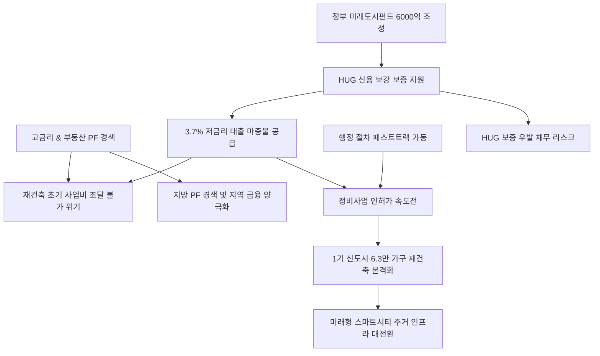

# 부동산/정책 분析: 노후계획도시 1기 신도시 정비사업 활성화를 위한 미래도시펀드 자금 지원 및 제도 개선 분석
## 투자 신호 + 사회적 영향 평가

---

## 📌 기사 기본 정보

- **날짜**: 2026-05-08
- **출처**: 정혜윤 기자 (머니투데이 경제 보도)
- **카테고리**: 경제 > 부동산 > 정책
- **핵심 주제**: 1기 신도시 등 노후계획도시 재건축의 최대 병목이었던 초기 사업비 조달 문제를 해결하기 위해 정부가 6,000억 원 규모의 '미래도시펀드'를 조성함. 주택도시보증공사(HUG)의 신용 보강으로 민간 건설사의 자체 조달 금리(5.3%)보다 대폭 저렴한 3.7% 수준으로 구역당 최대 200억 원을 대출 지원하며, 예비사업시행자 지정 확대 등 행정 절차 간소화(패스트트랙)를 병행해 6만 3,000가구의 재건축 속도를 높이고 수도권 주택 공급 안정을 도모함.

**메타데이터**
- 주요 사건: 미래도시펀드 6,000억 원 조성 계획 발표, HUG 보증을 통한 3.7%대 저금리 초기 사업비 지원, 예비사업시행자 지정 확대 등 패스트트랙 행정 개선
- 핵심 원인: 고금리와 부동산 PF 경색으로 인한 A- 등급 건설사 자금 조달 불가(자체 금리 5.3% 이상) 및 재건축 구역 중단 위기, 1기 신도시(분당·일산 등) 주거 슬럼화 극복 필요성, 수도권 주택 공급 불안 해소
- 주요 주체: 국토교통부, 주택도시보증공사(HUG), 민간 건설사, 1기 신도시 정비사업 조합원
- 키워드: 노후계획도시, 미래도시펀드, HUG보증, 초기사업비, 패스트트랙, 스마트시티, 부동산PF 경색

---

## 🔍 기사를 통한 투자 신호 추출

### 1단계: 핵심 사건 분해

**What (무엇이 일어났는가?)**
- 정부가 1기 신도시 및 전국 노후계획도시 정비사업의 최대 병목이었던 '초기 사업비 자금 조달'을 돕기 위해 6,000억 원 규모의 '미래도시펀드'를 조성하고, HUG 보증을 덧입혀 대출 금리를 3.7% 수준으로 인하하여 구역당 최대 200억 원까지 지원하기로 결정함. 동시에 예비사업시행자 지정을 확대하는 등 행정 절차 간소화(패스트트랙) 대책을 함께 실시함.

**When (언제 일어났는가?)**
- 2026-05-08 (부동산 PF 경색 및 고금리 장기화로 인해 건설사들의 자금난이 극에 달한 시기)

**Why (왜 일어났는가?)**
- 건설 경기 악화로 우량 건설사(A- 등급)조차 시장 조달 금리가 5.3%를 초과하는 고금리 상황에서, 재건축 초기 단계(설계, 인허가 용역 등)를 진행하기 위한 자금을 구하지 못해 사업이 전면 무산되거나 장기 지연될 위기에 처했기 때문임.

**Who (누가 주도하는가?)**
- 국토교통부 등 정부 당국 및 주택도시보증공사(HUG), 공공 투자 기관

---

### 2단계: 투자 신호 해석

#### A. **긍정적 신호 (Bullish)**

**① HUG 신용 보강에 기반한 저금리(3.7%) 대규모 마중물 공급**
- **신호**: 미래도시펀드 6,000억 원 및 HUG 보증 연계로 3%대 대출 금리 적용
- **의미**: PF 한파로 자금 조달이 중단되었던 1기 신도시 정비구역(선도지구 중심 6.3만 가구)에 실질적인 돈맥경화 해소 효과가 나타남. 초기 리스크가 대폭 경감되어 멈춰 있던 구역들이 빠르게 사업 속도를 낼 것임.
- **투자 기회**: 1기 신도시 정비사업 수혜 강도가 높은 우량 건설사, 스마트시티 인프라 솔루션 기업.

**② 패스트트랙 행정 제도 개선과 본사업비 연계 장치**
- **신호**: 예비사업시행자 지정 확대 및 사업 진척 시 총사업비 60% 이내 본사업비 연계 지원 확약
- **의미**: 단순 단발성 대출 지원을 넘어, 인허가 기간 단축과 향후 대규모 이주 및 본공사비 조달까지 시스템적으로 설계해 줌으로써 재건축 불확실성을 장기적으로 제거함.
- **투자 기회**: 신도시 마스터플랜 관련 엔지니어링·설계·감리 전문 상장 기업.

---

#### B. **위험 신호 (Bearish)**

**① 공공 보증 리스크 심화와 PF 시장 금융 양극화**
- **신호**: HUG 보증 역량을 동원한 정책 자금 쏠림 및 지방 PF의 지속적 소외
- **의미**: 부동산 PF 시장의 자연스러운 구조조정이 늦춰지고 공공 부채(보증 우발 부채)가 늘어날 우려가 있음. 또한 혜택이 수도권 우량 입지(1기 신도시)로만 집중되어 비수도권이나 외곽 사업장과의 자본 양극화가 심화될 수 있음.
- **투자 리스크**: 부실 PF 노출 비중이 큰 지방 중소형 건설사 및 비은행 상호금융권.

---

### 3단계: 섹터별 투자 기회 매트릭스

#### ✅ **높은 기대도 + 낮은 리스크**

**대형 브랜드 건설사 및 스마트시티 인프라 솔루션 기업**
- 미래도시펀드의 3%대 저금리 자금 공급과 패스트트랙 제도가 1기 신도시 선도지구 재건축을 본격 가동시킴에 따라, 자금력과 기술력을 갖춘 1군 건설사들이 확실한 대형 수주 기회를 선점할 것입니다. 또한 단순 주거 개선을 넘어 친환경 스마트 인프라(AI, 지율주행 등)가 결합된 미래도시 형태로 조성되므로, 스마트홈 및 빌딩 제어 인프라 테크 섹터의 리스크 대비 투자 메리트가 극대화됩니다.
- **투자 추천도**: ⭐⭐⭐⭐⭐

---

## 💰 구체적 투자 신호 변환

### 신호 1: 미래도시펀드 개시 — 수도권 노후 신도시 재건축 속도전 본격화
- **투자 해석**: 고금리와 PF 동결로 인한 건설업계의 '돈맥경화' 위기 상황에서 정부 주도의 미래도시펀드(6,000억 원 규모)와 HUG의 국가적 신용 보강은 매우 강력한 생존 처방입니다. 이는 민간 신용이 아닌 공공의 리스크 분담을 통해 멈췄던 정비사업의 인허가·초기 단계 물꼬를 터주는 '자본의 연금술' 역할을 합니다. 특히 1기 신도시 6만 3,000가구가 완전히 철거되고 재건축되는 과정에서 도시 전체가 인공지능과 데이터가 흐르는 스마트 주거 플랫폼이자 미래 도시로 변모하는 중장기 수혜가 기대됩니다. 다만, 공공의 보증 부담 확대로 시장 악화 시 우발 채무의 사회화 리스크와 비수도권 PF 부실의 양극화 경향은 리스크 요인으로 항시 체크해야 합니다.

---

## 🌍 사회적 영향 평가

### A. 긍정적 사회 영향
- **수도권 주택 공급 안정 및 주거 환경 개선**: 녹물, 주차 대란 등 노후화 한계에 직면한 분당·일산 등 1기 신도시 주민들의 삶의 질을 극적으로 개선하고 공급 불안으로 인한 서울-수도권 주택 가격 불안을 완충해 줍니다.
- **미래도시 패러다임 리드**: AI, 친환경 에너지 관리, 스마트 모빌리티가 도시 단위로 구현되는 모델 하우스를 전국적으로 조성하여 향후 해외 스마트시티 수출 경쟁력의 중요한 쇼케이스로 기능할 것입니다.

### B. 부정적 사회 영향
- **공공 혜택의 지역적 양극화 논란**: 국가 보증 혜택이 분당 등 수도권 핵심 노후 신도시에 편중되어, 비수도권이나 지방의 낙후 주거지는 정비사업성 악화와 정부 지원 부재 속에서 슬럼화가 더 가속화되는 양극화 현상이 깊어질 수 있습니다.
- **납세자 부담의 사회화 우려**: 부동산 경기 장기 침체가 닥칠 경우 HUG의 보증 채무 부실이 현실화되어 결과적으로 국민 세금으로 메워야 하는 재정적 뇌관이 될 우려가 존재합니다.

---

## 🎯 결론: 당신의 투자 전략 수립

- **즉시 실행**: 1기 신도시 선도지구 재건축 수혜가 확실한 대형 건설 브랜드 주식 포트폴리오를 유지하며, 스마트 인프라(지능형 빌딩, 전기차 충전 및 에너지 제어망) 관련 혁신 기업 주식 편입.
- **3개월 후**: 미래도시펀드의 1차 자금 집행률과 선도지구 지정 구역별 조합 동의 확보율을 관찰하며 실제 주택 공급 속도의 실효성을 검증. 지방 PF 연쇄 부도 우려가 대형 건설사 신용 등급에 영향을 주는지 지속 확인.

---

## 📝 Obsidian 연결 구조

