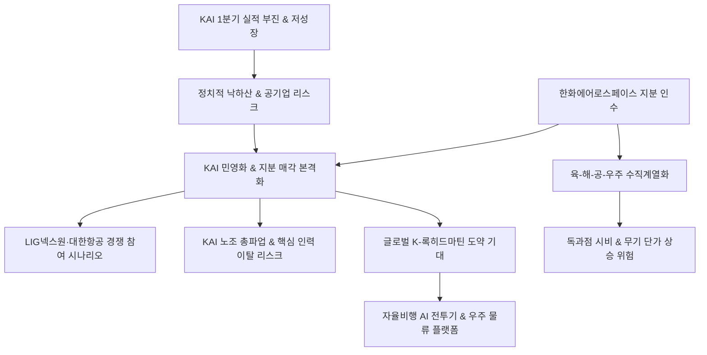

# 방산/M&A 분析: K방산 호황 속 KAI 실적 부진과 한화의 인수 추진 및 민영화 논란 분석
## 투자 신호 + 사회적 영향 평가

---

## 📌 기사 기본 정보

- **날짜**: 2026-05-08
- **출처**: 남윤서 기자 (방산업계 및 증권가 자료 종합)
- **카테고리**: 경제 > 산업 > 방산
- **핵심 주제**: 전 세계적인 K-방산 수출 호황에도 불구하고, 한국항공우주산업(KAI)이 공기업적 지배구조(낙하산 인사, R&D 투자 보수성) 한계로 1분기 부진한 실적(매출 1조 927억 원, 영업이익 671억 원, 성장률 1.7%)을 기록함. 경쟁사들이 세 자릿수 폭발적 성장을 달성할 때 정체된 KAI를 향해 한화에어로스페이스가 지분을 전격 확보하고 '경영 참여'를 선언하며 민영화 논란이 본격 점화됨. 민영화를 통한 'K-록히드마틴' 구축과 독과점 특혜 시비 및 노조 반발이 대립하는 상황.

**메타데이터**
- 주요 사건: KAI 1분기 성장률 1.7% 정체 발표, 한화에어로스페이스의 KAI 지분 취득 및 경영 참여/민영화 선언
- 핵심 원인: 정권에 따른 낙하산 인사와 경영진 교체 등 '공기업적 리더십 공백', 대형 개발 주기에 의존하는 완제기 사업의 실적 변동성, 한화그룹의 '육·해·공·우주' 통합 방산 지배력 확대 야망
- 주요 주체: 한국항공우주산업(KAI), 한화에어로스페이스(인수 주체), KAI 노동조합, 수출입은행(최대주주)
- 키워드: KAI, 한국항공우주산업, 민영화 논란, 한화에어로스페이스, 수직계열화, KF-21, 낙하산 인사, K-록히드마틴

---

## 🔍 기사를 통한 투자 신호 추출

### 1단계: 핵심 사건 분해

**What (무엇이 일어났는가?)**
- 대한민국 대표 항공우주 방산 기업인 KAI의 1분기 실적이 시장의 기대치에 못 미치며 연 1.7% 수준의 저성장에 그침. 이 틈을 타 주당 100만 원을 돌파한 황제주 한화에어로스페이스가 KAI 지분을 전격 인수하고 '경영 참여 및 민영화'를 적극 추진하고 나섬. KAI 노조는 이를 대기업의 '적대적 인수 및 기술 유출 위기'로 규정하고 총파업을 예고하는 등 강하게 대치 중임.

**When (언제 일어났는가?)**
- 2026-05-08 (한화 등 민간 방산 기업들이 130%대 폭발적 영업이익 성장 랠리를 가동 중인 K-방산 초호황기)

**Why (왜 일어났는가?)**
- 국책은행(수출입은행)이 대주주인 KAI의 공공적 지배구조가 장기 우주항공 R&D 및 과감한 M&A 결정에 걸림돌이 되는 '공기업병'을 유발했다는 진단 때문. 한화그룹은 지상(에어로스페이스)과 해상(오션)에 이어 공중(KAI) 밸류체인을 흡수하여 글로벌 종합 방산 록히드마틴의 아성을 넘보고자 함.

**Who (누가 주도하는가?)**
- 한화그룹 및 국가 방산 자산의 효율적 재편을 도모하는 투자금융(IB) 시장

---

### 2단계: 투자 신호 해석

#### A. **긍정적 신호 (Bullish)**

**① 민영화 추진에 기반한 책임경영 체제 확립 및 의사결정 고속화**
- **신호**: 한화의 경영 참여 공식화와 민간 대기업으로의 지분 매각 압박 확대
- **의미**: 최대 리스크 요인이었던 낙하산 인사와 정치적 외풍을 원천 차단하고, 민간 대기업의 강력한 추진력과 무제한적 R&D 자금이 공급되면서 KAI의 잠재 가치가 극대화되는 발판이 됨.
- **투자 기회**: [[KAI]], [[한화에어로스페이스]]

**② 육·해·공·우주를 아우르는 원스톱 방산 벨류체인의 시너지 극대화**
- **신호**: 한화그룹의 방산 부문 수직계열화 완성 진입
- **의미**: 한화의 글로벌 영업 인프라와 KAI의 기체 개발 능력이 시너지를 발휘하여 해외 수주 협상력이 배가되며, 자율비행 AI, 유무인 복합전투 체계(MUM-T) 등의 미래형 고부가가치 피지컬 AI 소프트웨어 개발이 대폭 앞당겨짐.
- **투자 기회**: 한화그룹 계열 방산주 포트폴리오.

---

#### B. **위험 신호 (Bearish)**

**① 노사 분규 장기화로 인한 인재 이탈 및 국책 개발 사업 차질**
- **신호**: KAI 노동조합의 적대적 M&A 반대 투쟁 및 핵심 설계 인력 유출 우려
- **의미**: 노사 갈등이 파업으로 비화할 경우, 국가 핵심 개발 프로젝트인 KF-21 전투기 양산 일정에 차질이 생기며 해외 고객사에 대한 납기 신뢰성이 훼손될 위험이 상존함.
- **투자 리스크**: KAI의 단기 실적 신뢰도 저하 및 수주 지연 가능성.

**② 공정거래위원회 기업결합 심사 저항 및 정치적 독점 규제 리스크**
- **신호**: 특정 대기업의 방산 부문 독과점 시비 및 야당의 '특혜 매각' 공세
- **의미**: 공정위 결합 심사가 연장되거나 무역 및 국가 자산의 독점 장벽에 가로막혀 최종 매각 협상이 장기간 지연 및 표류하여 주주들의 피로감을 유발할 수 있음.
- **투자 리스크**: M&A 테마 소진에 따른 지루한 주가 조정 가능성.

---

### 3단계: 섹터별 투자 기회 매트릭스

#### ✅ **높은 기대도 + 낮은 리스크**

**한화에어로스페이스 및 대형 방산 수혜주**
- KAI의 지배구조 개혁은 시간의 문제일 뿐, 글로벌 K-방산 지각 재편 흐름상 민간 통합이 시대적 흐름으로 판단됩니다. 한화가 이 마지막 우주항공 퍼즐을 인수하는 과정에서 일시적 이탈 노이즈로 KAI의 주가가 하락할 때를 저가 매수(Buy on dips) 타이밍으로 활용하는 전략이 유리합니다. 한화에어로스페이스는 글로벌 탑티어 종합 방산 지위를 고착화하게 되므로 장기 보유 전략의 리스크 대비 리턴이 매우 뛰어납니다.
- **투자 추천도**: ⭐⭐⭐⭐⭐

---

## 💰 구체적 투자 신호 변환

### 신호 1: KAI 민영화 추진 기습 선언 — 국가 우주항공 방산 자산의 거대 재편 시작
- **투자 해석**: 글로벌 K-방산 골든타임 속에서 KAI의 1.7% 정체된 어닝 지표는 정치적 리스크에 노출된 지배구조의 비효율성을 증명한 사건입니다. 한화의 지분 인수와 경영권 선언은 지배구조의 '공기업병'을 진단하고, 지상-해상-공중 및 우주 궤도까지 이어지는 'K-록히드마틴'을 세우려는 메가 트렌드의 신호탄입니다. 단기적으로는 노사 대립과 결합 심사 장벽으로 인한 잡음이 불가피하나, 중장기 관점에서는 AI 자율 비행과 위성 서비스 등 '피지컬 AI' 기술 빅뱅을 항공우주 플랫폼에 이식할 유일한 생존 전략입니다. 단기 낙폭 발생 시 우량한 KAI와 한화에어로스페이스의 추가 비중 확대를 추천합니다.

---

## 🌍 사회적 영향 평가

### A. 긍정적 사회 영향
- **국가 안보 경쟁력 강화 및 핵심 방산 기술 주권 확보**: 민간 대기업의 공격적인 자금과 전략을 결합하여 4.5세대 첨단 국산 전투기 KF-21 양산을 촉진하고 우주 인프라를 빠르게 확충하여 국가 안보를 고도화합니다.
- **공기업 방만 경영 및 보은 인사 폐단 극복**: 정권이 교체될 때마다 반복되는 낙하산 임원 선임과 리더십 단절을 해결하여 한국 항공우주 정책의 영속성과 책임 경영 문화를 세웁니다.

### B. 부정적 사회 영향
- **독과점에 따른 시장 왜곡 및 세수 비효율**: 1개 대기업 그룹이 지상, 해상, 공중 전력 무기를 독점 공급할 경우, 국방부(정부)와의 무기 계약에서 강력한 독점적 가격 결정권을 쥐어 국민 세금인 국방 예산의 과도한 지출을 초래할 수 있습니다.
- **핵심 우주 인재 이탈 및 조직 분열**: M&A에 따른 구조조정 위협에 노출된 핵심 우주항공 엔지니어들이 사기 저하로 이탈하여 국산 방산의 지식 기반이 공동화될 심각한 사회적 위협이 있습니다.

---

## 🎯 결론: 당신의 투자 전략 수립

- **즉시 실행**: 민영화 갈등 노이즈로 일시 조정을 겪는 [[KAI]] 주식을 분할 매수 기회로 포착하고, 막강한 자금 동원력과 수직계열화 성장이 가시적인 대장주 [[한화에어로스페이스]] 보유 유지.
- **3개월 후**: KAI 매각 입찰에 LIG넥스원, 대한항공 등 타 대기업 컨소시엄의 기습 참여 여부를 확인하여 입찰 흥행 구조 모니터링. 공정거래위원회의 기업결합 승인 조건과 KAI 노조의 단체 행동 수위를 관찰하여 일정 리스크 헷지.

---

## 📝 Obsidian 연결 구조

