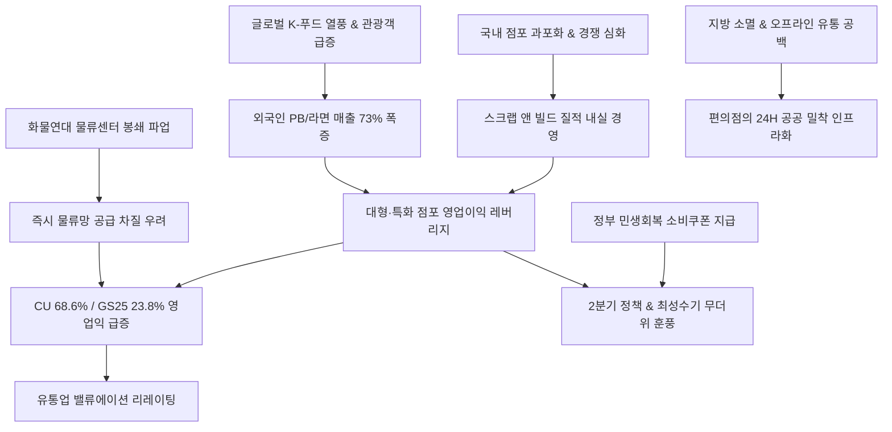

# 소비/유통 분析: 편의점 업계의 대형·특화 점포 전환과 K-푸드 글로벌 수요 및 내실 경영 전략 분석
## 투자 신호 + 사회적 영향 평가

---

## 📌 기사 기본 정보

- **날짜**: 2026-05-08
- **출처**: 유엄식·하수민 기자 (머니투데이 유통 취재)
- **카테고리**: 경제 > 소비 > 유통
- **핵심 주제**: 국내 점포 포화와 경쟁 심화라는 구조적 성장의 임계점 속에서, 편의점 양대 기업(GS25, CU)이 1분기 영업이익이 각각 23.8%, 68.6% 급증하는 어닝 서프라이즈를 달성함. 무리한 무한 출점 대신 저수익 매장을 폐점하고 우량 입지에 대형·특화 매장을 리뉴얼 배치하는 '스크랩 앤 빌드' 경영과, 전 세계적 K-푸드 열풍을 활용한 라면·굿즈 외국인 특화 매장 및 1인 가구 맞춤 신선식품 강화 매장(일반 매장 대비 매출 1.6배 달성)을 앞세워 글로벌 K-유통의 핵심이자 생활밀착형 플랫폼으로 대전환에 성공함.

**메타데이터**
- 주요 사건: 편의점 양강(CU·GS25) 1분기 영업이익 대폭 상승(CU 68.6%↑, GS25 23.8%↑), 대형·특화 점포로의 리뉴얼 가속화
- 핵심 원인: 부실 매장을 정리하고 대형화/특화 매장으로 체질을 바꾸는 '스크랩 앤 빌드' 질적 성장 전략, 외국인 관광객 증가 트렌드와 결합한 고마진 K-푸드 PB 매출 극대화
- 주요 주체: BGF리테일(CU), GS리테일(GS25), 국내 1인 가구 소비자, 외국인 관광객
- 키워드: 스크랩앤빌드, 내실경영, K푸드, 특화점포, 신선강화매장, PB상품, 유통혁신, BGF리테일, GS리테일

---

## 🔍 기사를 통한 투자 신호 추출

### 1단계: 핵심 사건 분해

**What (무엇이 일어났는가?)**
- 편의점 포화 시장에 대한 우려를 딛고 CU(BGF리테일)와 GS25(GS리테일)가 1분기 영업이익을 폭발적으로 끌어올림. 양적 경쟁을 과감히 폐기하고 우량 입지로 이전하거나 대형화하는 질적 고도화(스크랩 앤 빌드)를 시도하였으며, 외국인 관광객 라면 특화 매장(외국인 매출 73% 폭증) 및 1인 가구 타겟형 신선 강화 특화 매장을 구축해 점포당 평균 매출 레버리지를 극대화함.

**When (언제 일어났는가?)**
- 2026-05-08 (고물가 장기화로 서민 소비가 위축되고, 화물연대 물류센터 봉쇄 파업 등 유통망 리스크가 발생한 불안정한 거시 환경)

**Why (왜 일어났는가?)**
- 무제한 양적 출점은 점포 간 갉아먹기(Cannibalization)로 마진을 훼손했기 때문. 이에 고마진 PB 식품 비중 확대, 외국인 맞춤 K-콘텐츠 라인업 도입, 신선도 관리 체계 혁신으로 유효 수요를 독점하는 구조적 효율화를 달성함.

**Who (누가 주도하는가?)**
- BGF리테일, GS리테일 주도 하의 오프라인 공간 및 데이터 유통 혁신팀

---

### 2단계: 투자 신호 해석

#### A. **긍정적 신호 (Bullish)**

**① '스크랩 앤 빌드' 패러다임 전환에 따른 영업 마진율의 구조적 리플레이션**
- **신호**: CU 1분기 이익 68.6% 폭증 및 GS25 이익 23.8% 동반 증가
- **의미**: 저수익 가맹 계약 종료 및 우량 리뉴얼 전환을 통해 가맹점 단위 고정비 부담이 상쇄되고 영업이익률이 비약적으로 향상되는 '질적 수확기'에 본격 진입함.
- **투자 기회**: [[BGF리테일]], [[GS리테일]] 주식에 대한 중장기 투자 매력 및 목표 배수(Multiple) 상향 조정.

**② 온라인 유통이 대체 불가능한 '즉각 체험형 인바운드 쇼핑 거점' 등극**
- **신호**: K-푸드/PB 특화 매장의 일반 점포 대비 1.6배 이상 고수익 창출
- **의미**: 편의점이 기존의 마트, 백화점 영역을 잠식하는 것은 물론, 외국인 관광객들의 필수 여행 코스(라면 먹방, 전통 굿즈 소비)로 각인되며 단순 소매점에서 글로벌 K-컬처 유통 인프라로 정체성이 재정의됨.
- **투자 기회**: 고마진 PB 간편식/화장품을 공동 개발 및 공급하는 주요 강소 유통 벤더 기업.

---

#### B. **위험 신호 (Bearish)**

**① 타이트한 실시간 물류 공급망의 파업 취약성 리스크**
- **신호**: 화물연대 물류센터 봉쇄 파업으로 인한 일부 지역 공급망 마비
- **의미**: FF(신선식품)나 도시락, 유제품 위주의 즉시 배송이 생명인 편의점 체인에서 물류망 정체는 일시적인 가맹점 매출 급감과 브랜드 신뢰도 훼손, 점주 보상 청구 등의 잠재적 재무 노이즈를 내포함.
- **투자 리스크**: 유통망 내 물류 파업 장기화에 따른 비용 증가.

---

### 3단계: 섹터별 투자 기회 매트릭스

#### ✅ **높은 기대도 + 낮은 리스크**

**BGF리테일 및 GS리테일 (편의점 양대 주도주)**
- 다가오는 2분기는 전통적인 이른 무더위로 음료·빙과류 등 초고마진 상품 판매가 극대화되는 계절적 최성수기입니다. 이에 더해 정부가 내수 진작을 위해 추진하는 '민생회복 소비쿠폰'의 최전선 수혜 채널로 편의점이 낙점되며, 마진이 개선된 상태에서 정책 모멘텀과 계절적 수혜가 결합해 이익이 더 폭발할 것입니다. 밸류에이션 매력도 높은 구간입니다.
- **투자 추천도**: ⭐⭐⭐⭐⭐

---

## 💰 구체적 투자 신호 변환

### 신호 1: 오프라인 소매 매장의 질적 혁신 — K-컬처 전초기지로서의 편의점 체질 리레이팅
- **투자 해석**: CU와 GS25의 괄목할 실적 성장은 양적 포화 시장에 대한 편견을 완전히 부수는 강력한 투자 모멘텀입니다. 저수익 상권을 과감히 스크랩하고 '글로벌 특화·대형화' 매장으로 대체하는 전략은 점포당 마진과 고마진 PB 침투율을 끌어올리는 극적인 이익 레버리지를 구현했습니다. 특히 전 세계적 K-라면, K-디저트 유행에 힘입어 외국인 인바운드 자금을 쓸어 담는 글로벌 브랜드로 진화하고 있습니다. 단기적으로 가맹점 노사 및 배송 파업 리스크를 모니터링하면서, 2분기 강력한 정책 쿠폰 수혜와 이른 더위 모멘텀을 고려해 BGF리테일과 GS리테일의 매력적인 저가 매수로 적극 대응할 시점입니다.

---

## 🌍 사회적 영향 평가

### A. 긍정적 사회 영향
- **서민 체감 민생회복 기여 및 유통 안전망**: 소비쿠폰의 1차 사용처로서 골목 서민들의 알뜰 구매를 돕고, 고물가 상황에서 고품질 초저가 PB 상품을 상시 보급하여 서민 가계의 실질 영양 및 생활 장벽을 낮춰주는 긴급 안전망 역할을 수행합니다.
- **지역 소멸 대비 생활 커뮤니티 인프라**: 마트와 은행이 철수한 낙후 지역 및 농어촌에서 24시간 열려 있는 특화 편의점이 금융, 신선 공급, 공공 무인 택배, 심야 방범 등 핵심 공공 유통 허브 기능을 완수하여 지방 생활권을 사수합니다.

### B. 부정적 사회 영향
- **골목상권 및 전통 영세 소상공인의 생태계 고사**: 편의점이 단순 잡화를 넘어 정육, 채소, 과일, 반찬류, 화장품, 소형 가전 영역까지 '대형 특화' 형태로 빨아들임에 따라 전통 소형 마트와 개인 반찬가게 등 영세 상인의 설 자리가 전면 붕괴되는 사회적 아픔이 동반됩니다.
- **포장재 및 HMR 플라스틱 폐기물 급증**: 간편식 및 1인 가구 신선 포장 매장이 늘어남에 따라 현장에서 매일 쏟아져 나오는 일회용 미세 플라스틱, 컵라면 용기, 비닐 포장재의 폐기 비용이 고스란히 지역 사회의 환경적 오염과 세금 부담으로 누적됩니다.

---

## 🎯 결론: 당신의 투자 전략 수립

- **즉시 실행**: 실적 턴어라운드가 증명되었고 정책 소비쿠폰 집행 및 무더위 계절 수혜의 최전선에 놓인 대장주 [[BGF리테일]]과 [[GS리테일]] 비중 확대.
- **3개월 후**: 화물연대 물류센터 봉쇄 파업 등 공급망 노이즈의 완전 해소 여부를 확인. 무인 점포 시스템 내 현대차 보스턴다이나믹스 등의 스마트 물류 기술(로보틱스 배송, 매장 내 무인 재고 관리) 결합 타임라인 모니터링.

---

## 📝 Obsidian 연결 구조

