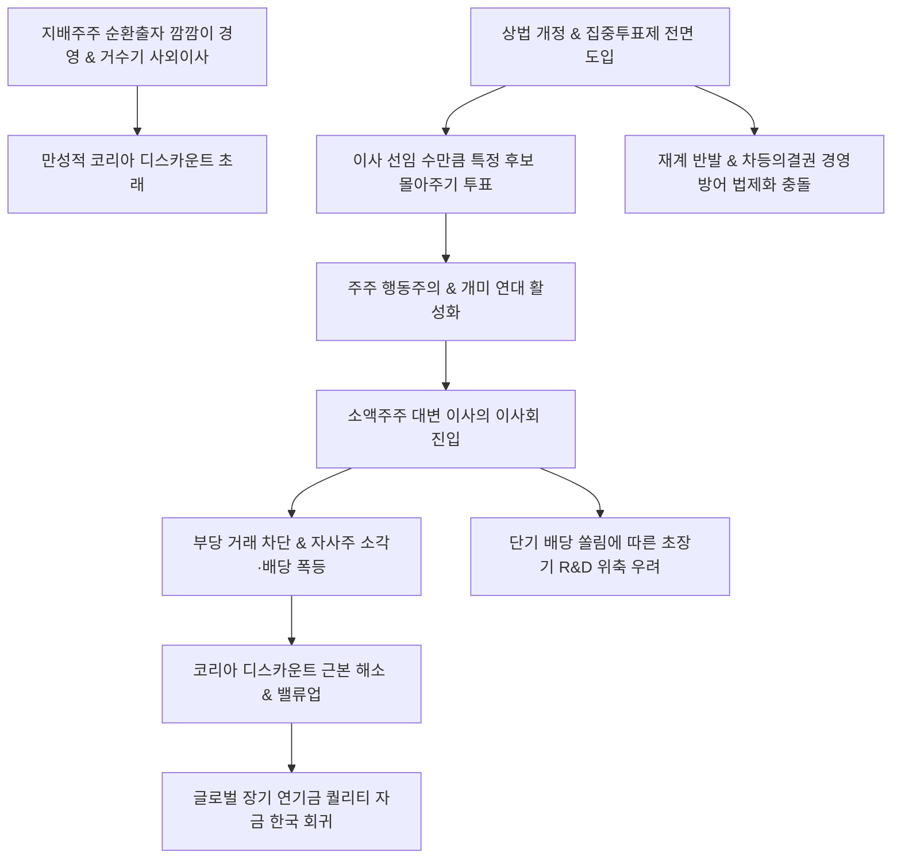

# 정책/거버넌스 분析: 집중투표제 도입과 기업 거버넌스 혁신 및 소액주주 주권 강화 분석
## 투자 신호 + 사회적 영향 평가

---

## 📌 기사 기본 정보

- **날짜**: 2026-05-08
- **출처**: 금융위원회 기업 밸류업 프로그램 및 상법 개정안 해설 기반 분석
- **카테고리**: 경제 > 정책 > 거버넌스
- **핵심 주제**: 정부가 코리아 디스카운트 해소와 소액주주 보호를 위해 추진 중인 상법 개정안의 핵심 쟁점, '집중투표제'가 한국 기업 자본시장 혁신의 핵심 동력으로 재조명되고 있음. 2인 이상의 이사를 선임할 때 선임할 이사 수만큼 의결권을 몰아줄 수 있는 제도로 대주주의 독단 경영과 거수기로 전락한 이사회를 견제함. 세제 혜택 및 국민성장펀드 투자 우선권 등 정부의 인센티브 장치를 결합하여 한국 자본주의의 OS를 근본적으로 업그레이드하고 소액주주 중심의 주권 시대를 선언함.

**메타데이터**
- 주요 사건: 상법 개정안 내 집중투표제 전면 도입 검토 및 입법 추진, 거버넌스 혁신 기업 대상 금융/세제 인센티브 설계 발표
- 핵심 원인: 극소수 지분의 지배주주 중심 불투명 경영 관행 및 순환출자 폐해, 사외이사 독립성 결여에 따른 한국 증시 저평가(코리아 디스카운트) 고착화, 1400만 동학개미의 주주 주권 환원 요구 비등
- 주요 주체: 금융위원회, 대기업 재계(경영권 방어 진영), 소액주주 연대 및 주주 행동주의 펀드
- 키워드: 집중투표제, 상법개정안, 지배구조개선, 소액주주보호, 주주행동주의, 코리아디스카운트, 거버넌스혁신, 국민성장펀드

---

## 🔍 기사를 통한 투자 신호 추출

### 1단계: 핵심 사건 분해

**What (무엇이 일어났는가?)**
- 정부가 한국 자본시장의 체질 개선을 위해 추진하고 있는 상법 개정안의 핵심 장치로 '집중투표제(Cumulative Voting)' 전면 부각. 2인 이상 이사를 뽑을 때 1주당 1표가 아닌 선임 이사 수만큼의 표를 한 후보에게 몰아줄 수 있는 투표 메커니즘을 상법상 의무화하려 함. 정부는 집중투표제 도입 우수 기업에 세제 감면과 국민성장펀드 수급 우대 등의 혜택을 명문화하여 지배구조 개선의 드라이브를 걸고 있음.

**When (언제 일어났는가?)**
- 2026-05-08 (코스피 7000 돌파라는 역대급 랠리 속에서 질적인 이익 분배 정의와 지배구조의 공정성을 요구하는 여론이 폭발한 시점)

**Why (왜 일어났는가?)**
- 지배주주 중심의 '깜깜이' 의사결정이 이뤄지는 한, 반도체 슈퍼사이클 호황에도 불구하고 한국 기업들은 해외 경쟁사에 비해 제값을 받지 못하는 만성적 저평가에 묶여 있기 때문. 이를 자본의 민주화와 이사회 견제 시스템 작동으로 해결하려는 목적임.

**Who (누가 주도하는가?)**
- 금융위원회 등 정무·금융 당국 및 밸류업 수혜를 받으려는 행동주의 펀드 연합군

---

### 2단계: 투자 신호 해석

#### A. **긍정적 신호 (Bullish)**

**① 이사회의 독립성 확립에 따른 주주 환원 정책의 급격한 활성화**
- **신호**: 집중투표제 기반 소액주주 측 전문가 이사의 이사회 진입 장벽 하락
- **의미**: 지배주주의 전횡이나 불합리한 일감 몰아주기가 사전 차단되며, 배당 성향 확대, 보유 자사주의 소각, 비효율 자산 매각 등 실질적이고 전례 없는 주주 환원율 폭등 릴레이가 가동됨.
- **투자 기회**: 현금성 자산은 풍부하나 대주주 눈치로 배당을 지연해 온 만성 저평가 자산주 및 핵심 지주사.

**② 글로벌 퀄리티 자본의 중장기 장착 유도**
- **신호**: 코리아 디스카운트 해소를 이끌 거버넌스 OS 업그레이드
- **의미**: 거버넌스 리스크로 한국 투자를 차별(Discount)해 온 글로벌 공적 연기금 등 장기 외국인 패시브 자금이 한국 증시로 완전히 회군하여 코스피 지수의 든든한 주춧돌 역할을 완수함.
- **투자 기회**: 집중투표제 선제 도입 예정 우량주 및 밸류업 최우수 편입 지수주.

---

#### B. **위험 신호 (Bearish)**

**① 행동주의 펀드의 이권 침해와 R&D 장기 투자 동력 훼손**
- **신호**: 단기 배당 확대 요구 중심의 지배주주-투기 자본 간 분쟁 격화
- **의미**: 장기 성장 동력 확보를 위해 수천억 원이 수반되는 CAPEX(설비 및 연구개발) 투자를 단행해야 할 시점에, 이사회가 단기 주가 부양을 요구하는 펀드 입김에 휘둘려 기업의 백년 대계 투자를 실기할 가능성이 상존함.
- **투자 리스크**: 대규모 R&D가 필수적인 반도체·배터리 등 기술집약 수출 대기업군.

---

### 3단계: 섹터별 투자 기회 매트릭스

#### ✅ **높은 기대도 + 낮은 리스크**

**자발적 거버넌스 개선 우수 지주사 및 국민성장펀드 편입 최우선 대형주**
- 대주주와 소액주주의 의사결정 균형을 이루며 집중투표제를 자발적으로 도입하는 우량 지주사의 경우, 정부의 금융 인센티브(국민성장펀드 우선 배정) 수혜가 확실시됩니다. 이들은 경영권 박탈 리스크가 낮으면서도 배당 효율화와 지배구조 불확실성 소멸로 인한 주가 리레이팅 혜택을 100% 누리게 되어 투자 기대 효용이 아주 큽니다.
- **투자 추천도**: ⭐⭐⭐⭐⭐

---

## 💰 구체적 투자 신호 변환

### 신호 1: 상법 개정 및 집중투표제 부상 — 한국 증시의 거버넌스 OS 전면 혁신
- **투자 해석**: 집중투표제의 화두는 단순히 하나의 투표법이 아니라 한국 자본시장의 의사결정 'OS(운영체제)'를 대주주 중심에서 '주주 전체의 주권'으로 바꾸는 거대한 지각 변동입니다. 코리아 디스카운트라는 오랜 병폐를 도려내는 가장 날카로운 제도적 메커니즘으로 기능할 것입니다. 주주 환원과 독립 견제가 강화되며 그간 잠자던 저평가 자산 지주사들의 현금 가치가 폭발할 전기를 맞았습니다. 일부 이사회 분쟁 노이즈와 단기 지출 중심주의에 따른 R&D 리스크가 존재하나, 장기적으로 글로벌 패시브 대기 자금을 한국으로 안착시킬 강력한 촉매입니다. 집중투표제 및 밸류업 참여 의사가 확고한 우량 가치주 포트폴리오 확대를 적극 권고합니다.

---

## 🌍 사회적 영향 평가

### A. 긍정적 사회 영향
- **동학 개미 및 1400만 서민 가계의 자산 재분배**: 기업 이익이 불투명하게 유출되지 않고 배당과 주가로 정상 유입되어 개인 투자자의 실질 소득을 높이고, 국민연금 기금 수명을 연장하여 국민 노후 복지를 공고히 합니다.
- **공정하고 깨끗한 시장 경제 확립**: 재벌 대주주의 부당 내부거래, 자녀 편법 증여, 일감 몰아주기 등 후진적 시장 자본주의 악습을 뿌리 뽑아 대한민국 자본주의의 도덕적 신뢰도를 일거에 격상시킵니다.

### B. 부정적 사회 영향
- ** R&D 초장기 투자 단절에 따른 성장 엔진 정지 위험**: 주주 행동주의의 목소리에 영합해 사내 유보금을 단기 배당이나 자사주 매입에만 투입하다가, 차세대 글로벌 AI 및 미래 산업을 이끌 초장기 R&D 투자 타이밍을 영원히 실기하여 국가 경쟁력이 쇠퇴할 수 있습니다.
- **경영 분쟁 격화로 인한 극단적 사회적 피로 가중**: 이사회 안에서 사내외 이사들이 매 의결 마다 사법 소송과 가처분 신청 등 파벌 대립으로 갈등을 노출하여, 기업의 본질적 경쟁력을 소모하고 시장 신뢰를 훼손하는 부정적 사회 비용 발생.

---

## 🎯 결론: 당신의 투자 전략 수립

- **즉시 실행**: 지배구조 개선 모멘텀이 뚜렷하고 풍부한 사내 유보금을 갖춘 저평가 지주사 및 금융 대형주 편입. 정부 집중투표제 밸류업 세제 인센티브 수혜 후보군 매수.
- **3개월 후**: 입법 과정에서 재계의 반발로 교환될 방어 장치(차등의결권 등)의 유무를 대조하여 지배구조 분쟁 리스크 변화 모니터링. 행동주의 펀드가 지목한 핵심 타겟 사들의 실제 배당 상향 비율 추적 및 대응.

---

## 📝 Obsidian 연결 구조

