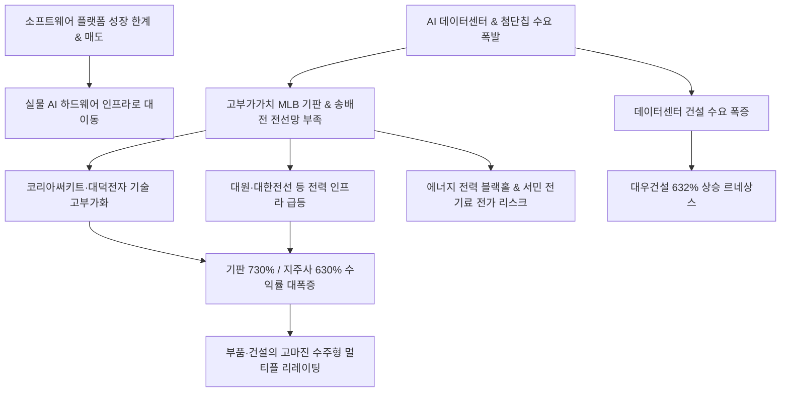

# 증시/산업 분析: AI 인프라 주도 하드웨어 르네상스와 코리아써키트 대덕전자 수익률 분석
## 투자 신호 + 사회적 영향 평가

---

## 📌 기사 기본 정보

- **날짜**: 2026-05-08
- **출처**: 한국거래소(KRX) 2025.06.20 ~ 2026.05.06 주가 상승률 자료 분석
- **카테고리**: 경제 > 증시 > 산업
- **핵심 주제**: 코스피 지수가 3000선에서 7000선으로 역사적 퀀텀 점프를 이뤄내는 과정에서 증시를 견인한 'AI 하드웨어 인프라' 섹터의 기록적인 폭등세 분석. 기존 인터넷 플랫폼의 정체 속에서 고성능 반도체 패키징 기판(PCB), 전력 설비, 전선, 데이터센터 건설 등 구경제 제조업이 AI 수요와 맞물려 르네상스를 맞이함. 코리아써키트(739.08%), 대덕전자(635.48%), SK스퀘어(633.83%), 대우건설(632.65%) 등 초대형 랠리를 주도한 부품 및 인프라 기업들의 공급망 재편과 장기 수주형 산업 체질화 분석.

**메타데이터**
- 주요 사건: 코스피 7000 달성 주도 AI 하드웨어 인프라주 폭등(코리아써키트 739.08%↑, 대덕전자 635.48%↑, SK스퀘어 633.83%↑, 대우건설 632.65%↑)
- 핵심 원인: 초고속 데이터 전송용 고다층 기판(MLB) 공급 부족 병목, AI 데이터센터 가동을 위한 전송 송배전 전력망 수요 폭증, 구경제 제조업의 '장기 공급 계약(LTA)' 기반 고마진 수주형 비즈니스 체질 전환
- 주요 주체: 코리아써키트, 대덕전자, SK스퀘어, 대우건설, 대형 전선주(대원·가온·대한전선)
- 키워드: AI인프라, 하드웨어르네상스, 코리아써키트, 대덕전자, SK스퀘어, 전력설비, PCB, 대우건설, 수주형산업

---

## 🔍 기사를 통한 투자 신호 추출

### 1단계: 핵심 사건 분해

**What (무엇이 일어났는가?)**
- AI 혁명의 기저 동력인 물리적 하드웨어 인프라(PCB, 전선, 송배전, 건설) 업종이 지난 1년간 300~700%를 상회하는 기록적인 초강세 랠리를 완수함. 기존 플랫폼 빅테크(네이버, 카카오 등)가 증시 주도권을 상실하는 사이, 코리아써키트(739.08%), 대덕전자(635.48%), SK스퀘어(633.83%), 대우건설(632.65%) 등이 황제주 반열 및 시가총액 최상위권으로 지각 재편됨.

**When (언제 일어났는가?)**
- 2026-05-08 (1년간의 상승률 정밀 통계를 기반으로 코스피 7000 시대를 이끈 주도 세력이 명확히 검증된 시점)

**Why (왜 일어났는가?)**
- 거대 AI 연산 처리를 뒷받침할 차세대 패키징 기판 공급 병목과 데이터센터 냉각/전력 공급용 변압기·전선 부족이 구조화되었기 때문. 이로 인해 과거 구경제로 취급받던 제조·부품 기업들이 글로벌 빅테크와의 대규모 선수금 기반 장기 수주 구조를 획득하여 마진 효율성이 극대화됨.

**Who (누가 주도하는가?)**
- 외국인 중심의 글로벌 거시 패시브 자금 및 반도체·인프라 밸류체인 주도 세력

---

### 2단계: 투자 신호 해석

#### A. **긍정적 신호 (Bullish)**

**① 구경제 제조업의 첨단 AI 수주형 고마진 비즈니스 전환 및 멀티플 리레이팅**
- **신호**: 코리아써키트, 대덕전자, 대우건설 등의 600% 이상 기록적 급등
- **의미**: 과거 시황에 따라 롤러코스터를 타던 단순 부품·건설사들이 AI 데이터센터 특수 및 차세대 MLB(고다층 기판) 장기 공급 계약(LTA)을 확보하며 실적의 고단위 예측 가능성을 획득함. 이는 밸류에이션 PER 배수를 한 단계 격상하는 가장 강력한 펀더멘털 변화임.
- **투자 기회**: [[코리아써키트]], [[대덕전자]], 데이터센터 건설 및 인프라 설계 특화 건설 대장주 [[대우건설]].

**② 반도체/AI 밸류체인 수혜 지주사 및 인프라 핵심 원자재의 독점적 가치 가중**
- **신호**: 반도체 투자 전문 지주사 SK스퀘어(633.83%) 상승 및 전선주의 400%대 랠리
- **의미**: AI 연산의 최종 완성물인 반도체 핵심 지분을 보유한 지주사의 할인율이 급격히 축소되고 있으며, AI 구동의 필수 동력인 전력 송배전 전선망의 가치가 천정부지로 치솟음.
- **투자 기회**: [[SK스퀘어]] 및 인프라 필수 공급사인 대한·가온·대원전선.

---

#### B. **위험 신호 (Bearish)**

**① 원자재 가격(구리 등) 급등에 따른 제조원가 압박 및 단기 차익 실현 변동성**
- **신호**: 상승률 최상단을 장식한 전선 및 중소형 부품사들의 밸류에이션 단기 피크아웃 우려
- **의미**: 전선과 기판의 핵심 소재인 구리 등 원자재 가격이 통제 불능 수준으로 급등할 경우 마진 스프레드가 축소될 리스크가 있으며, 1년 만에 700% 이상 상승한 피로감으로 인해 글로벌 연기금의 포트폴리오 리밸런싱 시 대규모 매물 폭탄에 노출될 수 있음.
- **투자 리스크**: 원자재 가격 전가 능력이 취약한 한계 기판 부품사 및 중소형 전선주.

---

### 3단계: 섹터별 투자 기회 매트릭스

#### ✅ **높은 기대도 + 낮은 리스크**

**글로벌 탑티어 패키징 기판사 및 데이터센터 포트폴리오 대형 건설사**
- AI 반도체 생산이 늘어날수록 전자기판(PCB/MLB) 공급 병목과 인프라 전력/냉각 솔루션 가치는 비례해서 증가할 수밖에 없습니다. 미래 실적 가시성이 대규모 장기 계약으로 이미 확보되어 있고, 원자재 가격 상승분을 글로벌 하이퍼스케일러에 즉각 전가할 독점적 기술력을 지닌 대형 기판 및 인프라 리더 기업들은 단기 조정이 올 때마다 가장 안전한 매수처가 됩니다.
- **투자 추천도**: ⭐⭐⭐⭐⭐

---

## 💰 구체적 투자 신호 변환

### 신호 1: AI 하드웨어 르네상스 폭발 — 구경제 제조업의 고도화와 밸류에이션 리프레시
- **투자 해석**: 코스피 7000 랠리를 이끈 기판(코리아써키트, 대덕전자)의 700%대 주가 상승과 지주사(SK스퀘어) 및 건설(대우건설)의 630%대 폭등은 AI 경쟁의 본질이 결국 '물리적 실물 인프라'를 누가 먼저 쥐느냐의 싸움임을 입증합니다. AI의 가치를 구현할 '차체(기판)'와 '에너지(전력망)'의 수요 병목이 해소되지 않는 한 이들 기업의 실적 체력은 장기 지속될 것입니다. 단기 급등에 따른 외국인 차익 매물로 주가 흔들림이 나타날 수 있으나, 이는 2차 랠리를 겨냥한 훌륭한 저점 매수 구간이 될 것입니다. 브랜드 및 원가 통제력을 쥔 독점적 하드웨어 대장주와 지주사 중심의 견고한 포트폴리오 유지를 강력 추천합니다.

---

## 🌍 사회적 영향 평가

### A. 긍정적 사회 영향
- **전통 제조업의 부활 및 양질의 청년 첨단 일자리 공급**: 낙후되어 가던 기판, 전선, 기계 가공 등 국내 전통 꿀뚝 산업이 첨단 테크 혁신과 융합하여 '수출 역군'으로 화려하게 복귀하고, 대규모 연구/엔지니어링 일자리를 신설해 국가 경제 체력을 대폭 보강합니다.
- **국가 초지능 인프라 전력망 선제 확보**: 데이터센터 건설 및 차세대 송배전 설비의 대대적 확충을 통해 향후 수십 년간 국가 안보 및 지능형 융합 기술의 중추가 될 핵심 테크 플랫폼 기반을 선제적으로 완비합니다.

### B. 부정적 사회 영향
- **에너지 블랙홀로 인한 전력 수급 비상 및 서민 비용 전가**: 초거대 데이터센터 가동을 위한 기하급수적인 전기 수요 폭증은 국가 전력 예비율을 위협하여 일반 서민 가계의 여름철 전기요금 인상 압박으로 귀결될 위험이 크며, 국가 탄소 배출 감축 계획의 핵심 걸림돌로 대두됩니다.
- **AI 밸류체인 소속 여부에 따른 극단적 양극화**: AI 수혜를 입은 부품·전선사들은 사상 최대 성과급 잔치를 벌이는 반면, 편입되지 못한 중소 제조 협력사 및 지방 일반 주택 건설사들은 유동성 공급 차단과 고금리 속에서 생존의 기로에 서는 경제적 K자 양극화 심화.

---

## 🎯 결론: 당신의 투자 전략 수립

- **즉시 실행**: 차세대 고다층 MLB 기판 패권을 확보한 [[코리아써키트]] 및 [[대덕전자]]를 핵심 포트폴리오로 편입 유지하고, 데이터센터 건설 실적이 압도적인 [[대우건설]] 분할 매수.
- **3개월 후**: 글로벌 구리 선물 가격 추이 및 마진 스프레드를 확인하여 중소형 전선주의 변동성 비중을 상대적으로 안정적인 반도체 투자 전문 지주사 [[SK스퀘어]]로 스위칭 리밸런싱.

---

## 📝 Obsidian 연결 구조

