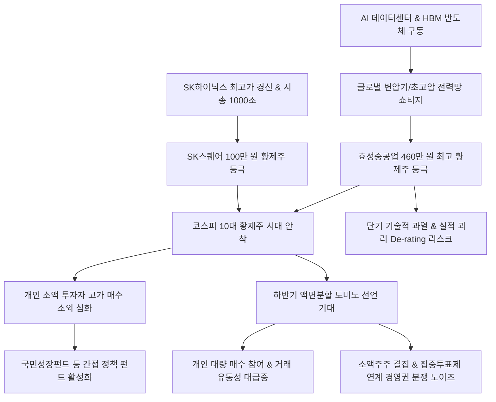

# 증시/황제주 분析: 코스피 10대 황제주 시대 등극과 효성중공업 SK스퀘어 주도 전력 반도체 강세 분석
## 투자 신호 + 사회적 영향 평가

---

## 📌 기사 기본 정보

- **날짜**: 2026-05-08
- **출처**: 박유미 기자 (한국거래소 자료 및 금융투자업계 종합)
- **카테고리**: 경제 > 증시 > 상장기업
- **핵심 주제**: 코스피 지수가 연일 최고치를 경신하는 가운데, 주당 가격이 100만 원을 초과하는 '10대 황제주' 시대가 열림. 넉 달 만에 4개에서 10개로 급증한 황제주 랠리는 AI 데이터센터용 변압기/송배전망의 기하급수적 수요로 460만 원을 돌파한 효성중공업과 SK하이닉스 호실적 지분을 보유한 반도체 전문 지주사 SK스퀘어가 견인함. 고가주 등극에 따른 개인 투자자의 진입 차단 우려가 커짐에 따라 하반기 '액면분할 도미노' 기대감이 고조되고 있으며, 상법 개정안(집중투표제)과 맞물려 주주 주권 운동이 가속화될지 주목됨.

**메타데이터**
- 주요 사건: 코스피 10대 황제주 시대 개막, 효성중공업 460만 원대 최고 주가 기록, SK스퀘어 100만 원 돌파, 하반기 액면분할 가능성 대두
- 핵심 원인: 전 세계 AI 인프라 가동을 위한 초고압 변압기/전력 설비 품귀 현상, SK하이닉스 1000조 돌파에 따른 모회사 지주사 가치 리레이팅, 국민성장펀드 등 장기 공공/패시브 수급 쏠림
- 주요 주체: 효성중공업, SK스퀘어, HD현대일렉트릭, 개인 소액주주, 한국거래소(KRX)
- 키워드: 황제주, 액면분할, 효성중공업, SK스퀘어, 전력반도체, 코스피7000, 주주환원, 집중투표제, 국민성장펀드

---

## 🔍 기사를 통한 투자 신호 추출

### 1단계: 핵심 사건 분해

**What (무엇이 일어났는가?)**
- 주당 100만 원이 넘는 고가 황제주 종목이 기존 4개에서 불과 넉 달 만에 10개로 폭증함. AI 데이터센터의 전력 부족을 헤지할 송배전망 대표주 효성중공업이 460만 원에 장을 마치며 국내 최고가 주식으로 군림하게 되었고, 지주사 밸류업 혜택을 업은 SK스퀘어 역시 100만 원 클럽에 최종 가입함. 이로 인해 소액 투자자 배제 논란이 일며 기업들의 선제적 '액면분할' 및 소액주주 권익 대변 상법 개정안(집중투표제 등)의 수혜 연계성이 부각됨.

**When (언제 일어났는가?)**
- 2026-05-08 (코스피 7000 선을 돌파하며 국내 대형 우량 기업들의 체급이 글로벌 빅테크 수준으로 점프한 시점)

**Why (왜 일어났는가?)**
- AI 전력 기기 품귀로 장기 수주잔고가 폭증한 변압기 인프라와 AI 칩 메모리(HBM) 랠리가 실물 가치 상승으로 직결되었기 때문. 아울러 개인이 직접 매입하기 불가능해진 100만 원 이상 고가주들에 대해 정부의 '국민성장펀드' 정책 자금이 간접 투자 통로로 유입되며 수급 동력을 유지시킴.

**Who (누가 주도하는가?)**
- 글로벌 패시브 자산운용사, 국민성장펀드 위탁 운용사 및 AI 인프라 투자 세력

---

### 2단계: 투자 신호 해석

#### A. **긍정적 신호 (Bullish)**

**① 하반기 황제주 대형주들의 '액면분할 도미노'에 따른 유동성 급팽창**
- **신호**: 효성중공업, HD현대일렉트릭 등의 액면분할 시나리오 본격화
- **의미**: 과거 삼성전자의 50대 1 분할 사례처럼, 1주당 수백만 원에 달하던 주식이 몇 만 원대로 대폭 분할될 시 진입 장벽이 소멸하며 1,400만 개인 소액주주들의 폭발적인 유동성이 신규 유입되어 주가를 한 차례 더 끌어올리는 모멘텀이 됨.
- **투자 기회**: 주당 단가가 매우 높고 거래량이 동결된 황제주군 ([[효성중공업]], [[SK스퀘어]] 등).

**② 업황 대호황에 기반한 자사주 소각 등 주주환원 선순환 극대화**
- **신호**: SK스퀘어 주도로 가시화된 '순익 증가 → 적극적 자사주 매입/소각' 로드맵
- **의미**: 황제주들이 고가 논란을 잠재우고 밸류에이션을 합리화하기 위해 강력한 자사주 소각 및 배당 상향 카드를 꺼내 들어 장기 연기금성 자금이 선호하는 고배당 가치주로 체질을 굳힘.
- **투자 기회**: 자회사 SK하이닉스의 시총 1000조 어닝을 공유하여 재원이 무궁무진한 반도체 전문 투자 지주사 [[SK스퀘어]].

---

#### B. **위험 신호 (Bearish)**

**① 이격도 과열에 따른 기술적 피크아웃 및 De-rating 리스크**
- **신호**: 단기 500% 이상 오버슈팅한 전력 설비주의 밸류에이션 한계 지적
- **의미**: 변압기 및 송배전의 중장기 수주가 단단하다 하더라도, 단기 랠리 피로감으로 인해 향후 2분기 가맹 실적이나 가이던스가 시장 컨센서스를 소폭이라도 하회할 시 황제주들의 주가 변동성 하락폭이 극단적으로 크게 열릴 우려가 있음.
- **투자 리스크**: 실적 대비 멀티플이 과도하게 확장된 일부 전력 설비 고가 개별주.

---

### 3단계: 섹터별 투자 기회 매트릭스

#### ✅ **높은 기대도 + 낮은 리스크**

**반도체 슈퍼사이클 정점의 투자 전문 지주사 (SK스퀘어)**
- 전력 설비 변압기 단일 테마의 황제주들은 단기 오버슈팅에 따른 기술적 조정 변동성이 존재하나, 반도체 슈퍼사이클의 한가운데서 HBM 수익을 독식하는 SK하이닉스의 최대주주 SK스퀘어는 액면분할 기대감, 지주사 자체 자사주 소각 모멘텀, 국민성장펀드 우대 수급이 다중 겹쳐 있어 리스크 대비 중장기 밸류 상승 잠재력이 압도적입니다.
- **투자 추천도**: ⭐⭐⭐⭐⭐

---

## 💰 구체적 투자 신호 변환

### 신호 1: 코스피 10대 황제주 안착 — AI 실물 권력 입증과 액면분할 유동성 랠리 대기
- **투자 해석**: 코스피 10대 황제주 시대의 등극은 AI 연산의 최종 화폐인 '전력 변압기(효성중공업)'와 '반도체(SK스퀘어)'의 실물 가치가 마침내 시장의 지배주주로 올라섰음을 선포한 것입니다. 높은 주당 가격은 개인의 직접 진입을 제한하지만, 이는 하반기 중 대대적 유동성 폭발을 동반할 '액면분할 도미노'의 결정적 촉매로 작동하게 됩니다. 주가 고점 오버슈팅 구간에서 전력 기기 대형주는 점진적 분할 익절로 비중을 관리하되, 실질 주주환원 재원이 무한하고 지주사 할인 해소가 뚜렷한 반도체 지주사(SK스퀘어) 및 국민성장펀드 연계 수급이 예정된 우량 황제주들을 간접 ETF 채널로 분산 포섭하는 리스크 헷지 전략이 최상입니다.

---

## 🌍 사회적 영향 평가

### A. 긍정적 사회 영향
- **대한민국 대표 기업들의 글로벌 체급 승격 및 신뢰 증진**: K-방산, HBM, 송배전 등 국가 전략 인프라 리더들이 글로벌 록히드마틴, 버티브급 가치를 공식 인정받아 국가 자본시장의 체력과 글로벌 위상이 크게 리드됨.
- **공공 펀드를 통한 성장의 온기 분배**: 개인이 직접 사기 어려워진 황제주들에 대해 정부가 국민성장펀드 포트폴리오로 대거 매입하여 국민에게 간접 자산 가치 상승의 수익을 고르게 나눠주는 정책적 낙수효과 구현.

### B. 부정적 사회 영향
- **우량 자산 시장의 서민 투자 배제 및 양극화 우려**: 주식 한 주에 수백만 원을 호가하게 되면서, 자본이 고갈된 소액 서민들은 랠리에서 철저히 격리되고 소수 대형 연기금과 부유층만 부를 독점하는 '주식 신분제' 양극화가 노출됨.
- **주권 파편화에 따른 지배구조 분쟁 및 의사결정 지연**: 거래 활성화를 위해 액면분할을 강행할 시, 대거 유입될 개인 소액주주와 상법 개정(집중투표제)이 물리적으로 시너지를 내며 재계 경영권을 위협하여, 적시 신속 경영을 방해하거나 합병 비율을 의도적으로 방해하는 주주 소송 분쟁 증가 가능성.

---

## 🎯 결론: 당신의 투자 전략 수립

- **즉시 실행**: 액면분할 모멘텀과 HBM 실적 지배력이 이중 작동하는 지주사 [[SK스퀘어]] 비중 확대. 단기 주가 상승폭이 500%를 초과하여 이격도가 극도로 높은 전력 기기 대형주는 분할 익절 대응.
- **3개월 후**: 효성중공업 및 HD현대일렉트릭의 실제 액면분할 이사회 결의 공시 여부를 즉각 추적하여 유동성 유입 일정 수립. 직접 매입이 불가능한 황제주들은 인프라/지배구조 ETF 간접 채널을 통한 분산 포트폴리오로 우회하여 안정적 수확.

---

## 📝 Obsidian 연결 구조

