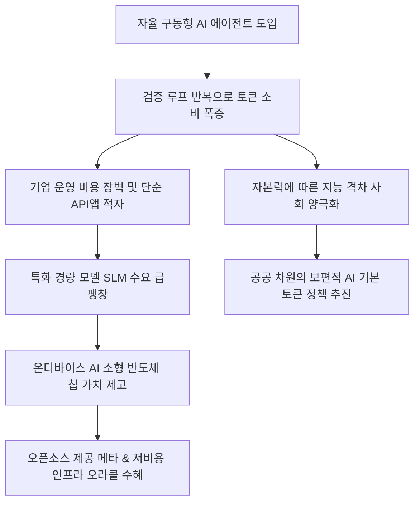

# 테크/AI경제 분析: 토큰 경제의 도래와 AI 비용 구조 및 지식 생산의 접근권 양극화 분석
## 투자 신호 + 사회적 영향 평가

---

## 📌 기사 기본 정보

- **날짜**: 2026-05-08
- **출처**: 박철완 서정대학교 스마트 모빌리티학부 교수 (마켓 나우 칼럼)
- **카테고리**: 경제 > 테크 > 인공지능
- **핵심 주제**: AI 패러다임이 기술 성능 경쟁을 넘어 '비용 구조'와 '지식 접근권' 중심의 토큰 경제(Token Economy)로 급격히 재편되고 있음. LLM이 정보를 처리하는 기본 단위인 '토큰'은 지식 생산의 새로운 원가이자 핵심 인프라가 되었으며, 추론·검증을 반복하는 AI 에이전트 구동 과정에서 토큰 소비량이 기하급수적으로 폭증함. 이에 따라 토큰 비용을 최소화하는 경량 모델(SLM), 인프라 최적화 솔루션, 그리고 저비용 고효율 인프라를 통제하는 기업이 미래 지식 자본 시장의 지배권을 쥘 것으로 전망됨.

**메타데이터**
- 주요 사건: 토큰 경제 시대의 본격 개막, AI 에이전트 보편화에 따른 토큰 비용 폭증, 국가 및 기업 간 지식 생산 접근권 격차 심화
- 핵심 원인: 초거대 모델(LLM)의 높은 구동 비용 장벽, 다중 에이전트 환경의 반복 추론 비용 누적, 빅테크의 독점적 인프라 요금 책정권
- 주요 주체: 글로벌 빅테크(OpenAI, 메타, 구글), 저전력 AI 반도체 제조사, 정부 및 공공 교육 기관
- 키워드: 토큰경제, AI비용구조, LLM, 에이전트, 지식양극화, SLM, 온디바이스AI, 지식생산원가, 가스비, 정보격차

---

## 🔍 기사를 통한 투자 신호 추출

### 1단계: 핵심 사건 분해

**What (무엇이 일어났는가?)**
- 검색, 문서 작성, 기획 등 지식 노동 전반에 실시간으로 토큰 기반의 비용(가스비)이 청구되는 '토큰 경제' 시스템이 구축됨. AI 모델의 지능 수준이 자본력과 직결되면서 교육, 의료, 금융 등 고부가가치 산업에서 지능의 양극화 현상이 뚜렷해짐. 이에 대응해 빅테크 독점 구도를 깨기 위한 소형 경량화 모델(SLM) 최적화 기술 및 하이브리드 모델 오케스트레이션(Model Orchestration) 시장이 새로운 투자 격전지로 부상함.

**When (언제 일어났는가?)**
- 2026-05-08 (단순 챗봇 수준을 넘어 인간의 개입 없이 업무를 완수하는 비즈니스용 AI 에이전트의 본격적인 도입 및 비용 효율화가 화두가 된 시점)

**Why (왜 일어났는가?)**
- 단일 질문-답변과 달리, 에이전트는 기획-실행-피드백 루프를 자율 구동하므로 일반 호출 대비 최대 수십 배의 토큰을 소비하여 기업의 운영 마진을 압박하기 때문임. 따라서 성능을 유지하면서 비용을 획기적으로 낮추는 '경제성' 확보가 시장의 최우선 생존 요건으로 자리 잡음.

**Who (누가 주도하는가?)**
- 비용 통제력을 쥔 글로벌 클라우드 및 인프라 제공사([[오라클]], [[시스코]]), 오픈소스 생태계를 이끄는 [[메타]], 저비용 하이브리드 솔루션 핀테크/테크 스타트업들

---

### 2단계: 투자 신호 해석

#### A. **긍정적 신호 (Bullish)**

**① 토큰 단가를 혁신하는 초경량 모델(SLM) 및 에이전트 최적화 시장의 폭발적 성장**
- **신호**: 기업들의 엔터프라이즈급 AI 비용 절감을 위한 온프레미스·온디바이스 SLM 채택률 급증
- **의미**: 거대 LLM API의 높은 비용을 회피하기 위해 특정 산업군에 맞춤형으로 튜닝된 초경량 모델과 추론 비용 오케스트레이션 툴의 가치가 재평가되며, 관련 솔루션 공급사의 멀티플이 급상승함.
- **투자 기회**: 기업용 AI 에이전트 설계 및 저비용 튜닝 기술력을 확보한 강소 소프트웨어 공급사.

**② 저전력 고효율 맞춤형 추론용 반도체(ASIC, NPU) 인프라로의 대전환**
- **신호**: 데이터센터 및 에이전트 가동을 위한 가성비 높은 추론 특화 칩 주문량 폭증
- **의미**: 토큰 경제의 핵심 비용 유발 요인인 서버 전력과 칩 구매 원가를 극적으로 낮추는 맞춤형 실리콘 및 저전력 시스템 인프라 구축 수요가 기존 가속기 위주에서 추론 특화 시장으로 확대됨.
- **투자 기회**: 저전력 AI 아키텍처 및 미세 공정 기판을 선도하는 반도체 밸류체인 대형주 및 하드웨어 공급사([[삼성전자]], [[오라클]]).

---

#### B. **위험 신호 (Bearish)**

**① 자체적인 '토큰 비용 통제력'이 없는 단순 API 재가공 AI 챗봇 서비스 기업들의 마진 붕괴**
- **신호**: 빅테크의 API 가격 변동 및 다중 에이전트 구동 비용 누적으로 인한 적자 전환
- **의미**: 자체적인 모델 최적화나 비용 제어 기술 없이 OpenAI 등의 거대 모델 API를 단순히 결합해 유료 서비스를 제공하던 기업들은, 사용자 트래픽 증가가 오히려 비용 폭증으로 연결되어 생존이 위태로워짐.
- **투자 리스크**: 독자적인 경량화 기술이 없고 부가가치가 낮은 API 연동형 앱 개발사군.

---

### 3단계: 섹터별 투자 기회 매트릭스

#### ✅ **높은 기대도 + 낮은 리스크**

**글로벌 저비용 AI 인프라망을 장악한 클라우드 및 하이브리드 인프라 리더 (오라클, 메타)**
- 거대 언어모델의 비용 압박 속에서 가장 저렴하게 데이터베이스 및 고성능 AI 인프라를 클라우드로 임대해 주는 서비스 프로바이더([[오라클]])와 비용 제로의 고성능 오픈소스 라마(Llama) 생태계를 확대해 주권 종속을 헤지하게 돕는 [[메타]]는 비용 경쟁의 최종 수혜를 입는 최상의 안전자산입니다.
- **투자 추천도**: ⭐⭐⭐⭐⭐

---

## 💰 구체적 투자 신호 변환

### 신호 1: 사고의 가스비 청구 개시 — 경량화 엔지니어링 및 저비용 인프라 밸류체인 선점
- **투자 해석**: 토큰 경제의 고도화는 무조건적인 최고 성능 AI 모델에 대한 베팅보다, '단위 원가당 비즈니스 효율'을 가장 높게 내는 실용주의적 비즈니스가 살아남음을 뜻합니다. 따라서 단기적인 초거대 LLM 모델의 과열 양상을 경계하고, 성능 극대화에 따른 전력 소모 및 칩 비용 부담을 영리하게 분산시키는 하이브리드 오케스트레이션 소프트웨어 솔루션과 가성비가 입증된 추론 특화 반도체 팹리스 부품 밸류체인으로 포트폴리오의 무게중심을 이동해야 합니다.

---

## 🌍 사회적 영향 평가

### A. 긍정적 사회 영향
- **산업 전반의 지식 생산 가속 및 혁신 원가 절감**: 효율적인 SLM 도입 및 프롬프트 최적화를 통해 기존 기획 및 설계에 걸리던 시간과 투입 자원을 극적으로 단축, 혁신 기술 개발의 진입 장벽 저하.
- **공공 AI 복지 및 인프라의 민주화 유도**: 정보 격차 해소를 위한 국가 차원의 기본 토큰 지원 정책 수립을 촉진하여 취약계층의 디지털 격차 완화 및 보편적 인적 역량 상향 평준화 기반 마련.

### B. 부정적 사회 영향
- **자본력 기반의 '지능 신분제' 및 자산 양극화 고착**: 고가의 고성능 실시간 에이전트를 상시 구동할 수 있는 부유층/대기업과 그렇지 못한 서민/중소기업 간의 비즈니스 생산성 격차가 기하급수적으로 확대됨.
- **국가적 지식 주권의 글로벌 빅테크 종속**: 토큰의 단가와 인프라 분배권을 통제하는 소수 빅테크에 국가 공공 지식 인프라와 기업의 업무 비서망이 완전히 예속되어, 데이터 유출 및 안보 리스크 심화.

---

## 🎯 결론: 당신의 투자 전략 수립

- **즉시 실행**: 저비용 AI 데이터 인프라 구축의 중심에 있으며 멀티클라우드 동맹으로 가성비를 극대화하는 빅테크 인프라주 [[오라클]]의 비중을 적극 확대.
- **3개월 후**: 온디바이스 AI 시장의 실제 보급률 추이 및 경량형 에이전트 탑재 기기 판매량을 관측하여 고부가가치 AI 소형 메모리 밸류체인 및 저전력 패키징 부품주 수혜 일정 구체화.

---

## 📝 Obsidian 연결 구조

