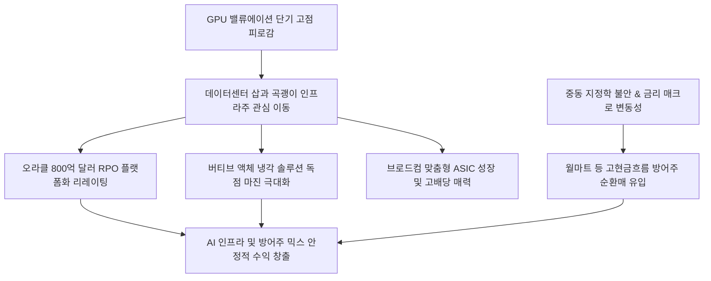

# 투자/AI인프라 분析: AI 인프라 오라클 시스코 버티브 분석과 글로벌 방어주 순환매 전략 분석
## 투자 신호 + 사회적 영향 평가

---

## 📌 기사 기본 정보

- **날짜**: 2026-05-08
- **출처**: 하선영 기자 (블룸버그 및 글로벌머니클럽 종합)
- **카테고리**: 경제 > 투자 > 글로벌증시
- **핵심 주제**: 글로벌 투자 시장의 중심이 엔비디아의 GPU 단일 랠리를 넘어 AI 구동의 근간인 물리적 '인프라 기업'으로 급속히 마이그레이션되고 있음. 데이터베이스의 거대 수주잔고(RPO)를 기반으로 플랫폼 리더십을 입증한 오라클, 발열 해소 냉각의 독점적 권력을 쥔 버티브, 고대역 네트워크 장비의 강자인 시스코가 월가 차세대 주도주로 전면 부각됨. 아울러 매크로 변동성(중동 지정학, 고금리 지속)을 방어하기 위한 강력한 현금흐름 소비재 방어주(월마트, 코스트코)로의 스마트한 자금 순환매가 함께 목격됨.

**메타데이터**
- 주요 사건: AI 인프라 대장주(오라클, 버티브 등)의 주가 재평가 및 리레이팅, 브로드컴의 맞춤형 ASIC 기반 성장-배당주 매력 부각, 월가 자금의 글로벌 방어주 순환매
- 핵심 원인: GPU 중심 쏠림에 따른 단기 밸류에이션 피로감, AI 데이터센터의 필수 과제인 발열(냉각) 및 고속 전송 병목 현상 봉착, 매크로 지정학 및 고금리 불안 대비 헤징 수요
- 주요 주체: 오라클, 브로드컴, 버티브, 시스코, 월마트, KLA, 글로벌 자산운용사
- 키워드: AI인프라, 오라클, 브로드컴, 버티브, 시스코, 방어주, ASIC, 데이터센터냉각, RPO, 순환매, 월마트

---

## 🔍 기사를 통한 투자 신호 추출

### 1단계: 핵심 사건 분해

**What (무엇이 일어났는가?)**
- AI 시장의 성숙도가 연산 장치 자체에서 '그 연산 장치를 안정적이고 유기적으로 굴리는 전제조건'인 데이터센터, 인프라, 전선, 송배전, 냉각, 특화 네트워크망으로 전환됨. 특히 잔여이행의무(RPO)가 800억 달러를 넘어선 오라클의 플랫폼화 가치와 AI 전력 밀도 폭증을 헤지할 버티브의 액체 냉각 기술이 실적 장벽을 형성하며 독점 주도주로 등극함. 동시에 불확실한 매크로 장세에서 견고한 현금 배당 메리트를 제공하는 브로드컴과 유통 방어주의 매수가 이중으로 활성화됨.

**When (언제 일어났는가?)**
- 2026-05-08 (엔비디아의 실적 발표를 앞두고 기술주 전반의 피크아웃 우려와 매크로 불안이 교차하며 포트폴리오의 실물 인프라 재배선이 단행된 시점)

**Why (왜 일어났는가?)**
- GPU 단일 테마의 단기 과열로 멀티플이 과부하에 도달했고, 실제 AI 데이터센터를 짓는 빅테크들이 칩 구동 속도를 방해하는 '발열 병목'과 '네트워크 전송 지연' 해결에 막대한 비용을 우선 투입하고 있기 때문임.

**Who (누가 주도하는가?)**
- 연기금, 은퇴 소득 펀드, 글로벌 매크로 헤지펀드 및 대형 패시브 펀드 매니저들

---

### 2단계: 투자 신호 해석

#### A. **긍정적 신호 (Bullish)**

**① GPU 병목을 해소하는 데이터센터 물리적 핵심 솔루션(냉각·네트워크) 독점력 강화**
- **신호**: 데이터센터 냉각 솔루션 강자 버티브의 수주 단가 상향 및 시스코의 차세대 초고속 스위치 칩 탑재 장비 출하량 급증
- **의미**: 칩 미세화 및 고적층화가 진행될수록 발열 제어와 통신 병목 제거 능력이 AI 연산 효율의 절대 조건을 결정하므로, 이들 인프라 강자들의 독점 마진율은 장기적으로 엔비디아보다 안정적으로 유지됨.
- **투자 기회**: 데이터센터 액체 냉각 지배적 지위를 가진 [[버티브]] 및 AI 초고속 인프라 장비 선두 [[시스코]].

**② 맞춤형 실리콘(ASIC) 설계 패권 장악 및 고배당 환원의 결합**
- **신호**: 빅테크의 자체 칩 설계 수주 증가 및 브로드컴의 배당 성장 로드맵 신뢰성 제고
- **의미**: 범용 칩에서 빅테크 자체 특화 맞춤형 칩(ASIC)으로의 생태계 다변화 수혜를 브로드컴이 독점하고 있으며, 강력한 배당 성향이 하락장의 방어막 역할을 수행하여 성장과 가치 매력을 동시 획득함.
- **투자 기회**: 글로벌 ASIC 설계 지배주 [[브로드컴]].

---

#### B. **위험 신호 (Bearish)**

**① 하드웨어 및 실물 인프라 연결성이 없는 순수 소프트웨어·단일 모델 스타트업들의 아웃퍼폼 둔화**
- **신호**: 인프라 비용 부담 증가에 따른 생성형 AI 서비스 개발사들의 이익률 압박
- **의미**: 실물 데이터 인프라(클라우드 랙, 광대역망)를 임대해 비용을 지급해야 하는 단순 서비스 중심 기업들은 인프라 단가 상승으로 마진이 훼손되며, 시장의 주도권에서 소외될 수 있음.
- **투자 리스크**: 독점적 플랫폼 가치나 비용 통제력이 부재한 3선급 생성형 AI 애플리케이션 관련주.

---

### 3단계: 섹터별 투자 기회 매트릭스

#### ✅ **높은 기대도 + 낮은 리스크**

**클라우드 수주잔고(RPO)와 전천후 AI 솔루션을 동시 통제하는 클라우드 리더 (오라클)**
- 엔비디아 랠리가 둔화되더라도 빅테크들의 클라우드 서버 증설 및 데이터베이스 고도화 계약(RPO)은 수년간 고정적으로 이어지기 때문에 실적 안정성이 가장 높습니다. 멀티클라우드 개방으로 마이크로소프트, 구글 등 빅테크 모두를 고객사로 포섭하는 유일무이한 인프라 승자입니다.
- **투자 추천도**: ⭐⭐⭐⭐⭐

---

## 💰 구체적 투자 신호 변환

### 신호 1: 삽과 곡괭이로의 자금 재이동 — AI 실물 인프라주 선점 및 고배당 방어주 결합
- **투자 해석**: 현재 AI 투자는 '과연 칩이 얼마나 팔릴 것인가'에서 '팔린 칩들이 제대로 냉각되고 지연 없이 데이터를 주고받을 수 있는가'라는 실용적인 물리적 문제로 고착되었습니다. 따라서 포트폴리오 내의 GPU 제조사 비율을 일부 차익 실현하여, 오라클(클라우드 인프라), 버티브(액체 냉각), 브로드컴(ASIC 및 고배당)으로 이동 배치해야 합니다. 이와 함께 경기 충격을 흡수할 견고한 캐시카우 소비재인 월마트 등을 혼합하여 변동성 높은 매크로 구간을 안정적인 방어적 성장으로 돌파해야 합니다.

---

## 🌍 사회적 영향 평가

### A. 긍정적 사회 영향
- **친환경 고효율 데이터센터 인프라로의 표준 혁신**: 버티브 등의 정밀 고효율 냉각 기술 도입으로 AI 구동에 따른 막대한 탄소 배출과 전력 낭비를 억제하는 기술적 돌파구 마련.
- **실물 자산 및 일자리 창출 활성화**: 데이터센터 부지 건설, 송전망 전선 포설, 대규모 장비 유지보수 등 실체가 있는 제조업 및 인프라 건설 부문의 지속가능한 일자리 및 지역 경제 활성화 유도.

### B. 부정적 사회 영향
- **인프라 자본 독점에 따른 중소 테크 기업의 고사**: 천문학적 클라우드 및 냉각 설비 구축비를 감당할 수 있는 극소수 메이저 테크 기업과 오라클 등의 지배사들만 데이터 연산 속도를 보장받아 중소 스타트업들과의 인프라 격차가 더욱 깊어짐.
- **지정학적 리스크 및 전력망 부족에 따른 지역사회 갈등**: 초거대 인프라의 전력망 독점으로 인해 지역 주거 송배전망 부하 및 전기 요금 인상 압박이 발생하여 인프라 건설 지역 주민들과의 사회적 충돌 가능성 노출.

---

## 🎯 결론: 당신의 투자 전략 수립

- **즉시 실행**: GPU 쏠림 포트폴리오를 분산하여, 잔여이행의무(RPO)가 담보된 대형 플랫폼 [[오라클]] 및 액체 냉각 절대강자 [[버티브]]의 비중을 신규 추가. 포트폴리오의 20%는 고금리 방어 성격을 지닌 소비 유통 대장주 [[월마트]]로 방어막 강화.
- **3개월 후**: KLA 등 검사 장비 지표와 글로벌 데이터센터 액체 냉각 표준 변경 동향을 상시 추적하여 기술 변동에 따른 부품 수혜주 포트폴리오 세부 튜닝.

---

## 📝 Obsidian 연결 구조

