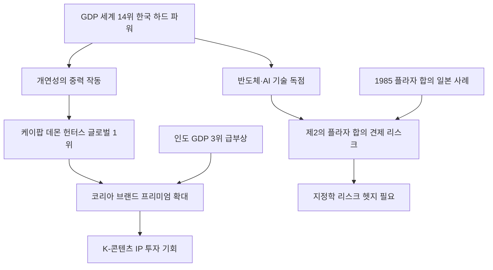

# 거시경제/문화 분析: 국가 경제력과 대중문화 영향력의 상관관계 및 케이팝 데몬 헌터스의 흥행과 경제적 위상
## 투자 신호 + 사회적 영향 평가

---

## 📌 기사 기본 정보

- **날짜**: 2026-05-09
- **출처**: 이태환 세종대 경제학과 교수 (중앙SUNDAY 세상만사 경제학)
- **카테고리**: 경제 > 금융 > 거시경제/문화
- **핵심 주제**: 2025년 넷플릭스 역대 최다 시청작이자 아카데미 2관왕을 수상한 『케이팝 데몬 헌터스(케데헌)』의 글로벌 흥행은 단순한 문화적 성취가 아니라, GDP 세계 14위의 하드 파워(경제 체급)가 전 세계 시청자의 뇌 속에 작동시킨 '개연성의 중력' 덕분임을 실증한 거시지정학 분析

**메타데이터**
- 주요 사건: 케이팝 데몬 헌터스 넷플릭스 역대 최다 시청 및 아카데미 2관왕, GDP 세계 14위 한국의 대중문화 글로벌 장악
- 핵심 원인: 국가 경제력(GDP·제조업 하드 파워)이 대중문화 영향력의 직접 토대, 1985년 플라자 합의 패턴의 경고
- 주요 주체: 한국 콘텐츠 산업, 글로벌 OTT(넷플릭스), 미국 패권 동맹, 인도 신흥 경제
- 키워드: 개연성의 장벽, 플라자 합의, 하드 파워, 소프트 파워, 케이팝 데몬 헌터스, 떠오르는 태양, 삼체

---

## 🔍 기사를 통한 투자 신호 추출

### 1단계: 핵심 사건 분해

**What (무엇이 일어났는가?)**
- 한국 K-Pop 걸그룹과 무속 신앙을 결합한 영화 『케이팝 데몬 헌터스』가 2025년 넷플릭스 역대 최다 시청 기록을 경신하고 아카데미 2관왕을 달성했습니다. 이 흥행은 전 세계 시청자들이 "한국 소녀들이 남산에서 지구를 구한다"는 서사를 자연스럽게 수용한 덕분이며, 이는 한국이 GDP 세계 14위를 달성한 하드 파워(경제 체급)가 뒤받쳐준 결과입니다.

**When (언제 일어났는가?)**
- 2026-05-09 (이태환 교수의 중앙SUNDAY 기고, 케이팝 데몬 헌터스 흥행 이후 거시경제학적 분析 시점)

**Why (왜 일어났는가?)**
- 경제력이 낮은 국가는 아무리 뛰어난 콘텐츠라도 '인류를 구원하는 주인공'이라는 설정의 개연성 장벽을 넘지 못합니다.
- 반면 GDP 세계 14위의 한국은 전 세계인의 일상을 지배하는 스마트폰·반도체·가전제품을 통해 이미 '신뢰 자본'을 확보했습니다.
- 1980년대 일본의 플라자 합의 사례처럼, 경제적 급부상은 문화적 위상과 동시에 서구 패권의 지정학적 견제를 불러옵니다.

**Who (누가 주도하는가?)**
- 문화적 위상 확장: 한국 콘텐츠 산업 및 글로벌 OTT 플랫폼
- 지정학적 견제 변수: 미국 중심의 서구 패권 동맹 및 금융 시스템

---

### 2단계: 투자 신호 해석

#### A. **긍정적 신호 (Bullish)**

**① 한국 콘텐츠·엔터 산업의 글로벌 프리미엄 가속화**
- **신호**: 케이팝 데몬 헌터스의 넷플릭스 역대 1위 및 아카데미 수상
- **의미**: GDP 14위 경제 체급이 문화 소프트 파워를 지속 증폭시키며 한국산 콘텐츠의 글로벌 IP(지식재산) 가치가 구조적으로 재평가됨
- **투자 기회**: 한국 대형 엔터테인먼트 IP 보유사, OTT 공동제작 수혜주, 한류 연계 관광·소비재 브랜드

**② 반도체·제조업 초격차 기술의 문화 외교 시너지**
- **신호**: 삼성·SK하이닉스의 글로벌 반도체 독점 지위와 케이팝 데몬 헌터스 흥행의 동시 발생
- **의미**: 첨단 제조업(하드 파워)이 대중문화(소프트 파워)를 지탱하는 경제 생태계가 완성됨으로써, 코리아 브랜드 프리미엄이 수출·관광·IP 라이선스 등 전 영역에 걸쳐 배가됨
- **투자 기회**: [[삼성전자]], [[SK하이닉스]], K-콘텐츠 글로벌 유통망 연계 플랫폼

---

#### B. **위험 신호 (Bearish)**

**① '제2의 플라자 합의' 형태의 지정학적 역풍 가능성**
- **신호**: 1985년 미국의 플라자 합의(엔화 강제 절상)가 일본의 '잃어버린 30년'을 초래한 역사적 패턴
- **의미**: 한국 기업이 반도체·모빌리티·바이오 분야에서 독점적 기술 체급을 키울수록, 서구 패권 동맹이 탄소세·공급망 제재·환율 압박 등 '제2의 합의' 카드를 구사할 위험이 높아짐
- **투자 리스크**: 한국 수출 대기업 중 서구 규제 노출이 큰 첨단 기술 업종 전반

**② 중국의 '빌런 프레임' 전철 반복 가능성**
- **신호**: 소설 『삼체』가 중국의 패권 야욕을 드러내는 서사로 귀결되어 서구에서 '인류 공멸 기폭제'로 묘사된 사례
- **의미**: 한국이 글로벌 평화적 기여국 이미지를 유지하지 못하거나 지나친 민족주의 콘텐츠를 수출할 경우, 서구 소비자의 이탈 및 규제 리스크로 이어질 수 있음
- **투자 리스크**: 한국 콘텐츠 관련주 및 대미·대유럽 수출 의존도 높은 소비재 브랜드

---

### 3단계: 섹터별 투자 기회 매트릭스

#### ✅ **높은 기대도 + 낮은 리스크**

**첨단 제조업 기반 하드 파워 유지 기업 (반도체·방산·AI)**
- 경제 체급(GDP 14위)이 문화 위상을 결정하는 구조에서, 초격차 기술력을 보유한 첨단 제조 대기업은 국가 브랜드와 동반 상승하는 복합 모멘텀을 누립니다.
- **투자 추천도**: ⭐⭐⭐⭐⭐

**한국 콘텐츠 글로벌 IP 보유 엔터테인먼트 기업**
- 케이팝 데몬 헌터스의 흥행 공식이 반복·확장될 구조적 기반이 마련된 상태이므로, K-콘텐츠 IP를 글로벌 OTT와 공동 개발하는 대형 엔터사는 중장기 프리미엄 확대가 기대됩니다.
- **투자 추천도**: ⭐⭐⭐⭐

---

## 💰 구체적 투자 신호 변환

### 신호 1: GDP 체급 성장에 따른 K-콘텐츠 프리미엄의 구조적 재평가

**투자 해석**: 이태환 교수의 분析은 한국 주식 시장에서 엔터테인먼트·콘텐츠 섹터가 단순한 문화 산업이 아니라 국가 경제력과 연동된 '국가 브랜드 프리미엄 자산'임을 시사합니다. 코스피가 GDP 성장에 힘입어 글로벌 재평가를 받는 것처럼, K-콘텐츠 IP 보유사들도 글로벌 OTT 수요와 연계되어 구조적 밸류에이션 상향을 기대할 수 있습니다. 동시에 투자자는 '제2의 플라자 합의' 형태의 지정학적 리스크를 항상 시나리오에 반영해야 합니다. 반도체·모빌리티·바이오 기업이 기술 독점을 완성해 나갈 때마다, 이에 대한 서구 패권의 규제 카드(탄소세, 공급망 제한, 환율 압박)가 현실화될 확률을 점진적으로 헷지(Hedge)하는 방어적 포트폴리오 설계가 필요합니다.

---

## 🌍 사회적 영향 평가

### A. 긍정적 사회 영향
- **문화 자신감과 국가 정체성의 강화**: 케이팝 데몬 헌터스의 글로벌 흥행은 한국 시민들에게 경제 성장이 문화적 위상으로 결실을 맺는다는 자신감을 부여하며, 국가 공동체 정체성을 강화하는 긍정적 사회 통합 효과를 냅니다.
- **한류 기반 관광·소비 산업의 소외 계층 고용 창출**: K-콘텐츠 흥행은 관광업·요식업·공예업 등 저숙련 노동자들의 일자리와 직결되어 소외 계층의 실질 소득 증가에 기여합니다.

### B. 부정적 사회 영향
- **플라자 합의 패턴 재현 시 제조업 종사자 직격**: 서구의 한국 견제 강화(규제·환율 압박)가 현실화되면, 가장 먼저 피해를 입는 것은 수출 대기업 하청 구조에 편입된 중소기업 근로자들입니다.
- **경제 성장의 과실 불평등 분배**: 케이팝 콘텐츠 흥행의 경제적 수익이 소수의 대형 엔터 기업과 투자자에게 집중되고, 실제 K-콘텐츠의 '밑단'을 구성하는 무명 아티스트·스태프들에게는 충분히 환원되지 않는 구조적 문제가 심화될 수 있습니다.

---

## 🎯 결론: 당신의 투자 전략 수립

- **즉시 실행**: K-콘텐츠 글로벌 IP 보유 대형 엔터사 및 OTT 공동제작 수혜주에 대한 중장기 포지션 검토. 동시에 반도체·방산 등 첨단 제조 대기업의 '지정학적 리스크 헷지' 시나리오를 포트폴리오에 반영
- **3개월 후**: 인도의 GDP 3위 등극 시점(2026~2027년 예상) 및 미-중 패권 경쟁의 한국 기술 규제 동향을 모니터링하며 '제2의 플라자 합의' 리스크의 현실화 여부 재점검

---

## 📝 Obsidian 연결 구조

