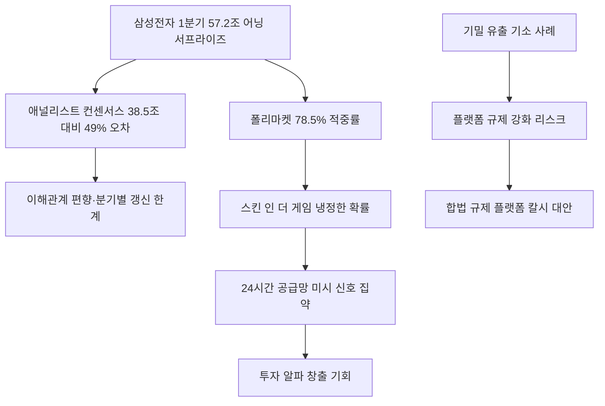

# 경제/핀테크 분析: 삼성전자 어닝 서프라이즈와 예측시장 폴리마켓의 집단지성 및 정보 집약 메커니즘
## 투자 신호 + 사회적 영향 평가

---

## 📌 기사 기본 정보

- **날짜**: 2026-05-09
- **출처**: 이준기 연세대 정보대학원 교수 (중앙SUNDAY 칼럼)
- **카테고리**: 경제 > 금융 > 핀테크/예측시장
- **핵심 주제**: 삼성전자의 2026년 1분기 어닝 서프라이즈(실제 영업이익 57.2조 원 vs 증권가 예측 38.5조 원)를 선제 반영한 탈중앙화 예측시장 폴리마켓(Polymarket)의 집단지성 메커니즘 분析. 이해관계에 왜곡된 전문가 집단(적중률 43.7%)을 압도하는 '스킨 인 더 게임(Skin in the Game)' 자본 확률의 승리를 조명

**메타데이터**
- 주요 사건: 삼성전자 1분기 영업이익 57.2조 원 기록(증권가 컨센서스 38.5조 원 대비 49% 초과), 폴리마켓 방향 적중률 78.5% vs 애널리스트 43.7%
- 핵심 원인: 자기 돈을 거는 '스킨 인 더 게임' 구조, 24시간 실시간 공급망 신호 집약, 이해관계 편향 없는 탈중앙화 플랫폼
- 주요 주체: 폴리마켓(탈중앙화 예측시장), 증권사 애널리스트, 삼성전자, 미군 기밀 유출 피의자(규제 리스크 사례)
- 키워드: 폴리마켓, 예측시장, 스킨인더게임, 집단지성, 브라이어 스코어, 칼시, 어닝 서프라이즈

---

## 🔍 기사를 통한 투자 신호 추출

### 1단계: 핵심 사건 분해

**What (무엇이 일어났는가?)**
- 삼성전자가 2026년 1분기 영업이익 57.2조 원을 기록하며 증권가 컨센서스(38.5조 원)를 49% 초과 달성했습니다. 이를 증권사 애널리스트들은 예측하지 못했으나, 탈중앙화 예측시장 폴리마켓의 베터들은 78.5%의 방향 적중률로 이를 선제 반영했습니다. 같은 기간 로제 '아파트(APT.)'의 그래미 수상 실패도 폴리마켓이 정확히 예견하여, '차가운 자본의 확률'이 감정적 팬덤의 희망 사항을 압도함을 실증했습니다.

**When (언제 일어났는가?)**
- 2026-05-09 (469개 미국 기업 실적 예측 분析 결과 발표, 2025년 9월~2026년 2월 데이터 기반)

**Why (왜 일어났는가?)**
- 증권사 애널리스트들은 기업 관계 유지 및 IB 업무 수주 등 이해관계로 인해 독립성을 잃고 실적 컨센서스를 왜곡합니다.
- 반면 폴리마켓의 베터들은 자기 돈을 잃지 않기 위해 극도로 신중하게 공급망 말단 정보를 실시간으로 집약하는 '스킨 인 더 게임' 구조에 놓여 있습니다.
- 전통 리서치 방식이 분기에 한두 차례만 갱신되는 반면, 예측시장은 24시간 실시간으로 가격에 정보를 반영합니다.

**Who (누가 주도하는가?)**
- 이익 집약 주도: 전 세계 공급망 현장 실무자와 트레이더들이 자금을 걸고 참여하는 탈중앙화 예측시장 집단
- 기득권 위협 대상: 왜곡된 컨센서스로 밥벌이하는 전통 증권사 애널리스트 집단

---

### 2단계: 투자 신호 해석

#### A. **긍정적 신호 (Bullish)**

**① 예측시장 기반 실시간 정보 집약의 투자 알파 창출**
- **신호**: 폴리마켓의 기업 실적 방향 적중률(78.5%)이 애널리스트 컨센서스(43.7%)를 두 배 가까이 앞선 실증 데이터
- **의미**: 예측시장 가격 흐름을 투자 분析의 선행 지표로 활용하면 전통 리서치 대비 유의미한 정보 우위 확보 가능
- **투자 기회**: 합법 규제 예측 플랫폼(칼시 등)의 기업 실적·매크로 예측 데이터를 보조 분析 도구로 활용하는 투자 전략

**② 삼성전자 등 어닝 서프라이즈 종목의 선행 모니터링**
- **신호**: 증권가가 57.2조 원을 38.5조 원으로 과소 예측한 구조적 이유(이해관계 편향)가 반복 작동
- **의미**: 애널리스트 컨센서스를 맹목적으로 추종하지 않고, 공급망 채널 체크 및 예측시장 확률 변동을 동시에 참고하면 어닝 서프라이즈 선행 포착 가능
- **투자 기회**: [[삼성전자]], [[SK하이닉스]] 등 반도체 대형주의 어닝 시즌 전 포지셔닝

---

#### B. **위험 신호 (Bearish)**

**① 기밀 정보 유출 결합 시 법적·시장 리스크**
- **신호**: 미군 병사가 기밀정보를 활용해 마두로 대통령 납치 베팅으로 40만 달러를 챙긴 최초 기소 사례
- **의미**: 예측시장이 비대칭 내부 정보의 불법 거래 창구로 악용될 경우, 플랫폼 규제 강화 및 시장 신뢰 붕괴로 이어질 수 있음
- **투자 리스크**: 예측시장 관련 핀테크 기업 및 탈중앙화 금융(DeFi) 플랫폼 전반

**② 한국의 사행성 규제 환경 내 법적 리스크**
- **신호**: 한국의 엄격한 사행 행위 규제로 인해 폴리마켓 등 예측시장 참여가 현행법상 불법으로 간주될 가능성
- **의미**: 글로벌 예측시장 트렌드에서 소외될 경우, 한국 투자자들이 실시간 집단지성 정보를 합법적으로 활용하지 못하는 정보 비대칭 고착화
- **투자 리스크**: 규제 미비 상태에서 개인이 해외 예측시장에 무분별하게 참여할 경우의 법적 제재 위험

---

### 3단계: 섹터별 투자 기회 매트릭스

#### ✅ **높은 기대도 + 낮은 리스크**

**공급망 현장 신호 기반의 반도체 대형주 선행 투자**
- 공급망 말단에서 실시간으로 집약되는 정보를 포착하는 예측시장의 확률 변동을 삼성전자·SK하이닉스 등 대형 반도체 어닝 시즌 전 포지셔닝에 활용하면, 전통 리서치 대비 유의미한 선행 매수 기회를 발굴할 수 있습니다.
- **투자 추천도**: ⭐⭐⭐⭐⭐

---

## 💰 구체적 투자 신호 변환

### 신호 1: 애널리스트 컨센서스의 구조적 편향 인식과 대안 정보 채널 구축

**투자 해석**: 이번 기사는 삼성전자의 어닝 서프라이즈가 단순한 실적 깜짝 발표가 아니라, 기존 전문가 집단의 '이해관계 편향'이 만들어낸 예측 오류가 얼마나 심각한지를 적나라하게 보여주는 구조적 사건임을 경고합니다. 투자자는 증권사 리포트를 참고하되, 이를 최종 판단의 유일한 근거로 삼는 의존도를 낮추고 공급망 현장의 미시 신호(장비 수주, 원자재 발주 동향, 반도체 장비 업체 수주 잔고)를 직접 모니터링해야 합니다. CFTC 합법 규제 플랫폼인 칼시(Kalshi) 등의 기업 실적 예측 확률을 보조 지표로 활용하는 것도 유효한 전략입니다.

---

## 🌍 사회적 영향 평가

### A. 긍정적 사회 영향
- **금융 정보의 민주화 촉진**: 예측시장이 보편화되면, 소수 증권사의 편향된 리포트에 의존하던 개인 투자자들도 실시간 집단지성 확률 데이터를 활용할 수 있어 정보의 비대칭성 해소에 기여합니다.
- **기업 실적 불투명성 감소**: 예측시장의 가격 압력이 기업들에게 실적 관련 정보를 보다 투명하게 공개하도록 하는 간접적인 시장 규율로 작동할 수 있습니다.

### B. 부정적 사회 영향
- **내부 정보 탈법 거래와 금융 공정성 훼손**: 기밀 정보 보유자가 예측시장을 이용해 불법 이익을 챙기는 사례가 증가할 경우, 일반 투자자가 피해를 보는 새로운 형태의 내부자 거래 문제가 부상합니다.
- **취약 계층의 예측 시장 중독 리스크**: 투기성 예측 베팅이 게임화(Gamification)되면서 경제적으로 취약한 계층이 도박성 손실에 노출될 수 있으며, 이에 대한 사회적 안전망 논의가 필요합니다.

---

## 🎯 결론: 당신의 투자 전략 수립

- **즉시 실행**: 삼성전자·SK하이닉스 등 반도체 대형주의 어닝 시즌(분기 실적 발표 2~3주 전)에 공급망 채널 체크(반도체 장비 수주 동향, HBM 공급 계약 동향)를 실시하고, 칼시 등 합법 예측시장의 실적 방향 확률을 보조 지표로 병행 확인
- **3개월 후**: 한국 금융당국의 예측시장 합법화 관련 규제 논의 동향을 모니터링하며, 글로벌 예측 플랫폼 활용의 법적 리스크 여부를 재검토

---

## 📝 Obsidian 연결 구조

