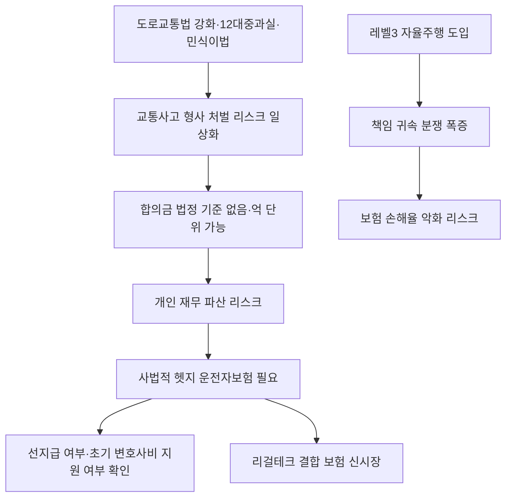

# 생활경제/보험 분析: 자동차보험과 운전자보험의 차이 및 교통사고 법적·형사적 리스크 대비 전략
## 투자 신호 + 사회적 영향 평가

---

## 📌 기사 기본 정보

- **날짜**: 2026-05-09
- **출처**: 홍승희 머니랜턴 대표 (중앙SUNDAY 머니 주치의)
- **카테고리**: 경제 > 금융 > 생활경제/보험
- **핵심 주제**: 자동차보험이 '민사적 범퍼'라면 운전자보험은 '형사적 에어백'이다. 12대 중과실·민식이법 등 법적 규제 강화로 단순 과실이 형사 범죄로 전환되는 현실에서, 합의금 선지급 여부와 초기 경찰 조사 단계 변호사 비용 지원이라는 실효성 기준으로 법적 자산 방어막(사법적 헷지)을 구축하는 전략 분析

**메타데이터**
- 주요 사건: 12대 중과실 교통사고의 형사 처벌 일상화, 민식이법(어린이 보호구역 안전의무) 벌금 상한 3,000만 원, 우회전 일시정지 의무화
- 핵심 원인: 보행자 중심 도로교통법 강화, 형사 합의금 법정 기준 부재(수천만 원~억 단위 가능), 깡통 보험(후지급·정식 기소 후 지급 구조)의 함정
- 주요 주체: 운전자 개인(리스크 주체), 보험사, 피해자, 법원(형사 처벌 집행)
- 키워드: 운전자보험, 12대 중과실, 형사 합의금 선지급, 민식이법, 사법 리스크 헷지, 변호사 선임비

---

## 🔍 기사를 통한 투자 신호 추출

### 1단계: 핵심 사건 분해

**What (무엇이 일어났는가?)**
- 도로교통법이 보행자 보호 중심으로 지속 강화되면서, 운전자가 의도치 않게 범하는 교통사고가 형사 처벌(징역·벌금) 대상이 되는 빈도가 일상적으로 높아졌습니다. 형사 처벌을 면하려면 피해자와 '형사 합의'를 해야 하는데, 합의금은 법정 기준이 없어 수천만 원에서 억 단위까지 치솟을 수 있습니다. 기존 자동차보험은 이 '형사적 책임'을 커버하지 못하며, 운전자보험만이 이를 보완합니다.

**When (언제 일어났는가?)**
- 2026-05-09 (민식이법 시행 이후 법적 리스크 환경 분析, 자율주행 도입 과도기 진입 시점)

**Why (왜 일어났는가?)**
- 사회 전반의 피해자 권리 보호 강화로 교통 관련 형사 처벌 기준이 지속적으로 상향되었습니다.
- 그러나 운전자보험의 보장 구조(특히 합의금 '후지급' 여부, 변호사 비용 지원 시점)가 법 강화 속도를 따라가지 못해 실질적인 방어 공백이 발생합니다.
- 레벨 3 조건부 자율주행 도입으로 사고 책임 귀속이 더욱 복잡해지는 구조적 변화가 진행 중입니다.

**Who (누가 주도하는가?)**
- 리스크 집중 대상: 12대 중과실에 노출된 모든 운전자 및 특히 경제적 방어 인프라가 취약한 서민 계층
- 규제 강화 주도: 국가 사법부 및 국토교통부, 피해자 권리 강화 입법 흐름

---

### 2단계: 투자 신호 해석

#### A. **긍정적 신호 (Bullish)**

**① 리걸테크(Legal-Tech) 연계 보험 서비스 신시장 창출**
- **신호**: 자율주행 도입 가속 + 형사 처벌 리스크 증가로 초기 법률 방어 수요 폭증
- **의미**: AI 변호사 앱과 연동하여 사고 즉시 24시간 경찰 진술 가이드라인을 제공하는 리걸테크 보험 결합 서비스가 새로운 성장 시장으로 부상
- **투자 기회**: 리걸테크 스타트업, AI 법률 플랫폼 연계 보험 상품 개발사, 운전자보험 특화 손해보험사

**② 운전자보험 가입률 상승에 따른 손해보험 업계 수익성 개선**
- **신호**: 법적 규제 강화가 보험 의무성 인식을 높이며 운전자보험 신계약 증가
- **의미**: 민식이법 등 강화된 법적 환경이 손해보험사의 운전자보험 상품 라인업 확대 및 프리미엄 보장 상품 판매 증가로 이어짐
- **투자 기회**: 국내 대형 손해보험사(삼성화재, DB손해보험, 현대해상 등)

---

#### B. **위험 신호 (Bearish)**

**① '깡통 보험' 가입자의 집단 손실 리스크**
- **신호**: 합의금 후지급 구조 또는 정식 기소 후에야 변호사 비용을 지원하는 불량 약관의 운전자보험 가입자 다수 존재
- **의미**: 실제 사고 발생 시 보험의 실효성이 없어 개인 재무가 파산 수준의 타격을 받는 집단적 피해 사례 증가
- **투자 리스크**: 민원 급증 및 금융당국 규제 강화에 따른 손해보험사 업계 전반의 약관 재설계 비용 증가

**② 자율주행 법적 분쟁 폭증에 따른 보험 손해율 악화**
- **신호**: 레벨 3 자율주행 도입 시 사고 원인(인간 과실 vs 시스템 오류) 분쟁 장기화
- **의미**: 소송 비용 및 법적 방어 비용 증가로 운전자보험 손해율이 예상보다 빠르게 악화될 가능성
- **투자 리스크**: 손해보험사 운전자보험 부문 수익성 압박

---

### 3단계: 섹터별 투자 기회 매트릭스

#### ✅ **높은 기대도 + 낮은 리스크**

**국내 대형 손해보험사 (법적 환경 강화 수혜)**
- 형사 처벌 리스크 증가가 운전자보험 가입 의무화 인식을 높이며, 대형 손해보험사의 운전자보험 라인업 및 리걸테크 결합 상품 판매 증가가 기대됩니다.
- **투자 추천도**: ⭐⭐⭐⭐

---

## 💰 구체적 투자 신호 변환

### 신호 1: 강화되는 법적 환경에서 '사법적 헷지(Legal Hedge)' 개념의 생활경제 정착

**투자 해석**: 이 기사는 개인 자산 관리의 영역에서 '사법적 헷지'라는 새로운 패러다임을 제시합니다. 금융 포트폴리오에서 리스크 헷지가 필수이듯, 생활 속 법적 리스크에 대한 방어막도 비용(보험료)을 지불하고 구축해야 합니다. 보험 상품 선택 시 가장 중요한 기준은 합의금의 '선지급' 여부와 경찰 조사 초기 단계부터의 변호사 비용 지원 여부입니다. 또한 민식이법 벌금 상한(3,000만 원) 이상의 보장 한도로 업그레이드했는지 주기적으로 점검해야 합니다. 이는 단순 소비 지출이 아니라, 인생 최악의 시나리오에서 자산을 지키는 핵심 방어 인프라입니다.

---

## 🌍 사회적 영향 평가

### A. 긍정적 사회 영향
- **피해자 보호 강화 및 사법적 정의 실현**: 형사 처벌 기준 강화와 합의금 제도는 교통사고 피해자의 실질적인 권리 회복에 기여하며, 운전자의 안전 운전 의식을 높이는 예방적 효과를 냅니다.
- **리걸테크를 통한 법률 서비스 접근성 민주화**: 고가의 변호사 선임이 어려운 서민도 운전자보험의 변호사 비용 지원을 통해 초기 법률 방어권을 확보할 수 있습니다.

### B. 부정적 사회 영향
- **안전의 양극화 — 월 1~2만 원도 내기 어려운 빈곤층**: 경제적 취약 계층은 운전자보험 가입 여력이 없어 한 번의 사고로 전과자가 되거나 파산에 직면하는 '사법적 양극화' 문제가 심화됩니다.
- **보험사의 사회적 의무 방기**: 국가가 법을 강화할수록 민간 보험사만 수익을 얻는 구조가 굳어지면, 보험에 가입할 수 없는 취약 계층은 사각지대에 더 깊이 빠질 위험이 있습니다. 저소득층 대상 정책 보험 확충이 사회적 책무로 부상합니다.

---

## 🎯 결론: 당신의 투자 전략 수립

- **즉시 실행**: 현재 가입한 운전자보험 약관의 ① 교통사고처리지원금 선지급 구조 여부, ② 경찰 조사 초기 단계 변호사 선임비 지원 여부, ③ 보장 한도(민식이법 3,000만 원 이상)를 즉시 점검하고 미달 시 리모델링
- **3개월 후**: 레벨 3 자율주행 상용화 동향을 모니터링하며, 사고 책임 귀속 분쟁 증가에 대비하는 법률 방어 보장 강화 상품으로의 업그레이드 시점 검토

---

## 📝 Obsidian 연결 구조

