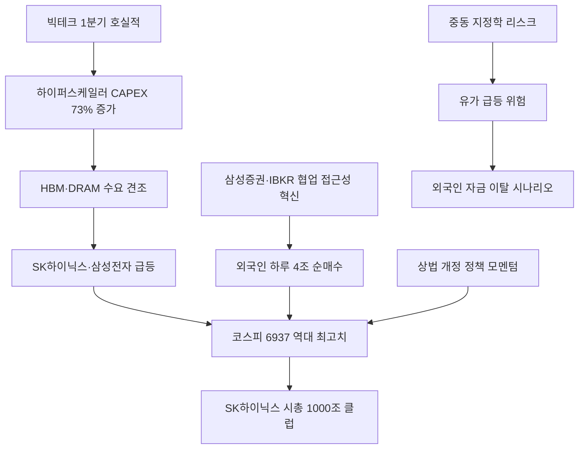

# 증시/외국인수급 분析: 코스피 6937 역대 최고 — 외국인 4조 순매수 삼성·IBKR 바이코리아
## 투자 신호 + 사회적 영향 평가

---

## 📌 기사 기본 정보

- **날짜**: 2026-05-09
- **출처**: 국내 경제지 종합 (한국거래소 데이터)
- **카테고리**: 경제 > 금융 > 증시/외국인수급
- **핵심 주제**: 5월 4일 코스피가 338포인트(5.12%) 급등하며 6,936.99로 역대 최고치를 경신. 외국인 하루 4조 251억 원 순매수, 삼성증권·IBKR(인터랙티브브로커스) 협업으로 외국인 접근성 혁신이 물꼬를 텄으며 SK하이닉스 시총 1,000조 클럽 첫 진입. 하이퍼스케일러 CAPEX 73% 증가가 반도체 수요의 핵심 동력

**메타데이터**
- 주요 사건: 코스피 6,936.99 역대 최고치 경신(7,000선까지 63포인트), SK하이닉스 시총 1,000조 클럽 진입, 외국인 하루 4조 251억 원 순매수
- 핵심 원인: 삼성증권·IBKR 협업(외국인 계좌 개설 없이 국내 주요 종목 직접 매수 가능), 빅테크 호실적·하이퍼스케일러 CAPEX 73% 증가, 상법 개정 정책 모멘텀
- 주요 주체: 외국인 투자자(순매수 4조), 기관(순매수 2.5조), 개인 투자자(순매도 6.3조), 삼성증권·IBKR 협업, SK하이닉스·삼성전자
- 키워드: 바이코리아, IBKR, 하이퍼스케일러, CAPEX, SK하이닉스 시총 1000조, 코리아 디스카운트 해소

---

## 🔍 기사를 통한 투자 신호 추출

### 1단계: 핵심 사건 분해

**What (무엇이 일어났는가?)**
- 코스피가 5월 4일 하루 338포인트(5.12%) 급등해 6,936.99로 역대 최고치를 경신했습니다. 외국인이 하루 4조 251억 원을 순매수하고 기관도 2조 5,224억 원을 매수한 반면, 개인은 6조 3,605억 원을 순매도했습니다. SK하이닉스는 하루 12.52% 급등하며 국내 두 번째로 시가총액 1,000조 클럽에 진입했습니다. 삼성증권·IBKR 협업으로 외국 개인 투자자들이 국내 증권사 계좌 없이 삼성전자·SK하이닉스·현대차를 직접 매수할 수 있게 된 접근성 혁신이 핵심 촉매였습니다.

**When (언제 일어났는가?)**
- 2026-05-09 (삼성증권·IBKR 협업 시작 4월 28일 이후 약 1주, 하이퍼스케일러 1분기 호실적 발표 직후)

**Why (왜 일어났는가?)**
- 알파벳·메타·아마존·마이크로소프트가 모두 호실적을 기록하며 2026년 하이퍼스케일러 CAPEX 전망치가 전년 대비 73% 증가한 8조 60억 달러로 상향됐습니다.
- 삼성증권·IBKR 협업이라는 접근성 인프라 혁신이 글로벌 개인 자금의 국내 증시 유입 통로를 획기적으로 낮췄습니다.
- 상법 개정·코리아 디스카운트 해소 정책 모멘텀이 동시에 작동했습니다.

**Who (누가 주도하는가?)**
- 매수 주도: 삼성증권·IBKR 채널을 통해 SK하이닉스·삼성전자를 집중 매수한 글로벌 외국인 개인 투자자
- 순매도: 차익 실현에 나선 국내 개인 투자자

---

### 2단계: 투자 신호 해석

#### A. **긍정적 신호 (Bullish)**

**① 삼성증권·IBKR 협업에 따른 구조적 외국인 자금 유입 확대**
- **신호**: 외국인 매수 창구 1위가 삼성증권(SK하이닉스 기준)으로, IBKR 협업 효과가 수치로 확인됨
- **의미**: 기존에는 외국 개인 투자자가 한국 주식을 사려면 별도 계좌 개설이 필요했으나, 이 장벽이 제거되면서 글로벌 개인 자금의 한국 증시 접근성이 구조적으로 개선됨
- **투자 기회**: 외국인 매수 집중 종목([[삼성전자]], [[SK하이닉스]], [[현대차]])의 중장기 수급 모멘텀 지속 기대

**② 하이퍼스케일러 CAPEX 73% 증가와 HBM 수요 직결**
- **신호**: 알파벳·메타·아마존·마이크로소프트 1분기 호실적 및 CAPEX 상향
- **의미**: 빅테크의 AI 데이터센터 투자 급증이 메모리 반도체(HBM·DRAM) 수요를 지속적으로 끌어올리며 SK하이닉스·삼성전자의 실적 상향 사이클을 뒷받침함
- **투자 기회**: [[SK하이닉스]], [[삼성전자]], HBM 관련 반도체 장비·소재 업체

---

#### B. **위험 신호 (Bearish)**

**① 중동 지정학 리스크 — 호르무즈해협 봉쇄 가능성**
- **신호**: 미군 '프로젝트 프리덤' 작전으로 호르무즈해협 긴장 고조, 미-이란 휴전 붕괴 가능성
- **의미**: 중동 전쟁 재점화 시 유가 급등과 글로벌 투자 심리 위축이 동시에 닥치며 외국인 자금의 급격한 이탈을 촉발할 수 있음
- **투자 리스크**: 코스피 전체, 특히 외국인 비중이 높은 반도체·수출 대형주

**② 개인 투자자 소외 및 차익 실현 압력**
- **신호**: 개인 투자자 6조 3,605억 원 순매도 — 외국인·기관 강세장에서 개인만 역방향
- **의미**: 외국인·기관 주도의 급등장에서 개인이 매도 대응을 할 경우 추가 상승 시 소외 리스크, 반대로 급락 시 저점 매수 기회
- **투자 리스크**: 개인 투자자의 고점 매수·저점 매도 반복 패턴 재현 가능성

---

### 3단계: 섹터별 투자 기회 매트릭스

#### ✅ **높은 기대도 + 낮은 리스크**

**반도체 빅2 (SK하이닉스·삼성전자) — 하이퍼스케일러 CAPEX 수혜**
- 하이퍼스케일러 CAPEX 73% 증가 사이클이 지속되는 한 HBM·DRAM 수요는 견조하며, IBKR 협업으로 외국인 수급도 구조적 확대 국면입니다. 12개월 선행 PER 7.12배의 저평가 여지도 상당합니다.
- **투자 추천도**: ⭐⭐⭐⭐⭐

---

## 💰 구체적 투자 신호 변환

### 신호 1: 삼성증권·IBKR 협업 — 코리아 디스카운트 해소의 구조적 인프라 혁신

**투자 해석**: 이번 외국인 4조 순매수 사건은 단순한 하루의 강세가 아니라, 삼성증권·IBKR 협업이라는 접근성 인프라 혁신이 글로벌 개인 자금을 코스피로 끌어당기는 구조적 변화의 시작점임을 알립니다. 과거에는 외국인 기관 중심의 자금만 들어왔다면, 이제는 전 세계 수백만 개인 투자자들이 IBKR 계좌 하나로 SK하이닉스와 삼성전자를 살 수 있게 됐습니다. 이 구조적 변화가 지속된다면 코리아 디스카운트 해소에 가장 강력한 시장 메커니즘이 됩니다. 다만 중동 지정학 리스크(호르무즈해협 봉쇄 가능성)는 상시 모니터링 변수로 관리해야 하며, 지정학 위기 시 에너지 자산 및 방어적 포트폴리오의 헷지 역할을 점검해 두어야 합니다.

---

## 🌍 사회적 영향 평가

### A. 긍정적 사회 영향
- **개인 자산 가치 상승 및 노후 안전망 강화**: SK하이닉스 시총 1,000조 클럽 진입과 코스피 역대 최고치는 461만 삼성전자 소액주주를 포함한 수천만 개인 투자자와 국민연금 수익률에 직접적인 자산 증가 효과를 냅니다.
- **코리아 디스카운트 해소 — 한국 자본시장 위상 제고**: IBKR 협업 모델이 확산될 경우, 한국 기업들이 글로벌 자본시장에서 제값을 받는 선순환 구조가 정착되어 기업 자금 조달 비용이 낮아집니다.

### B. 부정적 사회 영향
- **개인 투자자의 반복적 소외 — 기관·외국인 강세장의 구조적 그늘**: 외국인·기관이 사고 개인이 파는 구도가 반복될 경우, 정보 비대칭과 투자 역량 차이에 따른 자산 격차가 심화됩니다.
- **중동 지정학 리스크의 에너지 빈곤층 직격**: 호르무즈해협 봉쇄 시 유가 급등은 에너지 취약 계층과 서민의 생활 물가를 직접 압박하며, 증시 호황과 체감 경기 악화의 괴리가 커집니다.

---

## 🎯 결론: 당신의 투자 전략 수립

- **즉시 실행**: [[SK하이닉스]], [[삼성전자]] 중심의 반도체 포트폴리오 비중을 유지하며, 하이퍼스케일러 2분기 CAPEX 발표(알파벳·아마존·MS 실적 시즌)를 반도체 추가 매수 타이밍으로 활용
- **3개월 후**: 중동 지정학 리스크(이란-이스라엘 재점화 가능성) 및 호르무즈해협 봉쇄 시나리오에 대비해 에너지 관련 자산 일부 편입 여부 재검토. 코스피 7,000 돌파 후 차익 실현 물량 소화 과정 모니터링

---

## 📝 Obsidian 연결 구조

