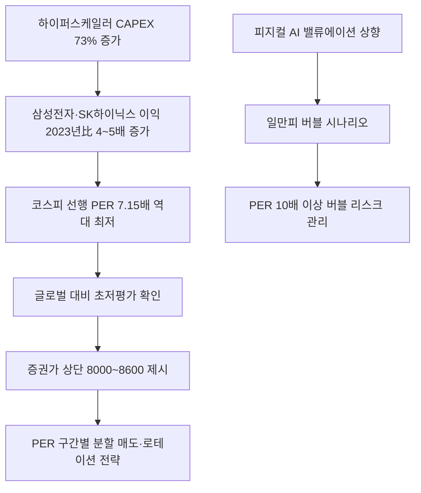

# 증시/밸류에이션 분析: 코스피 7000 직전 — 일만피 전망, 저PER 반도체·AI 증시 상단
## 투자 신호 + 사회적 영향 평가

---

## 📌 기사 기본 정보

- **날짜**: 2026-05-09
- **출처**: 한국일보 (김경렬 기자)
- **카테고리**: 경제 > 금융 > 증시/밸류에이션
- **핵심 주제**: 코스피가 6,936.99로 역대 최고치를 경신하며 7,000선까지 63포인트만 남긴 상황에서, 현재 12개월 선행 PER 7.15배가 코로나 저점(7.52배)보다 낮다는 '초저평가' 근거를 바탕으로 증권가가 연내 상단 8,000~8,600, 버블 시나리오에서 '일만피(코스피 1만)' 가능성까지 제시하는 밸류에이션 분析

**메타데이터**
- 주요 사건: 코스피 6,936.99 역대 최고치, 12개월 선행 PER 7.15배(코로나 저점 7.52배보다 낮음), 양대 증시 합산 시총 6,360조 원(서울 아파트 시총 3,000조 원의 2배)
- 핵심 원인: 삼성전자·SK하이닉스 영업이익 2023년 대비 4~5배 증가 예상, 하이퍼스케일러 CAPEX 73% 증가, 코리아 디스카운트 해소 기대감
- 주요 주체: 대신증권·신한투자증권·삼성증권·JP모간·골드만삭스 등 기관 전망, IBK투자증권 이승훈 센터장(일만피 제시)
- 키워드: 일만피, PER, EPS, 저평가, 피지컬 AI, 코리아 디스카운트, 반도체 랠리, 비반도체 확산

---

## 🔍 기사를 통한 투자 신호 추출

### 1단계: 핵심 사건 분해

**What (무엇이 일어났는가?)**
- 코스피가 6,936.99로 역대 최고치를 경신한 가운데, 12개월 선행 PER이 7.15배로 코로나 팬데믹 역대 저점(7.52배)보다 더 낮은 '초저평가' 상태임이 확인됐습니다. 이는 주가가 많이 올랐음에도 기업 이익이 그보다 훨씬 빠르게 성장한 덕분입니다. 증권사들은 연내 코스피 상단을 8,000~8,600으로 제시했으며, IBK투자증권은 AI·반도체 모멘텀 확산 시 '일만피(코스피 1만)'도 가능하다는 전망을 내놓았습니다.

**When (언제 일어났는가?)**
- 2026-05-09 (코스피 기업들의 2026년 이익이 2023년 대비 4~5배 증가 예상 시점, AI 빅테크 1분기 호실적 발표 직후)

**Why (왜 일어났는가?)**
- 삼성전자·SK하이닉스의 반도체 이익 급증으로 코스피 EPS(주당순이익)가 폭발적으로 상승하면서 PER이 오히려 역대 최저 수준까지 하락했습니다.
- 하이퍼스케일러 CAPEX 73% 증가가 메모리 반도체 수요의 지속적 성장을 담보합니다.
- 피지컬 AI(로봇·자율주행) 밸류에이션 상향이 버블 시나리오에 불을 붙이고 있습니다.

**Who (누가 주도하는가?)**
- 이익 성장 주도: 삼성전자·SK하이닉스 반도체 빅2
- 전망 제시: 국내외 주요 증권사 리서치 센터(대신·신한·삼성·JP모간·골드만삭스·노무라)

---

### 2단계: 투자 신호 해석

#### A. **긍정적 신호 (Bullish)**

**① PER 7.15배 — 이익 성장 대비 주가의 구조적 저평가**
- **신호**: 코스피 12개월 선행 PER 7.15배가 코로나 역대 저점(7.52배)보다 낮은 역사적 저평가 확인
- **의미**: 미국 나스닥 PER 30배 안팎에 비해 한국 시장이 1/4 수준에 거래 중이며, AI·반도체 이익 성장률이 지속된다면 PER 정상화만으로도 코스피 8,000~8,600 달성이 가능
- **투자 기회**: [[삼성전자]], [[SK하이닉스]] 중심의 반도체 대형주 비중 유지 및 저PER 가치주 선별 매수

**② 비반도체 종목으로의 온기 확산 — 다음 랠리의 촉매**
- **신호**: 신한투자증권의 "반도체 이익 추정치 상향 + 비반도체 종목 상승 탄력 맞물리면 상단 7,500"
- **의미**: 삼성전자·SK하이닉스 쌍두마차 중심의 랠리에서 비반도체 중소형주로 온기가 퍼지는 순간이 코스피 추가 도약의 신호탄
- **투자 기회**: 반도체 후방 장비·소재 업체, 피지컬 AI 관련 로봇·자율주행 부품주

---

#### B. **위험 신호 (Bearish)**

**① 하루 5% 급등의 과열 신호 — 이익 성장 꺾이면 낮은 PER도 함정**
- **신호**: 코스피가 하루 5.12% 급등한 것은 그 자체로 과열의 징후이며, IBK 이승훈 센터장도 "버블장세가 전개된다면"이라는 전제를 달아 일만피를 제시
- **의미**: 이익 성장이 예상보다 빠르게 꺾이거나 하이퍼스케일러 CAPEX 투자가 조기 위축될 경우, 저PER이 아니라 '이익 감소 + 주가 하락'의 더블 펀치가 가능
- **투자 리스크**: 반도체 이익 추정치 하향 조정 시 코스피 급락 변동성 확대

**② 2000년 닷컴 버블과의 구조적 차이 — 경계선 유지 필요**
- **신호**: 이익 없이 PER을 끌어올린 닷컴 버블과 달리 현재는 이익 급증이 PER을 낮추는 구조이나, PER 10배 이상 구간부터는 기대감의 영역
- **의미**: PER 8배(코스피 7,730) 시나리오까지는 펀더멘탈 기반이지만, 그 이상은 AI 기대감 버블 여부를 냉정하게 판단해야 함
- **투자 리스크**: PER 10배 이상(코스피 9,660 이상) 구간에서의 포지션 확대 시 버블 리스크

---

### 3단계: 섹터별 투자 기회 매트릭스

#### ✅ **높은 기대도 + 낮은 리스크**

**반도체 대형주 + 저PER 가치주 (PER 8배 기본 시나리오 하)**
- 이익 성장이 지속되는 한 PER 7.15배에서 8배로의 정상화만으로도 코스피 7,730이 달성되는 펀더멘탈 기반 시나리오입니다. 이 구간은 버블보다 가치 정상화의 성격이 강합니다.
- **투자 추천도**: ⭐⭐⭐⭐⭐

---

## 💰 구체적 투자 신호 변환

### 신호 1: PER 구간별 시나리오 투자 — 펀더멘탈 vs 버블 경계선 관리

**투자 해석**: 현재 코스피의 PER 7.15배는 '이익이 실제로 증가하고 있음에도 주가가 따라가지 못한 저평가 상태'를 의미합니다. 이는 미국 나스닥과의 밸류에이션 격차가 비정상적으로 크다는 신호이기도 합니다. PER 8배(코스피 약 7,730) 시나리오까지는 충분히 펀더멘탈에 기반한 목표이므로, 반도체 대형주 비중을 유지하는 전략이 유효합니다. 그러나 PER 10배(코스피 9,660) 이상 구간부터는 'AI 기대감 버블'의 성격이 강해지므로, 분할 매도를 통한 비중 조절과 함께 비반도체 저PER 종목으로의 로테이션을 병행하는 균형 전략을 권고합니다.

---

## 🌍 사회적 영향 평가

### A. 긍정적 사회 영향
- **국민 자산 증가 및 노후 안전망 강화**: 코스피 역대 최고치는 수천만 소액주주와 국민연금의 자산 가치를 직접 높이며, 고령화 사회의 노후 안전망으로서의 증시 역할이 강화됩니다.
- **기업 자금 조달 비용 하락**: PER 정상화와 주가 상승은 기업들이 주식 발행을 통해 더 낮은 비용으로 투자 자금을 조달할 수 있게 하여 실물 경제 투자 활성화에 기여합니다.

### B. 부정적 사회 영향
- **개인 투자자의 고점 매수 리스크 집중**: 코스피가 급등할수록 시장을 뒤늦게 쫓아 고점에 진입하는 개인 투자자가 증가하며, 이후 조정 국면에서 집중적인 손실을 입을 위험이 있습니다.
- **반도체·AI 중심 자산 격차 심화**: 삼성전자·SK하이닉스 주주 중심의 자산 증가가 반도체 이외 부문 종사자와의 자산 격차를 확대시키는 K자형 양극화 심화를 초래합니다.

---

## 🎯 결론: 당신의 투자 전략 수립

- **즉시 실행**: 코스피 PER 구간(7배대→8배)에서의 반도체 대형주 비중 유지. 하이퍼스케일러 2분기 CAPEX 발표(알파벳·아마존·MS)를 반도체 추가 매수 판단 기준으로 활용
- **3개월 후**: PER 9배(코스피 약 8,700) 접근 시 일부 차익 실현하며 비반도체 저PER 가치주·피지컬 AI 관련주로 로테이션 검토. 이익 성장률 유지 여부를 분기별로 점검

---

## 📝 Obsidian 연결 구조

