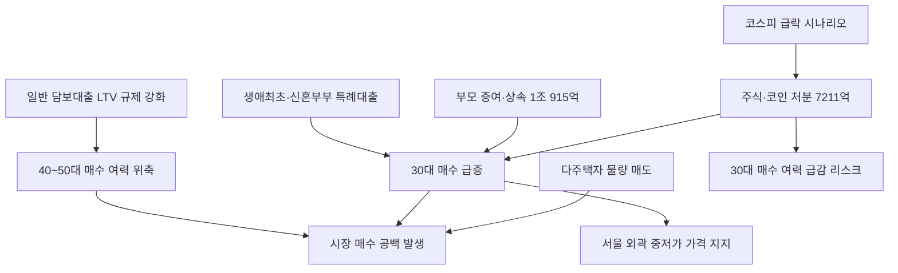

# 부동산/세대 분析: 30대의 정책대출·부모찬스로 다주택자 물량 절반 매수 — 부동산 세대 이동
## 투자 신호 + 사회적 영향 평가

---

## 📌 기사 기본 정보

- **날짜**: 2026-05-09
- **출처**: 국토교통부 자료·부동산 정보 플랫폼 집품 (2026년 5월 보도)
- **카테고리**: 경제 > 부동산 > 세대별 매수 구조
- **핵심 주제**: 2026년 3월 서울 부동산 시장에서 역사적 세대 교체가 발생. 다주택자 매물 2,087건 중 48.7%(1,017명)를 30대 이하가 매수. 자금 조달 3대 경로(정책대출·부모 증여·투자자산 처분)를 통해 기존 40~50대의 자리를 30대가 구조적으로 대체하는 메커니즘 분析

**메타데이터**
- 주요 사건: 서울 30대 이하 다주택자 물량 매수 비중 48.7%(1년 전 36.6%에서 역전), 30대 증여·상속 수취 1조 915억 원, 30대 투자자산 처분 7,211억 원(전 연령대 최대)
- 핵심 원인: 일반 담보대출 규제 강화로 40~50대 레버리지 차단, 생애최초·신혼부부·신생아 특례대출(연 1~3%대, 최대 5억 원)이 30대 전용 우회 통로로 작동, 전셋값 급등에 따른 매매 전환 압력
- 주요 주체: 30대 이하 매수자(정책금융·증여·투자자산 3경로 활용), 다주택자(매도 공급자), 정부(정책대출 설계자)
- 키워드: 30대 매수, 생애최초 특례대출, 부모찬스, 증여·상속, 영끌 진화, 다주택자, 서울 외곽 집중

---

## 🔍 기사를 통한 투자 신호 추출

### 1단계: 핵심 사건 분해

**What (무엇이 일어났는가?)**
- 2026년 3월 서울 다주택자 매물 2,087건 중 48.7%를 30대 이하가 매수했습니다. 1년 전 40~50대가 48.8%로 최대 매수층이었던 것이 완전히 역전됐습니다. 자금 조달은 ① 정책금융(생애최초·신혼부부·신생아 특례대출 연 1~3%대 최대 5억 원), ② 부모 증여·상속(1조 915억 원, 전 연령대 증여의 절반), ③ 투자자산 처분(주식·코인 등 7,211억 원, 전 연령대 최대)의 3경로로 구성됐습니다. 매수 지역은 강남이 아닌 강서구·노원구·성북구 등 서울 외곽 중저가 지역에 집중됐습니다.

**When (언제 일어났는가?)**
- 2026년 3월 (일반 담보대출 규제 강화 이후 40~50대 매수력 약화, 전셋값 급등 압력이 임계점에 도달한 시점)

**Why (왜 일어났는가?)**
- 정부의 일반 주택담보대출 LTV 규제 강화가 40~50대의 레버리지 활용 채널을 막은 반면, 30대는 정책금융이라는 규제 예외 통로를 유지하고 있습니다.
- 전셋값 급등과 월세 부담 상승이 "차라리 지금 사는 게 낫다"는 매매 전환 압력으로 작용했습니다.
- 베이비붐 세대(부모)의 자산 이전이 본격화되면서 증여·상속이 대출을 대체하는 새로운 자금 조달 경로로 정착했습니다.

**Who (누가 주도하는가?)**
- 매수 주도: 정책금융 + 부모 증여 + 투자자산 처분의 3경로를 활용하는 30대
- 매도 공급: 보유세·양도세 부담으로 물량을 내놓는 다주택자

---

### 2단계: 투자 신호 해석

#### A. **긍정적 신호 (Bullish)**

**① 서울 외곽 중저가 지역의 중장기 가격 지지력 강화**
- **신호**: 강서구·노원구·성북구 등 30대 매수 집중 지역에 지속적 실수요 유입
- **의미**: 정책대출 조건(생애최초·신혼부부)을 충족하는 30대의 실거주 목적 매수가 지속 유입되면서 서울 외곽 중저가 지역의 가격 하방 지지력이 강화됨
- **투자 기회**: 서울 외곽 중저가 지역 소형 아파트 실물 자산, 관련 리츠(REITs) 및 부동산 펀드

**② 다주택자 물량 정리 → 시장 공급 소화 순환 구조 형성**
- **신호**: 다주택자 매물 2,087건을 30대가 절반 소화하는 시장 청소 메커니즘
- **의미**: 보유세·양도세 부담으로 다주택자의 매도 압력이 지속되는 한, 정책금융을 갖춘 30대가 안정적인 흡수 주체로 기능하여 서울 중저가 시장의 급락을 방어함
- **투자 기회**: 부동산 공급 흐름 모니터링을 통한 서울 외곽 매수 타이밍 포착

---

#### B. **위험 신호 (Bearish)**

**① 투자자산 처분(주식·코인) 기반 매수의 금융시장 연동 리스크**
- **신호**: 30대의 투자자산 처분 규모 7,211억 원이 전 연령대 최대
- **의미**: 코스피 급락 시나리오 발생 시 30대의 부동산 매수 자금원이 축소되어 서울 외곽 시장에 부메랑 충격을 가할 수 있음. 증시와 부동산 시장의 연동성 심화
- **투자 리스크**: 코스피 급락 → 30대 매수 여력 급감 → 서울 외곽 거래량 급감 → 가격 하방 압력

**② '부모찬스' 없는 30대의 시장 소외 심화**
- **신호**: 증여·상속 1조 915억 원이 30대 매수 자금의 핵심 경로로 자리 잡음
- **의미**: 부유한 부모가 없는 30대는 정책금융만으로는 서울 시장 진입이 여전히 어려우며, 자산 불평등의 세대 내 심화가 가속됨
- **투자 리스크**: 사회적 불평등 심화에 따른 정치적 압력으로 정책대출 한도 축소·증여세 강화 가능성

---

### 3단계: 섹터별 투자 기회 매트릭스

#### ✅ **높은 기대도 + 낮은 리스크**

**서울 외곽 중저가 아파트 실물 자산 (강서·노원·성북 권역)**
- 정책금융을 갖춘 30대의 실거주 실수요가 지속 유입되는 중저가 권역은 급등보다 완만한 가격 지지 흐름이 기대됩니다. 다만 투자자산 처분 기반 매수의 금융시장 연동 리스크를 항상 병행 모니터링해야 합니다.
- **투자 추천도**: ⭐⭐⭐⭐

---

## 💰 구체적 투자 신호 변환

### 신호 1: '정책 필터링'이 만든 세대 교체 — 다음 매수 사이클의 주도 세력 분析

**투자 해석**: 이번 30대의 부동산 대거 매수는 단순한 트렌드 변화가 아니라 정부 정책(담보대출 LTV 강화)이 시장에서 40~50대 자산가층을 걸러내고 30대가 정책금융이라는 특수 통로로 그 빈자리를 채우는 구조적 '정책 필터링'의 결과입니다. 이 구조는 정책대출이 유지되고 다주택자 규제가 지속되는 한 반복될 가능성이 높습니다. 투자자는 서울 외곽 중저가 지역의 매수 압력이 지속되는 반면, 강남 등 고가 지역은 30대의 자금력 한계로 접근이 어려워 시장 이중 구조가 심화될 것임을 감안한 지역별 차별화 전략을 수립해야 합니다.

---

## 🌍 사회적 영향 평가

### A. 긍정적 사회 영향
- **30대 실거주 주거 안정 개선**: 정책대출을 통한 30대의 내집 마련이 확대되면서 임차 시장의 불안정성이 일부 완화되고, 청년 세대의 주거 안정성이 개선됩니다.
- **다주택자 물량의 시장 내 자연 소화**: 고령화로 인한 다주택자의 점진적 매도 물량이 정책금융 주도 실수요로 소화됨으로써, 급격한 공급 충격을 완화하는 사회적 안전판으로 기능합니다.

### B. 부정적 사회 영향
- **자산 불평등의 세대 내 양극화 심화**: 부모의 증여·상속 여력이 있는 30대와 그렇지 못한 30대 사이의 자산 격차가 부동산 시장에서 고착화됩니다. 이는 출발선의 불평등을 주거 자산 격차로 직접 전환시키는 사회 구조적 문제입니다.
- **정책대출 소진 후 이 세대의 다음 단계 취약성**: 생애최초·신혼부부 혜택을 소진한 30대가 10년 후 두 번째 주택을 마련하려 할 때 활용할 수 있는 자금 조달 수단이 현재보다 훨씬 제한될 가능성이 있어, 정책 수혜의 일회성 문제가 중장기 주거 불안정으로 귀결될 수 있습니다.

---

## 🎯 결론: 당신의 투자 전략 수립

- **즉시 실행**: 서울 외곽 중저가 권역(강서·노원·성북)의 소형 아파트 실수요 매수 흐름을 모니터링하며 분기별 거래량·가격 동향 추적. 코스피 급락 시나리오 발생 시 해당 지역 부동산 시장의 연동 충격을 선제 점검
- **3개월 후**: 정책대출(생애최초·신혼부부·신생아 특례) 한도 및 조건 변경 여부, 증여세 공제 한도 정책 논의를 모니터링하며 30대 매수력의 지속 가능성 재평가

---

## 📝 Obsidian 연결 구조

