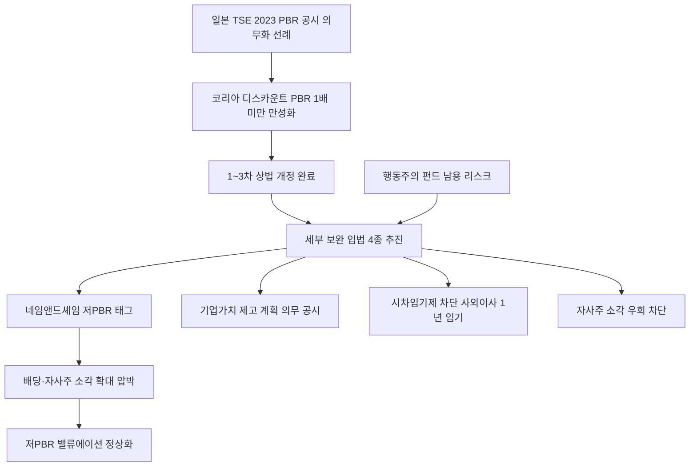

# 경제/정책 분析: 이재명 정부의 코스피 저평가 해소 — 상법 개정·자사주 소각·집중투표제·코리아 디스카운트
## 투자 신호 + 사회적 영향 평가

---

## 📌 기사 기본 정보

- **날짜**: 2026-05-09
- **출처**: 국내 경제지 종합
- **카테고리**: 경제 > 정책 > 증시/기업지배구조
- **핵심 주제**: 코스피 6,900 돌파에도 이재명 대통령이 "여전히 저평가"라고 진단하며 추가 정책 신호를 발신. 1~3차 상법 개정(이사 주주충실의무·집중투표제·자사주 소각의무화) 이후 세부 보완 입법 4종(주가 누르기 방지법·네임앤드셰임·시차임기제 차단·자사주 소각 우회 차단)이 쏟아지며 한국 기업 지배구조의 패러다임 전환 가속

**메타데이터**
- 주요 사건: 이재명 대통령 "코스피 저평가" 발언, 안도걸 의원 '주가 누르기 방지법' 발의(PBR 2년 연속 1배 미만 + ROE 8% 미만 기업 의무 공시), KOSDAQ 승강제 도입, 시차임기제 차단(사외이사 임기 1년 제한) 발의
- 핵심 원인: 만성적인 코리아 디스카운트(PBR 1배 미만 대기업 다수), 오너 중심 지배구조의 주주 권익 침해, 자사주 소각 의무화 우회 편법 등장
- 주요 주체: 이재명 정부, 국회(안도걸 의원 등), 국내 대기업 오너 일가, 소액주주, 외국인 기관 투자자
- 키워드: 코리아 디스카운트, PBR, ROE, 집중투표제, 시차임기제, 자사주 소각, 네임앤드셰임, 주주충실의무

---

## 🔍 기사를 통한 투자 신호 추출

### 1단계: 핵심 사건 분해

**What (무엇이 일어났는가?)**
- 코스피가 6,900선을 돌파한 상황에서도 이재명 정부는 구조적 코리아 디스카운트(PBR 1배 미만 기업 다수)가 해소되지 않았다고 판단, 세부 보완 입법 4종을 연달아 발의했습니다. ① PBR 2년 연속 1배 미만 + ROE 3년 평균 8% 미만 기업 기업가치 제고 계획 의무 공시, ② 저PBR 기업 종목명에 '저PBR' 태그를 달아 공개 압박하는 '네임앤드셰임', ③ 집중투표제 무력화를 위한 '시차임기제' 차단(사외이사 임기 1년 제한), ④ 정관 변경을 통한 자사주 소각 의무 우회 차단이 핵심 내용입니다.

**When (언제 일어났는가?)**
- 2026-05-09 (코스피 6,900 돌파 강세장, 1~3차 상법 개정 통과 이후 세부 보완 입법 단계)

**Why (왜 일어났는가?)**
- 한국 대기업 상당수가 PBR 1배 미만의 만성적 저평가 상태를 유지하며 코리아 디스카운트를 심화시키고 있습니다.
- 일부 기업이 시차임기제 도입으로 집중투표제를 무력화하고, 정관 변경으로 자사주 소각 의무를 우회하려는 편법이 나타나고 있습니다.
- 일본 도쿄증권거래소(TSE)의 2023년 PBR 1배 미만 기업 공시 의무화 이후 닛케이가 역대 최고치를 경신한 선례가 한국 정책의 롤모델로 작동하고 있습니다.

**Who (누가 주도하는가?)**
- 개혁 주도: 이재명 정부 및 여당 의원, 소액주주 권익 보호 운동
- 저항 세력: 집중투표제·자사주 소각 의무를 우회하려는 재벌 오너 일가 및 대기업 이사회

---

### 2단계: 투자 신호 해석

#### A. **긍정적 신호 (Bullish)**

**① 저PBR 기업의 주주환원 확대 → 밸류에이션 정상화 기대**
- **신호**: PBR 2년 연속 1배 미만 + ROE 8% 미만 기업의 기업가치 제고 계획 의무 공시 및 네임앤드셰임 압박
- **의미**: 일본 TSE 사례처럼 저PBR 기업이 자사주 소각·배당 확대·사업 구조조정을 통해 실질적인 주주환원을 확대하면 코스피의 질적 체질 개선이 가속화됨
- **투자 기회**: 현재 PBR 1배 미만이지만 자산 가치가 우수한 내수 대형주·금융주 중 주주환원 확대 기대주

**② 외국인 투자자 신뢰 회복 — 코리아 디스카운트 프리미엄 해소**
- **신호**: 주주 중심 지배구조 정착 시 외국인 기관 투자자들의 한국 증시 재평가 기대
- **의미**: 코리아 디스카운트의 핵심 원인인 '오너 리스크(지배주주 사익 추구)'를 제도적으로 억제함으로써 글로벌 패시브 자금의 한국 비중 확대 유도 가능
- **투자 기회**: [[삼성전자]], [[현대차]], [[SK]] 등 지배구조 개선 수혜 대형주

---

#### B. **위험 신호 (Bearish)**

**① 자사주 소각 의무화로 인한 기업 재투자 여력 훼손**
- **신호**: 자사주 소각 의무화가 R&D 및 설비 투자를 위한 기업 유보 현금을 잠식할 가능성
- **의미**: 삼성전자·SK하이닉스 등 대규모 투자가 필요한 첨단 기술 기업에 자사주 소각 의무가 일률적으로 적용될 경우, 장기 경쟁력 투자 위축이 오히려 주주 가치를 훼손할 역설적 결과를 초래할 수 있음
- **투자 리스크**: 대규모 R&D 지출이 필요한 반도체·제약·바이오 대형주의 투자 여력 축소

**② 집중투표제 남용 — 단기 행동주의 투자자 악용 가능성**
- **신호**: 집중투표제의 소액주주 보호 목적이 단기 수익 추구 헤지펀드의 이사회 장악 수단으로 악용될 가능성
- **의미**: 행동주의 투자자가 집중투표제를 통해 단기 주가 부양·자산 매각을 강요하는 방식으로 기업의 장기 전략적 의사결정을 방해할 위험
- **투자 리스크**: 집중투표제 적용 기업 중 행동주의 투자자 진입 시 단기 변동성 확대

---

### 3단계: 섹터별 투자 기회 매트릭스

#### ✅ **높은 기대도 + 낮은 리스크**

**저PBR 대형주 (PBR 1배 미만 → 주주환원 확대 수혜 기대주)**
- 네임앤드셰임 및 의무 공시 압박으로 자사주 소각·배당 확대에 나서는 저PBR 금융·지주·내수 대형주는 일본 TSE 사례를 따라 단계적 밸류에이션 정상화가 기대됩니다.
- **투자 추천도**: ⭐⭐⭐⭐⭐

---

## 💰 구체적 투자 신호 변환

### 신호 1: 일본 TSE 개혁의 한국판 — 저PBR 기업의 단계적 밸류에이션 정상화

**투자 해석**: 일본은 2023년 PBR 1배 미만 기업에 공시 의무를 부과한 이후 닛케이가 역대 최고치를 돌파했습니다. 한국의 '주가 누르기 방지법'이 같은 메커니즘을 작동시킬 경우, 현재 PBR 1배 미만 상태에서 자사주 소각·배당 확대 압박을 받는 대형 금융주·지주사·내수 대기업들은 중기적으로 밸류에이션 정상화 수혜를 받을 수 있습니다. 다만 입법의 방향성은 옳으나 속도가 너무 빠르면 역효과(R&D 투자 위축·행동주의 남용)가 발생할 수 있으므로, 실제 법안 통과 후 기업들의 구체적인 주주환원 계획 발표 시점을 매수 판단 기준으로 삼는 것을 권고합니다.

---

## 🌍 사회적 영향 평가

### A. 긍정적 사회 영향
- **461만 삼성전자 소액주주 및 국민연금 수익률 개선**: 코리아 디스카운트 해소가 현실화되면 소액주주들의 자산 가치가 직접 상승하고, 국민 노후 자산인 국민연금의 수익률도 함께 높아집니다.
- **기업 지배구조 민주화와 경영 투명성 제고**: 집중투표제와 주주충실의무 법제화는 소수 오너 일가의 이사회 독점을 견제하여 장기적으로 한국 기업의 글로벌 신뢰도를 높입니다.

### B. 부정적 사회 영향
- **'법안 속도전'에 따른 기업 경영 불확실성 증대**: 자사주 소각 의무·집중투표제·시차임기제 차단 등이 동시에 추진될 경우, 기업들의 중장기 투자 계획 수립이 어려워지는 경영 불확실성이 오히려 고용과 투자를 위축시킬 수 있습니다.
- **중소·벤처기업의 KOSDAQ 승강제 압박**: 승강제 도입으로 하위권 기업에 퇴출 압력이 가해지면, 성장 잠재력이 있는 중소기업이 조기에 상장 폐지 위기에 몰릴 수 있어 스타트업 생태계의 위축이 우려됩니다.

---

## 🎯 결론: 당신의 투자 전략 수립

- **즉시 실행**: 현재 PBR 1배 미만 상태이면서 자산 가치와 현금 창출력이 우수한 대형 금융주·지주사를 스크리닝하여 주주환원 계획 발표 시 선매수 포지션 구축
- **3개월 후**: '주가 누르기 방지법' 및 KOSDAQ 승강제 도입 국회 통과 여부 및 구체적 시행 일정 모니터링. 일본 TSE 사례(2023년 공시 의무화 → 2024년 닛케이 역대 최고치)와 비교하며 한국 저PBR 기업군의 밸류에이션 정상화 속도 재점검

---

## 📝 Obsidian 연결 구조

