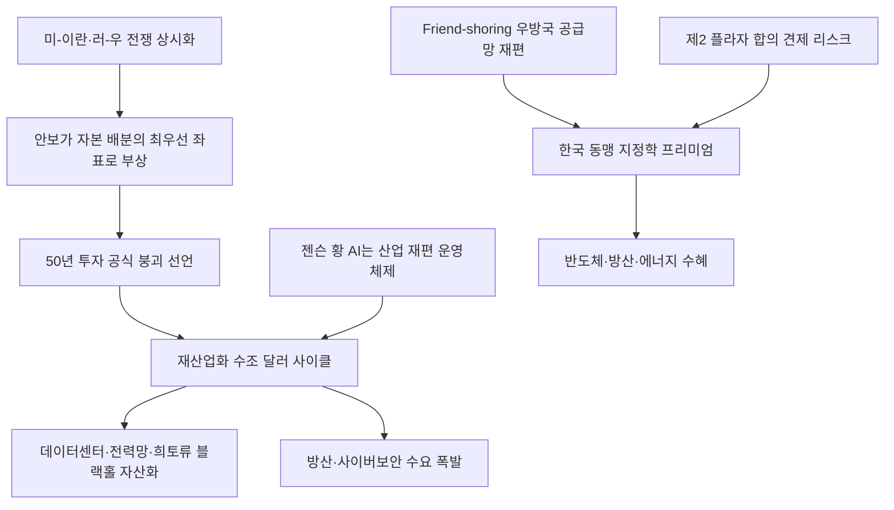

# 투자/지정학 분析: 밀컨 콘퍼런스 — 50년 투자 공식 붕괴, 안보·신뢰·AI 전쟁과 자본 재편
## 투자 신호 + 사회적 영향 평가

---

## 📌 기사 기본 정보

- **날짜**: 2026-05-09
- **출처**: 한국일보 (심재현 LA 특파원)
- **카테고리**: 경제 > 투자 > 지정학/글로벌자본
- **핵심 주제**: 미국 LA에서 열린 밀컨 글로벌 콘퍼런스(미국판 다보스)에서 칼라일(운용자산 4,000억 달러) CEO 하비 슈워츠가 "지난 50년 투자 공식이 깨졌다"고 선언. AI와 안보가 자본이 흐르는 새 좌표로 부상하며, 효율과 수익률 중심의 세계화 자본 논리 대신 안보·신뢰·재산업화(Reindustrialization)가 투자 우선순위의 핵심으로 재편됨을 분析

**메타데이터**
- 주요 사건: 하비 슈워츠(칼라일) "50년 투자 구조 재편 선언", 젠슨 황(엔비디아) "AI는 산업을 다시 만드는 시스템(운영체제)", 수조 달러 규모의 재산업화(Reindustrialization) 사이클 선언
- 핵심 원인: 미-이란·러시아-우크라이나 전쟁으로 안보 환경 변화 가속, 비용 최적화에서 안보·신뢰 보장 지역으로 자본 이동, AI 인프라 투자가 제조업·에너지·국방 전반을 재편
- 주요 주체: 칼라일 그룹(하비 슈워츠), 엔비디아(젠슨 황), 글로벌 대형 사모펀드·투자은행
- 키워드: 밀컨 콘퍼런스, 50년 투자 공식 붕괴, 재산업화, Friend-shoring, 안보 자본주의, 희토류, 피지컬 AI

---

## 🔍 기사를 통한 투자 신호 추출

### 1단계: 핵심 사건 분해

**What (무엇이 일어났는가?)**
- 세계 최대 투자 포럼 밀컨 콘퍼런스에서 칼라일 CEO 하비 슈워츠가 "1970년대 이후 통해온 '비용이 가장 싼 곳으로 자본을 보내라'는 50년 투자 공식이 깨졌다"고 선언했습니다. 미-이란·러-우 전쟁으로 안보가 에너지·데이터·공급망 전반의 경제 최우선 과제가 됐으며, 자본은 이제 효율이 아닌 안보와 신뢰가 담보된 지역으로 이동합니다. 젠슨 황은 AI를 "새로운 섹터가 아니라 산업 자체를 다시 만드는 운영체제"로 정의하며 수조 달러의 재산업화 사이클이 시작됐음을 선언했습니다.

**When (언제 일어났는가?)**
- 2026-05-09 (밀컨 글로벌 콘퍼런스 5월 4일 발언 보도)

**Why (왜 일어났는가?)**
- 중국 의존적 공급망이 미-중 패권 경쟁과 전쟁으로 취약성을 드러내면서, '싸지만 위험한 곳'보다 '비싸도 안전한 곳'이 자본의 새 목적지가 됐습니다.
- AI가 소프트웨어 영역을 넘어 물리적 인프라(공장·전력망·데이터센터)를 다시 짓는 10~20년 프로젝트로 확장되면서 수조 달러의 실물 투자 수요를 창출합니다.
- 동맹국끼리만 거래하는 'Friend-shoring(우방국 공급망)' 전략이 글로벌 투자 지형을 재편하고 있습니다.

**Who (누가 주도하는가?)**
- 새 투자 질서 선도: 칼라일·JP모간 등 세계 최대 사모펀드·투자은행, 엔비디아 등 AI 인프라 핵심 기업
- 수혜 지역: 미국 동맹국(한국·일본·대만·유럽)의 제조업·방산·에너지 인프라

---

### 2단계: 투자 신호 해석

#### A. **긍정적 신호 (Bullish)**

**① 한국의 미국 동맹 지정학 프리미엄 — 반도체·방산·에너지 인프라 수혜**
- **신호**: 슈워츠 "안보·신뢰가 담보된 지역으로 자본이 이동", 희토류·구리·에너지 인프라가 새 투자 우선순위로 부상
- **의미**: 한국은 미국의 핵심 동맹국으로서 반도체(삼성·SK하이닉스)·방산·에너지 인프라 분야에서 'Friend-shoring 수혜국'의 위상을 확보하고 있으며, 글로벌 대형 자본의 선호 투자처로 부상
- **투자 기회**: [[삼성전자]], [[SK하이닉스]], 한국 방위산업체, 원전·LNG 에너지 인프라 관련주

**② AI 재산업화 — 반도체·전력망·데이터센터 10~20년 투자 사이클**
- **신호**: 젠슨 황 "AI는 산업을 다시 만드는 운영체제", 전력망·데이터센터·희토류의 블랙홀 자산화
- **의미**: AI 인프라 투자가 소프트웨어 영역을 넘어 물리적 하드웨어 인프라 전반으로 확산되면서 반도체·전력 설비·희귀광물 관련 기업에 장기 수요 사이클이 형성
- **투자 기회**: HBM·DRAM 메모리 반도체, AI 전력망 관련 전력 설비주, 희토류 자원 확보 기업

---

#### B. **위험 신호 (Bearish)**

**① '제2의 플라자 합의' 형태의 한국 기술 독점 견제 리스크**
- **신호**: 50년 투자 공식 붕괴는 기존 규칙이 통하지 않는 패러다임 전환을 의미하며, 미국 동맹 내에서도 경쟁적 견제가 가능
- **의미**: 한국이 반도체·모빌리티 기술 독점을 완성할수록 미국 패권이 탄소세·공급망 제재·환율 압박 등 '보이지 않는 몽둥이'를 구사할 가능성이 높아짐
- **투자 리스크**: 대미 수출 의존도가 높은 한국 첨단 기술 업종 전반

**② Friend-shoring의 이면 — 중국과의 경제 디커플링 비용**
- **신호**: 중국과 경제적으로 긴밀하게 연결된 한국의 'Friend-shoring vs 중국 시장' 딜레마
- **의미**: 미국이 한국에 Friend-shoring 편입을 요구할수록 대중 수출 의존도가 높은 산업의 구조 조정 비용이 증가하며 단기 실적 악화 가능
- **투자 리스크**: 대중 매출 비중이 높은 화학·소재·중간재 수출 기업

---

### 3단계: 섹터별 투자 기회 매트릭스

#### ✅ **높은 기대도 + 낮은 리스크**

**AI 인프라 핵심 소재·에너지 자산 (재산업화 수혜)**
- 젠슨 황이 정의한 AI 재산업화 사이클에서 데이터센터 전력망(구리·전력 설비), 반도체 핵심 소재(희토류), 에너지 인프라(원전·LNG)는 수조 달러 투자의 직접 수혜처입니다.
- **투자 추천도**: ⭐⭐⭐⭐⭐

---

## 💰 구체적 투자 신호 변환

### 신호 1: 50년 투자 공식 붕괴 — 한국 투자자의 포트폴리오 지각판 재설계

**투자 해석**: 밀컨 콘퍼런스에서 칼라일·JP모간 같은 세계 최대 기관들이 공개 선언한 내용은 사변적 전망이 아니라 실제로 수조 달러의 자금 배분 방향을 결정짓는 선언입니다. 투자자는 지금 코스피 랠리가 단순 수급 강세가 아니라 '안보 자본주의'라는 글로벌 자본 질서 재편의 흐름과 한국의 동맹국 프리미엄이 맞물린 구조적 재평가임을 인식해야 합니다. 이에 따라 포트폴리오 내에서 방산·AI 인프라·에너지 인프라의 비중을 구조적으로 높이고, 대중 수출 의존 중간재 업종은 Friend-shoring 가속 시나리오에서 비중을 점진적으로 낮추는 방향성을 취해야 합니다.

---

## 🌍 사회적 영향 평가

### A. 긍정적 사회 영향
- **한국의 지정학 프리미엄 수혜 — 양질의 일자리 창출**: Friend-shoring 구조 안에서 한국이 반도체·방산·에너지 인프라의 핵심 공급자로 자리 잡을 경우, 첨단 제조업 중심의 고부가가치 일자리가 창출되어 국내 고용 구조의 질이 개선됩니다.
- **AI 재산업화 사이클의 사회 인프라 현대화**: AI가 제조업·의료·교통 등 전 산업을 재편하는 과정에서 노후 인프라의 현대화가 이루어지고, 이는 사회 전반의 생산성 향상으로 이어집니다.

### B. 부정적 사회 영향
- **Friend-shoring 강제로 인한 중소 제조업 구조 조정 고통**: 중국 시장에 의존하던 국내 중소 제조업체들이 Friend-shoring 압력에 직면하면, 급격한 구조 조정 과정에서 하청 중소기업 근로자들이 고용 불안에 노출됩니다.
- **'안보 자본주의'가 낳는 국방 지출 증가와 복지 예산 압박**: 안보가 자본 유치의 핵심 기준이 되면서 국방 예산이 확대되는 반면, 사회 취약 계층을 위한 복지·의료 예산이 상대적으로 축소될 수 있습니다.

---

## 🎯 결론: 당신의 투자 전략 수립

- **즉시 실행**: 반도체(삼성전자·SK하이닉스)·방위산업·AI 전력 인프라(변압기·전력 설비) 관련주의 비중을 포트폴리오 내에서 구조적으로 확대. 중국 매출 비중이 높은 화학·소재 업종 비중은 단계적으로 축소
- **3개월 후**: 미-이란 전쟁 재점화 및 러-우 종전 협상 동향, 미국의 대한(對韓) 첨단 기술 규제 동향을 모니터링하며 Friend-shoring 가속 속도와 지정학 프리미엄의 지속 가능성 재평가

---

## 📝 Obsidian 연결 구조

